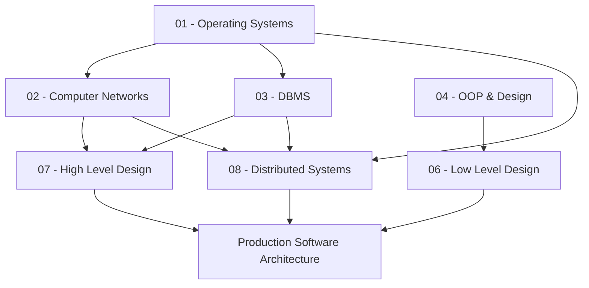

# Computer Science Knowledge Base — Master MOC

> [!abstract] Master Knowledge Graph
> A production-grade, first-principles engineering handbook interconnecting core systems programming, networking, database internals, object-oriented design, distributed architectures, and production reliability engineering.

---

## 🗺️ Core Subject Maps of Content

### 1. [[Operating Systems MOC|01 - Operating Systems]]
Hardware abstraction, kernel architectures, process lifecycles, memory virtualization, CPU scheduling, concurrency primitives, synchronization, virtual file systems, storage engines, and eBPF internals.

### 2. [[Computer Networks MOC|02 - Computer Networks]]
Layered protocol architectures (OSI & TCP/IP), Layer 2 Ethernet/switching, Layer 3 IPv4/IPv6 routing, Layer 4 TCP/UDP transport & congestion control, Layer 7 protocols (HTTP/1-3, TLS 1.3, DNS, gRPC), proxying, and production network reliability.

### 3. [[Database Management Systems MOC|03 - Database Management Systems]]
Relational theory, SQL execution & cost-based query optimization, storage engines (B+ Trees, LSM-Trees), concurrency control (2PL, MVCC, isolation anomalies), WAL & crash recovery (ARIES), and distributed data stores.

### 4. [[Object-Oriented Programming & Design Patterns MOC|04 - Object-Oriented Programming & Design Patterns]]
First-principles OOP abstractions, domain modeling, SOLID principles, coupling & cohesion metrics, refactoring bad designs, and Gang of Four (GoF) design patterns in production systems.

### 5. [[Low Level Design MOC|05 - Low-Level Design]]
Object-oriented domain modeling, concurrency models, thread-safe data structures, class diagrams, sequence flows, and full implementations for real-world systems (Rate Limiters, Parking Lots, Job Schedulers, LRU Caches).

### 6. [[High Level Design MOC|06 - High-Level Design]] & [[Distributed Systems MOC|07 - Distributed Systems]]
Scalability, availability, consistency (CAP/PACELC), distributed consensus (Raft/Paxos), partition management, distributed transactions (2PC/Saga), replication, caching strategies, and end-to-end industrial architectures (URL Shortener, Chat, Feed, Metrics Platform).

---

## ⚡ Cross-Subject Execution Flows (Capstone Notes)
- [[What Happens When You Type a URL]] — From browser DNS to NIC, switches, BGP routing, TLS handshake, HTTP/2 multiplexing, reverse proxy, OS socket buffer, kernel epoll, backend thread pool, and database query.
- [[What Happens During a System Call]] — From user space libc stub, CPU privilege transition (`SYSCALL`), kernel interrupt dispatch, address validation, kernel execution, to `SYSRET`.
- [[What Happens During a Page Fault]] — MMU translation miss, CR2 register capture, trap to kernel fault handler, disk backing read, frame allocation, page table update, and instruction restart.
- [[From User Request to Database Commit]] — End-to-end tracing of concurrency, locks, MVCC snapshots, buffer pool dirtiness, WAL fsync, and network acknowledgment.

---

## 📚 Revision, Practice & Governance
- [[Computer Science Rapid Revision Guide]]
- [[System Design Interview Blueprint]]
- [[CS Curriculum|Curriculum Registry & Progress]]
- [[Autonomous Agent State|Autonomous Engine State]]
- [[Documentation Queue|Live Documentation Queue]]
- [[Quality Audit|Quality Audit Dashboard]]
