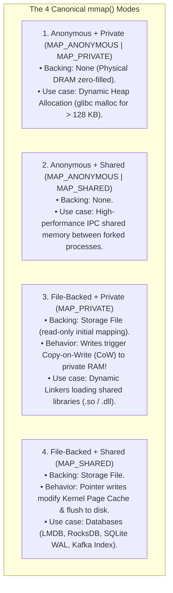
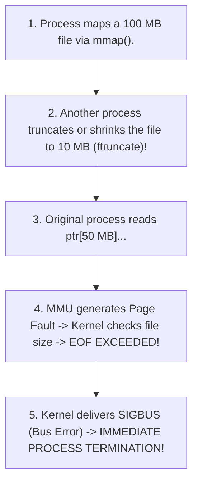

# Memory-Mapped I/O and `mmap`

> [!abstract] Mental Model
> `mmap` is **looking at a warehouse through a glass window vs hiring a courier to carry every box**:
> - Traditional `read()` and `write()` syscalls force the CPU to copy data twice: from Storage $\to$ Kernel Page Cache $\to$ User-Space Buffer via `copy_to_user()`.
> - **`mmap` (Memory Mapping)** maps a file's physical Page Cache frames directly into the process's **Virtual Address Space**.
> - Accessing file data is performed via **direct memory pointer dereferences (`char c = ptr[offset]`)**. The kernel loads disk blocks lazily via **Page Faults**, completely eliminating user-space memory copies and system call overhead!

---

## Traditional `read()` vs `mmap()` Architecture

```mermaid
flowchart TD
    subgraph Traditional_IO ["1. Traditional Buffered read() - Double Copy Overhead"]
        T_Disk["Storage (NVMe / SSD)"] -->|1. DMA Transfer| T_PageCache["Kernel Page Cache (RAM)"]
        T_PageCache -->|2. CPU copy_to_user() Copy| T_UserBuf["User Application Buffer (malloc RAM)"]
        T_App["App reads buffer"] --> T_UserBuf
    end

    subgraph Mmap_IO ["2. Memory-Mapped I/O (mmap) - Zero User-Space Copy"]
        M_Disk["Storage (NVMe / SSD)"] -->|1. Lazy DMA on Page Fault| M_PageCache["Kernel Page Cache in Physical RAM"]
        M_VMA["Process Virtual Memory (VMA / Page Table Entry)"]
        M_VMA -.->|PTE points directly to| M_PageCache
        M_App["App dereferences raw pointer: ptr[x]"] --> M_VMA
    end
```

---

## The Four Canonical Mapping Modes



---

## The Lazy Page Fault Lifecycle in `mmap()`

When an application calls `mmap()`, **zero disk blocks and zero physical RAM page frames are allocated**:

```mermaid
sequenceDiagram
    autonumber
    participant App as User Application
    participant Kernel as Linux Kernel (VFS / VM Core)
    participant MMU as Hardware MMU
    participant Disk as Physical Storage

    App->>Kernel: 1. mmap(NULL, 1GB, PROT_READ|PROT_WRITE, MAP_SHARED, fd, 0)
    Note over Kernel: Allocates struct vm_area_struct (VMA) in Red-Black Tree. Returns pointer 0x7F00_0000.
    Kernel-->>App: Return virtual pointer (0 physical bytes allocated!)
    
    App->>MMU: 2. Reads char c = ptr[4096] (First access to Page 1)
    Note over MMU: MMU finds PTE is Invalid (Present Bit = 0) -> Hardware Page Fault (#PF)!
    MMU->>Kernel: 3. CPU traps to do_page_fault(0x7F00_1000)
    Kernel->>Kernel: 4. Finds VMA in mm_struct RB-Tree; verifies valid file mapping
    Kernel->>Disk: 5. Issues block I/O (DMA) to read 4 KB chunk into Page Cache
    Disk-->>Kernel: Data loaded into Page Cache Frame 0x9B100
    Kernel->>MMU: 6. Populates PTE with Physical Address 0x9B100 (Present = 1)
    Kernel-->>App: 7. Resumes user instruction transparently!
```

---

## Durability & Synchronization: `msync()`

Modifications to `MAP_SHARED` mappings dirty the Linux Page Cache in nanoseconds. To enforce physical disk persistence, applications invoke **`msync()`**:

```c
// Force physical synchronization to disk:
int result = msync(ptr, length, MS_SYNC);
```

| `msync` Flag | Internal Behavior | Production Trade-off |
| :--- | :--- | :--- |
| **`MS_ASYNC`** | Schedules dirty pages for asynchronous flush by `kworker` threads and returns immediately. | Ultra-fast; non-blocking. Durability not guaranteed on power loss. |
| **`MS_SYNC`** | **Blocks calling thread** until all dirty pages and filesystem inode metadata hit storage. | Strict durability; blocks on disk I/O. |
| **`MS_INVALIDATE`**| Invalidates other cached copies of the mapping, forcing re-reads from disk. | Ensures cache consistency across concurrent nodes. |

---

## The Fatal Production Trap: The `SIGBUS` Signal



> [!CAUTION] Production Warning: Handling `SIGBUS`
> If a file mapped with `mmap()` is truncated by an external process or network filesystem (NFS) disconnects, dereferencing the pointer beyond the new EOF does not return an error code—it raises **`SIGBUS` (Signal 7)**, killing the process instantly. High-reliability databases catch `SIGBUS` with `sigaction()` or lock files with `flock()`.

---

## Production Diagnostics & Memory Mapping Inspection

```bash
# 1. Inspect Virtual Memory Areas (VMAs) for a running process
cat /proc/$(pgrep -f postgres)/maps | head -n 15

# Output format:
# 7f10a000-7f10b000 r--p 00000000 08:01 197204   /usr/lib/x86_64-linux-gnu/libc.so.6
# 7f10b000-7f2a0000 r-xp 00001000 08:01 197204   /usr/lib/x86_64-linux-gnu/libc.so.6
# 7f400000-7f500000 rw-s 00000000 00:0e 492019   /dev/shm/postgres_shared_mem (MAP_SHARED)

# 2. Inspect Resident vs Shared vs Dirty mmap memory consumption
pmap -x $(pgrep -f postgres) | tail -n 5

# 3. Monitor Major vs Minor Page Faults triggered by mmap:
perf stat -e page-faults,minor-faults,major-faults -- ./db_benchmark
# (Minor faults = page in Page Cache already; Major faults = triggered physical disk read)
```

---

## Active Recall & Interview Perspective

### Reasoning Prompts
1. *Why is `mmap()` significantly faster than standard `read()` / `write()` loops for random access in high-performance databases (e.g. LMDB, SQLite WAL)?*
   - **Answer**: Standard `read()` requires invoking a system call (transitioning Ring 3 $\to$ Ring 0), copying data across the kernel-to-user protection boundary via `copy_to_user()` into an application buffer, and repeating this for every read. With **`mmap()`**, the file's Page Cache frames are mapped directly into the process's page table. Reading data is a simple in-memory pointer dereference with **zero system call overhead** and **zero user-space memory copies**. Furthermore, the kernel's virtual memory subsystem automatically pages in only the accessed $4\text{ KB}$ pages lazily on demand.
2. *How does `MAP_PRIVATE` utilize Copy-on-Write (CoW) when loading shared libraries (`.so` / `.dll`)?*
   - **Answer**: When dynamic linkers load shared libraries (like `libc.so`), they map the file as **`MAP_PRIVATE`**. All processes on the system share the exact same physical DRAM page frames for executable code sections (`r-xp`), minimizing RAM usage. If a process writes to global variables in the data segment (`rw-p`), the hardware MMU triggers a write-protection fault, and the kernel creates a **private physical copy of that specific page (Copy-on-Write)** for the modifying process, leaving other processes unaffected.
3. *What causes a `SIGBUS` error in an `mmap`-backed application, and how does it differ from a `SIGSEGV`?*
   - **Answer**: **`SIGSEGV` (Segmentation Fault)** occurs when an application accesses a virtual memory address that is completely outside any valid Virtual Memory Area (`vm_area_struct`) or violates memory permissions (e.g. writing to read-only code). **`SIGBUS` (Bus Error)** occurs when the virtual memory address *is* within a valid VMA, but the underlying physical backing store cannot satisfy the page fault (e.g., attempting to read past the physical End-of-File of a truncated file, or encountering an unrecoverable disk hardware read error during demand paging).

---

## Key Takeaways
- **`mmap`** maps files directly into process virtual memory, eliminating user-space memory copying.
- Memory is loaded lazily via **Demand Paging Page Faults**; durability is enforced via **`msync(MS_SYNC)`**.
- Modifying truncated mmap files triggers fatal **`SIGBUS`** signals.

---

## Related Notes
- [[Operating System]] — Core memory abstractions.
- [[System Calls]] — `mmap`, `munmap`, `msync`, `mprotect`.
- [[Process Address Space]] — VMA layout.
- [[Paging Architecture]] — Page tables and PTEs.
- [[Demand Paging and Page Faults]] — Major page fault mechanics.
- [[Copy-on-Write - CoW]] — Private mapping isolation.
- [[Page Cache and Buffer Cache]] — Unified page cache mapping.
- [[Zero-Copy IO - sendfile, splice, io_uring]] — Complementary zero-copy primitives.
- [[Operating Systems MOC]] — Master table of contents for Operating Systems.
