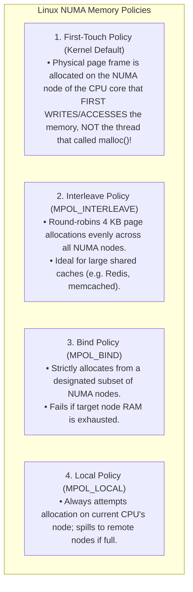
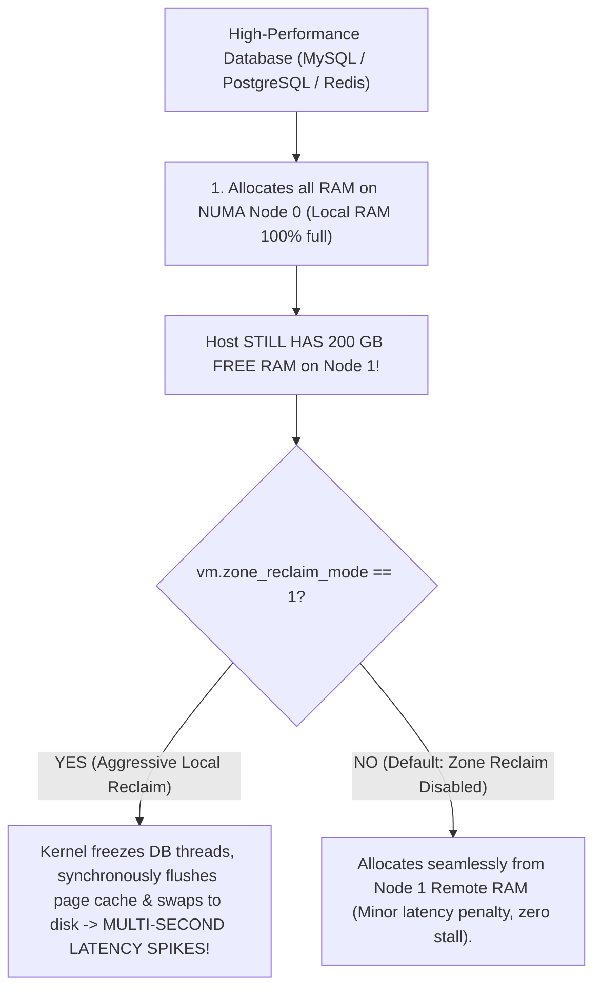

# NUMA Architecture (Non-Uniform Memory Access)

> [!abstract] Mental Model
> NUMA is **eating from your personal bread basket vs reaching across the banquet table**:
> - In early Symmetric Multiprocessing (SMP), all CPU sockets shared a single central memory bus. As core counts grew ($32 \dots 128+$ cores), memory bus contention created an insurmountable bottleneck.
> - **NUMA (Non-Uniform Memory Access)** breaks physical RAM into dedicated local pools, wiring each pool directly to an individual CPU socket's **Integrated Memory Controller (IMC)**.
> - Accessing **Local RAM** is blazing fast ($\sim 50\text{ - }70\text{ ns}$).
> - Accessing a neighbor socket's **Remote RAM** requires traversing high-speed point-to-point interconnects (Intel UPI / AMD Infinity Fabric), incurring a **$2\times \dots 3\times$ latency penalty ($\sim 140\text{ - }200\text{ ns}$)**.

---

## SMP vs NUMA Topology

```mermaid
flowchart TD
    subgraph SMP_Bottleneck ["1. Legacy SMP (Uniform Memory Access - UMA)"]
        S_CPU0["CPU Socket 0"] & S_CPU1["CPU Socket 1"] --> Bus["Shared Central Memory Bus (BUS CONTENTION BOTTLENECK!)"] --> S_RAM["Shared DRAM"]
    end

    subgraph NUMA_Architecture ["2. Modern NUMA (Non-Uniform Memory Access)"]
        subgraph Node0 ["NUMA Node 0"]
            N0_CPU["Socket 0 (Cores 0-31)"]
            N0_IMC["Local Memory Controller"]
            N0_RAM["Local DRAM (128 GB)<br/>Latency: ~65 ns"]
            N0_CPU <--> N0_IMC <--> N0_RAM
        end

        subgraph Node1 ["NUMA Node 1"]
            N1_CPU["Socket 1 (Cores 32-63)"]
            N1_IMC["Local Memory Controller"]
            N1_RAM["Local DRAM (128 GB)<br/>Latency: ~65 ns"]
            N1_CPU <--> N1_IMC <--> N1_RAM
        end

        N0_CPU <===>|Interconnect Fabric (Intel UPI / AMD Infinity Fabric)<br/>Remote Latency: ~160 ns (2.5x Penalty!)| N1_CPU
    end
```

---

## The NUMA Distance Matrix

Hardware firmware exposes a relative latency cost matrix via ACPI SLIT (System Locality Information Table):

```
        Node 0   Node 1   Node 2   Node 3
Node 0:   10       21       31       31
Node 1:   21       10       31       31
Node 2:   31       31       10       21
Node 3:   31       31       21       10
```
- **Distance 10**: Local memory access (normalized base cost).
- **Distance 21**: Single-hop remote interconnect traversal ($2.1\times$ latency).
- **Distance 31**: Two-hop remote interconnect traversal ($3.1\times$ latency).

---

## Linux Kernel Memory Allocation Policies

The Linux kernel virtual memory allocator uses NUMA-aware policies (`mempool`):



---

## The Dangerous Production Hazard: The "NUMA Anomaly"



> [!CRITICAL] Enterprise Production Setting
> Always verify that Zone Reclaim is disabled on database servers:
> ```bash
> sysctl -w vm.zone_reclaim_mode=0
> ```

---

## Automatic NUMA Balancing in the Linux Kernel

Linux CFS includes **Auto-NUMA balancing (`kernel.numa_balancing = 1`)**:
1. Periodically unmaps virtual memory PTEs (`PROT_NONE`), without invalidating physical page frames.
2. When a CPU thread touches the unmapped address, a **NUMA Hinting Page Fault** triggers in the kernel.
3. The kernel compares the accessing CPU core's NUMA node with the page's current physical NUMA node.
4. If a thread repeatedly accesses remote memory, the kernel asynchronously **migrates the page frame to the local NUMA node DRAM** using background DMA copy.

---

## Production Diagnostics & Process Pinning

```bash
# 1. Inspect NUMA Topology, CPU Cores, and Memory per Node
numactl --hardware

# Output:
# available: 2 nodes (0-1)
# node 0 cpus: 0 1 2 3 4 5 6 7 16 17 18 19 20 21 22 23
# node 0 size: 130842 MB
# node 0 free: 42109 MB
# node 1 cpus: 8 9 10 11 12 13 14 15 24 25 26 27 28 29 30 31
# node 1 size: 131072 MB
# node 1 free: 89104 MB

# 2. Inspect NUMA Allocation Hit/Miss Statistics:
numastat -c
# numa_hit      : Allocations satisfied on the local node (Optimal).
# numa_miss     : Allocations intended for local node that spilled remotely.
# numa_foreign  : Remote allocations satisfied on this node.

# 3. Pin a Latency-Sensitive Service to Node 0 CPU and RAM:
numactl --cpunodebind=0 --membind=0 ./trading_engine

# 4. Interleave Shared Cache Memory across all Nodes:
numactl --interleave=all ./redis-server /etc/redis.conf
```

---

## Active Recall & Interview Perspective

### Reasoning Prompts
1. *What is the "First-Touch Policy" in Linux NUMA memory management, and why can it cause severe performance degradation if initialization is done on a single thread?*
   - **Answer**: Under the **First-Touch Policy**, memory is not physically allocated to any NUMA node when `malloc()` returns a virtual address range; physical page frames are only allocated when a CPU core first writes/touches each page. If a multi-threaded application (e.g. a database or matrix computation engine) uses a single master thread to initialize a $100\text{ GB}$ array before spawning 64 worker threads across multiple CPU sockets, **all 100 GB of physical RAM will be allocated on Socket 0's local NUMA node**. When worker threads on Socket 1 begin processing, $100\%$ of their memory accesses will cross the interconnect fabric to remote memory, saturating the bus and running at half speed.
2. *How does `vm.zone_reclaim_mode` cause the "NUMA Anomaly" on large multi-socket database servers?*
   - **Answer**: When `vm.zone_reclaim_mode` is enabled ($1$), the Linux kernel treats NUMA node boundaries as strict memory zones. When a process on Node 0 requests memory and Node 0's local RAM is full, the kernel prioritizes reclaiming local memory (by aggressively scanning the LRU list, writing dirty cached files to disk, and paging anonymous memory to swap) rather than allocating available free memory from Node 1. This causes massive multisecond I/O latency stalls and thrashing even though the system as a whole has hundreds of gigabytes of free physical DRAM.
3. *When should you use `numactl --interleave=all` versus `numactl --cpunodebind=0 --membind=0`?*
   - **Answer**: Use **`--cpunodebind=0 --membind=0` (Strict Pinning)** when running a latency-critical application (such as high-frequency trading or real-time packet processing) that fits entirely within the core and RAM capacity of a single NUMA socket, ensuring $100\%$ of memory accesses are local ($\sim 65\text{ ns}$) with zero interconnect traversal. Use **`--interleave=all`** for large multi-threaded in-memory applications (like Redis, Memcached, or distributed JVMs) whose data set exceeds a single socket's memory capacity and whose worker threads are scheduled across all sockets, ensuring memory bandwidth and capacity are uniformly distributed across all memory controllers.

---

## Key Takeaways
- **NUMA** partitions RAM into local memory controller pools, trading uniform latency for massive multi-socket scaling.
- **Remote memory access** carries a **$2\times \dots 3\times$ latency penalty** across the CPU interconnect fabric.
- Linux uses **First-Touch Allocation**, **Auto-NUMA Balancing**, and requires **`vm.zone_reclaim_mode=0`** to avoid remote memory thrashing.

---

## Related Notes
- [[Operating System]] — Core architectural structures.
- [[Process Address Space]] — Virtual memory regions.
- [[Paging Architecture]] — Physical page allocation.
- [[CPU Scheduler and Dispatcher]] — NUMA-aware CFS task placement.
- [[Zero-Copy IO - sendfile, splice, io_uring]] — Memory locality in high-throughput I/O.
- [[eBPF Architecture and Observability]] — Tracing NUMA misses.
- [[Operating Systems MOC]] — Master table of contents for Operating Systems.
