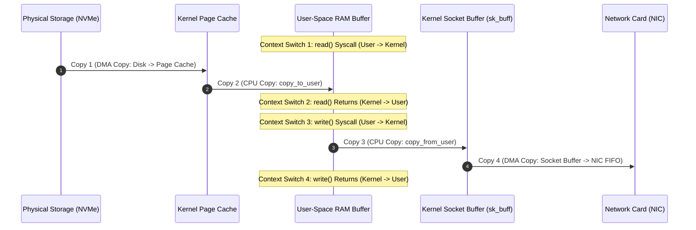
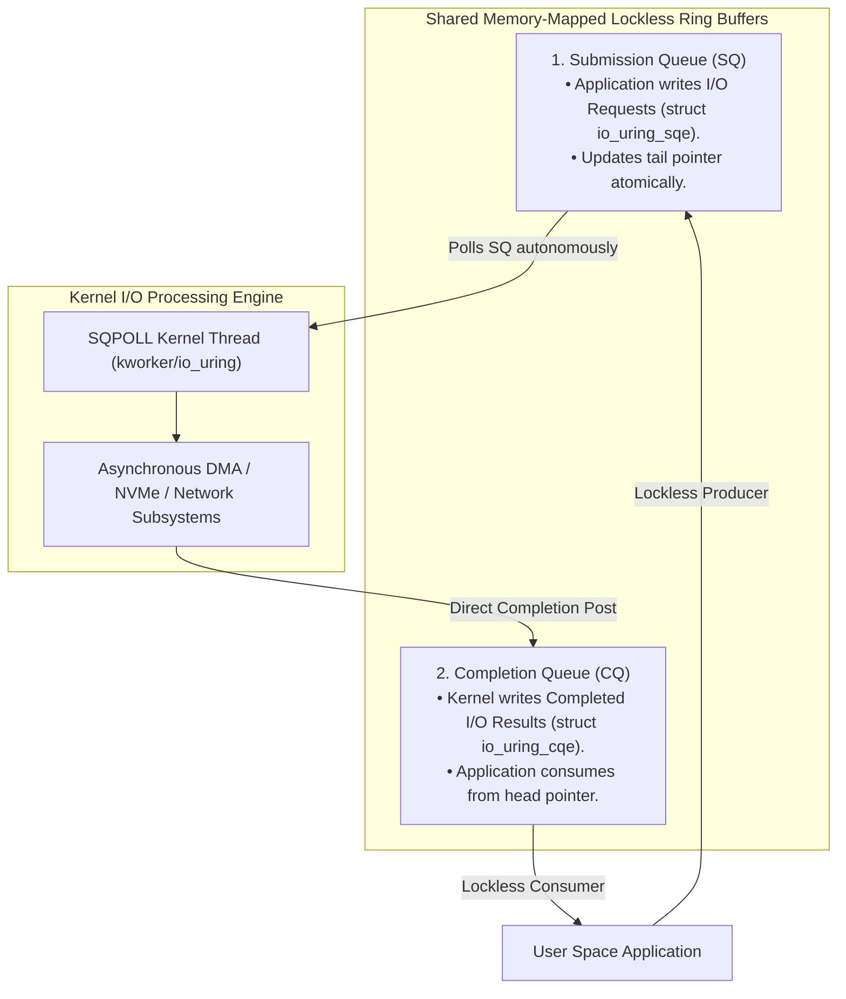

# Zero-Copy I/O: `sendfile`, `splice`, and `io_uring`

> [!abstract] Mental Model
> Zero-Copy is **connecting an oil pipeline directly between a tanker and refinery vs a bucket brigade**:
> - In standard web servers (serving static files over TCP), transferring a file using `read()` + `write()` forces **4 CPU Context Switches** and **4 Data Copies** ($2\times \text{DMA} + 2\times \text{CPU Memory Copies}$). The CPU wastes memory bus bandwidth acting as a human copy machine.
> - **Zero-Copy I/O** bypasses user-space entirely, streaming data directly from the **Kernel Page Cache into the Network Interface Card (NIC) via Scatter-Gather DMA**.
> - **`io_uring`** eliminates system call overhead entirely via **lockless shared memory ring buffers**.

---

## The 4-Copy / 4-Context-Switch Bottleneck

When a web server (e.g. Apache, Nginx) reads a file from disk and writes it to a network socket:



> **Total Overhead**: 4 Context Switches + 2 CPU Memory Bus Saturation Copies + 2 DMA transfers.

---

## 1. `sendfile()` with Scatter-Gather Socket DMA

Linux 2.4+ introduced **`sendfile()`** combined with **Scatter-Gather DMA**:

```mermaid
flowchart TD
    subgraph ZeroCopy_Sendfile ["sendfile() with NIC Scatter-Gather DMA"]
        Disk["Storage (NVMe)"] -->|1. DMA Transfer| PageCache["Kernel Page Cache (RAM)"]
        PageCache -.->|2. Append 16-byte Buffer Descriptor (NO PAYLOAD COPIED!)| SkBuf["Socket Buffer (sk_buff)"]
        PageCache ====>|3. NIC reads Page Cache DIRECTLY via Scatter-Gather DMA| NIC["Network Interface Card"]
    end
```

### The Architectural Elimination:
- **0 CPU Copies**: Payload bytes are NEVER copied by the CPU.
- **2 Context Switches** (A single `sendfile(out_fd, in_fd, offset, count)` call replaces both `read` and `write`).
- Foundation of extreme-throughput systems: **Apache Kafka**, **Nginx**, **HAProxy**.

---

## 2. `splice()` and In-Kernel Pipe Buffers

While `sendfile()` is restricted to File-to-Socket streaming, **`splice()`** streams data between **any two arbitrary file descriptors** (e.g. Socket to Socket, File to File) using in-kernel **Pipe Buffers (`struct pipe_inode_info`)**:

```mermaid
flowchart LR
    FD_In["Input File Descriptor"] 
    -->|splice()| KernelPipe["In-Kernel Pipe Buffer (struct page pointers ONLY)"]
    -->|splice()| FD_Out["Output File Descriptor"]
```
- Operates entirely by transferring **page frame pointers (`struct page*`)** rather than payload bytes.

---

## 3. The Modern Frontier: Linux `io_uring`

Introduced by Jens Axboe in Linux 5.1, **`io_uring`** completely replaces legacy `epoll` + POSIX I/O models. It establishes **two lockless circular ring buffers** mapped directly into both user-space and kernel memory via `mmap()`:



---

### Why `io_uring` Outclasses Everything:
1. **Zero System Calls in Fast Path (`IORING_SETUP_SQPOLL`)**: A dedicated kernel worker thread continuously polls the SQ ring in RAM. The user application submits thousands of I/O operations by writing memory descriptors **without executing a single system call (`io_uring_enter` is never called!)**.
2. **Unified Asynchrony**: Seamlessly handles disk files, sockets, timers, and inter-thread messaging in a single event loop.
3. **Fixed Buffers (`IORING_REGISTER_BUFFERS`)**: Pre-registers and pins user memory buffers in RAM, eliminating page-table walking and IOMMU mapping overhead on every I/O transaction.

---

## Technical Comparison Matrix

| Zero-Copy Primitive | Context Switches | CPU Memory Copies | Supported Descriptors | Syscall Elimination? |
| :--- | :--- | :--- | :--- | :--- |
| **Traditional `read/write`**| $4$ | $2$ (Double buffer) | Any FD | No |
| **`mmap` + `write`** | $2$ (Minor faults) | $1$ (Kernel socket copy)| Any FD | No |
| **`sendfile`** | $2$ | **$0$ (With SG-DMA)** | File $\to$ Socket only | No |
| **`splice`** | $2$ | **$0$** | Any FD (via Pipe) | No |
| **`io_uring` (Standard)** | $1$ per batch | **$0$ (With fixed bufs)**| **Universal (File, Sock, Pipe)**| Batching ($1000\text{ ops / syscall}$) |
| **`io_uring` (SQPOLL)** | **$\mathbf{0}$ (Zero Syscalls!)**| **$0$** | **Universal** | **$100\%$ Lockless RAM Queue** |

---

## Production Code Snippet: `sendfile()` vs `io_uring`

### 1. Zero-Copy File Transfer with `sendfile()`:
```c
#include <sys/sendfile.h>

// Stream 100 MB directly from file to network socket with ZERO CPU copying:
off_t offset = 0;
ssize_t sent = sendfile(socket_fd, file_fd, &offset, 104857600);
```

---

### 2. High-Performance Asynchronous Submission with `io_uring`:
```c
#include <liburing.h>

struct io_uring ring;
io_uring_queue_init(256, &ring, 0);

// Get submission queue entry:
struct io_uring_sqe *sqe = io_uring_get_sqe(&ring);

// Prepare zero-copy socket send:
io_uring_prep_send(sqe, socket_fd, buffer, len, MSG_ZEROCOPY);

// Submit batch to kernel:
io_uring_submit(&ring);
```

---

## Production Diagnostics & Tracing

```bash
# 1. Trace sendfile syscall invocation rate across server processes
sudo bpftrace -e 'tracepoint:syscalls:sys_enter_sendfile { @[comm] = count(); }'

# 2. Monitor io_uring SQ and CQ queue throughput:
sudo bpftrace -e 'tracepoint:io_uring:io_uring_submit_req { @submissions = count(); }'

# 3. Check system-wide io_uring permissions and registered instances:
cat /proc/sys/kernel/io_uring_disabled
# 0 (0 = Enabled; 1 = Disabled for unprivileged users; 2 = Disabled system-wide)
```

---

## Active Recall & Interview Perspective

### Reasoning Prompts
1. *How does Scatter-Gather DMA enable `sendfile()` to achieve true "Zero CPU Copy" data transfers?*
   - **Answer**: When `sendfile()` is invoked on a system with standard network hardware, the kernel still has to perform one CPU memory copy: copying data from the Page Cache into the kernel socket buffer (`sk_buff`). With **Scatter-Gather DMA-capable NICs**, the kernel does not copy any payload bytes into `sk_buff`; instead, it writes a tiny 16-byte memory descriptor into `sk_buff` containing the physical memory address pointers and lengths of the pages residing in the Page Cache. The NIC's hardware DMA controller reads the packet payload directly from the Page Cache RAM, achieving $100\%$ zero CPU memory copying.
2. *Why does `io_uring` provide significantly higher IOPS than `epoll` for high-throughput disk and network services?*
   - **Answer**: `epoll` is strictly a *readiness notification* mechanism (it tells you when an FD is ready, requiring you to invoke a subsequent `read()` or `write()` syscall). Furthermore, `epoll` does not support asynchronous operations on regular disk files (which always block in Linux). **`io_uring`** is a true *asynchronous completion* engine that handles both disk files and sockets. By using shared memory submission and completion ring buffers, user space can queue hundreds of operations and reap completions without making system calls, eliminating CPU context switches, TLB shootdowns, and kernel boundary transitions.
3. *What is `IORING_SETUP_SQPOLL` in `io_uring` and what trade-off does it introduce?*
   - **Answer**: `IORING_SETUP_SQPOLL` spawns a dedicated kernel thread (`kworker/io_uring`) that continuously spins and polls the Submission Queue (SQ) ring in shared memory. When the application writes new I/O requests to the ring, the kernel thread processes them immediately without the application ever calling `io_uring_enter()` (achieving **zero system calls**). The trade-off is CPU utilization: the polling kernel thread consumes an entire dedicated CPU core running at $100\%$ utilization even when I/O traffic is light, making it suitable only for high-load, low-latency enterprise services.

---

## Key Takeaways
- Standard file-to-socket transfers suffer a **4-Context-Switch / 4-Copy Bottleneck**.
- **`sendfile()`** and **`splice()`** stream data in-kernel via **Scatter-Gather DMA**, eliminating CPU memory copies.
- **`io_uring`** unifies disk and network I/O into **lockless shared memory ring buffers**, scaling to millions of IOPS with zero system calls (`SQPOLL`).

---

## Related Notes
- [[Operating System]] — Storage and I/O architecture.
- [[System Calls]] — Syscall overheads and transitions.
- [[Direct Memory Access - DMA]] — Scatter-gather DMA controllers.
- [[Page Cache and Buffer Cache]] — Page cache buffer descriptors.
- [[Memory-Mapped IO and mmap]] — Shared memory ring buffers.
- [[eBPF Architecture and Observability]] — Tracing zero-copy performance.
- [[Operating Systems MOC]] — Master table of contents for Operating Systems.
