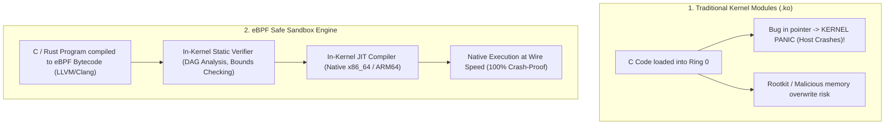
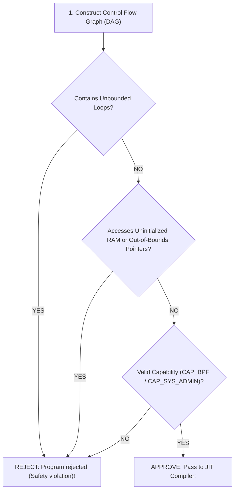

# eBPF Architecture and Observability

> [!abstract] Mental Model
> eBPF is **"JavaScript for the Linux Kernel"**:
> - Just as JavaScript allows web developers to run sandboxed, event-driven code inside web browsers without modifying the browser engine source code, **eBPF allows systems engineers to execute sandboxed, event-driven bytecode directly inside the Linux Kernel** without recompiling the kernel or loading risky, unstable Kernel Modules.
> - An **In-Kernel Static Verifier** guarantees that eBPF programs can never crash the host, never loop infinitely, and never corrupt kernel memory before an **In-Kernel JIT Compiler** translates the bytecode into native machine speed.

---

## The Architectural Shift: Kernel Modules vs eBPF



---

## eBPF Core Subsystems

```mermaid
flowchart TD
    subgraph UserSpace ["User Space"]
        Loader["Loader App (bpftool / Go / Rust / Python)"]
        BPF_Bytecode["eBPF Bytecode (.o ELF)"]
        Consumer["Observability Agent / Prometheus / Cilium"]
    end

    subgraph KernelSpace ["Linux Kernel (Ring 0)"]
        Syscall_BPF["sys_bpf() Syscall"]
        
        subgraph SandboxEngine ["eBPF Execution Engine"]
            Verifier["1. Static Safety Verifier<br/>• Prohibits unbounded loops<br/>• Bounds check all memory pointers<br/>• Max 1M instructions"]
            JIT["2. JIT Compiler<br/>• Translates bytecode to native assembly"]
            VM["3. eBPF Registers (R0-R10) & 512B Stack"]
        end

        subgraph StorageBridge ["BPF Maps (Shared In-RAM Key-Value Stores)"]
            HashMap["BPF_MAP_TYPE_HASH"]
            RingBuf["BPF_MAP_TYPE_RINGBUF (Lockless Event Stream)"]
        end

        subgraph Probes ["Kernel Event Attachment Points"]
            Kprobe["Kprobes (Kernel func entry)"]
            Tracepoint["Tracepoints (Static trace hooks)"]
            XDP["XDP (Driver packet ingress)"]
            LSM["LSM (Security MAC hooks)"]
        end
    end

    Loader -->|1. Loads Bytecode via sys_bpf()| Syscall_BPF
    Syscall_BPF --> Verifier --> JIT --> VM
    VM <-->|Read / Write Metrics| StorageBridge
    StorageBridge <-->|Zero-Copy mmap Read| Consumer
    Probes -->|Trigger Event Execution| VM
```

---

## The In-Kernel Static Safety Verifier

Before any eBPF program is permitted to execute, the kernel verifier performs rigorous graph analysis:



### Verifier Constraints:
1. **Memory Safety**: No raw pointer arithmetic on kernel structures without using `bpf_probe_read_kernel()`.
2. **Termination Assurance**: Every code path must reach `BPF_EXIT` within at most $1,000,000$ verified instructions.
3. **Register Initialization**: Registers must be explicitly initialized before use.

---

## eBPF Program Attachment Points

| Hook Type | Attachment Location | Latency Overhead | Primary Use Case |
| :--- | :--- | :--- | :--- |
| **XDP (eXpress Data Path)** | Network driver ring buffer (before `sk_buff` memory allocation) | **$< 10\text{ nanoseconds}$** | High-rate DDoS mitigation ($40\text{M pkts/sec}$), fast load balancing. |
| **TC (Traffic Control)** | Kernel network stack ingress/egress | $\sim 50\text{ nanoseconds}$ | Container network policies (Cilium), packet shaping, service mesh. |
| **Kprobe / Kretprobe** | Dynamic entry/return of **any** kernel C function | $\sim 100\text{ nanoseconds}$ | Dynamic kernel debugging, tracing disk I/O latency, lock contention. |
| **Tracepoint** | Statically defined kernel trace events (guaranteed stable ABI) | $\sim 20\text{ nanoseconds}$ | System call tracing (`sys_enter_openat`), scheduler latency analysis. |
| **Uprobe / Uretprobe** | Dynamic entry/return of **user-space** binaries | $\sim 200\text{ nanoseconds}$ | Tracing SSL/TLS unencrypted traffic in OpenSSL, Go runtime profiling. |
| **LSM (Linux Security Module)** | Kernel security decision points | $\sim 20\text{ nanoseconds}$ | Runtime security enforcement, container privilege lockdown. |

---

## BPF Maps: Bridging Kernel and User Space

eBPF programs cannot access standard libc or filesystem storage. They communicate with user space via **BPF Maps**:

- **`BPF_MAP_TYPE_RINGBUF`**: A lockless memory-mapped circular ring buffer designed for streaming millions of structured telemetry events to user space without dropping packets.
- **`BPF_MAP_TYPE_HASH`**: General purpose key-value storage (e.g. tracking connection counts per source IP).
- **`BPF_MAP_TYPE_PERCPU_ARRAY`**: Lock-free per-CPU array counters eliminating cache line bouncing on multi-core servers.

---

## Production Diagnostics & Tracing with `bpftrace`

```bash
# 1. Inspect all active in-kernel eBPF programs:
sudo bpftool prog list

# 2. Measure Disk I/O Block Latency Distribution in 1 line:
sudo bpftrace -e 'kprobe:blk_account_io_done { @[kstack] = hist(arg1); }'

# 3. Snoop All File Opens across the OS in Real Time:
sudo bpftrace -e 'tracepoint:syscalls:sys_enter_openat { printf("%-16s %s\n", comm, str(args->filename)); }'

# Output:
# nginx            /etc/nginx/nginx.conf
# postgres         /var/lib/postgresql/data/base/16384/1249
# dockerd          /var/run/docker/containerd/containerd.sock

# 4. Trace Unencrypted HTTPS Traffic in OpenSSL using Uprobes:
sudo bpftrace -e 'uprobe:/lib/x86_64-linux-gnu/libssl.so.3:SSL_write { printf("PID %d wrote %d bytes\n", pid, arg2); }'
```

---

## Active Recall & Interview Perspective

### Reasoning Prompts
1. *Why does XDP (eXpress Data Path) achieve significantly higher packet processing performance than standard Linux `iptables` / `nftables`?*
   - **Answer**: Standard Linux networking requires the network card driver to allocate an expensive `sk_buff` (Socket Buffer) kernel structure in DRAM, populate IP/TCP headers, initialize metadata, and pass it up through the entire networking stack before reaching `iptables` rules. **XDP** executes an eBPF program directly inside the network driver's RX ring buffer *before* the kernel allocates an `sk_buff` or touches the network stack. It can drop malicious packets (`XDP_DROP`) or redirect them (`XDP_TX`) in single-digit nanoseconds, processing over $40\text{ million packets per second}$ on commodity hardware.
2. *What is the difference between a Tracepoint and a Kprobe in Linux observability?*
   - **Answer**: **Tracepoints** are statically placed, explicitly declared macros inside the Linux kernel source code by kernel maintainers; they offer stable, guaranteed ABIs across kernel version upgrades and negligible overhead. **Kprobes** provide dynamic instrumentation: the kernel dynamically replaces the target instruction at any arbitrary kernel function address with a breakpoint/jump instruction to trigger a handler. While Kprobes allow tracing almost any function in the kernel, they are unstable (kernel function names and signatures change between kernel releases) and carry slightly higher overhead.
3. *How does the eBPF Verifier prevent Kernel Panics while executing arbitrary user-defined code in Ring 0?*
   - **Answer**: The Verifier performs formal static analysis by building a Directed Acyclic Graph (DAG) of all possible code execution paths. It checks every register and memory reference, proving that memory pointers never point outside valid stack boundaries or map entries, and verifies that the program contains no unbounded loops (preventing CPU starvation). It also enforces that all helper function arguments match strict type specifications. If any unsafe condition or potential null-pointer dereference is detected, the kernel rejects program loading with an error.

---

## Key Takeaways
- **eBPF** enables safe, sandboxed, high-performance execution of custom bytecode in **Ring 0**.
- The **Static Verifier** guarantees crash-free execution, and the **JIT Compiler** runs code at native machine speed.
- Used for high-throughput **Observability (Tracepoints/Kprobes)**, **Networking (XDP/Cilium)**, and **Runtime Security (LSM)**.

---

## Related Notes
- [[Operating System]] — Core kernel architecture.
- [[Kernel Modules and Device Drivers]] — Contrasting kernel extension mechanisms.
- [[System Calls]] — Syscall interception.
- [[Interrupts and Interrupt Handling]] — NIC interrupt handling and XDP.
- [[OS-Level Virtualization - Linux Namespaces and cgroups]] — Container networking and observability.
- [[Zero-Copy IO - sendfile, splice, io_uring]] — High-performance kernel interfaces.
- [[Operating Systems MOC]] — Master table of contents for Operating Systems.
