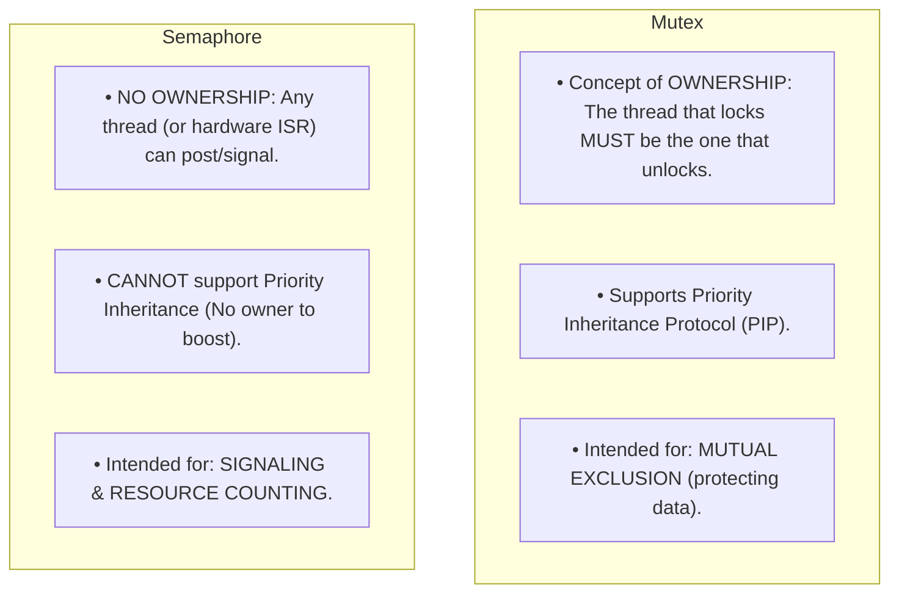

# Binary and Counting Semaphores

> [!abstract] Mental Model
> A **Counting Semaphore** is a **nightclub bouncer with a bowl of $N$ entry tokens**: when a patron arrives, they take a token ($P$ / `sem_wait()`). If the bowl is empty ($S = 0$), the patron must wait in the velvet-rope line outside until a departing patron drops their token back into the bowl ($V$ / `sem_post()`). 
> Unlike a [[Producer-Consumer Pattern - Bounded Queues and Condition Variables]], **the person returning the token does NOT have to be the person who took it**—making semaphores the premier abstraction for **asynchronous signaling and resource pooling**.

---

## The Dijkstra Mathematical Foundations ($P$ and $V$)

Invented by Edsger Dijkstra in 1965 for the THE multiprogramming system, a Semaphore $S$ is an integer variable accessed exclusively through two atomic operations:

```mermaid
flowchart TD
    subgraph WaitOp ["1. Wait Operation (P / proberen / sem_wait)"]
        direction TB
        W_Dec["Atomically Decrement: S = S - 1"]
        W_Check{"Is S < 0?"}
        W_Dec --> W_Check
        W_Check -->|YES| W_Sleep["Block Calling Thread & Append PCB to Semaphore Wait Queue"]
        W_Check -->|NO| W_Proceed["Thread proceeds immediately into Critical Section"]
    end

    subgraph SignalOp ["2. Signal Operation (V / verhogen / sem_post)"]
        direction TB
        S_Inc["Atomically Increment: S = S + 1"]
        S_Check{"Is S <= 0?"}
        S_Inc --> S_Check
        S_Check -->|YES (Waiters exist)| S_Wake["Dequeue and Wake UP one sleeping thread from Wait Queue"]
        S_Check -->|NO| S_Done["No threads waiting; token preserved in bowl"]
    end
```

---

### The Fundamental Semaphore Invariant
$$\mathbf{S(t) = S_{\text{init}} + N_{\text{signals}}(t) - N_{\text{waits\_completed}}(t) \ge 0}$$
- If $S(t) > 0$: Represents the **number of available resource units**.
- If $S(t) < 0$: $|S(t)|$ represents the **exact number of threads currently blocked and sleeping** in the kernel wait queue.

---

## Binary vs Counting Semaphores

| Dimension | Binary Semaphore | Counting Semaphore |
| :--- | :--- | :--- |
| **Initial Value ($S_{\text{init}}$)** | Exactly **$1$** (or $0$ for signaling). | Arbitrary positive integer **$N$** (e.g., $10$, $100$). |
| **Value Range** | Restricted to $\{0, 1\}$. | Unbounded non-negative integer $[0, N]$. |
| **Primary Domain** | Mutual Exclusion or 1-to-1 Event Notification. | **Resource Pools** (DB connections, memory buffers, thread limits). |
| **Concurrency Degree** | Exactly **1 thread** at a time. | Up to **$N$ threads concurrently**. |

---

## The Critical Distinction: Mutex vs Semaphore



---

## POSIX Semaphore APIs in Production C

POSIX defines two variants of semaphores: **Unnamed (Memory-based)** and **Named (Kernel IPC)**:

### 1. Unnamed Semaphores (`sem_init`)
Reside in shared process memory or thread address space:

```c
#include <stdio.h>
#include <pthread.h>
#include <semaphore.h>
#include <unistd.h>

#define MAX_CONCURRENT_WORKERS 3

sem_t resource_pool;

void* worker(void* arg) {
    int id = *(int*)arg;
    
    // 1. P Operation: Acquire resource token (Blocks if pool exhausted)
    sem_wait(&resource_pool);
    
    printf("[Worker %d] Acquired token! Processing heavy computation...\n", id);
    sleep(1); // Simulating work
    
    printf("[Worker %d] Finished work. Releasing token.\n", id);
    
    // 2. V Operation: Return token and awaken waiting worker
    sem_post(&resource_pool);
    return NULL;
}

int main(void) {
    // Initialize semaphore: pshared = 0 (threads), initial value = 3
    sem_init(&resource_pool, 0, MAX_CONCURRENT_WORKERS);
    
    pthread_t threads[6];
    int ids[6];
    
    for (int i = 0; i < 6; i++) {
        ids[i] = i + 1;
        pthread_create(&threads[i], NULL, worker, &ids[i]);
    }
    
    for (int i = 0; i < 6; i++) {
        pthread_join(threads[i], NULL);
    }
    
    sem_destroy(&resource_pool);
    return 0;
}
```

---

### 2. Named Semaphores (`sem_open` for Multi-Process IPC)
Named semaphores are identified by a filesystem-like path and persist in the kernel across unrelated processes:

```c
// Process A (Creator):
sem_t *sem = sem_open("/engine_lock", O_CREAT | O_EXCL, 0644, 1);

// Process B (Client):
sem_t *sem = sem_open("/engine_lock", 0);
sem_wait(sem);
// ... IPC critical section ...
sem_post(sem);
sem_close(sem);

// Unlink when completely finished:
sem_unlink("/engine_lock");
```

---

## Classic Production Pattern: Rate Limiting & Concurrency Throttling

```mermaid
sequenceDiagram
    autonumber
    participant Incoming as 1000 Inbound HTTP Requests
    participant Semaphore as Counting Semaphore (Limit = 10)
    participant Upstream as External Payment Gateway

    Incoming->>Semaphore: 1. Requests execute sem_wait()
    Note over Semaphore: 10 requests acquire tokens instantly.<br/>990 requests placed into sleep queue!
    Semaphore->>Upstream: 2. Exactly 10 concurrent requests sent to Gateway
    Upstream-->>Semaphore: 3. Gateway responds -> Worker calls sem_post()
    Note over Semaphore: Token returned; next sleeping request awakened!
```

---

## Active Recall & Interview Perspective

### Reasoning Prompts
1. *Why can a semaphore be signaled by an Interrupt Service Routine (ISR), while a mutex cannot?*
   - **Answer**: Mutexes enforce strict **thread ownership**: the kernel records the calling thread's ID and panics or fails if a different thread or context attempts to unlock it. Because hardware ISRs execute in an asynchronous interrupt context without a `task_struct` thread identity, an ISR cannot "own" a lock. Semaphores have no concept of ownership—they are atomic counters with wait queues—allowing an ISR to freely call `sem_post()` to notify a user thread that hardware data is ready.
2. *What is the difference between `sem_wait()`, `sem_trywait()`, and `sem_timedwait()`?*
   - **Answer**: `sem_wait()` is a blocking call that puts the thread to sleep indefinitely if $S \le 0$. `sem_trywait()` is non-blocking: if $S > 0$, it decrements and returns $0$; if $S \le 0$, it returns immediately with error `EAGAIN`. `sem_timedwait()` blocks for at most a specified `struct timespec` timeout, returning `ETIMEDOUT` if no token becomes available, preventing indefinite thread deadlocks.
3. *If a counting semaphore is initialized to $S = 5$, and 8 threads call `sem_wait()`, followed by 2 calls to `sem_post()`, what is the final internal value of $S$ and how many threads are sleeping?*
   - **Answer**: 
     - Initial: $S = 5$.
     - After 8 waits: $S = 5 - 8 = -3$ (3 threads blocked and sleeping).
     - After 2 posts: $S = -3 + 2 = \mathbf{-1}$.
     - **Final State**: Internal counter is **$-1$**, and exactly **$1$ thread remains sleeping** in the wait queue.

---

## Key Takeaways
- **Semaphores** are atomic counter abstractions with $P$ (`sem_wait`) and $V$ (`sem_post`) operations.
- **Counting Semaphores** manage resource pools of size $N$; **Binary Semaphores** restrict values to $0$ and $1$.
- Unlike Mutexes, semaphores have **no thread ownership**, making them ideal for **ISR signaling and rate-limiting**.

---

## Related Notes
- [[Operating System]] — Concurrency architecture.
- [[Interrupts and Interrupt Handling]] — ISR signaling using semaphores.
- [[Critical Section Problem]] — Mutual exclusion with binary semaphores.
- [[Hardware Synchronization Primitives - CAS, TAS, LL-SC]] — Silicon atomics.
- [[Producer-Consumer Pattern - Bounded Queues and Condition Variables]] — Ownership-constrained alternative to binary semaphores.
- [[Producer-Consumer Pattern - Bounded Queues and Condition Variables]] — Condition-based waiting.
- [[Producer-Consumer Problem]] — Bounded buffer solved with semaphores.
- [[Operating Systems MOC]] — Master table of contents for Operating Systems.
