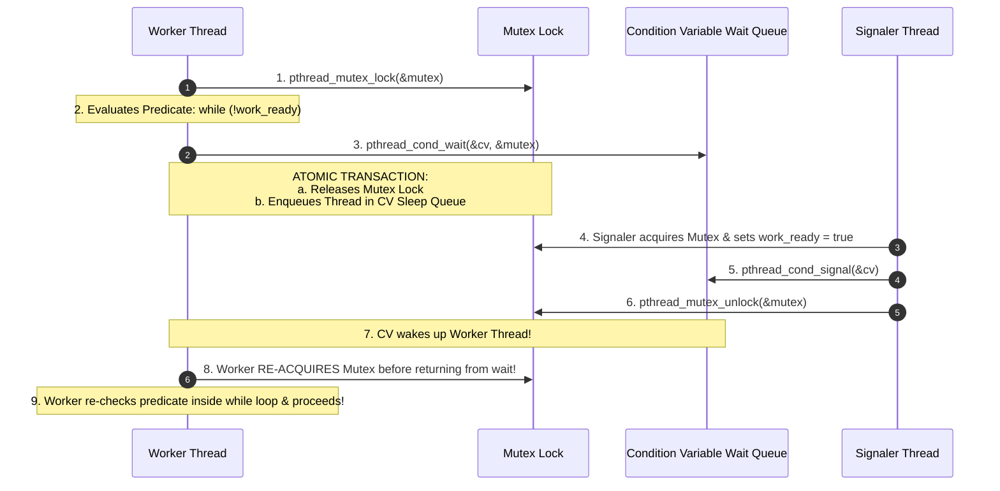
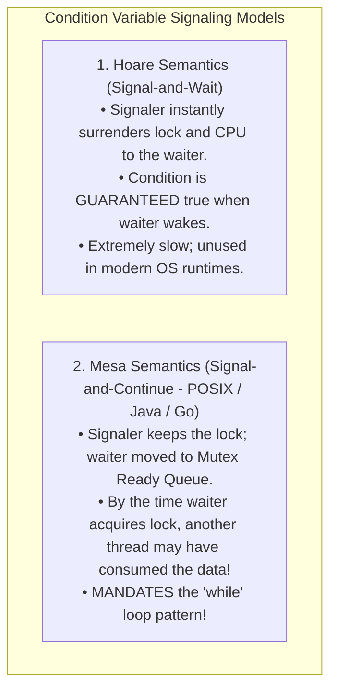
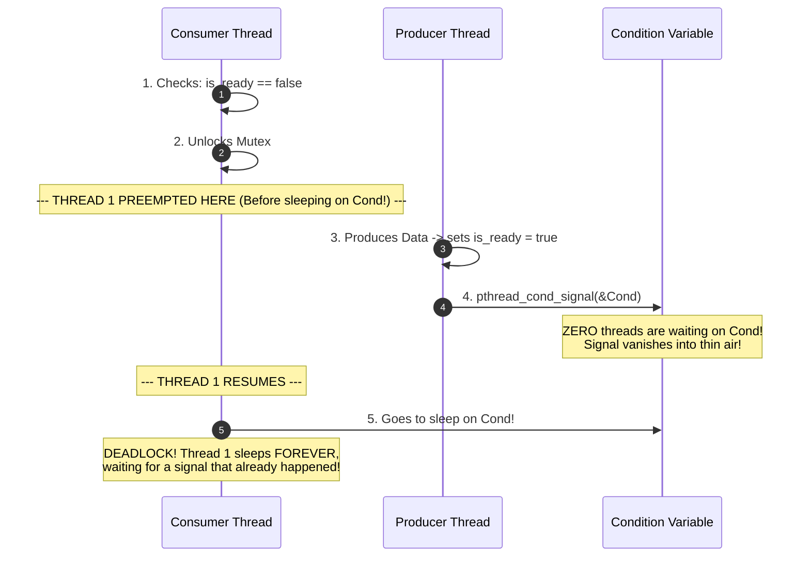
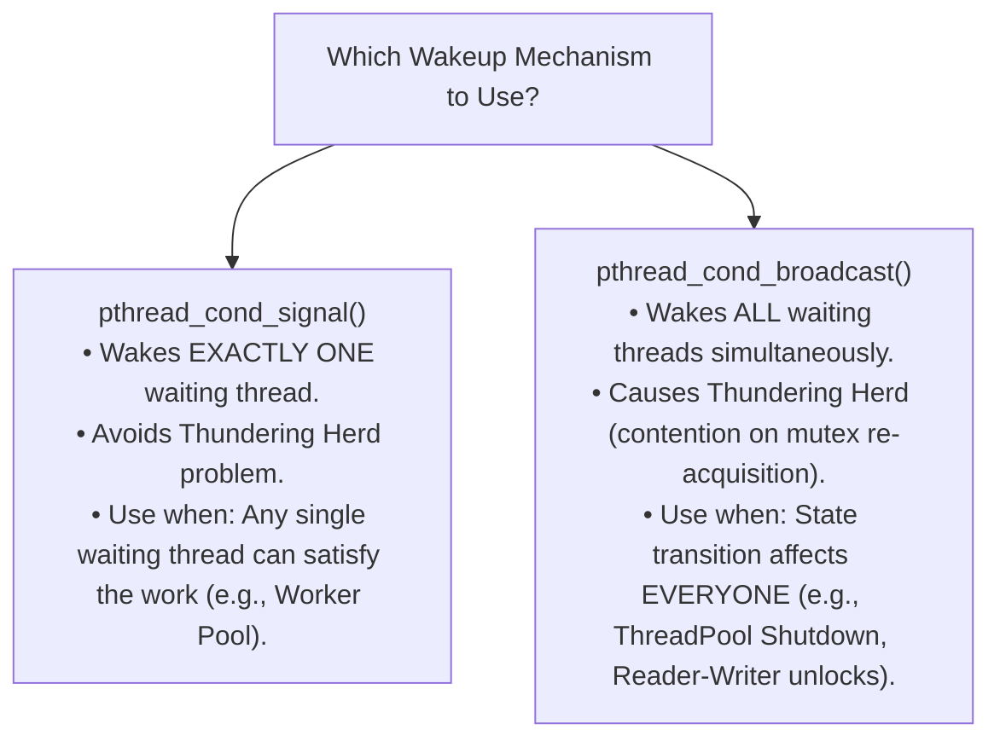

# Condition Variables

> [!abstract] Mental Model
> A **Condition Variable** is a **doctor's waiting room intercom**: you lock the consultation room door ([[Producer-Consumer Pattern - Bounded Queues and Condition Variables]]) to review your test results. Finding that your lab work isn't ready yet, you don't keep the doctor hostage; you unlock the door, step into the waiting lounge, and **go to sleep** (`pthread_cond_wait`). When the lab technician finishes, they announce your name over the intercom (`pthread_cond_signal`), whereupon you wake up, re-lock the consultation room door, and re-check your results.

---

## Architectural Mechanics: The Mutex Coupling

A Condition Variable has **no value and no memory**; it is simply an operating system wait queue. It **must always be paired with a Mutex** to protect the shared boolean condition predicate:



---

## The Cardinal Rule: Mesa vs Hoare Semantics

Why must `pthread_cond_wait()` **always be placed inside a `while` loop, never an `if` statement?**



---

### The Catastrophic `if` Bug:
```c
// BROKEN CONCURRENT CODE (NEVER DO THIS!):
pthread_mutex_lock(&lock);
if (queue_is_empty()) { // BUG: if statement instead of while loop!
    pthread_cond_wait(&cond, &lock);
}
item = dequeue(); // CRASH! Under Mesa semantics, queue might be empty again!
pthread_mutex_unlock(&lock);
```

### The Correct Production Pattern:
```c
// ROBUST PRODUCTION CODE:
pthread_mutex_lock(&lock);
while (queue_is_empty()) { // Loop re-evaluates condition after EVERY wakeup!
    pthread_cond_wait(&cond, &lock);
}
item = dequeue(); // 100% Guaranteed safe
pthread_mutex_unlock(&lock);
```

---

## The Silicon Reality: Spurious Wakeups

> [!danger] Spurious Wakeup Hazard
> On multi-core operating systems (Linux, macOS, Windows), **a sleeping thread can wake up from `pthread_cond_wait()` even if NO thread ever signaled or broadcasted the condition variable!**

### Why Spurious Wakeups Occur in Real Kernels:
1. **Linux Futex Context**: In the Linux kernel, `futex` wait queues are organized in a global hash table. A wake signal intended for a different futex hash collision can wake the thread.
2. **Kernel Signals (`EINTR`)**: Unix signals (e.g., `SIGALRM`, `SIGCHLD`) delivered to the process interrupt the kernel `sys_futex` sleep, forcing the pthread runtime to re-acquire the mutex and return.
3. **Multi-Processor Race Resolving**: Memory bus invalidations during SMP state transitions.

*The `while (!predicate)` loop completely neutralizes spurious wakeups by immediately putting the falsely-awakened thread back to sleep!*

---

## The "Lost Wakeup" Race Condition

What happens if `pthread_cond_wait()` was not designed to release the mutex and sleep **atomically**?



> [!important] Atomic Requirement
> `pthread_cond_wait()` **atomically drops the mutex and enrolls the thread in the sleep queue** inside a single kernel lock transaction, mathematically preventing the Lost Wakeup race.

---

## Signal vs Broadcast (`pthread_cond_signal` vs `pthread_cond_broadcast`)



---

## Production Implementation: Thread-Safe Bounded Queue in C

```c
#include <stdio.h>
#include <stdlib.h>
#include <stdbool.h>
#include <pthread.h>

#define CAPACITY 5

typedef struct {
    int buffer[CAPACITY];
    int head;
    int tail;
    int count;
    pthread_mutex_t lock;
    pthread_cond_t not_full;   // Signaled when slot becomes available
    pthread_cond_t not_empty;  // Signaled when item becomes available
} bounded_queue_t;

void queue_init(bounded_queue_t *q) {
    q->head = q->tail = q->count = 0;
    pthread_mutex_init(&q->lock, NULL);
    pthread_cond_init(&q->not_full, NULL);
    pthread_cond_init(&q->not_empty, NULL);
}

void queue_push(bounded_queue_t *q, int item) {
    pthread_mutex_lock(&q->lock);
    
    // Mesa Semantics: Must use while loop!
    while (q->count == CAPACITY) {
        pthread_cond_wait(&q->not_full, &q->lock);
    }
    
    q->buffer[q->tail] = item;
    q->tail = (q->tail + 1) % CAPACITY;
    q->count++;
    
    // Signal waiting consumers that an item is ready
    pthread_cond_signal(&q->not_empty);
    pthread_mutex_unlock(&q->lock);
}

int queue_pop(bounded_queue_t *q) {
    pthread_mutex_lock(&q->lock);
    
    while (q->count == 0) {
        pthread_cond_wait(&q->not_empty, &q->lock);
    }
    
    int item = q->buffer[q->head];
    q->head = (q->head + 1) % CAPACITY;
    q->count--;
    
    // Signal waiting producers that space is available
    pthread_cond_signal(&q->not_full);
    pthread_mutex_unlock(&q->lock);
    return item;
}
```

---

## Active Recall & Interview Perspective

### Reasoning Prompts
1. *Why does `pthread_cond_wait` take a pointer to a mutex as its second argument?*
   - **Answer**: To prevent the fatal **Lost Wakeup** race condition. If unlocking the mutex and putting the thread to sleep were two separate operations, a context switch between them would allow a signaling thread to change the predicate and fire `pthread_cond_signal` before the waiting thread actually sleeps. The signal would be lost, causing the waiting thread to sleep indefinitely. Taking the mutex allows the kernel to atomically release the lock and register the thread into the condition variable sleep queue in a single indivisible step.
2. *What is the Thundering Herd Problem and how does `pthread_cond_signal` mitigate it?*
   - **Answer**: The Thundering Herd Problem occurs when `pthread_cond_broadcast` wakes dozens or hundreds of sleeping threads simultaneously when only a single item or unit of work is available. All awakened threads rush to acquire the mutex simultaneously, creating severe lock contention, cache-line bouncing, and context-switching overhead, only for one thread to grab the item and the rest to fall back to sleep. `pthread_cond_signal` mitigates this by waking exactly one thread.
3. *Why can condition variables never replace mutexes?*
   - **Answer**: A Condition Variable has no intrinsic locking capability or mutual exclusion guarantee; it is merely an anonymous waiting list. It relies entirely on an external mutex to provide atomic synchronization when evaluating and mutating the shared boolean predicate. Without the mutex, data races on the state variable would destroy correctness.

---

## Key Takeaways
- **Condition Variables** enable threads to sleep until a specific boolean state predicate becomes true.
- Under **Mesa Semantics**, `pthread_cond_wait` **must always be wrapped in a `while` loop** to handle state changes and **Spurious Wakeups**.
- `pthread_cond_wait` **atomically releases the mutex and sleeps**, eliminating Lost Wakeup race conditions.

---

## Related Notes
- [[Operating System]] — Concurrency primitives.
- [[Thread]] — Multi-threaded state coordination.
- [[Critical Section Problem]] — Protecting shared invariants.
- [[Producer-Consumer Pattern - Bounded Queues and Condition Variables]] — The mandatory locking partner for condition variables.
- [[Binary and Counting Semaphores]] — The counting alternative to CVs.
- [[Monitors]] — Language-level pairing of mutex + condition variables.
- [[Producer-Consumer Problem]] — Bounded buffer solved with CVs.
- [[Operating Systems MOC]] — Master table of contents for Operating Systems.
