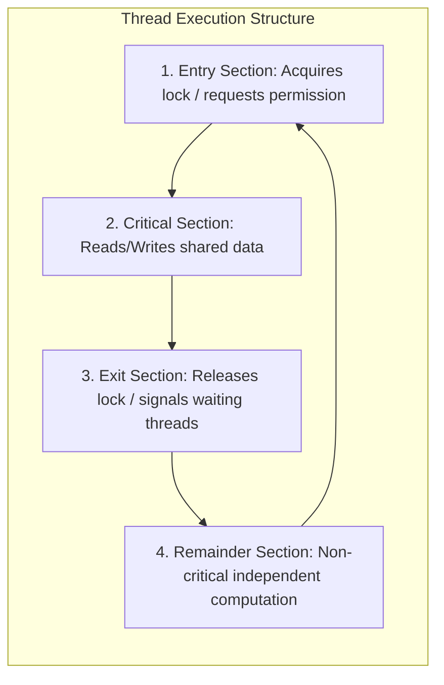
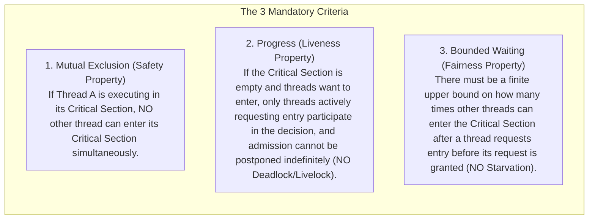
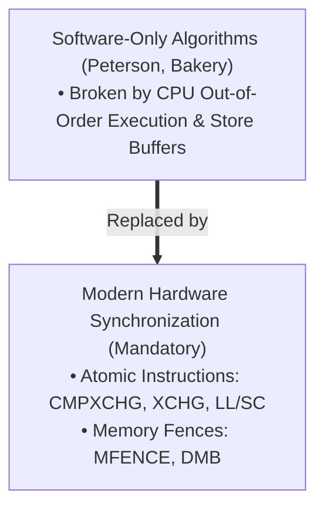

# The Critical Section Problem

> [!abstract] Mental Model
> A **Critical Section** is a **single-occupancy sterile operating room**: only one surgeon (thread) is permitted inside at any time to operate on the patient (shared mutable data). The **Critical Section Problem** is the challenge of designing the protocol governing the automated door locks—ensuring surgeons don't enter simultaneously, doctors in the hallway don't block the door, and no surgeon waits outside forever.

---

## Anatomy of a Concurrent Process

Every concurrent thread executing shared state is divided into four distinct sections:



---

## The Three Inviolable Correctness Criteria

To be certified as a valid solution to the Critical Section Problem, an algorithm **must mathematically satisfy all three requirements**:



---

## The Evolution of Software-Only Solutions

Before hardware atomic instructions existed, computer scientists designed software algorithms to solve the 2-process critical section problem:

### Attempt 1: Strict Alternation (Turn Variable)
```c
int turn = 0; // Shared variable

// Process P0:
while (turn != 0); // Busy wait
// --- CRITICAL SECTION ---
turn = 1;
// --- REMAINDER SECTION ---
```
- **Flaw**: Violates **Progress**. If Process 0 finishes and enters a long remainder section, Process 1 executes once, sets `turn = 0`, and is then blocked from re-entering until Process 0 runs again—even if the critical section is completely empty!

---

### Attempt 2: Flag Array
```c
bool flag[2] = {false, false};

// Process P0:
flag[0] = true;
while (flag[1]); // Wait for P1
// --- CRITICAL SECTION ---
flag[0] = false;
```
- **Flaw**: Violates **Progress (Deadlock)**. If $P_0$ and $P_1$ set `flag[0] = true` and `flag[1] = true` simultaneously, both execute `while(flag[other])` concurrently, deadlocking both threads forever.

---

## Peterson's Algorithm (The Classical 2-Process Solution)

Invented by Gary Peterson in 1981, this algorithm combines the `flag` array with a `turn` tie-breaker:

```c
// Shared variables
bool flag[2] = {false, false}; // flag[i] = true means Process i wants to enter
int turn = 0;                  // Whose turn it is to yield

// ============================================================================
// Process P0:
// ============================================================================
flag[0] = true;     // 1. Declare intent to enter
turn = 1;           // 2. Gratefully yield turn to the other process
while (flag[1] && turn == 1); // 3. Wait while P1 wants to enter AND it's P1's turn

// --- CRITICAL SECTION ---
shared_counter++;

flag[0] = false;    // 4. Exit Section: Relinquish intent
// --- REMAINDER SECTION ---

// ============================================================================
// Process P1:
// ============================================================================
flag[1] = true;
turn = 0;
while (flag[0] && turn == 0);

// --- CRITICAL SECTION ---
shared_counter++;

flag[1] = false;
// --- REMAINDER SECTION ---
```

---

### Mathematical Proof of Peterson's Algorithm

1. **Mutual Exclusion**: For both $P_0$ and $P_1$ to enter the critical section simultaneously, both `while` loop conditions must be false, requiring `turn == 0` and `turn == 1` simultaneously. Since `turn` is a scalar variable on silicon, it can only hold one value ($0$ or $1$) at any instant, making simultaneous entry impossible.
2. **Progress**: The `while` loop is governed by `turn`. If both want to enter (`flag[0]=true` and `flag[1]=true`), the process that wrote to `turn` *last* will overwrite the value written by the other, immediately unblocking the other process.
3. **Bounded Waiting**: A process waits at most **one entry** of the competing process before getting access.

---

## Why Peterson's Algorithm Fails on Modern Hardware

> [!danger] Silicon Reality Check
> Peterson's algorithm is **mathematically sound on paper**, but **BROKEN on modern multi-core x86, ARM, and RISC-V CPUs** without hardware memory barriers!

### The Modern Hardware Failure Mechanism:
Modern CPUs feature **Store Buffers and Out-of-Order Execution**:
1. In $P_0$, the CPU sees that writing `flag[0] = true` and reading `flag[1]` access different memory addresses.
2. The CPU reorders the write behind the read (Store-Load reordering).
3. Both $P_0$ and $P_1$ read `flag[other] == false` before their respective `flag = true` writes become visible in DRAM cache coherence!
4. **Result**: Both threads enter the critical section simultaneously, causing data corruption.



---

## Generalization to $N$ Processes: Lamport's Bakery Algorithm

For $N$ processes, Leslie Lamport designed the **Bakery Algorithm** (analogous to taking a numbered ticket at a bakery deli counter):
- Each process taking a ticket receives a number strictly greater than all current numbers: $\text{ticket}[i] = 1 + \max(\text{ticket}[0] \dots \text{ticket}[n-1])$.
- The process with the smallest ticket number enters the critical section next. Ties are broken by lowest Process ID.

---

## Active Recall & Interview Perspective

### Reasoning Prompts
1. *What are the three mandatory requirements for any valid critical section solution?*
   - **Answer**: 
     1. **Mutual Exclusion**: Only one thread may execute inside the critical section at any given time.
     2. **Progress**: If no thread is in the critical section, selection of the next thread cannot be blocked by threads in remainder sections and cannot be delayed indefinitely.
     3. **Bounded Waiting**: There must be an upper bound on the number of times other threads can enter after a thread has requested entry, preventing indefinite starvation.
2. *Why does strict alternation (`turn = 0; turn = 1`) violate the Progress requirement?*
   - **Answer**: Because permission to enter is strictly coupled to the other process running. If Process 0 exits the critical section, sets `turn = 1`, and then enters a long non-critical computation (remainder section) or terminates, Process 1 can run once, set `turn = 0`, and will then be permanently locked out from re-entering the empty critical section until Process 0 decides to run again.
3. *How do modern systems guarantee critical section safety if Peterson's algorithm fails on modern silicon?*
   - **Answer**: Modern systems rely on **Hardware-Assisted Atomic Instructions** provided by CPU instruction set architectures (such as Compare-And-Swap `CMPXCHG` on x86 or Load-Linked/Store-Conditional `LDREX`/`STREX` on ARM), coupled with **Memory Fences / Barriers** that prevent compiler and hardware out-of-order reordering.

---

## Key Takeaways
- The Critical Section Problem requires satisfying **Mutual Exclusion (Safety)**, **Progress (Liveness)**, and **Bounded Waiting (Fairness)**.
- **Peterson's Algorithm** is the classical 2-process software solution, but requires **hardware memory barriers** to prevent store-load reordering on modern CPUs.
- Production operating systems solve the problem using **Hardware Atomic Primitives** (CAS, Mutexes, Spinlocks).

---

## Related Notes
- [[Operating System]] — Concurrency abstractions.
- [[Thread]] — Shared memory concurrency.
- [[Race Conditions and Data Races]] — The failure modes critical sections prevent.
- [[Hardware Synchronization Primitives - CAS, TAS, LL-SC]] — Silicon-level atomics.
- [[Memory Ordering and Memory Barriers]] — Hardware memory models.
- [[Spinlocks]] — Busy-waiting locks built on hardware atomics.
- [[Producer-Consumer Pattern - Bounded Queues and Condition Variables]] — Sleeping locks built on futexes.
- [[Operating Systems MOC]] — Master table of contents for Operating Systems.
