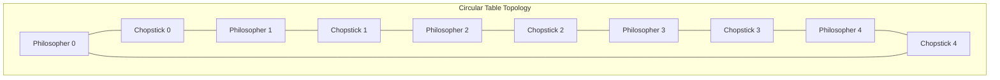
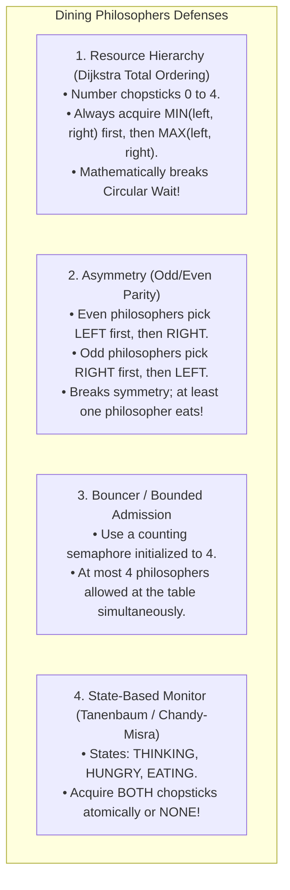
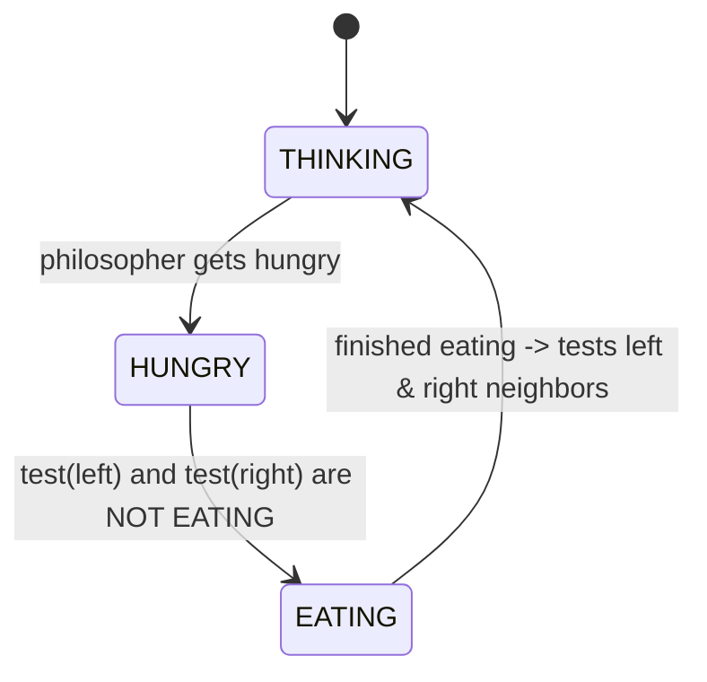

# The Dining Philosophers Problem

> [!abstract] Mental Model
> Five philosophers sit around a circular banquet table with a bowl of spaghetti in the center. Between each adjacent pair of philosophers lies a **single chopstick** (5 total chopsticks). 
> - To eat, a philosopher must acquire **both their left and right chopsticks**.
> - If every philosopher sits down at the exact same moment and picks up their left chopstick, each holds one chopstick and waits indefinitely for their neighbor to drop the right one.
> - **Result: A total circular deadlock where all five philosophers starve to death.**

---

## Architectural Setup & The Naive Deadlock



### The Naive Algorithm:
```c
// VULNERABLE CODE (DEADLOCK HAZARD!):
void* philosopher_naive(void* num) {
    int id = *(int*)num;
    while (1) {
        think();
        sem_wait(&chopstick[id]);                 // 1. Pick up LEFT chopstick
        sem_wait(&chopstick[(id + 1) % 5]);       // 2. Pick up RIGHT chopstick
        
        eat();
        
        sem_post(&chopstick[id]);                 // 3. Put down left
        sem_post(&chopstick[(id + 1) % 5]);       // 4. Put down right
    }
}
```

### The Execution Trap:
If a context switch occurs after Step 1 across all threads, every philosopher holds their left chopstick ($C_0, C_1, C_2, C_3, C_4$ are all locked). When they attempt Step 2, **all 5 threads block forever**—satisfying all four [[Deadlock Fundamentals and Coffman Conditions|Coffman Conditions]].

---

## The Four Definitive Solutions



---

## 1. Dijkstra's Resource Hierarchy Solution (Total Resource Ordering)

Dijkstra proved that imposing a **strict total ordering on resources** mathematically prevents circular wait:

```c
#include <stdio.h>
#include <pthread.h>
#include <unistd.h>

#define N 5
pthread_mutex_t chopsticks[N];

void* philosopher_hierarchy(void* arg) {
    int id = *(int*)arg;
    int left = id;
    int right = (id + 1) % N;
    
    // Determine lower and higher indexed chopsticks
    int first = (left < right) ? left : right;
    int second = (left < right) ? right : left;
    
    while (1) {
        printf("[Philosopher %d] Thinking...\n", id);
        usleep(50000);
        
        // 1. Acquire LOWER numbered chopstick first
        pthread_mutex_lock(&chopsticks[first]);
        // 2. Acquire HIGHER numbered chopstick second
        pthread_mutex_lock(&chopsticks[second]);
        
        printf("  *** [Philosopher %d] EATING with %d and %d ***\n", id, first, second);
        usleep(100000);
        
        pthread_mutex_unlock(&chopsticks[second]);
        pthread_mutex_unlock(&chopsticks[first]);
    }
    return NULL;
}
```

> [!tip] Why Dijkstra's Hierarchy Works
> Philosophers $0, 1, 2, 3$ will pick up $0 \rightarrow 1$, $1 \rightarrow 2$, $2 \rightarrow 3$, $3 \rightarrow 4$. 
> But Philosopher $4$ has chopsticks $4$ and $0$. Because $0 < 4$, **Philosopher 4 attempts to pick up Chopstick 0 first!**
> Philosopher 4 now competes directly with Philosopher 0 for Chopstick 0, allowing Philosopher 3 to grab Chopstick 4 and eat immediately. **Circular wait is mathematically destroyed!**

---

## 2. The State-Based Monitor Solution (Tanenbaum Model)

In production distributed systems and database engines, tasks cannot always acquire resources in static numerical order. The **State-Based Monitor** checks neighbor states and acquires permissions atomically:



### Complete Implementation in C:
```c
#include <stdio.h>
#include <pthread.h>

#define N 5
#define LEFT (id + 4) % N
#define RIGHT (id + 1) % N

typedef enum { THINKING, HUNGRY, EATING } state_t;

state_t state[N];
pthread_mutex_t mutex = PTHREAD_MUTEX_INITIALIZER;
pthread_cond_t self_cv[N];

void test(int id) {
    // Can eat ONLY if hungry AND neither neighbor is eating
    if (state[id] == HUNGRY && state[LEFT] != EATING && state[RIGHT] != EATING) {
        state[id] = EATING;
        pthread_cond_signal(&self_cv[id]);
    }
}

void take_chopsticks(int id) {
    pthread_mutex_lock(&mutex);
    state[id] = HUNGRY;
    test(id);
    
    // Sleep on private condition variable if neighbors are eating
    while (state[id] != EATING) {
        pthread_cond_wait(&self_cv[id], &mutex);
    }
    pthread_mutex_unlock(&mutex);
}

void put_chopsticks(int id) {
    pthread_mutex_lock(&mutex);
    state[id] = THINKING;
    
    // Check if left or right neighbors can now eat
    test(LEFT);
    test(RIGHT);
    pthread_mutex_unlock(&mutex);
}
```

---

## Active Recall & Interview Perspective

### Reasoning Prompts
1. *Which of the four Coffman conditions does Dijkstra's Resource Hierarchy solution eliminate?*
   - **Answer**: It eliminates the **Circular Wait** condition. By enforcing a global strict partial order on resource indices (always acquiring the lower-indexed mutex before the higher-indexed mutex), it is mathematically impossible to form a directed cycle of dependencies ($T_0 \to T_1 \to \dots \to T_n \to T_0$) in the Resource Allocation Graph.
2. *Why is the Dining Philosophers Problem considered a fundamental benchmark for concurrency design?*
   - **Answer**: It models multi-resource allocation with overlapping dependencies under mutual exclusion. Unlike simpler single-resource problems, it captures the hazards of **Deadlock** (all philosophers holding one chopstick), **Livelock** (philosophers repeatedly picking up and dropping chopsticks in lockstep), and **Starvation** (two fast philosophers colluding to alternate eating, starving the philosopher between them).
3. *What is the difference between Deadlock and Livelock in the Dining Philosophers context?*
   - **Answer**: In **Deadlock**, all philosophers are blocked in `TASK_UNINTERRUPTIBLE` kernel sleep waiting for a resource that will never be released ($0\%$ CPU utilization). In **Livelock**, philosophers are actively executing code and changing state (e.g., picking up left chopstick, noticing right is busy, putting down left chopstick, and retrying in a loop), burning $100\%$ CPU cycles without any philosopher ever making forward progress (eating).

---

## Key Takeaways
- The **Dining Philosophers Problem** demonstrates multi-resource deadlock and starvation hazards.
- **Resource Ordering (Dijkstra)** breaks Circular Wait by forcing all threads to acquire lower-indexed locks first.
- The **State-Based Monitor** guarantees atomic dual-resource acquisition, preventing both deadlock and livelock.

---

## Related Notes
- [[Operating System]] — Concurrency benchmarks.
- [[Thread]] — Multi-threaded contention.
- [[Critical Section Problem]] — Protecting dining states.
- [[Producer-Consumer Pattern - Bounded Queues and Condition Variables]] — Chopstick lock implementations.
- [[Producer-Consumer Pattern - Bounded Queues and Condition Variables]] — Individual philosopher sleep queues.
- [[Producer-Consumer Problem]] — Companion classical problem.
- [[Deadlock Fundamentals and Coffman Conditions]] — Deep dive into the 4 deadlock criteria.
- [[Resource Allocation Graph]] — Graph cycles in dining philosophers.
- [[Operating Systems MOC]] — Master table of contents for Operating Systems.
