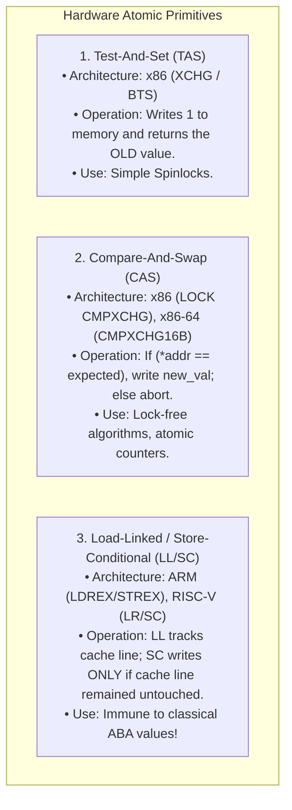
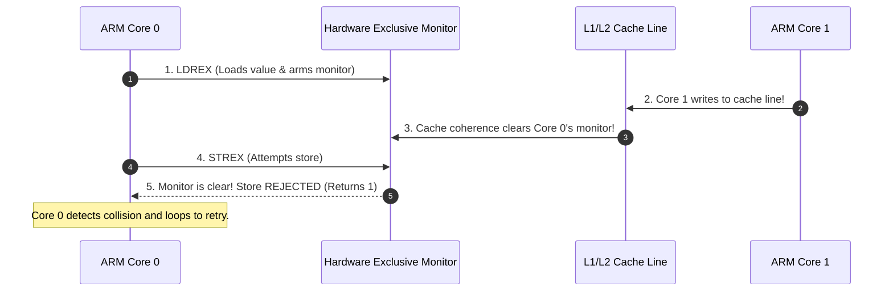
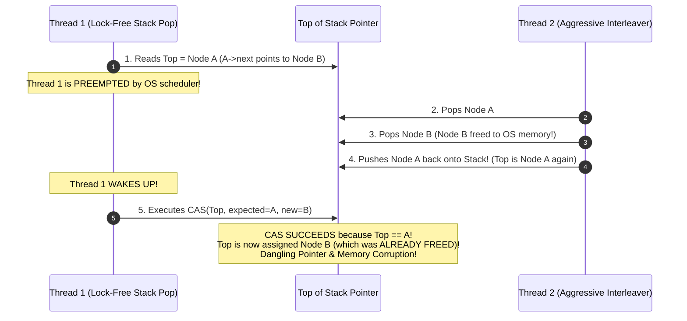

# Hardware Synchronization Primitives: CAS, TAS, and LL-SC

> [!abstract] Mental Model
> Because software-only algorithms break under modern out-of-order CPU pipelines, CPU architects engineered **hardware atomic instructions into physical silicon**. These instructions execute a complete **Read-Modify-Write (RMW)** cycle as an **indivisible, non-interruptible transaction** at the CPU cache-line level—guaranteeing that no other core can inspect or alter the data mid-flight.

---

## Architectural Comparison of the Big Three Primitives



---

## 1. Test-And-Set (TAS)

The simplest hardware synchronization primitive. It writes `1` (or `true`) to a memory location and returns its prior value:

### C Pseudocode:
```c
bool test_and_set(bool *target) {
    bool old_value = *target; // Hardware executes atomically
    *target = true;
    return old_value;
}
```

### Spinlock Implementation via TAS:
```c
typedef struct {
    bool lock_state;
} spinlock_t;

void spin_lock(spinlock_t *lock) {
    // Spin while old value is true (meaning someone else held the lock)
    while (test_and_set(&(lock->lock_state))) {
        // CPU pause hint to reduce bus contention
        #if defined(__x86_64__)
        __builtin_ia32_pause();
        #endif
    }
}

void spin_unlock(spinlock_t *lock) {
    lock->lock_state = false;
}
```

---

## 2. Compare-And-Swap (CAS)

CAS is the foundational cornerstone of all modern lock-free data structures and OS kernels:

### C Pseudocode:
```c
bool compare_and_swap(int *addr, int expected_val, int new_val) {
    if (*addr == expected_val) {
        *addr = new_val;
        return true;  // CAS Succeeded!
    }
    return false;     // CAS Failed: Memory was changed by another core
}
```

### x86-64 Assembly Implementation:
```nasm
; LOCK CMPXCHG r/m32, r32
; Expects 'expected_val' in EAX, 'new_val' in EBX, 'addr' in RDI
lock cmpxchg (%rdi), %ebx
; If ZF (Zero Flag) is set, swap succeeded; otherwise EAX holds the current value.
```

---

## 3. Load-Linked / Store-Conditional (LL/SC)

Instead of a single heavy CISC instruction, RISC architectures (ARM, RISC-V, MIPS) split atomicity into two lightweight instructions:

1. **Load-Linked (`LDREX` on ARM / `LR` on RISC-V)**: Reads memory and sets a **hardware exclusive monitor** on that cache line.
2. **Store-Conditional (`STREX` on ARM / `SC` on RISC-V)**: Attempts to write to the address. If any other core has written to that cache line since the `LDREX`, the store **fails and returns 1**; otherwise it writes and returns `0`.



---

## How Silicon Enforces Atomicity: Cache Line Locking

Modern multi-core processors do **not** lock the physical memory bus (which would stall all cores across the motherboard). Instead, they use **Cache-Line Locking via the MESI/MOESI Cache Coherence Protocol**:

```mermaid
flowchart LR
    Core["Executing CPU Core"] -->|Asserts LOCK prefix| L1["L1 Data Cache"]
    L1 -->|Transitions Cache Line to 'Modified' (M) State| Coherence["MESI Protocol Engine"]
    Coherence -->|Sends Invalidate Signals to other cores| Bus["Interconnect Ring Bus"]
    Bus -->|Blocks Snooping Cores during RMW cycle| TargetLine["Target 64-Byte Cache Line"]
```

1. The core transitions the target 64-byte cache line into the **Exclusive (E) or Modified (M)** state.
2. Any competing requests from other cores for that cache line are delayed until the atomic instruction finishes writing.

---

## The Critical Lock-Free Hazard: The ABA Problem

The **ABA Problem** occurs when a thread reads a value $A$, is preempted, another thread changes $A \to B \to A$, and the original thread resumes:



---

### The Solution: Tagged Pointers / Double-Word CAS (DWCAS)

To solve ABA, algorithms couple each pointer with a **monotonically increasing version counter** (64-bit pointer + 64-bit tag = 128-bit structure):

```c
typedef struct {
    void *ptr;          // 64-bit pointer
    uint64_t counter;   // 64-bit ABA tag
} tagged_ptr_t;

// Atomic 128-bit CAS on x86-64 using CMPXCHG16B
bool atomic_cas_128(tagged_ptr_t *target, tagged_ptr_t expected, tagged_ptr_t desired) {
    return __atomic_compare_exchange(
        target, &expected, &desired, false, __ATOMIC_SEQ_CST, __ATOMIC_SEQ_CST
    );
}
```
Even if the pointer reverts from $A \to B \to A$, the version tag changed from $1 \to 2 \to 3$. Since $(A, 1) \ne (A, 3)$, the CAS correctly detects the ABA modification and safely aborts!

---

## Active Recall & Interview Perspective

### Reasoning Prompts
1. *What is the difference between `compare_exchange_weak` and `compare_exchange_strong` in C++ `std::atomic`?*
   - **Answer**: `compare_exchange_strong` only fails if the actual value does not equal the expected value. `compare_exchange_weak` can experience **spurious failures** (failing even when the value matches) on architectures using LL/SC (like ARM) due to interrupt context switches or cache evictions clearing the reservation monitor. `weak` is preferred inside retry loops because it compiles to fewer instructions on ARM.
2. *Why is Compare-And-Swap (CAS) susceptible to the ABA problem, while Load-Linked/Store-Conditional (LL/SC) is inherently immune?*
   - **Answer**: CAS checks for **value equality**; if a value changes from $A \to B \to A$, CAS sees $A == A$ and assumes no change occurred. LL/SC checks for **memory modification events** on the physical cache line; even if memory reverts to the exact original bitwise value $A$, the intermediate write to $B$ invalidates the hardware reservation monitor, causing the subsequent Store-Conditional to fail.
3. *How does modern hardware prevent a `LOCK CMPXCHG` instruction from stalling the entire multi-socket server memory bus?*
   - **Answer**: Modern CPUs use **Cache Line Locking** instead of bus locking. If the target memory address resides in the CPU's local L1/L2 cache, the core uses the cache coherence protocol (MESI) to acquire exclusive ownership (`Modified` state) of just that 64-byte cache line. The atomic operation is executed purely within the local L1 cache at SRAM speeds, allowing other cores to access independent memory addresses without delay.

---

## Key Takeaways
- **Hardware Atomics (TAS, CAS, LL/SC)** provide the silicon-level foundation for mutual exclusion and lock-free concurrency.
- **CAS** is ubiquitous on x86 (`CMPXCHG`), while **LL/SC** is the standard on RISC architectures (`LDREX`/`STREX`).
- The **ABA Problem** is solved using **Tagged Pointers / Double-Word CAS (`CMPXCHG16B`)** with version counters.

---

## Related Notes
- [[Operating System]] — Concurrency architecture.
- [[Thread]] — Multi-threaded memory access.
- [[Race Conditions and Data Races]] — Concurrency hazards atomics eliminate.
- [[Critical Section Problem]] — Hardware foundations for critical sections.
- [[Memory Ordering and Memory Barriers]] — Hardware memory models.
- [[Spinlocks]] — Built directly on TAS/CAS.
- [[Producer-Consumer Pattern - Bounded Queues and Condition Variables]] — Hybrid userspace atomics with kernel futex sleeping.
- [[Lock-Free and Wait-Free Data Structures]] — Lock-free queues built on CAS.
- [[Operating Systems MOC]] — Master table of contents for Operating Systems.
