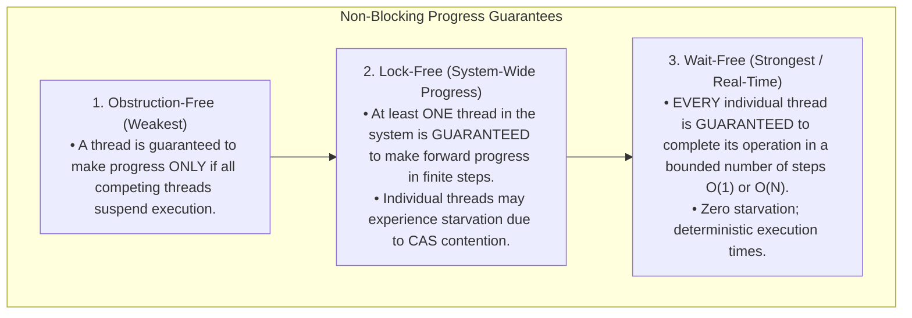
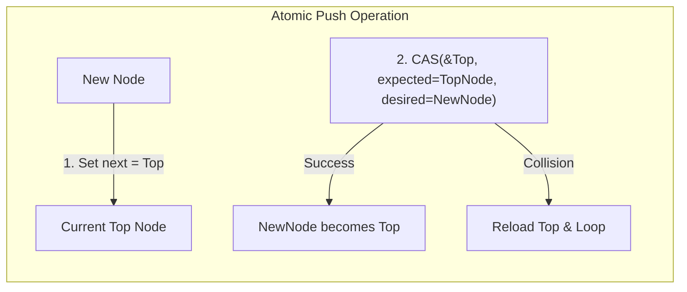
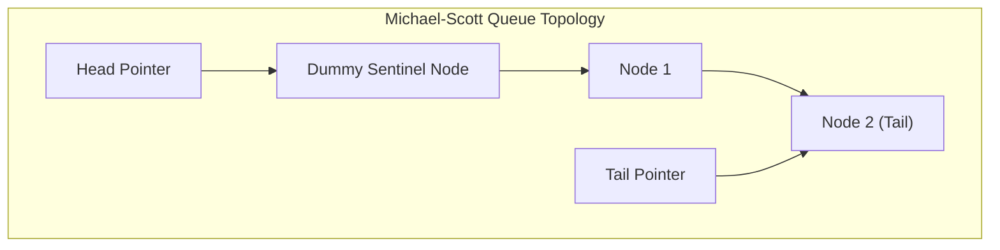
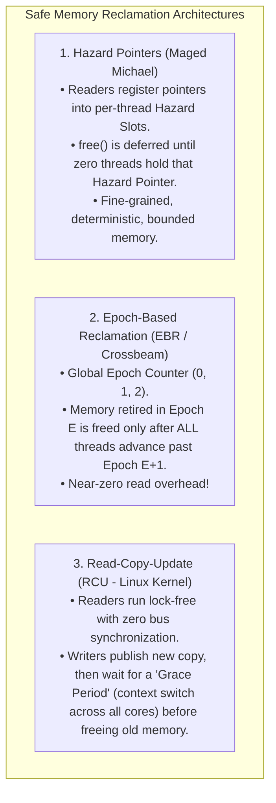

# Lock-Free and Wait-Free Data Structures

> [!abstract] Mental Model
> Traditional mutexes are **single-passenger locked elevators**: if the person holding the key crashes, gets preempted by the OS scheduler, or enters an infinite loop, **every other thread in the building is blocked forever**.
> **Lock-Free and Wait-Free Data Structures** are **open-air escalators**: individual passengers may stumble or get bumped backward in retry loops, but the escalator mechanism itself **never stops moving forward**. Even if the OS abruptly kills a thread mid-operation, the data structure remains 100% coherent without deadlocking the system.

---

## The Non-Blocking Hierarchy (Maurice Herlihy, 1991)



---

## 1. The Treiber Stack (Lock-Free LIFO Stack)

Invented by R. Kent Treiber in 1986, this algorithm implements a thread-safe stack using a single atomic Compare-And-Swap (`CAS`) loop:



### Complete Implementation in C11:
```c
#include <stdatomic.h>
#include <stdlib.h>
#include <stdbool.h>

typedef struct node {
    int data;
    struct node *next;
} node_t;

typedef struct {
    _Atomic(node_t*) top;
} treiber_stack_t;

void stack_init(treiber_stack_t *stack) {
    atomic_init(&stack->top, NULL);
}

void stack_push(treiber_stack_t *stack, int val) {
    node_t *new_node = malloc(sizeof(node_t));
    new_node->data = val;
    
    // Load current top with relaxed memory ordering
    node_t *old_top = atomic_load_explicit(&stack->top, memory_order_relaxed);
    
    // CAS Loop with Release semantics on success
    do {
        new_node->next = old_top;
    } while (!atomic_compare_exchange_weak_explicit(
        &stack->top,
        &old_top,
        new_node,
        memory_order_release,  // Publishes new_node memory safely
        memory_order_relaxed   // Reloads updated top on collision
    ));
}

bool stack_pop(treiber_stack_t *stack, int *result) {
    node_t *old_top = atomic_load_explicit(&stack->top, memory_order_acquire);
    
    while (old_top != NULL) {
        node_t *next_node = old_top->next; // Hazard: Needs Safe Memory Reclamation!
        if (atomic_compare_exchange_weak_explicit(
                &stack->top,
                &old_top,
                next_node,
                memory_order_acquire,
                memory_order_relaxed)) {
            *result = old_top->data;
            // NOTE: Do NOT immediately free(old_top) without SMR! (ABA / Use-After-Free)
            return true;
        }
    }
    return false; // Stack was empty
}
```

---

## 2. The Michael-Scott Queue (Lock-Free FIFO Queue)

Invented by Maged Michael and Michael Scott in 1996, the **MS-Queue** uses a dummy sentinel node and a **Cooperative "Helping" Protocol**:



### The Two-Phase Enqueue & Helping Mechanism:
1. **Phase 1 (Link Node)**: Thread A attempts `CAS(&tail->next, NULL, new_node)`.
2. **Phase 2 (Advance Tail)**: Thread A attempts `CAS(&tail, old_tail, new_node)`.
3. **The Helping Rule**: If Thread B arrives while Thread A is between Phase 1 and Phase 2, Thread B notices `tail->next != NULL`. Instead of blocking, **Thread B completes Phase 2 on Thread A's behalf** (`CAS(&tail, old_tail, old_tail->next)`), and then proceeds with its own enqueue!

---

## The Ultimate Challenge: Safe Memory Reclamation (SMR)

In garbage-collected runtimes (Java, Go), lock-free programming is simplified because the runtime engine handles memory safety. In low-level systems (C, C++, Rust, Linux Kernel), **reclaiming memory without locks is an extreme hazard**:

> [!danger] The Use-After-Free / ABA Collision
> If Thread 1 pops Node $A$ and immediately executes `free(A)`, Thread 2 (which was preempted while reading `A->next`) will dereference a dangling pointer into recycled memory upon resuming, triggering catastrophic silent memory corruption.

---

### The Three Industrial SMR Solutions:



---

## Production Focus: Linux Kernel RCU (Read-Copy-Update)

RCU is the backbone of the Linux kernel network routing table, dentry directory cache, and VFS file descriptor tables:

```c
// ============================================================================
// Reader Thread (Lockless, Zero-Overhead Fast Path):
// ============================================================================
rcu_read_lock(); // Disables kernel preemption (Zero atomic bus writes!)
struct route_entry *route = rcu_dereference(global_routing_table);
if (route) {
    forward_packet(packet, route->gateway_ip);
}
rcu_read_unlock();

// ============================================================================
// Writer / Updater Thread:
// ============================================================================
struct route_entry *new_route = kmalloc(sizeof(*new_route), GFP_KERNEL);
*new_route = *old_route;
new_route->gateway_ip = new_ip;

// 1. Atomically publish updated pointer with memory barrier
rcu_assign_pointer(global_routing_table, new_route);

// 2. Defer destruction until all current readers finish their read sections
synchronize_rcu(); // Sleeps until a Grace Period passes on all CPU cores!

// 3. Guaranteed safe to free old memory
kfree(old_route);
```

---

## Active Recall & Interview Perspective

### Reasoning Prompts
1. *What is the fundamental difference between Lock-Free and Wait-Free algorithms?*
   - **Answer**: **Lock-Free** guarantees **system-wide progress**: across the entire system, at least one thread will make forward progress in a finite number of CPU instructions, but individual threads may starve due to repeatedly losing CAS races. **Wait-Free** guarantees **per-thread progress**: every individual thread is guaranteed to complete its operation in a bounded number of execution steps regardless of the execution speed or contention of other threads, making it suitable for hard real-time systems.
2. *Why do Lock-Free data structures require Safe Memory Reclamation (SMR) in languages like C/C++ but not in Java or Go?*
   - **Answer**: Java and Go have automated Garbage Collectors (GC) with tracing collectors. The GC will not free an unlinked node as long as any thread's local call stack holds an active reference to it. In manual memory management languages (C/C++), calling `free()` or `delete` immediately returns the address to the OS allocator. If another thread was preempted while holding a pointer to that node, it will execute a **Use-After-Free** or experience the **ABA Problem** when it resumes.
3. *How does Linux Kernel RCU define a "Grace Period"?*
   - **Answer**: A Grace Period is a duration of time during which every CPU core in the system undergoes at least one **Quiescent State** (such as a context switch, executing in user-space, or entering the idle loop). Because RCU read-side critical sections (`rcu_read_lock`) forbid sleeping and blocking, any reader that began before the grace period started is guaranteed to have completed by the end of the grace period, making it 100% safe for the writer to free the old memory.

---

## Key Takeaways
- **Lock-Free** guarantees system-wide throughput without deadlocks; **Wait-Free** guarantees bounded per-thread latency.
- **Michael-Scott Queues** use cooperative helping protocols to maintain lockless FIFO consistency.
- Manual memory reclamation is solved via **Hazard Pointers**, **Epoch-Based Reclamation (EBR)**, or **Linux RCU**.

---

## Related Notes
- [[Operating System]] — Advanced concurrency.
- [[Thread]] — Multi-core lockless execution.
- [[Critical Section Problem]] — Non-blocking alternative to locks.
- [[Hardware Synchronization Primitives - CAS, TAS, LL-SC]] — CAS foundations.
- [[Memory Ordering and Memory Barriers]] — Acquire-release ordering in lock-free code.
- [[Producer-Consumer Pattern - Bounded Queues and Condition Variables]] — The blocking contrast to lock-free design.
- [[Producer-Consumer Problem]] — Lock-free bounded queues.
- [[Operating Systems MOC]] — Master table of contents for Operating Systems.
