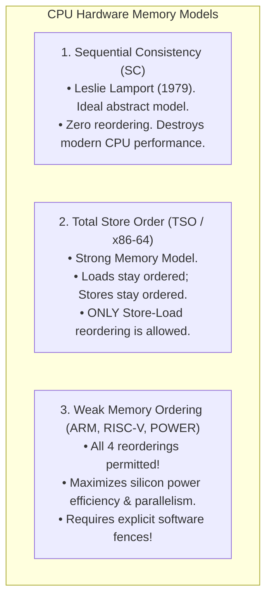
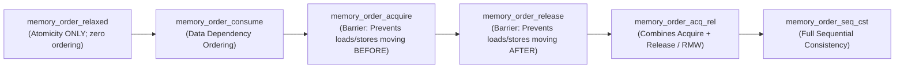

# Memory Ordering and Memory Barriers

> [!abstract] Mental Model
> On a modern superscalar multi-core processor, **chronological time is an illusion**. To maximize throughput, CPU hardware and optimizing compilers reorder memory reads and writes arbitrarily, provided single-threaded program logic is preserved. 
> **Memory Barriers (Fences)** are **traffic checkpoints on silicon**: they force a CPU core to drain its pending store buffers and serialize memory transactions before any subsequent instructions can execute across the bus.

---

## Why Hardware Reorders Memory: Store Buffers & Out-of-Order Execution

Writing to main DRAM takes $\approx 100\text{–}300$ clock cycles. If a CPU core stalled on every write instruction, multi-gigahertz processors would grind to a halt.

```mermaid
flowchart LR
    Core["CPU Core ALU"] -->|1. Instant Write (1 Cycle)| StoreBuf["CPU Store Buffer (FIFO)"]
    StoreBuf -->|2. Asynchronous Drain (100-300 Cycles)| L1Cache["L1/L2 Cache Hierarchy (MESI)"]
    
    Core -.->|3. Speculative Out-of-Order Load (Bypasses Store Buffer)| L1Cache
```

1. **Store Buffer (Write Buffer)**: The core deposits writes instantly into a private local FIFO store buffer and continues executing instructions.
2. **The Reordering Consequence**: A subsequent `LOAD` from another memory address can execute from cache **before** the pending `STORE` in the store buffer drains to shared cache coherence!

---

## The Four Types of Memory Reorderings

| Reordering Type | Description | Permitted on x86 (TSO)? | Permitted on ARM / RISC-V? |
| :--- | :--- | :--- | :--- |
| **Load-Load** | Earlier Load reordered after a later Load | **No** | **Yes** |
| **Load-Store**| Earlier Load reordered after a later Store | **No** | **Yes** |
| **Store-Store**| Earlier Store reordered after a later Store | **No** | **Yes** |
| **Store-Load** | Earlier Store delayed behind a later Load | **YES** *(Store Buffer Latency)* | **Yes** |

---

## Hardware Memory Models: TSO vs Weak Ordering



---

## The C++11 / C11 Concurrency Memory Model

Modern programming languages define memory ordering semantics that map directly to underlying hardware primitives:



---

### The Producer-Consumer Acquire-Release Synchronization Pattern

This is the standard, zero-cost high-performance synchronization idiom in concurrent systems:

```c
#include <stdatomic.h>
#include <stdbool.h>

// Shared payload and ready flag
int payload_data = 0;
atomic_bool data_ready = false;

// ============================================================================
// Producer Thread (Core 0):
// ============================================================================
void producer(void) {
    payload_data = 42; // Non-atomic write
    
    // memory_order_release guarantees payload_data write commits BEFORE data_ready write!
    atomic_store_explicit(&data_ready, true, memory_order_release);
}

// ============================================================================
// Consumer Thread (Core 1):
// ============================================================================
void consumer(void) {
    // memory_order_acquire guarantees no reads below can execute BEFORE data_ready is true!
    while (!atomic_load_explicit(&data_ready, memory_order_acquire)) {
        // Spin / Wait
    }
    
    // GUARANTEED to read 42 (No torn read or stale cache!)
    int val = payload_data;
}
```

---

## Hardware Assembly Barrier Instructions

When compiling acquire-release or sequentially consistent operations, compilers emit hardware fence instructions:

### 1. x86-64 Assembly Fences:
- **`MFENCE` (Memory Fence)**: Full barrier. Serializes all Load and Store operations; drains the store buffer.
- **`SFENCE` (Store Fence)**: Flushes store buffers; ensures all prior stores commit before subsequent stores.
- **`LFENCE` (Load Fence)**: Serializes instruction pipeline; ensures all prior loads complete before subsequent loads.
- *Note on x86*: Because x86 is TSO, `acquire` and `release` compile to **standard `MOV` instructions ($0$ CPU overhead!)**; only `seq_cst` or Store-Load fences require explicit `MFENCE` or `LOCK` prefixes.

### 2. ARM64 (AArch64) Assembly Fences:
- **`DMB ISH` (Data Memory Barrier)**: Full barrier across inner-shareable domain.
- **`DMB ISHLD` (Data Memory Barrier Load-Load / Load-Store)**: Enforces load ordering.
- **`DMB ISHST` (Data Memory Barrier Store-Store)**: Enforces store ordering.
- **`LDAR` / `STLR`**: ARMv8 hardware instructions with built-in Acquire Load and Release Store semantics.

---

## The Classic Bug: Broken Double-Checked Locking (DCLP)

Before memory barriers were understood, engineers attempted to optimize singleton initialization:

```cpp
// VULNERABLE HISTORICAL CODE:
Singleton* getInstance() {
    if (instance == nullptr) {             // 1. First Check (Unsynchronized)
        lock_guard<mutex> lock(my_mutex);
        if (instance == nullptr) {         // 2. Second Check
            instance = new Singleton();   // 3. FATAL HARDWARE HAZARD!
        }
    }
    return instance;
}
```

### The Failure Mechanism:
`new Singleton()` consists of three steps:
1. `void* mem = malloc(sizeof(Singleton));` (Allocate memory)
2. `Singleton::Singleton(mem);` (Execute constructor)
3. `instance = mem;` (Assign global pointer)

The CPU can reorder Step 3 *before* Step 2! 
Another thread executing Check 1 sees `instance != nullptr`, retrieves the pointer, and begins using an **uninitialized, partially constructed object**, causing immediate segmentation faults or data corruption.

```cpp
// SAFE MODERN C++11 (Atomic Pointer with Acquire-Release or Local Static):
static Singleton& getInstance() {
    static Singleton instance; // Thread-safe guaranteed by C++11 magic statics!
    return instance;
}
```

---

## Active Recall & Interview Perspective

### Reasoning Prompts
1. *Why does `atomic_store(..., memory_order_release)` compile into a regular `MOV` on x86, but requires explicit instructions (`STLR` or `DMB`) on ARM?*
   - **Answer**: x86 implements **Total Store Order (TSO)**, where hardware guarantees that Stores are never reordered with other Stores, and Loads are never reordered with other Loads. Therefore, standard `MOV` stores inherently satisfy release semantics without extra hardware instructions. In contrast, ARM is a **Weakly Ordered** architecture that freely reorders Store-Store and Load-Store operations for performance; hence, it must emit explicit barrier instructions (`DMB`) or one-way fence instructions (`STLR`) to enforce release order.
2. *What is the specific memory reordering that breaks Peterson's Algorithm on x86 processors?*
   - **Answer**: The **Store-Load Reordering**. In Peterson's algorithm, a thread writes `flag[i] = true` (Store), then immediately checks `flag[other]` (Load). On x86, the Store is buffered in the CPU's local store buffer and is not yet visible in shared cache coherence when the core speculatively loads `flag[other]`. Both cores see `flag[other] == false` simultaneously and enter the critical section together. Inserting `MFENCE` between the store and load fixes the bug.
3. *What is the difference between `memory_order_relaxed` and `memory_order_seq_cst`?*
   - **Answer**: `memory_order_relaxed` guarantees only **atomicity** (no torn reads/writes for that specific variable), but provides **zero ordering guarantees** regarding other memory operations. `memory_order_seq_cst` (Sequential Consistency) provides the strongest guarantee: it enforces total memory ordering where all cores in the entire system observe all `seq_cst` operations in the exact same global chronological sequence.

---

## Key Takeaways
- Modern hardware utilizes **Store Buffers and Weak Memory Models**, reordering instructions out-of-order for execution speed.
- **x86** implements **Total Store Order (TSO)** (allowing only Store-Load reordering); **ARM/RISC-V** implement **Weak Ordering** (allowing all reorderings).
- **Acquire-Release Semantics** provide optimal, zero-cost synchronization across cores without paying the performance penalty of full Sequential Consistency.

---

## Related Notes
- [[Operating System]] — Hardware abstraction layers.
- [[Thread]] — Multi-core memory interaction.
- [[Race Conditions and Data Races]] — Concurrency bugs originating from memory reordering.
- [[Critical Section Problem]] — Hardware foundations.
- [[Hardware Synchronization Primitives - CAS, TAS, LL-SC]] — Silicon atomic primitives.
- [[Spinlocks]] — Barrier usage inside lock acquire/release.
- [[Producer-Consumer Pattern - Bounded Queues and Condition Variables]] — Synchronization constructs built on memory barriers.
- [[Lock-Free and Wait-Free Data Structures]] — Lock-free data structures using acquire-release.
- [[Operating Systems MOC]] — Master table of contents for Operating Systems.
