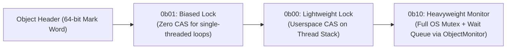

# Monitors

> [!abstract] Mental Model
> A **Monitor** is an **automated private bank teller window**: the bank vault (shared mutable state) and the teller window (access methods) are physically sealed inside a secure room. The automated door system **guarantees that only one customer (thread) can ever be inside the room at a time**. 
> Instead of requiring programmers to manually write error-prone lock and unlock pairs around every line of code, **the compiler automatically injects mutual exclusion locks at every method entry and exit**.

---

## Architectural Anatomy of a Monitor

Invented by C.A.R. Hoare and Per Brinch Hansen in 1974, a Monitor packages **Data Encapsulation, Mutual Exclusion, and Condition Synchronization** into a single first-class language abstraction:

```mermaid
flowchart TD
    subgraph MonitorStructure ["Monitor Encapsulation Boundary"]
        EntryQueue["Outer Entry Queue (Threads waiting for Monitor Lock)"]
        
        subgraph InsideMonitor ["Active Monitor Chamber (Max 1 Thread)"]
            ActiveThread["Executing Thread"]
            SharedData["Private Shared State Variables"]
            Methods["Synchronized Entry Procedures"]
        end
        
        subgraph CVQueues ["Condition Variable Sleep Queues"]
            CV1["Condition Queue x (waiters on empty)"]
            CV2["Condition Queue y (waiters on full)"]
        end
    end

    EntryQueue -->|Compiler acquires lock| ActiveThread
    ActiveThread -->|x.wait() - Releases lock & sleeps| CV1
    ActiveThread -->|y.wait() - Releases lock & sleeps| CV2
    ActiveThread -->|x.signal() / y.signal()| CVQueues
    ActiveThread -->|Method returns - Compiler releases lock| Exit["Exit Monitor"]
```

---

## Monitor Signaling Disciplines: Hoare vs Mesa vs Brinch Hansen

| Signaling Model | Execution Rule | Predicate Check Requirement | Adoption |
| :--- | :--- | :--- | :--- |
| **Mesa (Signal-and-Continue)** | Signaler **retains the lock** and continues running. Signaled thread is moved to the Entry Queue. | **Mandatory `while` loop**: State can change before signaled thread acquires lock. | **Universal** (Java, C#, Python, POSIX pthreads). |
| **Hoare (Signal-and-Wait)** | Signaler **immediately yields the lock and CPU** to the signaled thread. | `if` check is safe: Condition guaranteed true on wakeup. | Theoretical (Algol, Pascal). |
| **Brinch Hansen (Signal-and-Exit)** | Signaler **must immediately exit the monitor** upon firing a signal. | `if` check is safe. | Specialized concurrent languages (Concurrent Pascal). |

---

## The Java Monitor Architecture & Bytecode Mechanics

In Java, every single object in the JVM contains an **Intrinsic Monitor (Object Monitor)** managed via the object header's Mark Word:



### Java `synchronized` Syntax:
```java
public class ThreadSafeBoundedBuffer<T> {
    private final Object[] buffer = new Object[10];
    private int count = 0, head = 0, tail = 0;

    // Compiler automatically emits 'monitorenter' and 'monitorexit' bytecodes
    public synchronized void put(T item) throws InterruptedException {
        // Mesa Semantics: Always loop!
        while (count == buffer.length) {
            wait(); // Atomically releases intrinsic lock & sleeps on monitor
        }
        buffer[tail] = item;
        tail = (tail + 1) % buffer.length;
        count++;
        
        notifyAll(); // Wakes up potential consumers
    }

    public synchronized T get() throws InterruptedException {
        while (count == 0) {
            wait();
        }
        @SuppressWarnings("unchecked")
        T item = (T) buffer[head];
        head = (head + 1) % buffer.length;
        count--;
        
        notifyAll();
        return item;
    }
}
```

---

## JVM Bytecode Disassembly: `monitorenter` & `monitorexit`

When the Java compiler translates a `synchronized` block, it emits pair-matched bytecode instructions with exception handling tables:

```text
Compiled from "Buffer.java"
 0: aload_0
 1: dup
 2: astore_1
 3: monitorenter        // 1. ACQUIRE OBJECT MONITOR
 4: aload_0
 5: getfield      #2    // Access field
 ...
15: aload_1
16: monitorexit         // 2. RELEASE MONITOR ON NORMAL PATH
17: goto          25
20: astore_2            // EXCEPTION HANDLER
21: aload_1
22: monitorexit         // 3. GUARANTEED RELEASE EVEN ON RUNTIME EXCEPTION!
23: aload_2
24: athrow
25: return
```

> [!tip] Exception Safety
> The defining advantage of language-level Monitors is **deterministic cleanup**: even if a critical section throws a null-pointer exception or runtime error, the runtime runtime engine guarantees the monitor lock is **always released**, eliminating dangling lock deadlocks.

---

## Multi-Condition Modern Monitors: `ReentrantLock` & `Condition`

The classical Java intrinsic monitor has a severe limitation: **only a single wait-set per object**. Calling `notifyAll()` wakes up *both* producers and consumers, triggering massive context-switching contention.

Modern production Java utilizes **Explicit Monitors with Multiple Condition Variables**:

```java
import java.util.concurrent.locks.ReentrantLock;
import java.util.concurrent.locks.Condition;

public class OptimizedBuffer<T> {
    private final ReentrantLock lock = new ReentrantLock();
    
    // Two DISTINCT condition queues for the SAME monitor!
    private final Condition notFull  = lock.newCondition();
    private final Condition notEmpty = lock.newCondition();
    
    public void put(T item) throws InterruptedException {
        lock.lock();
        try {
            while (isFull()) {
                notFull.await(); // Sleeps ONLY on notFull queue
            }
            insert(item);
            notEmpty.signal();   // Signals ONLY consumers! (No producer wakeups)
        } finally {
            lock.unlock();       // RAII cleanup in finally block
        }
    }
}
```

---

## Active Recall & Interview Perspective

### Reasoning Prompts
1. *What fundamental software engineering hazard do Monitors solve compared to raw Semaphores?*
   - **Answer**: Raw semaphores require developers to manually pair every `sem_wait()` with a `sem_post()` across all execution paths. If a programmer forgets an unlock, calls them in the wrong sequence (`post` then `wait`), or if code throws an unhandled exception before reaching `post`, the system enters an unrecoverable deadlock. Monitors solve this by making synchronization a structural language construct: the compiler automatically enforces lock acquisition at method entry and guarantees lock release on exit or exception.
2. *Why does Java's single intrinsic monitor (`synchronized` + `notifyAll`) suffer from performance degradation in high-throughput Producer-Consumer pools?*
   - **Answer**: In Java's intrinsic monitor, every object has only one internal wait-queue. Because producers and consumers share this single queue, calling `notify()` might wake another producer instead of a consumer. To avoid deadlocks, developers are forced to call `notifyAll()`, which wakes *all* sleeping producers and consumers (Thundering Herd). This causes massive CPU cache-line bouncing and lock contention, as only one thread gets work and the rest fall back to sleep.
3. *What is the difference between Hoare Monitors and Mesa Monitors regarding condition predicate verification?*
   - **Answer**: In a Hoare monitor (Signal-and-Wait), signaling transfers the lock and CPU execution immediately and atomically to the waiting thread; therefore, the condition is guaranteed to be true when the waiter wakes, making an `if (condition)` check safe. In a Mesa monitor (Signal-and-Continue), the signaling thread continues running, and other threads may intercept the lock before the awakened thread executes; thus, the condition may no longer hold upon wakeup, strictly requiring a `while (condition)` loop.

---

## Key Takeaways
- **Monitors** encapsulate shared data, procedures, and synchronization, with the compiler automatically enforcing mutual exclusion.
- All modern production systems (Java, C#, POSIX) implement **Mesa Semantics (Signal-and-Continue)**, requiring `while` loop condition checks.
- Modern implementations use **Explicit Locks (`ReentrantLock`) with multiple `Condition` variables** to avoid Thundering Herd wakeups.

---

## Related Notes
- [[Operating System]] — Language vs Kernel synchronization.
- [[Thread]] — High-level concurrency abstractions.
- [[Critical Section Problem]] — Problem monitors automate.
- [[Producer-Consumer Pattern - Bounded Queues and Condition Variables]] — Underlying lock utilized by monitors.
- [[Producer-Consumer Pattern - Bounded Queues and Condition Variables]] — Condition synchronization within monitors.
- [[Binary and Counting Semaphores]] — Low-level alternative to monitors.
- [[Producer-Consumer Problem]] — Classic problem solved with monitors.
- [[Operating Systems MOC]] — Master table of contents for Operating Systems.
