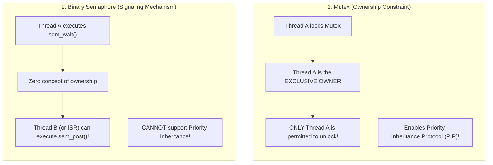

# Mutex (Mutual Exclusion Lock)

> [!abstract] Mental Model
> A **Mutex** is a **conference room with a physical key and a sleeping lounge**: exactly one person can hold the key and occupy the room at a time. If another employee arrives and finds the room locked, they don't sprint frantically against the locked door (like a [[Spinlocks|Spinlock]]); instead, they check into the waiting lounge, **go to sleep** (releasing the CPU core), and request a wake-up call the moment the key is returned.

---

## Mutex vs Binary Semaphore: The Ownership Principle

A common interview pitfall is confusing a Mutex with a 1-valued (Binary) Semaphore. They are fundamentally different abstractions:



---

## The Modern Revolution: The Linux `futex` Architecture

Historical Unix mutexes required a kernel system call (`sys_lock`) on *every single lock and unlock*, costing $1000+$ CPU clock cycles even when zero contention existed.

In 2002, Ulrich Drepper and Ingo Molnar introduced the **`futex` (Fast Userspace Mutex)**, which powers all modern POSIX threads (`pthreads`) on Linux:

```mermaid
flowchart TD
    LockReq["Thread calls pthread_mutex_lock()"]
    
    CAS{"1. Atomic CAS in Userspace:<br/>Is lock variable 0 (Unlocked)?"}
    
    CAS -->|YES (Uncontended: ~95% of cases)| Acquired["Lock Acquired in USERSPACE!<br/>• Atomic swap 0 -> 1<br/>• Latency: ~10-15 nanoseconds<br/>• ZERO Kernel Context Switch!"]
    
    CAS -->|NO (Contended Lock)| Syscall["2. Fallback to Kernel Syscall:<br/>syscall(SYS_futex, &val, FUTEX_WAIT, 1, NULL)"]
    
    Syscall --> KernelSleep["Kernel puts thread into TASK_UNINTERRUPTIBLE sleep<br/>Appends thread PCB to Kernel Futex Hash Table"]
```

---

### Anatomy of Futex Mechanics:
1. **Uncontended Lock Acquisition ($95\%+$ of production locks)**:
   - Uses an atomic Compare-And-Swap (`LOCK CMPXCHG`) in userspace memory.
   - **Cost**: $\approx 10\text{–}15\text{ ns}$ (zero syscall overhead, zero Ring 0 transitions).
2. **Contended Lock Acquisition**:
   - If the CAS fails (lock is already held), the runtime calls:
     ```c
     syscall(SYS_futex, &futex_word, FUTEX_WAIT, expected_val, NULL);
     ```
   - The Linux kernel verifies that `*futex_word == expected_val` atomically, suspends the thread, and schedules another process via `schedule()`.
3. **Lock Release**:
   - The holding thread atomically decrements the userspace integer.
   - If waiters are detected, it invokes:
     ```c
     syscall(SYS_futex, &futex_word, FUTEX_WAKE, 1);
     ```
   - The kernel wakes up the highest-priority sleeping thread from the futex wait queue.

---

## Production Mutex Flavors

| Mutex Flavor | Pthreads Identifier | Behavior & Trade-offs |
| :--- | :--- | :--- |
| **Default / Fast** | `PTHREAD_MUTEX_NORMAL` | Standard lock. Attempting to lock twice on the same thread causes an immediate **self-deadlock**. |
| **Recursive / Reentrant** | `PTHREAD_MUTEX_RECURSIVE` | Tracks owner thread ID and recursion counter. Allows nested locks by the same thread; must be unlocked an equal number of times. |
| **Error-Checking** | `PTHREAD_MUTEX_ERRORCHECK` | Returns `EDEADLK` on recursive lock attempts and `EPERM` if a non-owner attempts to unlock. Ideal for debugging. |
| **Adaptive Mutex** | `PTHREAD_MUTEX_ADAPTIVE_NP` | **Hybrid Spin-Then-Sleep Lock**: Spins for $\approx 100\text{ iterations}$ if the lock owner is currently executing on another CPU core; falls back to `futex` sleep if the owner doesn't unlock quickly. |

---

## Complete POSIX Mutex Lifecycle in C

```c
#include <stdio.h>
#include <pthread.h>

pthread_mutex_t lock;
long long shared_counter = 0;

void* worker(void* arg) {
    for (int i = 0; i < 100000; i++) {
        // 1. Acquire Mutual Exclusion Lock
        pthread_mutex_lock(&lock);
        
        // --- CRITICAL SECTION ---
        shared_counter++;
        
        // 2. Release Lock and notify potential futex waiters
        pthread_mutex_unlock(&lock);
    }
    return NULL;
}

int main(void) {
    // Initialize mutex with default attributes
    pthread_mutex_init(&lock, NULL);
    
    pthread_t t1, t2;
    pthread_create(&t1, NULL, worker, NULL);
    pthread_create(&t2, NULL, worker, NULL);
    
    pthread_join(t1, NULL);
    pthread_join(t2, NULL);
    
    // Destroy mutex resources
    pthread_mutex_destroy(&lock);
    printf("Final Safe Counter: %lld\n", shared_counter);
    return 0;
}
```

---

## Production Diagnostics & Contention Profiling

In high-concurrency cloud microservices, lock contention is the #1 scalability killer. Engineers profile mutex stalls using Linux kernel tracing:

```bash
# 1. Profile mutex lock acquisition latency and contention hotspots
sudo perf lock record -- ./my_high_load_server
sudo perf lock report

# Example Output:
# =========================================================================
# Name               acquired   contended   total wait (ns)   max wait (ns)
# &db_pool_mutex       104230       12042       4589201402        12401042
# =========================================================================

# 2. Trace off-CPU thread sleep times caused by mutex blocking via BCC/eBPF
sudo offcputime-bpfcc -p $(pgrep -n my_server) 5
```

---

## Active Recall & Interview Perspective

### Reasoning Prompts
1. *Why does the Linux `futex` provide an order of magnitude higher performance than classical System V kernel semaphores?*
   - **Answer**: Classical System V IPC locks required entering the Linux kernel via a system call on *every single lock/unlock operation*, incurring context-switch and CPU privilege ring switch overhead. A `futex` uses an atomic CAS directly in userspace for uncontended paths (the common case), executing entirely in L1 cache in $\approx 10\text{ ns}$ without touching the kernel. The kernel is invoked only when actual lock contention occurs.
2. *What is an Adaptive Mutex and under what hardware conditions does it provide the highest throughput?*
   - **Answer**: An adaptive mutex (`PTHREAD_MUTEX_ADAPTIVE_NP`) first acts like a spinlock by spinning for a short threshold if the lock owner is currently running on another CPU core. If the owner releases the lock during the spin, the waiter acquires it instantly without sleeping. If the owner is not running or the threshold expires, it transitions into a sleeping futex lock. It provides maximum throughput on **multi-socket multi-core servers with short critical sections**.
3. *Why can a Mutex implement Priority Inheritance, while a Counting Semaphore cannot?*
   - **Answer**: Priority Inheritance Protocol (PIP) requires knowing the exact identity of the thread holding the resource so the kernel can boost its priority when a higher-priority thread blocks. A Mutex enforces strict **thread ownership** (the locking thread is recorded in `task_struct`). A Semaphore has no concept of ownership—it is an anonymous counter that any thread can post/signal—making it impossible for the kernel to determine whose priority should be boosted.

---

## Key Takeaways
- A **Mutex** is a sleeping mutual exclusion lock with strict **thread ownership**, supporting **Priority Inheritance**.
- Linux **`futex`** achieves extreme speed by handling uncontended paths entirely in userspace atomics, falling back to kernel sleep only under contention.
- **Adaptive Mutexes** hybridize spinning and sleeping to maximize multi-core throughput.

---

## Related Notes
- [[Operating System]] — Concurrency primitives.
- [[Context Switching]] — The cost paid when a mutex sleeps.
- [[Critical Section Problem]] — Problem mutexes solve.
- [[Hardware Synchronization Primitives - CAS, TAS, LL-SC]] — Atomics used in futex words.
- [[Memory Ordering and Memory Barriers]] — Acquire-release semantics in mutex locks.
- [[Spinlocks]] — Non-sleeping alternative for microsecond critical sections.
- [[Binary and Counting Semaphores]] — Signaling counterpart to mutexes.
- [[Producer-Consumer Pattern - Bounded Queues and Condition Variables]] — Mutex-associated synchronization.
- [[Operating Systems MOC]] — Master table of contents for Operating Systems.
