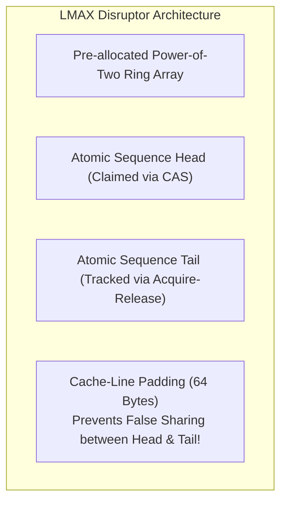

# The Producer-Consumer Problem (Bounded Buffer)

> [!abstract] Mental Model
> The Producer-Consumer Problem is an **automated sushi conveyor belt with exactly $N$ plate slots**:
> - **Producers (Sushi Chefs)** prepare rolls and place them onto available belt slots. If all $N$ slots are filled, chefs must **sleep** until a customer takes a plate.
> - **Consumers (Restaurant Patrons)** take plates off the belt. If the belt is empty ($0$ plates), patrons must **sleep** until a chef produces fresh sushi.
> - The synchronization protocol must coordinate **buffer limits (underflow/overflow)** and **multi-chef/multi-patron race conditions**.

---

## Architectural Layout: The 3-Primitive Synchronization Model

To coordinate $M$ producers and $K$ consumers safely over a fixed buffer of capacity $N$, the system utilizes **two counting semaphores and one mutual exclusion lock**:

```mermaid
flowchart LR
    subgraph Producers ["M Producer Threads"]
        P1["Producer 1"]
        P2["Producer 2"]
    end

    subgraph SyncPrimitives ["Synchronization Guards"]
        SemEmpty["Semaphore 'empty_slots' (Init = N)"]
        Lock["Mutex 'buffer_lock'"]
        SemFull["Semaphore 'full_slots' (Init = 0)"]
    end

    subgraph RingBuffer ["Bounded Ring Buffer (Capacity = N)"]
        B0["Slot 0"]
        B1["Slot 1 (Full)"]
        B2["Slot 2 (Full)"]
        B3["Slot 3 (Empty)"]
    end

    subgraph Consumers ["K Consumer Threads"]
        C1["Consumer 1"]
        C2["Consumer 2"]
    end

    Producers -->|1. sem_wait(empty)| SemEmpty
    SemEmpty -->|2. mutex_lock()| Lock
    Lock -->|3. Write to tail| RingBuffer
    RingBuffer -->|4. sem_post(full)| SemFull
    SemFull --> Consumers
```

---

## The Fatal Concurrency Trap: Lock Inversion Deadlock

A classic multi-threading bug occurs when programmers swap the acquisition order of the Semaphore and Mutex:

### 1. The Broken Order (Deadlock Vulnerability):
```c
// VULNERABLE CODE (DEADLOCK HAZARD!):
void producer_broken() {
    pthread_mutex_lock(&buffer_lock); // 1. Acquires Mutex Lock FIRST
    sem_wait(&empty_slots);            // 2. Blocks if buffer is FULL!
    
    // --- Insert Item ---
    
    sem_post(&full_slots);
    pthread_mutex_unlock(&buffer_lock);
}
```

### The Failure Sequence:
1. The buffer is full ($N$ items, `empty_slots = 0`).
2. Producer arrives, acquires `buffer_lock`, then calls `sem_wait(&empty_slots)` and **goes to sleep**.
3. Consumer arrives to remove an item (which would free a slot), but calls `pthread_mutex_lock(&buffer_lock)` and **blocks on the sleeping producer**.
4. **Result: Total Circular Deadlock!** The consumer cannot free space because the producer holds the lock; the producer cannot release the lock because it is waiting for space.

---

### 2. The Correct Production Order:
> [!important] The Golden Rule of Bounded Buffers
> **Always acquire resource semaphores (`sem_wait`) FIRST, and acquire the mutual exclusion lock (`mutex_lock`) SECOND.**

```c
// SAFE PRODUCTION ORDER:
sem_wait(&empty_slots);            // 1. Wait for resource availability (Sleeps WITHOUT holding lock)
pthread_mutex_lock(&buffer_lock); // 2. Acquire lock for safe pointer manipulation

// --- CRITICAL SECTION: Insert into ring buffer ---

pthread_mutex_unlock(&buffer_lock);
sem_post(&full_slots);             // 3. Notify consumers that an item is ready
```

---

## Complete Production Implementation in C (POSIX)

```c
#include <stdio.h>
#include <stdlib.h>
#include <pthread.h>
#include <semaphore.h>
#include <unistd.h>

#define BUFFER_SIZE 5
#define TOTAL_ITEMS 20

int buffer[BUFFER_SIZE];
int head = 0; // Read index
int tail = 0; // Write index

sem_t empty_slots;
sem_t full_slots;
pthread_mutex_t buffer_lock;

void* producer(void* arg) {
    for (int i = 1; i <= TOTAL_ITEMS; i++) {
        // 1. Wait for empty slot
        sem_wait(&empty_slots);
        
        // 2. Acquire mutual exclusion
        pthread_mutex_lock(&buffer_lock);
        
        buffer[tail] = i;
        printf("[Producer] Inserted item %d at slot %d\n", i, tail);
        tail = (tail + 1) % BUFFER_SIZE;
        
        pthread_mutex_unlock(&buffer_lock);
        
        // 3. Signal item available
        sem_post(&full_slots);
        usleep(50000); // 50ms
    }
    return NULL;
}

void* consumer(void* arg) {
    for (int i = 1; i <= TOTAL_ITEMS; i++) {
        // 1. Wait for available item
        sem_wait(&full_slots);
        
        // 2. Acquire mutual exclusion
        pthread_mutex_lock(&buffer_lock);
        
        int item = buffer[head];
        printf("    [Consumer] Consumed item %d from slot %d\n", item, head);
        head = (head + 1) % BUFFER_SIZE;
        
        pthread_mutex_unlock(&buffer_lock);
        
        // 3. Signal slot freed
        sem_post(&empty_slots);
        usleep(100000); // 100ms
    }
    return NULL;
}

int main(void) {
    sem_init(&empty_slots, 0, BUFFER_SIZE);
    sem_init(&full_slots, 0, 0);
    pthread_mutex_init(&buffer_lock, NULL);
    
    pthread_t prod_tid, cons_tid;
    pthread_create(&prod_tid, NULL, producer, NULL);
    pthread_create(&cons_tid, NULL, consumer, NULL);
    
    pthread_join(prod_tid, NULL);
    pthread_join(cons_tid, NULL);
    
    sem_destroy(&empty_slots);
    sem_destroy(&full_slots);
    pthread_mutex_destroy(&buffer_lock);
    return 0;
}
```

---

## High-Performance Production Pattern: The Lock-Free LMAX Disruptor

In high-frequency trading (HFT) and microsecond log ingestion pipelines, mutexes and semaphores are too slow due to kernel context-switch penalties.

The **LMAX Disruptor** replaces mutex-based queues with a **Lock-Free Circular Ring Buffer**:



- **Power-of-Two Masking**: Array index calculated via bitwise AND (`seq & (SIZE - 1)`) instead of slow integer division modulo (`%`).
- **Cache-Line Padding**: Pads the producer and consumer sequence counters with 56 dummy bytes so they never share the same 64-byte L1 cache line, eliminating **False Sharing**.
- **Performance**: Handles **$20\text{+ million messages/second}$** with $< 50\text{ nanosecond}$ latencies on single-socket commodity x86 hardware.

---

## Active Recall & Interview Perspective

### Reasoning Prompts
1. *Why does the Producer-Consumer problem require TWO semaphores instead of just one?*
   - **Answer**: The problem has two distinct, asymmetric boundary conditions that must be synchronized: **Buffer Full** (producers must block when empty slots equal 0) and **Buffer Empty** (consumers must block when full slots equal 0). A single counting semaphore can only count one resource dimension; using two semaphores (`empty_slots` initialized to $N$ and `full_slots` initialized to $0$) allows producers and consumers to block and signal each other independently without race conditions.
2. *What is False Sharing in high-concurrency ring buffers and how is it eliminated?*
   - **Answer**: False Sharing occurs when two independent variables accessed by different CPU cores (such as the producer's write sequence pointer and the consumer's read sequence pointer) happen to reside inside the same 64-byte CPU cache line. Whenever either core writes to its pointer, the MESI cache coherence protocol invalidates the entire cache line across all cores, causing unnecessary interconnect bus traffic and stalling execution. It is eliminated by inserting **64-byte cache line padding** (`alignas(64)`) between the variables.
3. *How can the Producer-Consumer problem be implemented using Condition Variables instead of Semaphores?*
   - **Answer**: Using a single Mutex protecting the buffer and two Condition Variables: `not_full` and `not_empty`. The producer acquires the mutex, loops `while (count == N) pthread_cond_wait(&not_full, &mutex)`, writes data, signals `pthread_cond_signal(&not_empty)`, and unlocks. The consumer acquires the mutex, loops `while (count == 0) pthread_cond_wait(&not_empty, &mutex)`, reads data, signals `pthread_cond_signal(&not_full)`, and unlocks.

---

## Key Takeaways
- The **Producer-Consumer Problem** synchronizes bounded buffer capacity using two counting semaphores (`empty_slots`, `full_slots`) and one mutex.
- Swapping semaphore and mutex acquisition triggers **Lock Inversion Deadlocks**.
- Ultra-low-latency production systems use **Lock-Free Ring Buffers (Disruptor pattern)** with cache-line padding to prevent False Sharing.

---

## Related Notes
- [[Operating System]] — Concurrency problem sets.
- [[Thread]] — Multi-threaded worker pipelines.
- [[Critical Section Problem]] — Protecting ring buffer indices.
- [[Producer-Consumer Pattern - Bounded Queues and Condition Variables]] — Mutual exclusion around head/tail updates.
- [[Binary and Counting Semaphores]] — Counting tokens for empty/full slots.
- [[Producer-Consumer Pattern - Bounded Queues and Condition Variables]] — Alternative solution with `not_full`/`not_empty`.
- [[Dining Philosophers Problem]] — Companion classical concurrency problem.
- [[Lock-Free and Wait-Free Data Structures]] — Lock-free bounded queues.
- [[Operating Systems MOC]] — Master table of contents for Operating Systems.
