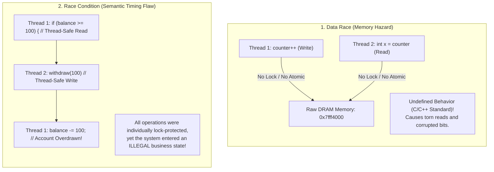
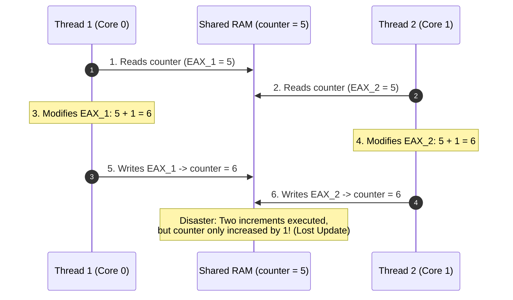

# Race Conditions and Data Races

> [!abstract] Mental Model
> - A **Data Race** is a **hardware-level collision on raw silicon**: two threads reach for the exact same memory address simultaneously without synchronization, where at least one thread is writing.
> - A **Race Condition** is a **semantic flaw in high-level timing**: the correctness of your program's business logic depends on which thread or process happens to win a random timing sprint.
> - *Crucial Distinction*: You can have a Race Condition *without* a Data Race (e.g., Check-Then-Act logic where all operations are individually lock-protected but temporally uncoordinated), and a Data Race without an immediate business race condition.

---

## Architectural Comparison: Race Condition vs Data Race



---

## The Non-Atomic Reality of Silicon: Read-Modify-Write (RMW)

In high-level languages (C, Java, Go, Python), a simple statement looks atomic:
```c
counter++; // "Single instruction", right? WRONG!
```

At the hardware CPU assembly level (x86-64), `counter++` decomposes into **three distinct machine instructions**:

```nasm
movl    counter(%rip), %eax    ; 1. READ: Load memory value into CPU register EAX
addl    $1, %eax               ; 2. MODIFY: Increment EAX register inside ALU
movl    %eax, counter(%rip)    ; 3. WRITE: Store register value back to memory
```

### The Interleaving Disaster:
Suppose `counter = 5` and two threads execute `counter++` concurrently on two CPU cores:



---

## Security Hazard: Time-of-Check to Time-of-Use (TOCTOU)

A **TOCTOU Race Condition** is a critical security vulnerability where the state of a resource changes between when the operating system checks permissions and when it uses the resource:

```c
// VULNERABLE PRIVILEGED DAEMON CODE:
void write_log_file(const char *filename) {
    // 1. Time of Check (TOC)
    if (access(filename, W_OK) == 0) { 
        
        // --- ATTACKER RACES HERE! ---
        // Attacker deletes filename and creates a symbolic link:
        // symlink("/etc/shadow", filename);
        
        // 2. Time of Use (TOU)
        FILE *f = fopen(filename, "w"); // OVERWRITES /etc/shadow WITH ROOT PRIVILEGES!
        fputs("Log Entry", f);
        fclose(f);
    }
}
```

### The Atomic Defense:
Use file-descriptor-based system calls with atomic creation flags:
```c
// SAFE PRODUCTION CODE:
int fd = open(filename, O_WRONLY | O_CREAT | O_EXCL | O_NOFOLLOW, 0644);
// O_EXCL guarantees atomic creation; O_NOFOLLOW refuses to traverse symlinks!
```

---

## Compiler and CPU Out-of-Order Reordering

Without memory synchronization primitives, modern optimizing compilers and superscalar CPUs aggressively reorder memory reads and writes:

```c
// Thread 1 (Producer)
payload_data = 42;    // Instruction A
data_ready = true;    // Instruction B

// Thread 2 (Consumer)
if (data_ready) {     // Instruction C
    print(payload_data); // Instruction D
}
```

### The Hardware Surprise:
- The CPU out-of-order execution engine may commit Instruction B (writing to store buffer) **before Instruction A completes DRAM cache line invalidation**.
- Thread 2 sees `data_ready == true`, but reads an uninitialized garbage value for `payload_data`!
- *Mitigation*: Requires **[[Memory Ordering and Memory Barriers|Memory Barriers / Acquire-Release Semantics]]**.

---

## Production Diagnostics: ThreadSanitizer (TSan)

Race conditions are notoriously non-deterministic, often manifesting only once in ten thousand runs under production load. Modern engineering teams detect them in CI pipelines using **ThreadSanitizer (TSan)**:

```bash
# 1. Compile C/C++ codebase with ThreadSanitizer instrumentation
clang -fsanitize=thread -g -O1 server.c -o server

# 2. Run the application test suite:
./server

# Example TSan Diagnostic Output:
# ==================
# WARNING: ThreadSanitizer: data race (pid=1042)
#   Write of size 4 at 0x7b0400000000 by thread T1:
#     #0 worker_thread server.c:42 (server+0x1234)
#   Previous Read of size 4 at 0x7b0400000000 by thread T2:
#     #0 telemetry_logger server.c:88 (server+0x5678)
#   Location is global 'counter' of size 4 at 0x7b0400000000
# ==================
```

---

## Active Recall & Interview Perspective

### Reasoning Prompts
1. *Can a program written without a single Data Race still suffer from a Race Condition?*
   - **Answer**: Yes. A data race is a raw unsynchronized concurrent memory access. Even if every individual read and write is made thread-safe using mutexes (eliminating data races), a high-level **Check-Then-Act Race Condition** can still occur if the lock is released between the check step (`if (!queue.isEmpty())`) and the action step (`item = queue.pop()`), allowing another thread to empty the queue in between.
2. *Why is `volatile` in C/C++ insufficient to solve data races?*
   - **Answer**: In C and C++, `volatile` merely informs the compiler not to optimize away reads/writes or cache the variable in a CPU register. It does **not** insert CPU hardware memory barriers (`MFENCE`), does **not** enforce atomic Read-Modify-Write instructions, and does **not** prevent the hardware CPU from reordering store buffers. For thread synchronization, developers must use `std::atomic` (C++) or `stdatomic.h` (C11).
3. *What hardware mechanism allows x86 CPUs to execute `counter++` atomically?*
   - **Answer**: The **`LOCK` instruction prefix** (`lock incq counter(%rip)`). The `LOCK` prefix asserts a hardware lock signal on the system bus or uses cache-coherence line locking (MESI protocol), preventing any other CPU core from reading or modifying that cache line for the duration of the Read-Modify-Write cycle.

---

## Key Takeaways
- **Data Races** occur at the memory access level (unsynchronized concurrent write); **Race Conditions** occur at the semantic timing logic level.
- High-level operations (`counter++`) are non-atomic **Read-Modify-Write** cycles in assembly.
- Prevent data races using **Atomic Operations (`std::atomic`)** or **Mutexes**, and detect them in CI with **ThreadSanitizer (`-fsanitize=thread`)**.

---

## Related Notes
- [[Operating System]] — Concurrency fundamentals.
- [[Thread]] — Shared virtual address space.
- [[Thread Safety and Reentrancy]] — Writing safe concurrent code.
- [[Critical Section Problem]] — Formal requirements for mutual exclusion.
- [[Hardware Synchronization Primitives - CAS, TAS, LL-SC]] — Silicon-level atomics.
- [[Memory Ordering and Memory Barriers]] — Hardware memory models and reordering.
- [[Producer-Consumer Pattern - Bounded Queues and Condition Variables]] — OS-level lock implementations.
- [[Operating Systems MOC]] — Master table of contents for Operating Systems.
