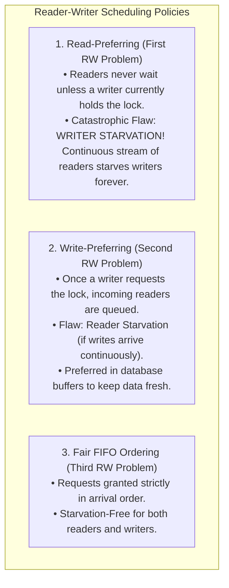
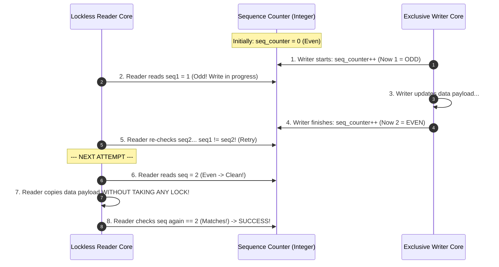

# The Reader-Writer Problem and RWLocks

> [!abstract] Mental Model
> An **RWLock (Read-Write Lock)** is a **public library reading room**: dozens of patrons can enter simultaneously to read reference manuscripts in parallel (**Shared Read Access**). However, when the archivist arrives to bind or edit the pages (**Exclusive Write Access**), all readers must clear the room, and no new readers may enter until the modifications are complete.

---

## Architectural Lock State Matrix

```mermaid
flowchart TD
    subgraph LockModes ["RWLock State Transitions"]
        direction LR
        Unlocked["UNLOCKED<br/>(State = 0)"]
        
        ReadLocked["SHARED READ MODE<br/>(Readers Count >= 1)<br/>• Multiple concurrent readers allowed.<br/>• Writers are BLOCKED."]
        
        WriteLocked["EXCLUSIVE WRITE MODE<br/>(Single Writer Active)<br/>• All readers BLOCKED.<br/>• All other writers BLOCKED."]
        
        Unlocked -->|rdlock()| ReadLocked
        Unlocked -->|wrlock()| WriteLocked
        ReadLocked -->|All readers unlock| Unlocked
        WriteLocked -->|Writer unlocks| Unlocked
    end
```

---

## The Three Classical Problem Variants (Courtois et al., 1971)



---

## Complete POSIX RWLock Implementation in C

```c
#include <stdio.h>
#include <pthread.h>
#include <unistd.h>

pthread_rwlock_t rwlock;
int shared_resource = 100;

// Multiple reader threads execute concurrently
void* reader(void* arg) {
    int id = *(int*)arg;
    
    // 1. Acquire Shared Read Lock
    pthread_rwlock_rdlock(&rwlock);
    printf("[Reader %d] Reading shared resource = %d\n", id, shared_resource);
    usleep(100000); // Simulating read
    pthread_rwlock_unlock(&rwlock);
    
    return NULL;
}

// Single writer executes with exclusive isolation
void* writer(void* arg) {
    int id = *(int*)arg;
    
    // 2. Acquire Exclusive Write Lock (Blocks until all readers clear)
    pthread_rwlock_wrlock(&rwlock);
    shared_resource += 50;
    printf("[Writer %d] *** MODIFIED resource to %d ***\n", id, shared_resource);
    usleep(200000); // Simulating write
    pthread_rwlock_unlock(&rwlock);
    
    return NULL;
}

int main(void) {
    pthread_rwlock_init(&rwlock, NULL);
    pthread_t r[4], w[2];
    int ids[6] = {1, 2, 3, 4, 1, 2};
    
    // Launch interleaved readers and writers
    pthread_create(&r[0], NULL, reader, &ids[0]);
    pthread_create(&r[1], NULL, reader, &ids[1]);
    pthread_create(&w[0], NULL, writer, &ids[4]);
    pthread_create(&r[2], NULL, reader, &ids[2]);
    pthread_create(&w[1], NULL, writer, &ids[5]);
    pthread_create(&r[3], NULL, reader, &ids[3]);
    
    for (int i = 0; i < 4; i++) pthread_join(r[i], NULL);
    for (int i = 0; i < 2; i++) pthread_join(w[i], NULL);
    
    pthread_rwlock_destroy(&rwlock);
    return 0;
}
```

---

## High-Performance Linux Kernel Alternative: Seqlocks (Sequence Locks)

Standard RWLocks have a hidden performance cost: **every reader must execute an atomic increment (`fetch_add`) to track reader counts**. In high-frequency 64-core workloads, this causes massive cache-line bouncing.

The Linux kernel introduced **Seqlocks** (used for system uptime, clock ticks, and routing tables):



---

### Seqlock Production Implementation:
```c
// Writer:
write_seqlock(&my_seqlock);
shared_timestamp_data++;
write_sequnlock(&my_seqlock);

// Reader (100% Non-Blocking Fast Path):
unsigned int seq;
do {
    seq = read_seqbegin(&my_seqlock);
    local_data = shared_timestamp_data;
} while (read_seqretry(&my_seqlock, seq));
```

> [!tip] The Seqlock Advantage
> - **Readers never take locks and never write to memory** (Zero cache line invalidations).
> - **Writers NEVER block on readers**.
> - Ideal for small data structures where reads outnumber writes $1000:1$.

---

## Active Recall & Interview Perspective

### Reasoning Prompts
1. *Why does a standard RWLock degrade performance compared to a standard Mutex if the workload is 50% reads and 50% writes?*
   - **Answer**: An RWLock has higher internal overhead than a standard Mutex because acquiring a read lock requires atomic incrementing and checking multiple state variables (`reader_count`, `writer_waiting_flag`), and releasing requires atomic decrements and conditional wakeups. If the ratio of reads to writes is not heavily skewed toward reads (e.g., at least $80\text{–}90\%$ reads), the overhead of managing the dual-lock state exceeds the benefits of concurrent reading, making a simple fast `futex` mutex faster.
2. *How do Write-Preferring RWLocks prevent Writer Starvation?*
   - **Answer**: When a writer requests the lock, the RWLock sets a `writer_waiting` flag. Any newly arriving reader that attempts `pthread_rwlock_rdlock()` sees this flag and is placed into a waiting queue, even if current readers are still actively reading. Once all active readers complete, the waiting writer immediately acquires the lock, ensuring readers cannot form an unbroken chain that indefinitely starves the writer.
3. *Why can Seqlocks NOT be used if the protected data structure contains dynamic memory pointers?*
   - **Answer**: Because readers in a Seqlock do not block writers, a writer could free or reallocate the memory of a node while a reader is concurrently traversing a pointer. If the reader dereferences the dangling pointer before checking `read_seqretry()`, the program will crash with a segmentation fault (`SIGSEGV`) or read invalid memory. Seqlocks are strictly safe only for flat, value-copied data structures (like integers, coordinates, or structs without pointers).

---

## Key Takeaways
- **RWLocks** allow concurrent shared read access while enforcing exclusive write isolation.
- Unconstrained read priority triggers **Writer Starvation**, resolved via **Write-Preferring or Fair FIFO RWLocks**.
- **Linux Seqlocks** provide lockless, zero-overhead read paths for read-heavy workloads where data contains no dynamic pointers.

---

## Related Notes
- [[Operating System]] — Concurrency primitives.
- [[Critical Section Problem]] — Problem formulation.
- [[Producer-Consumer Pattern - Bounded Queues and Condition Variables]] — Exclusive-only locking counterpart.
- [[Binary and Counting Semaphores]] — Low-level primitives used to build RWLocks.
- [[Producer-Consumer Pattern - Bounded Queues and Condition Variables]] — Condition queuing for RWLock waiters.
- [[Lock-Free and Wait-Free Data Structures]] — Seqlocks as an optimistic lock-free pattern.
- [[Operating Systems MOC]] — Master table of contents for Operating Systems.
