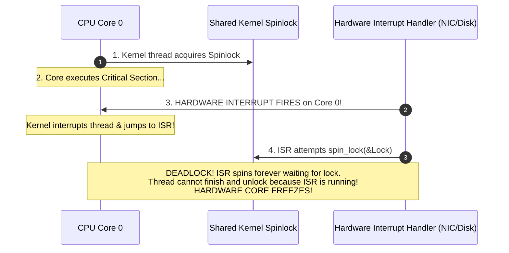

# Spinlocks

> [!abstract] Mental Model
> A **Spinlock** is a **revolving door with an impatient guard**: when the door is occupied, waiting threads do not sit down in the waiting lobby (sleeping via OS context switch); instead, they stand at the door **running in place at 100% CPU speed**, repeatedly polling the handle until it turns. 
> Spinlocks waste CPU cycles, but provide **sub-microsecond lock acquisition** with **zero context-switch latency**.

---

## Architectural Decision Matrix: Spinlock vs Mutex

```mermaid
flowchart TD
    CritDuration{"How long is the Critical Section held?"}
    
    CritDuration -->|"< 2 Context Switches (~1-3 microseconds)| UseSpinlock["USE SPINLOCK<br/>• Spinning burns fewer CPU cycles than the overhead of two kernel context switches (~2-5 microseconds)."]
    
    CritDuration -->|"> 5 microseconds OR Blocks on I/O"| UseMutex["USE MUTEX<br/>• Put thread to sleep via futex/scheduler.<br/>• Frees the CPU core for other productive threads."]
```

> [!danger] The Cardinal Law of Spinlocks
> **A thread holding a spinlock MUST NEVER SLEEP, block on I/O, or yield the CPU.**
> If a thread holding a spinlock sleeps, other CPU cores attempting to acquire the lock will spin at 100% CPU utilization indefinitely, causing widespread system lockups.

---

## The Evolution of Spinlock Architectures

### 1. Naive Test-and-Set (TAS) Spinlock
```c
void spin_lock_naive(atomic_bool *lock) {
    while (atomic_exchange_explicit(lock, true, memory_order_acquire)) {
        // High-frequency atomic bus write!
    }
}
```
- **Catastrophic Flaw**: Every iteration executes an atomic write instruction (`XCHG`). On multi-core CPUs, this repeatedly broadcasts cache invalidation signals across the interconnect bus (MESI cache line ping-pong), choking memory bandwidth across all CPU sockets.

---

### 2. Test-and-Test-and-Set (TATAS) Spinlock with `PAUSE`
TATAS reads the lock using standard non-atomic loads (served entirely from local L1 cache in `Shared` state) and only executes an atomic write when the lock actually appears free:

```c
void spin_lock_tatas(atomic_bool *lock) {
    while (true) {
        // 1. Test: Spin on local L1 cache read (Zero bus traffic!)
        while (atomic_load_explicit(lock, memory_order_relaxed)) {
            #if defined(__x86_64__)
            __builtin_ia32_pause(); // Emits x86 PAUSE instruction
            #elif defined(__aarch64__)
            __asm__ volatile("yield");
            #endif
        }
        
        // 2. Test-and-Set: Attempt atomic lock acquisition
        if (!atomic_exchange_explicit(lock, true, memory_order_acquire)) {
            return; // Lock acquired!
        }
    }
}
```

> [!tip] The Silicon Magic of the `PAUSE` Instruction
> The x86 `PAUSE` instruction introduces a slight pipeline delay ($\approx 10\text{–}40\text{ cycles}$). This prevents the CPU's speculative execution engine from mispredicting loop exits, eliminating pipeline flush penalties and drastically cooling down physical core temperatures.

---

### 3. Ticket Spinlocks (Guaranteed FIFO Fairness)

TATAS spinlocks are non-deterministic: the core closest to the L3 cache usually wins the race, causing severe **starvation** for distant NUMA nodes.

**Ticket Spinlocks** operate like a deli counter:
- Each arriving thread fetches a unique incrementing `ticket_number`.
- Threads spin until `now_serving == ticket_number`.

```c
typedef struct {
    atomic_uint next_ticket;
    atomic_uint now_serving;
} ticket_spinlock_t;

void ticket_lock(ticket_spinlock_t *lock) {
    // 1. Take a numbered ticket atomically
    unsigned int my_ticket = atomic_fetch_add_explicit(&lock->next_ticket, 1, memory_order_relaxed);
    
    // 2. Spin until our ticket number is called
    while (atomic_load_explicit(&lock->now_serving, memory_order_acquire) != my_ticket) {
        __builtin_ia32_pause();
    }
}

void ticket_unlock(ticket_spinlock_t *lock) {
    // Increment now_serving to notify the next in line
    unsigned int current = atomic_load_explicit(&lock->now_serving, memory_order_relaxed);
    atomic_store_explicit(&lock->now_serving, current + 1, memory_order_release);
}
```

---

### 4. MCS Queued Spinlocks & Linux `qspinlock`

Even Ticket Spinlocks suffer when hundreds of cores spin polling the single shared `now_serving` cache line.

**MCS Spinlocks** (Mellor-Crummey & Scott, 1991) construct a linked list of waiting CPU nodes. **Each CPU core spins exclusively on its own private per-CPU cache line**:


- When Core 0 unlocks, it writes directly to Core 1's private node: `node_cpu1->locked = false`.
- **Result**: Exactly **one cache line invalidation** per handoff, achieving perfect $O(1)$ multi-socket scalability!
- In Linux 4.2+, this was optimized into **`qspinlock` (Queued Spinlock)**, compressing the MCS algorithm into a compact 4-byte struct.

---

## Critical Kernel Hazard: Spinlocks & Hardware Interrupts



---

### The Kernel Defense: `spin_lock_irqsave`
To prevent interrupt deadlocks, the Linux kernel provides specialized locking macros that **disable local CPU hardware interrupts before acquiring the spinlock**:

```c
// LINUX KERNEL PRODUCTION CODE:
unsigned long flags;

// 1. Disables local CPU interrupts AND acquires spinlock
spin_lock_irqsave(&my_lock, flags);

// --- CRITICAL SECTION (Completely safe from ISR preemption) ---
shared_device_buffer->head++;

// 2. Releases spinlock AND restores prior interrupt state
spin_unlock_irqrestore(&my_lock, flags);
```

---

## Active Recall & Interview Perspective

### Reasoning Prompts
1. *Why should spinlocks NEVER be used on a single-core uniprocessor system without kernel preemption disabled?*
   - **Answer**: On a single-core system, only one thread can physically execute at a time. If Thread A holds the spinlock and Thread B is scheduled, Thread B will spin for its entire time quantum consuming 100% CPU cycles. Because Thread A cannot execute while Thread B is spinning, the lock can *never* be released during Thread B's slice. Spinning on a uniprocessor is pure wasted CPU time; sleeping locks (mutexes) or disabling preemption must be used instead.
2. *How does the `PAUSE` instruction prevent CPU pipeline stalls in spinlock loops?*
   - **Answer**: In a tight spin loop, the CPU's branch predictor speculates that the loop will continue spinning. When the lock is finally released, the memory write invalidates the speculative pipeline, forcing an expensive pipeline flush ($\approx 30\text{–}40\text{ cycles}$). The `PAUSE` instruction de-pipelines the loop, adds a small architectural delay, and prevents aggressive memory ordering violations on loop exit.
3. *What is the difference between `spin_lock()` and `spin_lock_irqsave()` in the Linux kernel?*
   - **Answer**: `spin_lock()` only acquires the spinlock. If the lock is shared with an Interrupt Service Routine (ISR) that executes on the same CPU core, an interrupt arriving mid-critical section will trigger a self-deadlock. `spin_lock_irqsave()` saves the CPU's interrupt state flags and disables local hardware interrupts before acquiring the lock, guaranteeing that no ISR can interrupt the critical section on that core.

---

## Key Takeaways
- **Spinlocks** provide near-zero latency mutual exclusion for short critical sections ($< 2$ context switches).
- **TATAS with `PAUSE`** and **MCS Queued Spinlocks (`qspinlock`)** eliminate cache-coherence bus saturation.
- Kernel code must use **`spin_lock_irqsave`** to prevent catastrophic hardware interrupt deadlocks.

---

## Related Notes
- [[Operating System]] — Kernel synchronization.
- [[Interrupts and Interrupt Handling]] — Interrupt service routine mechanics.
- [[Context Switching]] — Context switch cost trade-offs.
- [[Hardware Synchronization Primitives - CAS, TAS, LL-SC]] — Silicon atomics.
- [[Memory Ordering and Memory Barriers]] — Acquire-release ordering in locks.
- [[Producer-Consumer Pattern - Bounded Queues and Condition Variables]] — The sleeping alternative to spinlocks.
- [[Reader-Writer Problem and RWLocks]] — Spinlock variants for read-heavy workloads.
- [[Operating Systems MOC]] — Master table of contents for Operating Systems.
