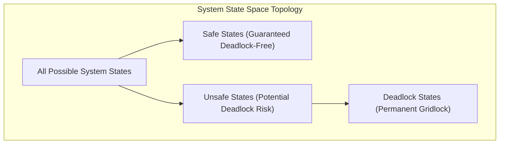
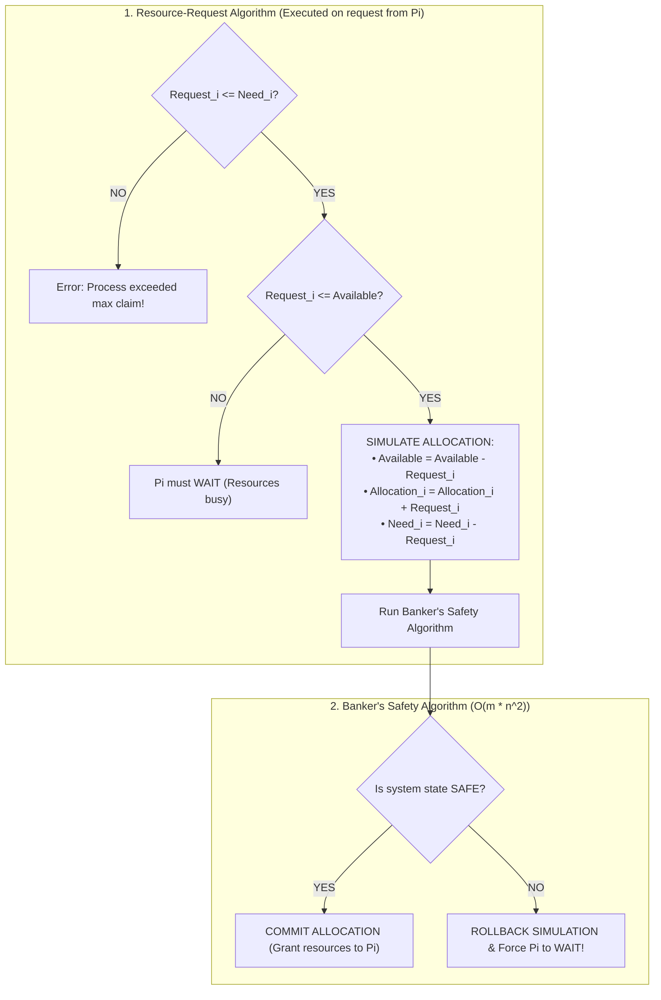

# Deadlock Avoidance and Banker's Algorithm

> [!abstract] Mental Model
> The Banker's Algorithm is a **cautious credit bank manager in a small town**: clients have declared maximum lines of credit ($Max$), but only borrow portions at any given time ($Allocation$). When a customer requests an immediate cash advance ($Request$), the banker simulates whether granting it leaves the bank vault with enough remaining cash ($Available$) to ensure **at least one client can finish their business, repay their total debt, and free up cash for the next client**. 
> If granting the loan could lead to an insolvent trap (**Unsafe State**), the banker **refuses the request and forces the client to wait**.

---

## State Space Topology: Safe vs Unsafe vs Deadlock



- **Safe State**: There exists at least one **Safe Sequence** $\langle P_1, P_2, \dots, P_n \rangle$ where every process can acquire its maximum remaining claim, complete execution, and return all resources to the pool.
- **Unsafe State**: No safe sequence exists. If all processes simultaneously demand their maximum declared resources, the system will unavoidably enter a deadlock.
- **The Avoidance Invariant**: **The OS dynamically monitors every resource request and ensures the system NEVER transitions from a Safe State to an Unsafe State.**

---

## The Mathematical Data Structures

For a system with $n$ processes and $m$ distinct resource types:

$$\begin{aligned}
\mathbf{Available[m]} &\quad \text{Vector of length } m \text{ (Free unallocated instances)} \\
\mathbf{Max[n][m]} &\quad n \times m \text{ Matrix (Maximum declared demand per process)} \\
\mathbf{Allocation[n][m]} &\quad n \times m \text{ Matrix (Currently held instances per process)} \\
\mathbf{Need[n][m]} &\quad n \times m \text{ Matrix (Remaining instances required to complete)}
\end{aligned}$$

### The Fundamental Matrix Invariant:
$$\mathbf{Need[i][j] = Max[i][j] - Allocation[i][j]}$$

---

## The Two Sub-Algorithms



---

## Complete Production C Implementation

```c
#include <stdio.h>
#include <stdbool.h>

#define P 5 // Number of processes (P0 to P4)
#define R 3 // Number of resource types (A, B, C)

// Verifies if system is in a Safe State and computes safe sequence
bool is_safe_state(int processes[], int avail[], int max[][R], int allot[][R], int safe_seq[]) {
    int need[P][R];
    for (int i = 0; i < P; i++) {
        for (int j = 0; j < R; j++) {
            need[i][j] = max[i][j] - allot[i][j];
        }
    }

    bool finish[P] = {false};
    int work[R];
    for (int i = 0; i < R; i++) work[i] = avail[i];

    int count = 0;
    while (count < P) {
        bool found = false;
        for (int p = 0; p < P; p++) {
            if (!finish[p]) {
                // Check if Need_p <= Work
                int j;
                for (j = 0; j < R; j++) {
                    if (need[p][j] > work[j]) break;
                }

                // If all needs can be satisfied
                if (j == R) {
                    for (int k = 0; k < R; k++) {
                        work[k] += allot[p][k]; // Simulate process completing and releasing
                    }
                    safe_seq[count++] = p;
                    finish[p] = true;
                    found = true;
                }
            }
        }
        // If no process could be satisfied in this pass, system is UNSAFE!
        if (!found) return false;
    }
    return true;
}

int main(void) {
    int processes[P] = {0, 1, 2, 3, 4};
    int avail[R] = {3, 3, 2}; // Available resources (A, B, C)

    int max[P][R] = {
        {7, 5, 3}, // P0
        {3, 2, 2}, // P1
        {9, 0, 2}, // P2
        {2, 2, 2}, // P3
        {4, 3, 3}  // P4
    };

    int allot[P][R] = {
        {0, 1, 0}, // P0
        {2, 0, 0}, // P1
        {3, 0, 2}, // P2
        {2, 1, 1}, // P3
        {0, 0, 2}  // P4
    };

    int safe_seq[P];
    if (is_safe_state(processes, avail, max, allot, safe_seq)) {
        printf("[SUCCESS] System is in a SAFE state.\nSafe Sequence: ");
        for (int i = 0; i < P; i++) {
            printf("P%d%s", safe_seq[i], (i == P - 1) ? "\n" : " -> ");
        }
    } else {
        printf("[WARNING] System is in an UNSAFE state!\n");
    }
    return 0;
}
```

---

## Algorithmic Complexity & Production Limitations

| Metric | Banker's Algorithm Performance |
| :--- | :--- |
| **Time Complexity** | **$O(m \times n^2)$** where $n$ is the process count and $m$ is resource types. |
| **Space Complexity** | **$O(n \times m)$** matrix storage. |

### Why Modern OSes Rarely Run Banker's Algorithm in Userspace:
1. **A Priori Maximum Declaration**: Real applications cannot predict their maximum resource demands upfront (e.g., dynamic heap allocations, network buffers).
2. **Dynamic Process Count**: In production servers, threads and processes are spawned and destroyed continuously ($n$ is not fixed).
3. **Severe Overhead**: Running an $O(m \times n^2)$ matrix scan on every single `malloc()` or lock acquisition would cripple throughput.

---

## Active Recall & Interview Perspective

### Reasoning Prompts
1. *Is an Unsafe State identical to a Deadlocked State?*
   - **Answer**: No. An Unsafe State is not necessarily a deadlock; it is merely a state from which the operating system **can no longer guarantee that a deadlock will not occur**. If processes do not happen to request their maximum possible declared resources simultaneously, an unsafe system may still execute to completion without ever deadlocking. Deadlock is a strict subset of unsafe states.
2. *What is the time complexity of the Banker's Safety Algorithm and how is it derived?*
   - **Answer**: The time complexity is **$O(m \times n^2)$**. In the worst case, the algorithm must find $n$ processes to add to the safe sequence. In the outer loop ($n$ iterations), it may have to scan all remaining uncompleted processes ($O(n)$) and compare their $m$-length need vectors against the available work vector ($O(m)$). Multiplying gives $n \times (n \times m) = O(m \times n^2)$.
3. *How does Deadlock Avoidance differ fundamentally from Deadlock Prevention?*
   - **Answer**: **Deadlock Prevention** is static and design-based: it constrains the structure of how programs request resources (such as forcing total lock ordering) to permanently eliminate at least one Coffman condition before runtime. **Deadlock Avoidance** is dynamic and runtime-based: it allows arbitrary resource request patterns, but inspects each request dynamically against declared maximums to ensure the system never enters an unsafe state.

---

## Key Takeaways
- **Deadlock Avoidance** dynamically prevents unsafe state transitions using declared maximum resource limits.
- **Banker's Algorithm** verifies safe execution sequences in **$O(m \times n^2)$** time.
- While theoretically optimal, real-world OSes avoid Banker's Algorithm due to the requirement for **a priori maximum resource declarations**.

---

## Related Notes
- [[Operating System]] — Resource allocation theory.
- [[Deadlock Fundamentals and Coffman Conditions]] — Theoretical foundations.
- [[Resource Allocation Graph]] — Graph representation of claim edges.
- [[Deadlock Prevention Strategies]] — The static alternative to avoidance.
- [[Deadlock Detection and Recovery]] — The post-deadlock alternative.
- [[Operating Systems MOC]] — Master table of contents for Operating Systems.
