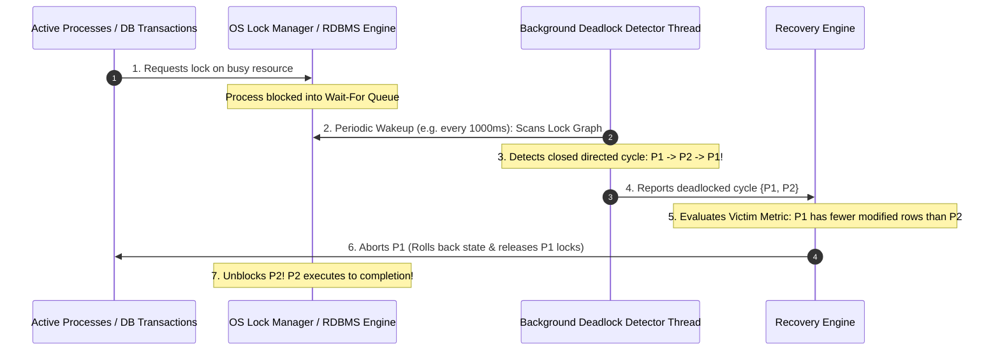
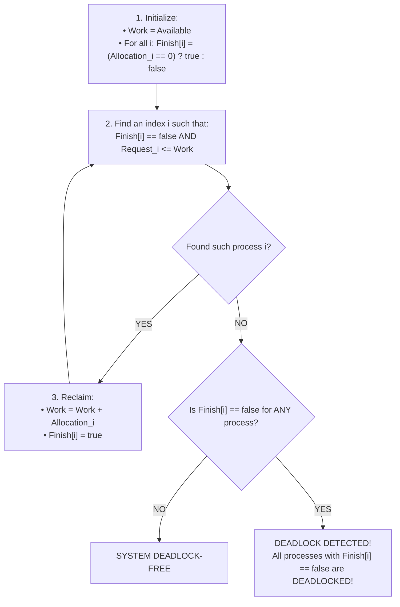
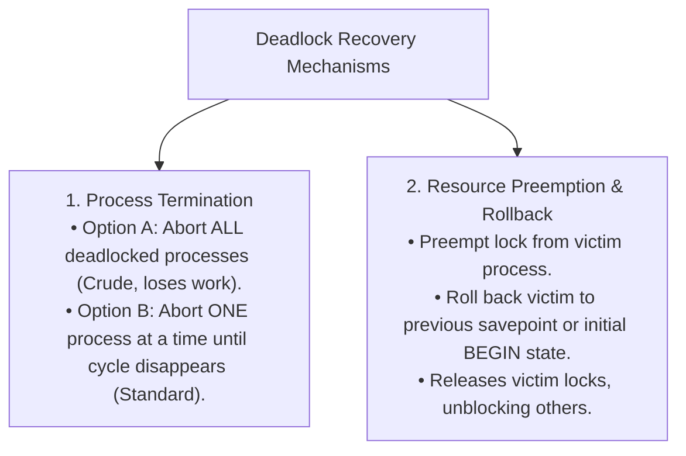

# Deadlock Detection and Recovery

> [!abstract] Mental Model
> **Deadlock Detection and Recovery** is a **metropolitan smart-traffic surveillance system**: instead of forbidding traffic (Prevention) or requiring permits at every intersection (Avoidance), vehicles move freely. When traffic cameras detect an immovable gridlock (**Detection**), the system automatically dispatches a tow truck to remove the smallest car blocking the intersection (**Victim Selection & Recovery**), clearing the road for everyone else.

---

## The Detection & Recovery Lifecycle



---

## 1. Deadlock Detection Algorithms

### A. Single-Instance Systems (Wait-For Graph Cycle Detection)
- Converts lock allocation queues into a **Wait-For Graph (WFG)** ($P_i \to P_j$).
- Executes **Tarjan's Strongly Connected Components (SCC)** or Depth-First Search (DFS) cycle detection.
- **Time Complexity**: **$O(V + E)$** where $V = |Processes|$ and $E = |Wait-Edges|$.

---

### B. Multi-Instance Systems (Vector-Matrix Reduction)
For systems with multiple resource instances per type, the OS maintains `Available[m]`, `Allocation[n][m]`, and `Request[n][m]`:



- **Time Complexity**: **$O(m \times n^2)$**.

---

## 2. Deadlock Recovery Strategies

Once a deadlock cycle is detected, the OS/database must restore forward progress through **Process Termination** or **Resource Preemption**:



---

## 3. Victim Selection Optimization & Starvation Prevention

The recovery engine must choose which process to terminate based on **minimal economic cost**:

| Metric | Evaluation Logic |
| :--- | :--- |
| **Work Completed** | Processes that have executed for milliseconds are killed before jobs running for 5 hours. |
| **Modified State / Locks** | Transactions that have written 2 rows are rolled back before transactions with 100,000 modified rows. |
| **Process Priority** | High-priority real-time processes are spared over background worker daemons. |

---

### The Starvation Trap:
> [!danger] Victim Starvation Hazard
> If the victim selection algorithm *always* picks the transaction with the lowest cost, a newly-started small transaction might be aborted, restarted, aborted again, and **starve forever**.

### The Production Remedy:
Include an **Abort Counter / Timestamp** in the cost calculation:
$$\mathbf{\text{Victim Score}} = \frac{\text{Resource Cost}}{\mathbf{\text{Rollback Count}} + 1}$$
*As a process gets aborted repeatedly, its victim score drops, immunizing it from future terminations!*

---

## Production RDBMS Implementation: PostgreSQL & MySQL

In high-concurrency databases, lock deadlocks are a daily reality:

```sql
-- Transaction 1:
BEGIN;
UPDATE accounts SET balance = balance - 100 WHERE id = 1; -- Holds Lock on Row 1
UPDATE accounts SET balance = balance + 100 WHERE id = 2; -- Waits for Lock on Row 2

-- Transaction 2 (Concurrent):
BEGIN;
UPDATE accounts SET balance = balance - 50 WHERE id = 2;  -- Holds Lock on Row 2
UPDATE accounts SET balance = balance + 50 WHERE id = 1;  -- BLOCKED! DEADLOCK FORMS!
```

### Database Internal Response:
1. **PostgreSQL**: Waits for `deadlock_timeout` (default $1000\text{ ms}$). If locks are not freed, fires background cycle detector, terminates Transaction 2 with `ERROR: deadlock detected`, and prints the conflicting query text.
2. **MySQL InnoDB**: `innodb_deadlock_detect=ON` checks the lock graph instantly ($0\text{ ms}$ delay) on every wait, rolls back the transaction with the smaller undo log footprint, and returns `ERROR 1213 (40001): Deadlock found when trying to get lock; try restarting transaction`.

---

## Active Recall & Interview Perspective

### Reasoning Prompts
1. *What is the difference between the Need matrix in Banker's Algorithm and the Request matrix in Deadlock Detection?*
   - **Answer**: In Banker's Algorithm (Deadlock Avoidance), the `Need` matrix represents the **speculative maximum remaining resources** a process *might* request in the future ($Max - Allocation$). In Deadlock Detection, the system does not know future maximums; the `Request` matrix represents the **actual, currently active unfulfilled requests** that threads have already submitted and are actively blocking on.
2. *Why do relational databases prefer Deadlock Detection over Deadlock Prevention?*
   - **Answer**: Deadlock Prevention (such as enforcing global alphabetical row lock ordering or pre-declaring all tables) is impossible in dynamic ad-hoc SQL queries and severely reduces write concurrency. Deadlocks in well-indexed databases occur in $< 0.1\%$ of transactions. It is mathematically far more efficient to let transactions run concurrently with optimistic locking, detect the rare deadlocks in $O(V + E)$ time, and automatically abort/retry the victim transaction.
3. *What is Checkpointing and how does it optimize Deadlock Recovery?*
   - **Answer**: Checkpointing is the periodic serialization of a process's complete execution and memory state to stable storage (or database `SAVEPOINT`). Without checkpoints, recovering from a deadlock requires aborting the entire process and restarting it from zero. With checkpoints, the OS/DB can execute a **Partial Rollback**, rewinding the victim process only to the most recent savepoint prior to acquiring the contested lock, preserving the bulk of its computed work.

---

## Key Takeaways
- **Deadlock Detection** discovers active cycles in Wait-For Graphs ($O(V + E)$) or multi-instance matrices ($O(m \times n^2)$).
- **Deadlock Recovery** resolves cycles via **Victim Selection** and **Transaction Rollback**.
- To prevent **Victim Starvation**, cost functions must incorporate the **number of prior rollbacks**.

---

## Related Notes
- [[Operating System]] — Concurrency management.
- [[Process States and Lifecycle]] — `TASK_UNINTERRUPTIBLE` state.
- [[Critical Section Problem]] — Lock contention.
- [[Producer-Consumer Pattern - Bounded Queues and Condition Variables]] — Row locks and mutex waits.
- [[Deadlock Fundamentals and Coffman Conditions]] — Theoretical criteria.
- [[Resource Allocation Graph]] — Wait-For Graph derivation.
- [[Deadlock Prevention Strategies]] — The proactive alternative.
- [[Deadlock Avoidance and Banker's Algorithm]] — Matrix avoidance comparisons.
- [[Deadlock vs Livelock vs Starvation]] — Definitive comparison matrix.
- [[Operating Systems MOC]] — Master table of contents for Operating Systems.
