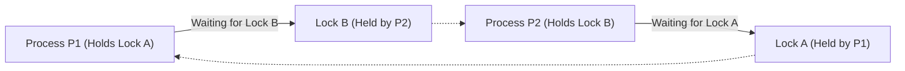
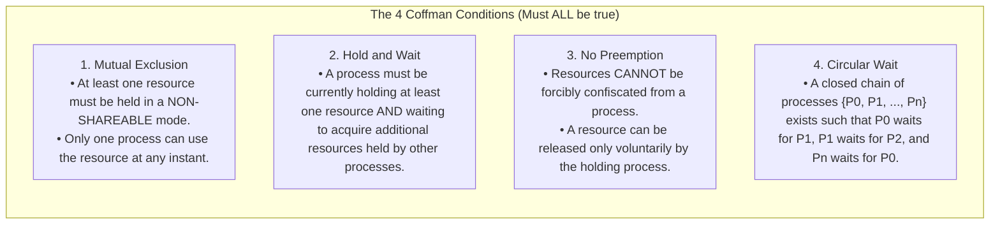
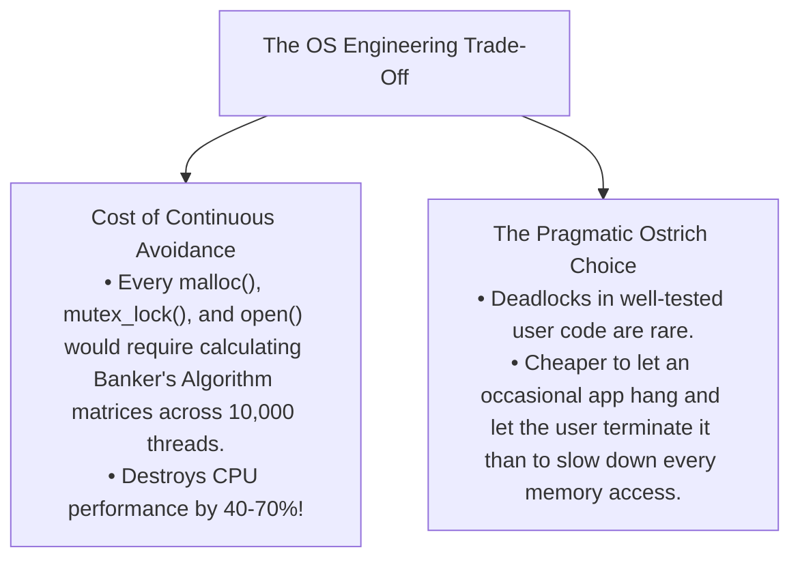

# Deadlock Fundamentals and the Four Coffman Conditions

> [!abstract] Mental Model
> A **Deadlock** is a **four-way traffic gridlock at an intersection**: four cars enter the intersection simultaneously, each blocking the car to its left while waiting for the car ahead to advance. No driver can move forward, no driver is willing to reverse, and nobody can make progress. 
> In an operating system, **deadlock is the ultimate frozen state**: a set of threads are permanently sleeping in the kernel, each holding a lock that another thread needs to wake up.

---

## Formal Definition of Deadlock

A set of processes is in a **Deadlock State** when **every process in the set is waiting for an event (resource release) that can only be triggered by another process within the same set**.



---

## The Four Inviolable Coffman Conditions (1971)

Pioneered by Edward G. Coffman Jr., a deadlock can arise **if and only if ALL FOUR of the following conditions hold simultaneously**:



> [!important] The Keystone Principle of Deadlock Prevention
> If you can design a system architecture that **mathematically guarantees that AT LEAST ONE of these four conditions is violated at all times, deadlock becomes mathematically impossible.**

---

## The Four High-Level Deadlock Handling Strategies

Modern computer systems adopt four distinct philosophies to manage deadlocks:

| Strategy | Mechanism | Performance / Overhead | Real-World Application |
| :--- | :--- | :--- | :--- |
| **1. The Ostrich Algorithm** | Stick your head in the sand. Ignore the problem completely; if a deadlock occurs, reboot or kill processes. | **Zero Overhead** | **Linux, Windows, macOS** for general user applications. |
| **2. Deadlock Prevention** | Design protocols that structurally eliminate at least one Coffman condition (e.g., Total Resource Ordering). | Low runtime overhead; restricts programming freedom. | Embedded avionics, RTOS, Linux `spin_lock_irqsave`. |
| **3. Deadlock Avoidance** | Dynamically inspect resource requests at runtime and refuse allocation if it leads to an "Unsafe State" (**Banker's Algorithm**). | High runtime overhead ($O(M \times N^2)$ per allocation). | Specialized resource management systems. |
| **4. Detection & Recovery** | Let deadlocks happen, periodically run graph cycle detection algorithms, and terminate victim processes. | Moderate periodic overhead. | **RDBMS engines (PostgreSQL, MySQL InnoDB, Oracle)**. |

---

## Why General-Purpose OSes Use the "Ostrich Algorithm"

Why don't Linux or Windows run dynamic deadlock avoidance for standard C/C++ applications?



---

## Production Diagnostics: Linux Kernel `lockdep`

While Linux uses the Ostrich algorithm for userspace applications, **deadlocks inside the Linux kernel itself would crash the entire machine**.

To prevent kernel deadlocks, Linux includes **`lockdep` (Runtime Lock Dependency Validator)**:

```bash
# 1. Inspect kernel lockdep status in dmesg
dmesg | grep -i "lockdep"

# 2. Example lockdep warning when a circular dependency is detected in a kernel module:
# ==============================================================================
# [ BUG: possible circular locking dependency detected ]
# 6.1.0-custom #1 Not tainted
# ------------------------------------------------------
# kworker/u16:1/42 is trying to acquire lock:
#  (&sb->s_type->i_mutex_key#3){++++}-{3:3}, at: ext4_evict_inode+0x12/0x450
#
# but task is already holding lock:
#  (&jbd2_handle_key){++++}-{0:0}, at: jbd2_journal_start+0x45/0x90
#
# -> Chain exists of:
#    &jbd2_handle_key --> &sb->s_type->i_mutex_key#3
# ==============================================================================
```

---

## Active Recall & Interview Perspective

### Reasoning Prompts
1. *What are the four Coffman conditions and what happens if even ONE condition is broken?*
   - **Answer**: The four conditions are **Mutual Exclusion**, **Hold and Wait**, **No Preemption**, and **Circular Wait**. If even a single condition is broken, deadlock cannot occur. For instance, breaking Mutual Exclusion (making resources read-only shareable) or breaking Circular Wait (enforcing total lock ordering) makes the formation of an unresolvable waiting cycle mathematically impossible.
2. *Why is Circular Wait a necessary condition for deadlock, but a cycle in a Resource Allocation Graph is NOT always sufficient?*
   - **Answer**: Circular Wait is a mandatory logical requirement. However, in a Resource Allocation Graph, a cycle is only a *sufficient* condition for deadlock if **every resource in the cycle has exactly one instance**. If resources have multiple instances (e.g., 3 identical printers), a cycle merely indicates a potential deadlock; if an external process finishes and releases an instance into the cycle, the deadlock is broken.
3. *How do database engines (like MySQL InnoDB) handle deadlocks differently from general-purpose operating systems?*
   - **Answer**: General-purpose OSes ignore userspace deadlocks (Ostrich Algorithm), leaving recovery to humans. Relational databases actively maintain a background thread running a **Wait-For Graph cycle detection algorithm** every few milliseconds. When a deadlock is detected, the database automatically **selects a victim transaction** (typically the transaction with the fewest modified rows), rolls it back, releases its locks, and returns an error (`ER_LOCK_DEADLOCK`), allowing the other transaction to complete successfully.

---

## Key Takeaways
- A **Deadlock** is a state where every process in a set is blocked waiting for a resource held by another process in that set.
- Deadlock requires all **Four Coffman Conditions**: **Mutual Exclusion, Hold and Wait, No Preemption, Circular Wait**.
- General-purpose OSes use the **Ostrich Algorithm**, while kernel debugging uses **`lockdep`** and databases use **Wait-For Graph detection**.

---

## Related Notes
- [[Operating System]] — Resource management.
- [[Process States and Lifecycle]] — `TASK_UNINTERRUPTIBLE` sleep states.
- [[Critical Section Problem]] — Lock dependencies.
- [[Producer-Consumer Pattern - Bounded Queues and Condition Variables]] — Locks involved in deadlocks.
- [[Dining Philosophers Problem]] — Classical deadlock illustration.
- [[Resource Allocation Graph]] — Visual graph representation of deadlocks.
- [[Deadlock Prevention Strategies]] — Techniques to break Coffman conditions.
- [[Deadlock Avoidance and Banker's Algorithm]] — Dynamic state safety checking.
- [[Deadlock Detection and Recovery]] — Detection algorithms and victim selection.
- [[Operating Systems MOC]] — Master table of contents for Operating Systems.
