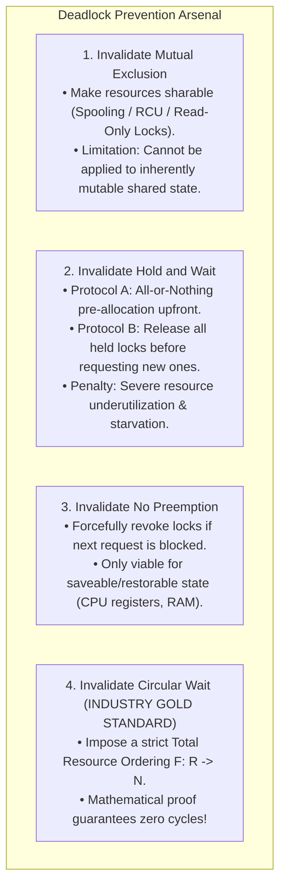

# Deadlock Prevention Strategies

> [!abstract] Mental Model
> **Deadlock Prevention** is **structural building code design**: instead of installing smoke detectors to react to fires after they start (Detection) or checking the wind direction before striking every match (Avoidance), you build the entire structure out of **non-combustible steel and concrete**. 
> By mathematically outlawing at least one of the four [[Deadlock Fundamentals and Coffman Conditions|Coffman conditions]] at design time, **deadlock becomes structurally impossible**.

---

## The Four Prevention Vectors



---

## 1. Eliminating Mutual Exclusion (Virtualization & Spooling)

- **The Principle**: If no resource is held exclusively, multiple processes never block each other.
- **Spooling (Simultaneous Peripheral Operations On-Line)**:
  - Dedicated hardware (e.g., physical printer) is hidden behind a system daemon.
  - Processes write their complete print output into independent disk spool files.
  - Only the single spooler daemon interacts directly with the printer, eliminating process-level mutual exclusion.
- **Lock-Free Concurrency**:
  - Replacing exclusive mutexes with atomic [[Hardware Synchronization Primitives - CAS, TAS, LL-SC|CAS instructions]] and [[Lock-Free and Wait-Free Data Structures|RCU (Read-Copy-Update)]].

---

## 2. Eliminating Hold and Wait

To prevent a process from holding resources while sleeping on new ones:

```mermaid
flowchart LR
    subgraph ProtocolA ["Protocol A: Conservative All-or-Nothing"]
        P_Start["Process Init"] -->|Single Atomic Request for ALL locks: A + B + C| Granted["Execution Begins"]
        Granted -->|Releases all locks on exit| Done["Finished"]
    end

    subgraph ProtocolB ["Protocol B: Release-Before-Acquire"]
        Step1["Holds Lock A"] -->|Needs Lock B| ReleaseA["Explicitly Releases Lock A!"]
        ReleaseA -->|Requests {A, B} together| AcquireBoth["Continues Execution"]
    end
```

### The Production Costs:
1. **Low Utilization**: A process needing a GPU for 10 seconds at the end of a 2-hour job must lock the GPU for the entire 2 hours.
2. **Starvation**: Processes requiring multiple popular resources simultaneously may wait indefinitely as other threads repeatedly claim single units.

---

## 3. Eliminating No Preemption (Resource Confiscation)

- **The Protocol**: If Process $P_1$ holding $\{R_1, R_2\}$ requests $R_3$ (which is currently held by $P_2$), the OS **forcefully revokes $R_1$ and $R_2$ from $P_1$**.
- $P_1$ enters a suspended state; it can restart only when it successfully re-acquires $\{R_1, R_2, R_3\}$ together.
- **Where Viable**:
  - **CPU Core Scheduling**: Process state is saved in the [[Process Control Block|PCB]] / thread context and resumed seamlessly.
  - **Virtual Memory Paging**: Pages are swapped to disk backing store.
- **Where Impossible**:
  - Database row locks without transactional abort mechanisms (would leave uncommitted dirty reads).
  - Socket streams or tape drive writes mid-transfer.

---

## 4. Eliminating Circular Wait (Strict Total Resource Ordering)

> [!important] The Industry Gold Standard
> Imposing a **global strict order on all lock acquisitions** is the most widely adopted and practical deadlock prevention technique in production software engineering (Linux Kernel, MySQL InnoDB, distributed consensus).

---

### The Mathematical Formulation & Proof
Let $R = \{R_1, R_2, \dots, R_m\}$ be the set of all system resource types. Define a strict one-to-one indexing function:
$$F: R \to \mathbb{N}$$

**The Inviolable Rule**: A process holding resource $R_i$ can request resource $R_j$ **if and only if**:
$$F(R_j) > F(R_i)$$

---

### Proof by Contradiction:
1. Assume a Circular Wait exists containing a cycle of $n$ processes:
   $$\{P_0, P_1, P_2, \dots, P_{n-1}, P_0\}$$
2. For each process $P_k$, let $R_k$ be the resource it holds while waiting for $R_{k+1}$ held by $P_{k+1}$.
3. By the Total Ordering Rule, each step in the chain requires:
   $$F(R_0) < F(R_1) < F(R_2) < \dots < F(R_{n-1}) < F(R_0)$$
4. This yields the inequality:
   $$F(R_0) < F(R_0)$$
5. **A number cannot be strictly less than itself ($\bot$). Contradiction!**
6. Therefore, no circular dependency graph can ever form, making deadlock **mathematically impossible**.

---

## Production Implementation: C++ `std::lock`

In C++11 and later, `std::lock` and `std::scoped_lock` implement deadlock-free multi-lock acquisition by sorting mutex memory addresses internally:

```cpp
#include <mutex>
#include <thread>

std::mutex account_mutex_A;
std::mutex account_mutex_B;

void transfer_funds(std::mutex &m1, std::mutex &m2) {
    // std::scoped_lock uses a deadlock-avoidance algorithm (address sorting / backoff)
    // to atomically acquire both locks without risk of circular wait!
    std::scoped_lock lock(m1, m2);
    
    // Critical Section: Transfer money safely
}
```

---

## Active Recall & Interview Perspective

### Reasoning Prompts
1. *Why is Total Resource Ordering considered far superior to the "All-or-Nothing" pre-allocation strategy in production systems?*
   - **Answer**: "All-or-Nothing" pre-allocation requires a process to know all resources it will ever need at the moment it begins, which is often impossible in dynamic, event-driven applications. Furthermore, it severely degrades system throughput because resources are locked prematurely and held idle for long durations. Total Resource Ordering allows processes to acquire resources dynamically on-demand, maximizing utilization and concurrency while guaranteeing zero cycles through a simple numerical lock hierarchy.
2. *How does the Linux kernel enforce lock ordering among its developers?*
   - **Answer**: The Linux kernel relies on strict documentation of lock hierarchies (e.g., `inode_lock` must always be acquired before `page_lock`) and enforces this at runtime using **`lockdep` (Lock Dependency Validator)**. When `lockdep` is compiled into debug kernels, it tracks the acquisition order of every lock class; if code attempts to acquire Lock B then Lock A in one function, but Lock A then Lock B in another, `lockdep` immediately halts boot and prints a comprehensive circular dependency stack trace.
3. *Can Deadlock Prevention cause Thread Starvation?*
   - **Answer**: Yes. Under the "Release-Before-Acquire" and "No Preemption" protocols, a process attempting to acquire multiple locks may repeatedly have its locks revoked or fail to acquire its complete set, entering continuous retry loops while other processes proceed. This is mitigated by implementing fair FIFO ticket queues or aging mechanisms.

---

## Key Takeaways
- **Deadlock Prevention** statically eliminates at least one Coffman condition at design time.
- **Spooling** eliminates Mutual Exclusion for dedicated peripherals; **All-or-Nothing** eliminates Hold and Wait.
- **Total Resource Ordering ($F(R_j) > F(R_i)$)** is the mathematically proven industry standard for preventing Circular Wait.

---

## Related Notes
- [[Operating System]] — Resource allocation.
- [[Producer-Consumer Pattern - Bounded Queues and Condition Variables]] — Lock hierarchy patterns.
- [[Critical Section Problem]] — Protecting shared invariants.
- [[Dining Philosophers Problem]] — Demonstrates Dijkstra's hierarchy solution.
- [[Deadlock Fundamentals and Coffman Conditions]] — The theoretical conditions eliminated here.
- [[Resource Allocation Graph]] — Graph cycle elimination.
- [[Deadlock Avoidance and Banker's Algorithm]] — Dynamic runtime alternative.
- [[Operating Systems MOC]] — Master table of contents for Operating Systems.
