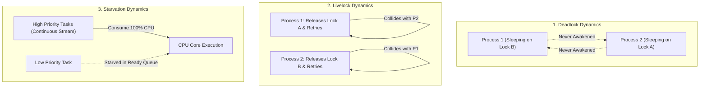
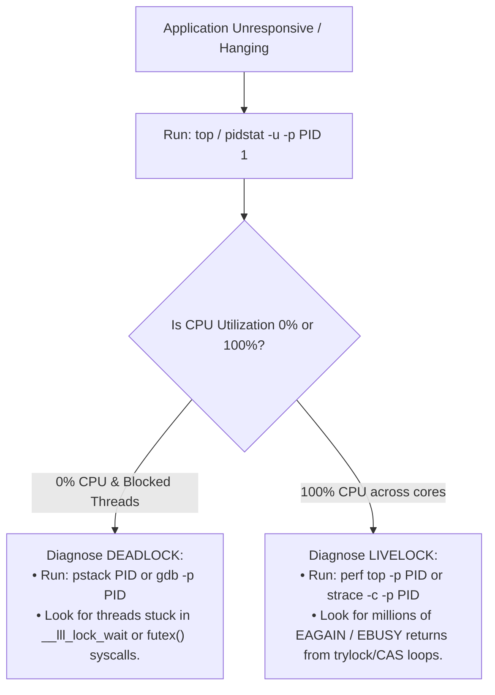

# Deadlock vs Livelock vs Starvation

> [!abstract] Mental Model
> Consider three distinct failure scenarios when two people meet in a narrow hallway:
> 1. **Deadlock**: Both bump into each other, freeze completely, and refuse to step aside. **($0\%$ Movement, $0\%$ Progress, $0\%$ CPU Utilization)**.
> 2. **Livelock**: Both politely try to let the other pass. Person A steps left while Person B steps right (still blocking). Both instantly step the other way in perfect synchronization, dancing back and forth indefinitely. **($100\%$ Frenetic Movement, $0\%$ Progress, $100\%$ CPU Utilization)**.
> 3. **Starvation**: A polite person waits for the corridor to clear, but an endless stream of VIPs continuously cut ahead in line, leaving the person waiting forever. **(Other processes make progress, but one is unfairly denied execution)**.

---

## Architectural Comparison Matrix

| Dimension | Deadlock | Livelock | Starvation |
| :--- | :--- | :--- | :--- |
| **Process State** | **`BLOCKED` / `WAITING`** (Sleeping in kernel `TASK_UNINTERRUPTIBLE`). | **`RUNNING`** (Actively executing instructions in userspace/kernel loops). | **`READY`** (Runnable, sitting unpicked in the Scheduler Ready Queue). |
| **CPU Utilization** | **$0\%$ CPU** (Threads consume zero processor cycles). | **$100\%$ CPU Spike** per core (Burning cycles in busy-wait/retry loops). | **Normal / Variable CPU** (CPUs are busy running higher-priority tasks). |
| **System State** | **Permanently Frozen** (No state mutations occur). | **Continuously Mutating** (States change rapidly, but no forward progress). | **Forward Progress Occurs** (System as a whole makes progress; one task starved). |
| **Root Cause** | Circular Wait dependency with mutual exclusion. | Symmetric reactive collision recovery without phase jitter. | Unfair scheduling algorithms or greedy resource prioritization. |
| **Primary Cure** | Lock ordering, timeout preemption, deadlock detection aborts. | **Randomized Exponential Backoff + Jitter**. | **Priority Aging ($P_{\text{dyn}} = P_{\text{base}} - k \cdot T_{\text{wait}}$)**, FIFO Queues. |

---

## Behavioral State Flow Comparison



---

## Deep Dive: Livelock in Production Systems

Livelock typically occurs when developers attempt to prevent deadlock using non-blocking primitives (`pthread_mutex_trylock` or atomic CAS) **without introducing asymmetry or random delay**:

```c
// VULNERABLE LIVELOCK CODE (Deterministic Lockstep Collision):
void* transaction_worker(void* arg) {
    while (1) {
        pthread_mutex_lock(&lock_A);
        
        // Attempt to grab second lock non-blockingly
        if (pthread_mutex_trylock(&lock_B) != 0) {
            // Back off to prevent deadlock!
            pthread_mutex_unlock(&lock_A);
            
            // BUG: Both threads sleep for EXACT SAME duration!
            usleep(1000); 
            continue; // Collide again in the next iteration!
        }
        
        // Critical Section
        do_work();
        pthread_mutex_unlock(&lock_B);
        pthread_mutex_unlock(&lock_A);
        break;
    }
    return NULL;
}
```

---

### The Production Remedy: Randomized Exponential Backoff with Jitter
Inspired by the Ethernet CSMA/CD protocol and AWS Architecture standards:

```c
// ROBUST LIVELOCK DEFENSE:
int attempt = 0;
while (1) {
    pthread_mutex_lock(&lock_A);
    if (pthread_mutex_trylock(&lock_B) == 0) {
        do_work();
        pthread_mutex_unlock(&lock_B);
        pthread_mutex_unlock(&lock_A);
        break;
    }
    pthread_mutex_unlock(&lock_A);
    
    // Calculate exponential delay with randomized jitter:
    int base_delay_us = 1000 * (1 << attempt); // Exponential: 1ms, 2ms, 4ms...
    int jitter = rand() % 500;                 // 0-500us random noise
    usleep(base_delay_us + jitter);
    
    if (attempt < 10) attempt++;
}
```

---

## Production Diagnostics & CLI Profiling

How can a systems engineer distinguish between Deadlock, Livelock, and Starvation in Linux production servers?



### CLI Diagnostic Commands:
```bash
# 1. Inspect Thread States (D = Uninterruptible Deadlock, R = Running Livelock)
ps -eLo pid,tid,class,rtprio,stat,comm | grep my_app

# 2. Check Syscall Activity (Livelock shows infinite retry syscalls; Deadlock shows 0)
strace -c -p <PID>

# 3. Dump Stack Traces across all threads to identify deadlock lock cycles
pstack <PID>
```

---

## Active Recall & Interview Perspective

### Reasoning Prompts
1. *Why does Livelock burn $100\%$ CPU while Deadlock consumes $0\%$ CPU?*
   - **Answer**: In a Deadlock, threads are blocked on synchronization primitives (`futex`, `mutex_lock`) and put to sleep by the kernel scheduler (`TASK_UNINTERRUPTIBLE`), removing them from the CPU runqueue and consuming $0\%$ CPU. In a Livelock, threads actively execute userspace loops (e.g., calling `trylock`, failing, releasing previously held locks, and retrying); because they never yield the CPU or enter a kernel wait queue, they spin continuously at $100\%$ core utilization.
2. *How does adding random "Jitter" to backoff algorithms break Livelocks?*
   - **Answer**: Livelock persists because multiple competing threads execute identical deterministic retry logic in exact lockstep synchronization. By introducing a randomized time offset (jitter), one thread sleeps slightly longer than the other, breaking the temporal symmetry. The earlier-waking thread acquires all necessary locks and completes its work before the delayed thread wakes up, permanently resolving the collision loop.
3. *Can Starvation occur in a system that is completely free of Deadlocks and Livelocks?*
   - **Answer**: Yes. A system can be completely free of deadlocks and livelocks (e.g., using standard Priority Scheduling or Read-Preferring RWLocks) while still causing severe starvation. If high-priority tasks or shared read locks arrive at a rate faster than they can be drained, a lower-priority task or waiting writer will sit in the ready queue indefinitely without ever being scheduled.

---

## Key Takeaways
- **Deadlock**: Threads sleep in `BLOCKED` state ($0\%$ CPU), waiting for a circular resource cycle.
- **Livelock**: Threads run in `RUNNING` state ($100\%$ CPU), endlessly colliding in symmetric retry loops; resolved via **Exponential Backoff with Random Jitter**.
- **Starvation**: Runnable threads in `READY` state are unfairly bypassed by greedy or high-priority tasks; resolved via **Dynamic Priority Aging**.

---

## Related Notes
- [[Operating System]] — Concurrency failure taxonomy.
- [[Process States and Lifecycle]] — `BLOCKED` vs `RUNNING` vs `READY`.
- [[Priority Scheduling and Aging]] — Starvation prevention via linear aging.
- [[Producer-Consumer Pattern - Bounded Queues and Condition Variables]] — Blocking vs non-blocking (`trylock`) mechanics.
- [[Deadlock Fundamentals and Coffman Conditions]] — Theoretical criteria for deadlock.
- [[Resource Allocation Graph]] — Graph cycle analysis.
- [[Deadlock Prevention Strategies]] — Breaking Coffman conditions.
- [[Deadlock Detection and Recovery]] — Detection and victim selection.
- [[Reader-Writer Problem and RWLocks]] — Reader vs writer starvation patterns.
- [[Operating Systems MOC]] — Master table of contents for Operating Systems.
