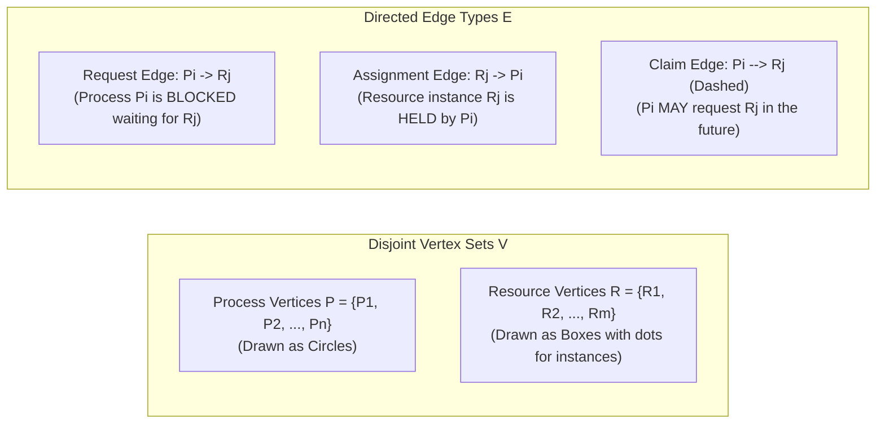
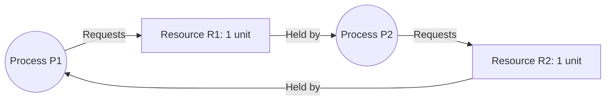
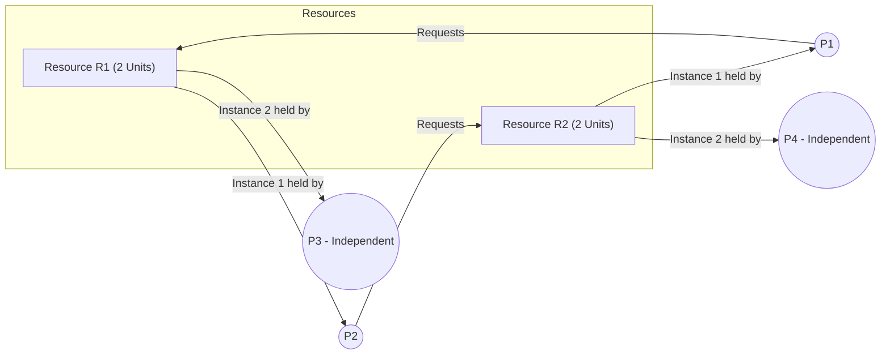
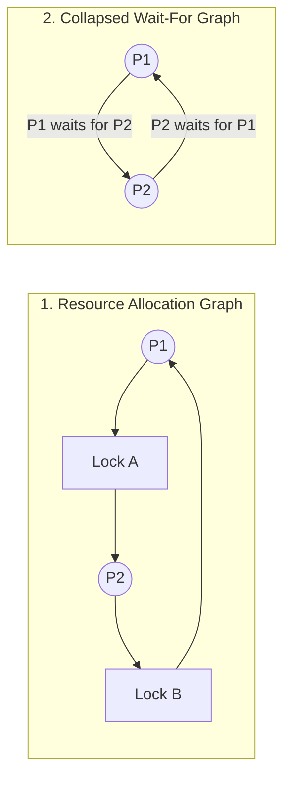

# Resource Allocation Graph (RAG)

> [!abstract] Mental Model
> A **Resource Allocation Graph (RAG)** is a **directed visual debt ledger**: processes (circles) and physical/logical resources (rectangles) form a map of system dependencies. 
> - Arrows pointing **from a process to a resource** represent unfulfilled requests (waiting lines).
> - Arrows pointing **from a resource to a process** represent active ownership (locks held).
> - If these arrows form an **unbreakable closed cycle**, the system has reached gridlock.

---

## Graph Taxonomy & Mathematical Definition

A Resource Allocation Graph is a directed bipartite graph $G = (V, E)$ partitioned into:



---

## The Fundamental Theorem: Cycles vs Deadlocks

```mermaid
flowchart TD
    CheckInstance{"How many instances exist per resource type?"}
    
    CheckInstance -->|Single-Instance Resources (1 dot per box)| SingleInstance["CYCLE <==> DEADLOCK<br/>• A directed cycle is BOTH NECESSARY and SUFFICIENT.<br/>• Every cycle is an immediate, permanent deadlock!"]
    
    CheckInstance -->|Multi-Instance Resources (Multiple dots per box)| MultiInstance["CYCLE is NECESSARY, but NOT SUFFICIENT!<br/>• A cycle MAY or MAY NOT be deadlocked.<br/>• Must be verified via the Graph Reduction Algorithm!"]
```

---

## Case Study 1: Single-Instance Deadlock Cycle



- **Cycle Path**: $P_1 \to R_1 \to P_2 \to R_2 \to P_1$.
- **Result**: Because $R_1$ and $R_2$ each possess only a single instance, $P_1$ and $P_2$ are **strictly deadlocked**.

---

## Case Study 2: Multi-Instance Cycle with NO Deadlock



- **Analysis**: A closed cycle exists between $\{P_1, R_1, P_2, R_2, P_1\}$.
- **Why this is NOT Deadlocked**:
  1. Process $P_3$ holds an instance of $R_1$ but is **not waiting for anything**.
  2. When $P_3$ finishes, it releases its instance of $R_1$.
  3. The released $R_1$ instance is allocated to $P_1$, fulfilling $P_1$'s request!
  4. $P_1$ runs to completion, releases $R_2$, which is then allocated to $P_2$.
  5. **All processes complete successfully!**

---

## The Graph Reduction Algorithm

To deterministically verify whether a multi-instance RAG is in deadlock, the OS executes **Graph Reduction**:

```mermaid
flowchart TD
    Step1["1. Find a Process Pi whose resource requests can be satisfied<br/>by currently unallocated available resources."]
    
    Check{"Can any such Pi be found?"}
    Step1 --> Check
    
    Check -->|YES| Reduce["2. REDUCE Pi:<br/>• Erase all request edges from Pi.<br/>• Erase all assignment edges to Pi.<br/>• Add Pi's held resources back to Available pool!"]
    Reduce --> Step1
    
    Check -->|NO (No more reductions possible)| FinalEval{"Are all edges completely erased?"}
    
    FinalEval -->|YES| Safe["SYSTEM IS DEADLOCK-FREE<br/>(Graph is completely reducible)"]
    FinalEval -->|NO| Deadlocked["SYSTEM IS IN DEADLOCK!<br/>(Remaining unreduced processes form Deadlocked Set)"]
```

---

## The Wait-For Graph (WFG) Optimization

In systems where all resource types have **strictly one instance** (such as database row locks or mutual exclusion semaphores), resource boxes can be collapsed into a **Wait-For Graph (WFG)**:



### Algorithmic Verification:
- The database engine runs **Tarjan's or Kosaraju's Strongly Connected Components (SCC)** cycle detection algorithm on the WFG.
- **Time Complexity**: **$O(V + E)$** where $V = |P|$ and $E = |\text{Wait Edges}|$.

---

## Active Recall & Interview Perspective

### Reasoning Prompts
1. *Under what exact mathematical condition is a cycle in a Resource Allocation Graph guaranteed to be a deadlock?*
   - **Answer**: A cycle in a Resource Allocation Graph is guaranteed to be a deadlock **if and only if every resource type involved in the cycle has exactly one instance**. If any resource type in the cycle has two or more instances, a cycle is merely a necessary condition, and the graph must be evaluated using the Graph Reduction Algorithm to verify whether external non-cycle processes can release instances to break the cycle.
2. *What is a Claim Edge in a Resource Allocation Graph and how is it utilized?*
   - **Answer**: A Claim Edge (drawn as a dashed directed edge $P_i \dashrightarrow R_j$) indicates that process $P_i$ may request resource $R_j$ at some future point during its execution lifecycle. It is used in **Deadlock Avoidance algorithms**: before granting a request, the system converts the claim edge to a request edge and tests whether assigning the resource would introduce a cycle. If a cycle would form, the allocation is denied to keep the system in a safe state.
3. *How does an RDBMS use the Wait-For Graph to recover from transaction deadlocks?*
   - **Answer**: An RDBMS continuously constructs a Wait-For Graph from active transaction lock queues. When a background cycle-detection check finds a directed cycle ($T_1 \to T_2 \to T_1$), it identifies that a deadlock has occurred. It then evaluates a cost metric across the cycle (e.g., number of lock rows modified, CPU time spent), **aborts the lowest-cost "victim" transaction**, rolls back its changes, and releases its locks, allowing the remaining transactions in the cycle to proceed.

---

## Key Takeaways
- The **Resource Allocation Graph (RAG)** models processes, resources, requests, and assignments as a directed bipartite graph.
- **In single-instance systems, Cycle $\iff$ Deadlock**; in multi-instance systems, cycles must be tested via **Graph Reduction**.
- Single-instance systems optimize deadlock detection by collapsing RAGs into **Wait-For Graphs (WFG)** with $O(V + E)$ cycle detection.

---

## Related Notes
- [[Operating System]] — Resource modeling.
- [[Process States and Lifecycle]] — Waiting states.
- [[Critical Section Problem]] — Lock dependencies.
- [[Producer-Consumer Pattern - Bounded Queues and Condition Variables]] — Single-instance resources.
- [[Deadlock Fundamentals and Coffman Conditions]] — The theoretical conditions RAGs visualize.
- [[Deadlock Prevention Strategies]] — Graph design to prevent cycles.
- [[Deadlock Avoidance and Banker's Algorithm]] — State safety checking with claim edges.
- [[Deadlock Detection and Recovery]] — Detection algorithms on graphs.
- [[Operating Systems MOC]] — Master table of contents for Operating Systems.
