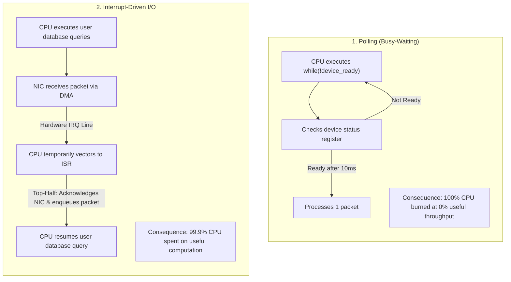
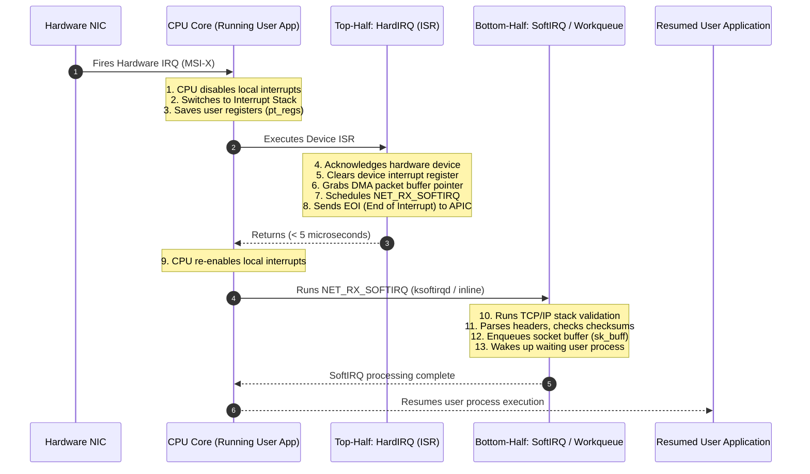
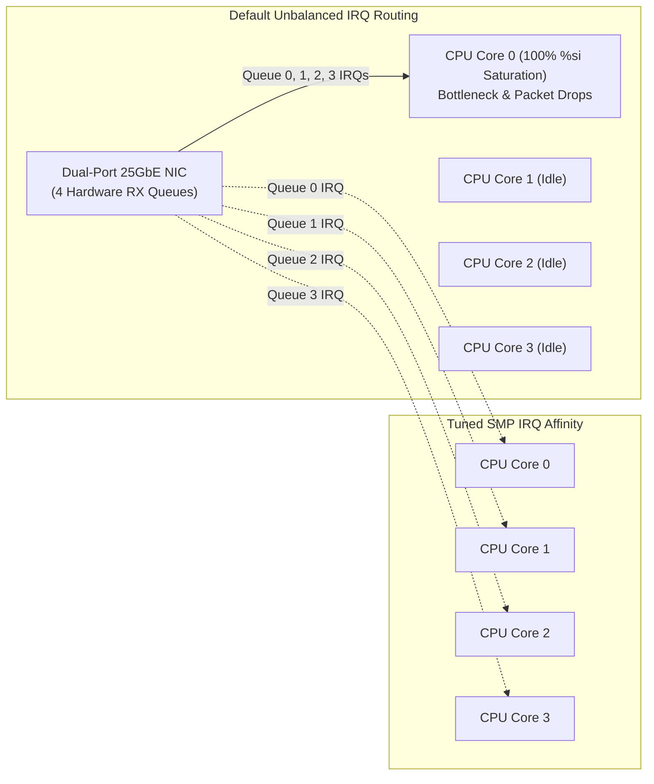

# Interrupts and Interrupt Handling

> [!abstract] Mental Model
> An Interrupt is the **hardware doorbell and emergency dispatch mechanism** of a computer. Instead of the CPU continuously polling slow physical devices in a busy-wait loop ("Do you have data yet? Do you have data yet?"), physical devices emit an electrical voltage change across an interrupt line (or send a PCIe Message Signaled Interrupt). The CPU silicon immediately pauses its current instruction pipeline, saves its execution context, and vectors to a dedicated kernel handler function before resuming the interrupted workload.

---

## Why This Exists: Polling vs Interrupt-Driven I/O



| Dimension | Polling | Interrupt-Driven I/O |
| :--- | :--- | :--- |
| **CPU Utilization** | Wasted (100% CPU busy-waiting on slow I/O registers). | High (CPU executes user code until notified by hardware). |
| **Response Latency** | Instantaneous if CPU is currently in poll loop; terrible if CPU is multiplexing tasks. | Deterministic hardware-driven response (~few hundred nanoseconds). |
| **Ideal Use Case** | Ultra-high throughput where data arrival is continuous (e.g., DPDK / 100GbE NICs). | General-purpose computing with bursty, unpredictable events (disk, keyboard, network). |

---

## Hardware Architecture: IDT, IRQs, and APIC

Modern multi-core systems route hardware signals through the **APIC (Advanced Programmable Interrupt Controller)** into the **Interrupt Descriptor Table (IDT)**:

```text
Physical Device (NIC / NVMe / Timer)
       |
       | (PCIe MSI-X Message / Electrical Pin)
       v
[ I/O APIC (Motherboard Chipset) ]
       |
       | Routes interrupt to target CPU Core based on smp_affinity
       v
[ Local APIC (Per CPU Core) ]
       |
       | Triggers CPU Hardware Interrupt Vector (e.g., Vector 33)
       v
[ IDT: Interrupt Descriptor Table (256 Entries in Kernel RAM) ]
+--------+-------------------------------------------------------+
| Vector | Description / Handler Gate                            |
+--------+-------------------------------------------------------+
| 0..31  | CPU Exceptions & Traps (0: #DE, 14: #PF Page Fault)  |
| 32..255| User-Defined Hardware & Software Interrupt Vectors    |
|        | (e.g., Vector 33 -> NIC Driver ISR, Vector 128: Legacy)|
+--------+-------------------------------------------------------+
       |
       v
[ Interrupt Service Routine (ISR) / Top-Half Handler in Kernel ]
```

### The IDT (Interrupt Descriptor Table)
In x86-64 long mode, the IDT contains **256 16-byte gate descriptors**. The CPU finds the IDT in memory using the `IDTR` (IDT Register), which is loaded at boot time by the kernel using the privileged `LIDT` instruction.

---

## The Linux Two-Half Interrupt Model

Handling a hardware interrupt directly inside an ISR with interrupts disabled creates a severe dilemma:
- If the ISR runs too long (e.g., parsing TCP headers or allocating memory), the CPU **drops subsequent hardware interrupts**, causing clock drift and packet loss.
- If the ISR returns too quickly, the packet data is not processed.

To solve this, modern kernels split interrupt handling into **Top-Half (HardIRQ)** and **Bottom-Half (SoftIRQ / Workqueues)**:



---

## Bottom-Half Mechanisms Compared

Linux provides three distinct bottom-half mechanisms with different capabilities:

| Mechanism | Execution Context | Can Sleep / Block? | Concurrency | Primary Use Case |
| :--- | :--- | :--- | :--- | :--- |
| **Softirq** | Interrupt / Software context | **NO** (Must never sleep) | Can run concurrently on multiple CPUs simultaneously. | High-frequency, performance-critical subsystems: `NET_RX`, `NET_TX`, `TIMER_SOFTIRQ`, `RCU`. |
| **Tasklet** | Interrupt / Software context | **NO** (Must never sleep) | Strictly serialized: the same tasklet instance never runs on 2 CPUs simultaneously. | Legacy device drivers (largely deprecated in modern kernels). |
| **Workqueue** | **Process Context** (dedicated kernel thread `kworker`) | **YES** (Can sleep, acquire mutexes, perform disk/network I/O) | Managed by kernel thread pool across CPUs. | Heavy, non-urgent background operations (driver initialization, disk writes). |

---

## Production Networking: Interrupt Storms & NAPI (Hybrid Polling)

Under normal traffic (e.g., 5,000 packets/sec), interrupt-driven networking is efficient.
However, under massive load (e.g., a **DDoS attack or 40GbE line rate** with 10,000,000 packets/sec), the system suffers from **Receiver Livelock**:

```text
The Receiver Livelock Problem:
Every packet triggers a Top-Half HardIRQ.
HardIRQs preempt SoftIRQs.
The CPU spends 100% of its cycles merely acknowledging incoming interrupts.
No CPU cycles remain to execute the SoftIRQ (TCP stack) or user-space application.
Result: 100% CPU utilization, but 100% of all packets are dropped!
```

### The Solution: Linux NAPI (New API) Hybrid Polling
1. When the first packet arrives, the NIC fires a hardware interrupt.
2. The Top-Half ISR **disables interrupts on the NIC** and schedules the `NET_RX_SOFTIRQ`.
3. The kernel transitions to **polling mode**: it loops over the NIC's ring buffer, processing a batch of up to 64 packets (`weight`).
4. Once the NIC ring buffer is drained empty, the kernel **re-enables NIC interrupts**.

This hybrid model gives instant response at low traffic and zero interrupt overhead at high load.

---

## SMP IRQ Affinity & CPU Pinning

On multi-socket, multi-core NUMA servers, all hardware interrupts often default to **CPU 0**, causing CPU 0 to be pegged at 100% `%si` (softirq) while all other 63 cores sit idle.



### Configuring IRQ Affinity in Production
```bash
# 1. Identify IRQ numbers for network interface eth0
grep eth0 /proc/interrupts
# Example: IRQ 45, 46, 47, 48

# 2. Pin IRQ 45 to CPU core 0 (Hex bitmask 0x1 = 0001b)
echo 1 | sudo tee /proc/irq/45/smp_affinity

# 3. Pin IRQ 46 to CPU core 1 (Hex bitmask 0x2 = 0010b)
echo 2 | sudo tee /proc/irq/46/smp_affinity
```

---

## Production Diagnostics & Observability Commands

```bash
# 1. View live hardware interrupt counts across all CPU cores
watch -n 1 'cat /proc/interrupts | head -n 30'

# 2. Inspect softirq activity (tracking NET_RX, TIMER, RCU load)
cat /proc/softirqs

# 3. Monitor hardware vs software interrupt CPU consumption in real time
top
# Look at:
#   %hi : Percentage of CPU time spent in Hardware Interrupts (Top-Half)
#   %si : Percentage of CPU time spent in Software Interrupts (Bottom-Half)

# 4. Detailed per-CPU softirq statistics using mpstat
mpstat -I SCPU 1 5
```

---

## Failure Modes & Edge Cases

| Failure Mode | Root Cause | Symptoms | Mitigation |
| :--- | :--- | :--- | :--- |
| **Sleeping in ISR** | Top-Half handler invoked a blocking mutex, `schedule()`, or `kmalloc(GFP_KERNEL)`. | Immediate **Kernel Panic**: `BUG: scheduling while atomic`. | Only use spinlocks with IRQs disabled (`spin_lock_irqsave`), defer work to workqueues. |
| **Softirq CPU Starvation (`ksoftirqd` 100%)** | Enormous network traffic or misconfigured driver saturating softirq processing. | High packet drop rate, user threads starved, `ksoftirqd/X` taking 100% CPU. | Enable NAPI, distribute IRQs across cores (`smp_affinity`), use Receive Side Scaling (RSS). |
| **Spurious / Unhandled Interrupt** | Faulty hardware or unacknowledged IRQ line asserting continuously. | `dmesg` warning: `irq XX: nobody cared (try booting with irqpoll)`. Kernel disables IRQ. | Replace failing hardware; check device driver initialization. |

---

## Active Recall & Interview Perspective

### Reasoning Prompts
1. *Why is an interrupt handler divided into a Top Half and a Bottom Half?*
   - **Answer**: The Top Half runs with hardware interrupts disabled on the local core. To prevent missing subsequent hardware signals, it must execute in microseconds—only acknowledging the device and saving buffer pointers. Heavy computation (checksum validation, TCP stack routing) is deferred to the Bottom Half, which runs with interrupts enabled.
2. *Can an ISR (Top-Half handler) call `mutex_lock()`? Why or why not?*
   - **Answer**: No. An ISR runs in **Interrupt Context**, which has no backing `task_struct` to suspend or put on a wait queue. If `mutex_lock()` were to block because the lock is held, the kernel would attempt to context switch with no process to switch from, resulting in an instant **Kernel Panic**. ISRs must use non-blocking spinlocks (`spin_lock_irqsave`).
3. *What is Receiver Livelock in high-throughput network servers?*
   - **Answer**: A state where the rate of incoming network packets is so overwhelming that the CPU spends 100% of its cycles servicing hardware interrupts (Top Halves). Because Top Halves preempt everything else, the kernel never gets CPU time to execute the SoftIRQs or user applications to actually process the packets. Linux solves this with **NAPI**, switching from interrupts to polling under high packet rates.

---

## Key Takeaways
- Interrupts replace wasteful CPU polling by allowing hardware devices to signal the CPU **asynchronously via the APIC and IDT**.
- Linux uses a **two-half model**: Top-Half (fast, non-blocking HardIRQ) and Bottom-Half (SoftIRQ, Tasklet, Workqueue).
- High-performance production servers require **SMP IRQ Affinity tuning** and **NAPI hybrid polling** to prevent interrupt storms and receiver livelock.

---

## Related Notes
- [[Operating System]] — Resource multiplexing and hardware control.
- [[Kernel]] — Kernel execution contexts (Process vs Interrupt Context).
- [[Privilege Rings and CPU Modes]] — Hardware privilege transitions.
- [[System Calls]] — Synchronous software requests to the kernel.
- [[Traps and Exceptions]] — Synchronous processor-generated events.
- [[Direct Memory Access - DMA]] — How devices transfer data to RAM before firing an interrupt.
- [[Operating Systems MOC]] — Master table of contents for Operating Systems.
