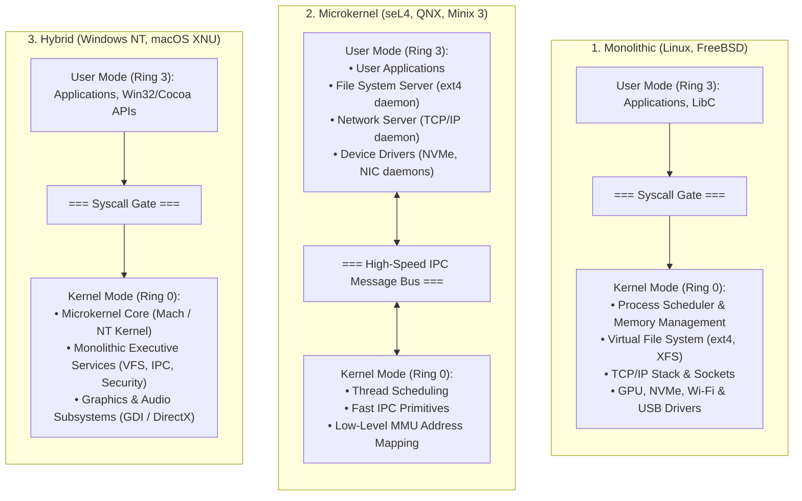

# Kernel Architecture: Monolithic vs Microkernel vs Hybrid

> [!abstract] Mental Model
> The fundamental dilemma of kernel design is **Performance through Shared Address Space** versus **Reliability through Hardware Isolation**. 
> - A **Monolithic Kernel** puts everything in the same privileged room (Ring 0): blazing fast function calls, but a single clumsy guest (a buggy driver) can burn the whole house down.
> - A **Microkernel** gives every subsystem its own locked, isolated room (User Mode): if a driver catches fire, only that room is affected, but passing messages between rooms requires expensive border checks.
> - A **Hybrid Kernel** keeps the rooms modular but puts them back in the same building to avoid border tolls.

---

## Architectural Comparison Matrix



---

## The 5 Major Kernel Archetypes

### 1. Monolithic Kernels (Linux, FreeBSD, OpenBSD, Solaris)
In a monolithic kernel, the entire operating system executes as a single large binary in [[Privilege Rings and CPU Modes|Ring 0]].
- **Communication**: Subsystems communicate via **direct C function calls** and shared in-memory data structures (`struct task_struct`, `struct inode`).
- **Advantages**:
  - **Peak Performance**: Zero IPC serialization overhead, zero privilege mode switching between OS subsystems.
  - **Memory Efficiency**: Single shared buffer pool and page cache across VFS, networking, and memory allocators.
- **Disadvantages**:
  - **Fragile Blast Radius**: A NULL pointer dereference or memory leak in a third-party peripheral driver (e.g., a webcam or Wi-Fi driver) triggers an instant **Kernel Panic / BSOD**.
  - **Massive Attack Surface**: Millions of lines of C code running with unrestricted hardware privileges (Linux $\approx 35\text{M}+$ LOC).

---

### 2. Microkernels (seL4, QNX Neutrino, Minix 3, Mach)
A microkernel adheres to the **Principle of Least Privilege**: only mechanisms that strictly *require* Ring 0 privileges (low-level CPU scheduling, IPC, and primitive MMU page mapping) remain in the kernel.
- **Subsystem Architecture**: The File System, TCP/IP stack, and all Device Drivers run as **unprivileged user-space processes (daemons)** in Ring 3.
- **Advantages**:
  - **Fault Resilience / Self-Healing**: If the network driver crashes, the microkernel detects the process death and restarts the network daemon in milliseconds without restarting the machine.
  - **Formal Verification**: The **seL4 microkernel** is mathematically proven to be bug-free against its specification—proving the total absence of buffer overflows, null pointer dereferences, and privilege escalation vulnerabilities.
- **Disadvantages**:
  - **IPC Tax & Mode Switch Overhead**: Reading a file requires multiple user $\leftrightarrow$ kernel context switches: Application $\rightarrow$ Kernel $\rightarrow$ File System Server $\rightarrow$ Kernel $\rightarrow$ Disk Driver $\rightarrow$ Kernel $\rightarrow$ Application.

---

### 3. Hybrid Kernels (Windows NT, macOS XNU / Darwin)
Hybrid kernels adopt the modular layered design of microkernels (separating executive services into discrete modules), but run those services **inside Ring 0** to eliminate IPC context switches.
- **Windows NT Architecture**: The *NT Kernel* (low-level scheduling/sync) is wrapped by the *NT Executive* (Memory Manager, Object Manager, Security Reference Monitor, I/O Manager), with graphics rendering (`win32k.sys`) moved into Ring 0 for rendering throughput.
- **macOS XNU**: Combines the **Mach microkernel** (IPC, scheduling, virtual memory) with **FreeBSD** (POSIX API, VFS, networking stack) and the **IOKit** (C++ driver framework), all compiled into a single Ring 0 supervisor image.

---

### 4. Exokernels (MIT Aegis, Nemesis)
Exokernels eliminate OS abstractions entirely. 
- Traditional kernels abstract physical disk sectors into files and physical RAM into page tables.
- An Exokernel provides **zero abstractions** in Ring 0; it only enforces **safe hardware allocation and partitioning** (e.g., "Process A owns disk blocks 1000..5000 and physical pages 0x200..0x400").
- Applications link against a **Library Operating System (LibOS)** that implements custom file systems or network protocols tuned specifically to that application's performance profile.

---

### 5. Unikernels / Library OS (MirageOS, OSv, IncludeOS)
Designed for cloud-native virtualization and serverless functions:
- Compiles the application code and only the exact OS libraries it needs (e.g., a minimal TCP stack and disk driver) into a **single, specialized bootable binary**.
- The binary runs directly on a Type 1 Hypervisor (KVM/Xen) in Ring 0 with **no user/kernel separation**.
- **Metrics**: Boot time in $<10\text{ ms}$, total disk image size $<5\text{ MB}$, and zero system call overhead.

```text
Summary of Architectural Paradigms:
+-------------------------------------------------------------------------------+
| Archetype    | Ring 0 Footprint      | Communication Between OS Subsystems    |
+-------------------------------------------------------------------------------+
| Monolithic   | Everything (OS + Dev) | Direct C Function Calls (In-Memory)    |
| Microkernel  | Minimal (<10k LOC)    | Synchronous / Asynchronous IPC (Ring 3)|
| Hybrid       | Modular in Ring 0     | Internal Function Calls / Mach Messages|
| Exokernel    | Hardware Slicing Only | Library OS in User Space               |
| Unikernel    | Entire App + OS Libs  | Single Address Space (Zero Mode Switch)|
+-------------------------------------------------------------------------------+
```

---

## The Historical Tanenbaum-Torvalds Debate (1992) & Modern Reality

In 1992, Prof. Andrew Tanenbaum (creator of MINIX) posted a famous critique titled *"Linux is obsolete"*, arguing that monolithic kernels were a major step backward and microkernels were the future.

```text
The Debate:
Tanenbaum: "Microkernels represent modern software engineering. Modularity and
           fault isolation make monolithic kernels obsolete."
Torvalds:  "From a theoretical point of view, microkernels are nice. From a practical
           engineering point of view, IPC performance penalties and cache thrashing
           make them uncompetitive for real-world operating systems."
```

### Where Each Archetype Dominates in Modern Production:
1. **Cloud & Enterprise Servers**: **Monolithic (Linux)** won completely due to raw I/O throughput, low latency, and zero IPC overhead.
2. **Safety-Critical Real-Time Systems**: **Microkernels (QNX, seL4, VxWorks)** dominate avionics (Boeing, Airbus), space exploration (NASA Mars Rovers), automotive infotainment/ADAS (Tesla, BMW, Audi), and medical life-support systems where a driver crash must never halt the system.
3. **Hardware Security Coprocessors**: **Microkernels** run inside hardware security chips (Apple's Secure Enclave OS, Google Titan M chip).
4. **Desktop & Workstation OS**: **Hybrid (Windows NT, macOS XNU)** dominates consumer desktop computing.

---

## Detailed Performance Analysis: The Microkernel IPC Bottleneck

Why is a pure microkernel slower on standard I/O workloads?

```text
Trace of a Simple "read(fd, buf, 4096)" Operation:

In a Monolithic Kernel (Linux):
1. User App calls read() -> SYSCALL (Mode switch to Ring 0)
2. sys_read() calls vfs_read() -> ext4_read() -> nvme_submit_cmd() (Direct C calls)
3. NVMe transfers data via DMA
4. copy_to_user() -> SYSRET (Mode switch back to Ring 3)
Total Transitions: 2 (1 into Ring 0, 1 out of Ring 0).

In a Pure Microkernel:
1. User App sends IPC message to VFS Server -> Traps to Microkernel
2. Microkernel context switches to VFS Server process in Ring 3
3. VFS Server resolves file path, sends IPC to NVMe Driver Server -> Traps to Microkernel
4. Microkernel context switches to NVMe Driver Server process in Ring 3
5. NVMe Driver issues hardware I/O, waits for interrupt -> Traps to Microkernel
6. Microkernel receives interrupt, wakes NVMe Driver Server
7. NVMe Driver sends response IPC to VFS Server -> Traps to Microkernel
8. Microkernel context switches to VFS Server
9. VFS Server sends response IPC to User App -> Traps to Microkernel
10. Microkernel context switches back to User App
Total Transitions: 8+ Context Switches & Mode Transitions!
```

---

## Active Recall & Interview Perspective

### Reasoning Prompts
1. *Why can a bug in an audio driver crash a Linux server, but not a QNX-based car dashboard?*
   - **Answer**: In Linux (Monolithic), device drivers run inside privileged Ring 0 with full memory access; a crash or illegal pointer dereference triggers a kernel panic that halts the entire machine. In QNX (Microkernel), the audio driver runs as an unprivileged user-space daemon in Ring 3. If it crashes, the microkernel catches the process exit and restarts the audio daemon seamlessly while the core operating system and critical dashboard systems continue running uninterrupted.
2. *How does a Unikernel achieve sub-10 millisecond boot times and zero mode switch overhead?*
   - **Answer**: A Unikernel eliminates the distinction between User Space and Kernel Space. The application is compiled directly against lightweight OS libraries into a single flat binary image that boots directly on a virtualized hypervisor. Because there are no multiple processes, no user/kernel privilege rings, and no unused background daemons, boot time is nearly instantaneous and every function call is a direct in-memory call without `SYSCALL` mode switching.
3. *What is the architectural compromise made by Windows NT and macOS XNU?*
   - **Answer**: They use a **Hybrid Kernel** design. They organize OS subsystems into clean, modular microkernel-style abstractions, but compile the Executive services, File Systems, and display drivers into Ring 0 to achieve the high execution speed of monolithic systems without paying the severe IPC context-switching tax of pure microkernels.

---

## Key Takeaways
- **Monolithic Kernels (Linux)** maximize performance by running all services in Ring 0, sacrificing driver fault isolation.
- **Microkernels (seL4, QNX)** maximize security and fault resilience by moving drivers and file systems to isolated User Mode daemons, communicating via IPC.
- **Hybrid Kernels (Windows NT, macOS XNU)** balance modular design with Ring 0 execution performance.
- **Unikernels** strip away multi-tenancy and privilege rings entirely for specialized, ultra-fast cloud-native workloads.

---

## Related Notes
- [[Operating System]] — Global architecture.
- [[Kernel]] — Kernel subsystems and execution models.
- [[Privilege Rings and CPU Modes]] — Hardware protection levels.
- [[User Mode vs Kernel Mode]] — Privilege boundary analysis.
- [[Kernel Modules and Device Drivers]] — How monolithic kernels achieve runtime modularity.
- [[Inter-Process Communication - IPC]] — Mechanisms powering microkernel message buses.
- [[Operating Systems MOC]] — Master table of contents for Operating Systems.
