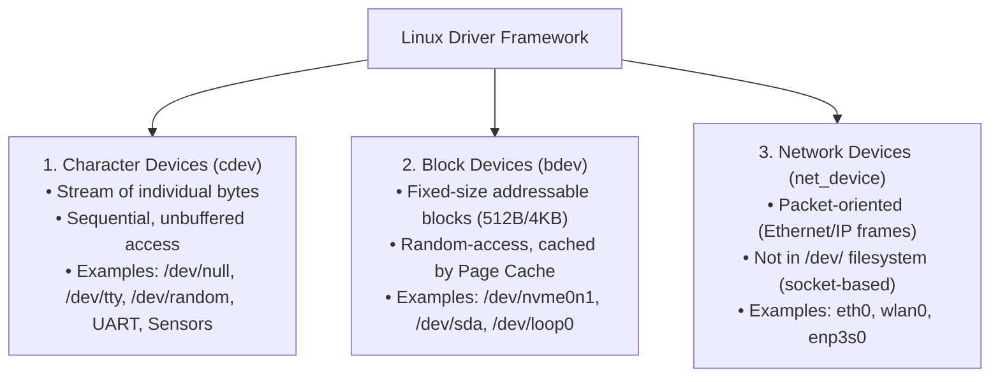
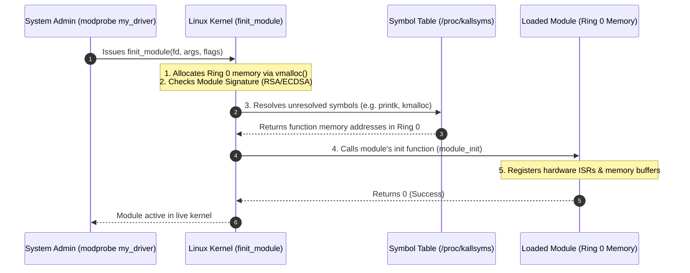

# Kernel Modules and Device Drivers

> [!abstract] Mental Model
> A **Loadable Kernel Module (LKM)** is a **hot-pluggable software component dynamically linked into the running kernel at runtime in [[Privilege Rings and CPU Modes|Ring 0]]**. Instead of recompiling and rebooting a massive monolithic kernel every time you plug in a new USB device, Wi-Fi card, or NVMe drive, the kernel dynamically loads `.ko` (Kernel Object) files into privileged memory, resolves symbols against the live kernel symbol table, and registers hardware handlers on the fly.

---

## Why LKMs Exist

If a monolithic operating system did not support dynamic modularity:
1. **Bloated Memory Footprint**: The static kernel binary (`vmlinux`) would have to bundle millions of device drivers for every possible GPU, NIC, RAID controller, and sensor on earth, consuming gigabytes of unswappable physical RAM.
2. **Slow Development & Patching Cycle**: Adding a driver or tuning a filesystem would require a full kernel recompile and system reboot.
3. **Hardware Hot-Plugging Impossibility**: Connecting a new USB device or Thunderbolt dock at runtime would be unsupported.

LKMs grant monolithic kernels the **extensibility of microkernels while retaining the raw bare-metal execution performance of Ring 0**.

---

## The Three Fundamental Device Driver Classes

In Unix/Linux, all hardware device drivers conform to one of three standardized subsystem abstractions:



---

## Architectural Comparison of Driver Classes

| Feature | Character Device (`cdev`) | Block Device (`bdev`) | Network Device (`net_device`) |
| :--- | :--- | :--- | :--- |
| **Data Unit** | Stream of continuous bytes | Fixed-size blocks (sectors/pages) | Discrete packets / frames |
| **Filesystem Node** | Present in `/dev` (e.g., `crw-rw-rw-`) | Present in `/dev` (e.g., `brw-rw----`) | **None in `/dev`** (accessed via sockets) |
| **Caching Layer** | Direct unbuffered transfer | Managed by OS **Page Cache & Buffer Cache** | Kernel socket buffers (`sk_buff` queues) |
| **Primary Interface** | `struct file_operations` (`read`, `write`, `ioctl`) | `struct block_device_operations` + Request Queue | `struct net_device_ops` (`ndo_start_xmit`) |
| **Access Pattern** | Sequential / streaming | Random access by sector index | Asynchronous send / receive |

---

## Anatomy of a Kernel Module (`.ko`)

A minimal, production-style Linux Kernel Module in C:

```c
#include <linux/init.h>      // Macros for module initialization
#include <linux/module.h>    // Core header for loading LKMs
#include <linux/kernel.h>    // KERN_INFO logging macros

MODULE_LICENSE("GPL");
MODULE_AUTHOR("Senior Systems Engineer");
MODULE_DESCRIPTION("Production High-Throughput Packet Filter Driver");
MODULE_VERSION("1.0");

// 1. Module Initialization: Executed during 'insmod' or 'modprobe'
static int __init packet_filter_init(void) {
    pr_info("packet_filter: Driver initialized in Ring 0.\n");
    // Register character device, allocate buffers, hook interrupts
    return 0; // 0 = Success; Negative value = Initialization failure
}

// 2. Module Cleanup: Executed during 'rmmod'
static void __exit packet_filter_exit(void) {
    pr_info("packet_filter: Cleaning up resources and unregistering.\n");
    // Free allocated memory, unregister device, release IRQs
}

module_init(packet_filter_init);
module_exit(packet_filter_exit);
```

---

## Dynamic Symbol Resolution in Ring 0

When a user runs `modprobe my_driver`:
1. The kernel invokes the `finit_module()` system call.
2. The kernel verifies cryptographic signatures (if **UEFI Secure Boot** is active).
3. The kernel allocates contiguous virtual memory in Ring 0 using `vmalloc()`.
4. The kernel ELF loader resolves undefined symbols in the `.ko` binary against the **Kernel Symbol Table (`/proc/kallsyms`)**:
   - Symbols exported with `EXPORT_SYMBOL(func_name)` are dynamically linked.
   - Symbols exported with `EXPORT_SYMBOL_GPL()` are restricted strictly to GPL-compatible modules.



---

## Production Engineering: DKMS & Tainted Kernels

### 1. DKMS (Dynamic Kernel Module Support)
When an enterprise updates its Linux kernel (`apt upgrade linux-image-generic`), out-of-tree kernel modules (such as **NVIDIA GPU drivers, ZFS on Linux, or WireGuard**) will break because kernel internal ABIs change between versions.
- **DKMS** monitors kernel installations.
- Upon detecting a newly installed kernel, DKMS automatically invokes the C compiler, compiles the third-party driver against the new kernel headers, and installs the resulting `.ko` binary before the next reboot.

### 2. The Tainted Kernel Flag
When debugging production crashes, systems engineers inspect the **Kernel Taint State**:

```bash
# Check if kernel is tainted
cat /proc/sys/kernel/tainted
# 0 = Pristine uncorrupted kernel; Non-zero = Tainted flag bitmask
```

Common Taint Flags:
- **`P` (Proprietary)**: A proprietary closed-source module (e.g., NVIDIA binary driver) was loaded into Ring 0.
- **`O` (Out-of-tree)**: A module compiled outside the official Linux kernel tree was loaded.
- **`E` (Unsigned)**: An unsigned module was loaded in violation of Secure Boot policies.
- **`M` (Machine Check Exception)**: A hardware memory bit-flip occurred.

---

## Failure Modes & Debugging

| Failure Mode | Mechanism | Symptoms | Mitigation / Fix |
| :--- | :--- | :--- | :--- |
| **Panic in `module_init`** | Driver dereferences an invalid MMIO address or fails to acquire a resource during startup. | Host crashes during `modprobe` with register dump in `dmesg`. | Boot into single-user rescue mode; blacklist the offending module in `/etc/modprobe.d/blacklist.conf`. |
| **Module Unload Deadlock (`rmmod: Resource temporarily unavailable`)** | The module's reference count is $> 0$ (e.g., an open file descriptor or active socket holds a reference to the module). | `rmmod` or `modprobe -r` fails with `Device or resource busy`. | Identify holding processes with `lsof` or `fuser` on the device node; terminate holding processes first. |
| **Kernel Memory Leak in SLUB** | A driver calls `kmalloc()` on every packet/event but fails to call `kfree()` in error paths. | System RAM gradually decreases; `slabtop` shows ballooning SLUB allocations for driver structures. | Profile with `kmemleak` (Linux Kernel Memory Leak Detector). |

---

## Practical Diagnostics & Management Commands

```bash
# 1. List all currently loaded kernel modules, memory sizes, and reference counts
lsmod | head -n 15

# 2. View detailed metadata, dependencies, author, and parameters for a module
modinfo ext4

# 3. Load a module with all its dependencies automatically resolved
sudo modprobe nvme

# 4. Safely remove an idle module and its unused dependencies
sudo modprobe -r e1000e

# 5. Inspect live parameters exposed by a module in the sysfs hierarchy
ls -la /sys/module/tcp_cubic/parameters/

# 6. Blacklist a buggy or unstable kernel module from loading at boot
echo "blacklist nouveau" | sudo tee /etc/modprobe.d/blacklist-nouveau.conf
sudo update-initramfs -u
```

---

## Active Recall & Interview Perspective

### Reasoning Prompts
1. *What is the difference between `insmod` and `modprobe`?*
   - **Answer**: `insmod` is a low-level primitive command that only inserts a single, specified `.ko` file into the kernel without resolving dependencies. If that module depends on symbols from another module, `insmod` fails with an unresolved symbol error. `modprobe` parses the system module dependency index (`modules.dep` generated by `depmod`), automatically loading all required prerequisite modules in the correct dependency order before inserting the target module.
2. *Why is a crash in a device driver fatal to the entire Linux operating system?*
   - **Answer**: Because Linux is a **Monolithic Kernel**. Loadable Kernel Modules run in the same privileged **Ring 0** address space as the core scheduler and memory manager. When a driver encounters an unhandled exception or memory corruption bug, there is no hardware memory boundary protecting the rest of the kernel, forcing an immediate **Kernel Panic** to prevent silent data corruption.
3. *What is `EXPORT_SYMBOL_GPL` and why does it exist in the Linux kernel?*
   - **Answer**: It is a macro used by Linux kernel developers to export internal kernel functions and symbols *only* to kernel modules that declare a GPL-compatible license (`MODULE_LICENSE("GPL")`). It prevents proprietary closed-source commercial drivers from linking against deeply proprietary or specialized internal kernel subsystems without contributing code back under the GPL license.

---

## Key Takeaways
- Loadable Kernel Modules (**LKMs**) enable monolithic kernels to dynamically extend their functionality and support hardware without rebooting.
- Linux categorizes drivers into **Character Devices (`cdev`)**, **Block Devices (`bdev`)**, and **Network Devices (`net_device`)**.
- LKMs execute with **full Ring 0 privileges**; driver crashes compromise the entire operating system, necessitating strict DKMS rebuilds and UEFI signature verification.

---

## Related Notes
- [[Operating System]] — Global architecture and hardware multiplexing.
- [[Kernel]] — Kernel memory layout and execution contexts.
- [[Privilege Rings and CPU Modes]] — Ring 0 execution and hardware protections.
- [[Kernel Architecture - Monolithic vs Microkernel vs Hybrid]] — Architecture comparisons and fault isolation trade-offs.
- [[Interrupts and Interrupt Handling]] — How device drivers hook into top-half and bottom-half interrupt handlers.
- [[Operating Systems MOC]] — Master table of contents for Operating Systems.
