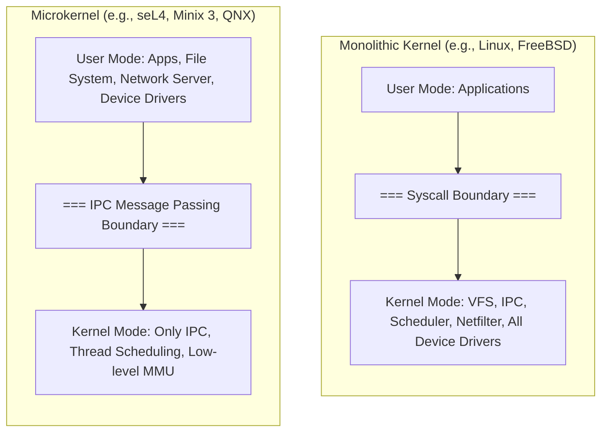

# Kernel

> [!abstract] Mental Model
> If the Operating System is the complete civil government (including utility libraries, shell binaries, daemons, and window managers), the **Kernel is the permanent, all-powerful central nervous system** residing in privileged hardware memory. It is the first software loaded into RAM at boot and the only layer with unrestricted authority to execute raw machine instructions, arbitrate hardware access, and manage the lifecycle of every running thread.

---

## Why This Exists

Applications cannot be permitted to manage raw hardware or negotiate resource distribution among themselves because:
1. **Selfish Allocation**: An application with a `while(true)` loop would starve all other applications if there were no central entity with hardware timer preemption authority.
2. **Security & Trust**: Untrusted code cannot be trusted to verify file permissions or prevent snooping on adjacent memory pages.
3. **Hardware Heterogeneity**: Software developers cannot write distinct code for thousands of different disk controllers, network chipsets, and motherboard layouts.

The Kernel exists as the **trusted, unbypassable intermediary** executing in hardware [[Privilege Rings and CPU Modes|Ring 0]] that controls all hardware registers, manages virtual memory translation tables, and provides standardized abstractions to user-space software.

---

## The Core Subsystems of a Kernel

A production-grade monolithic kernel (such as Linux) decomposes into six primary cooperating subsystems:

```mermaid
graph TB
    subgraph KernelSpace [Privileged Kernel Space (Ring 0)]
        direction TB
        
        SCI["System Call Interface (SCI)<br/>(sys_call_table, dispatch, argument validation)"]
        
        subgraph Subsystems [Core Subsystems]
            ProcessSub["Process & Thread Subsystem<br/>• CPU Scheduler (CFS/EEVDF)<br/>• IPC & Signals<br/>• Process Lifecycle (task_struct)"]
            
            MemorySub["Memory Management Subsystem<br/>• Buddy Allocator & SLAB/SLUB<br/>• Page Fault Handler & Virtual Memory<br/>• Page Cache & Swap Management"]
            
            VFSSub["Virtual File System (VFS)<br/>• Inode, Dentry, File abstraction<br/>• Filesystem drivers (ext4, XFS, Btrfs)<br/>• Buffer Cache"]
            
            NetSub["Networking Stack<br/>• Sockets & Protocol Engines (TCP/IP)<br/>• Netfilter & Routing Engine<br/>• Packet Queuing & NIC Ring Buffers"]
            
            DeviceSub["Device Driver Framework<br/>• Character, Block, & Network Drivers<br/>• Interrupt Handlers (Top/Bottom Half)<br/>• DMA & Bus Controllers (PCIe, USB)"]
        end
        
        ArchDep["Architecture-Specific Layer (arch/x86, arch/arm64)<br/>• MMU page table manipulation, Context switch assembly, Trap vectors"]

        SCI --> ProcessSub
        SCI --> MemorySub
        SCI --> VFSSub
        SCI --> NetSub
        
        ProcessSub <--> MemorySub
        VFSSub <--> MemorySub
        VFSSub --> DeviceSub
        NetSub --> DeviceSub
        Subsystems --> ArchDep
    end

    ArchDep --> Hardware["Physical CPU, MMU, DRAM, NVMe, NIC"]
```

---

## Kernel Execution Contexts

One of the most critical concepts in systems engineering is understanding the **three distinct execution contexts** in which kernel code runs:

```text
+-----------------------------------------------------------------------------+
| 1. Process Context (Executing on behalf of a specific User Process)          |
|    - Triggered by: System Calls (e.g., read(), write(), fork())              |
|    - Has a valid 'current' pointer (points to calling task_struct)          |
|    - Can SLEEP / BLOCK (waiting on disk I/O, mutex, page fault)              |
|    - Has access to user address space (via copy_to_user / copy_from_user)   |
+-----------------------------------------------------------------------------+
| 2. Interrupt Context (Executing asynchronously on hardware events)           |
|    - Triggered by: Hardware IRQ (NIC packet arrival, timer tick, disk ready)|
|    - NOT associated with any user process (runs on dedicated interrupt stack)|
|    - CANNOT SLEEP OR BLOCK (calling mutex_lock or schedule() will CRASH/PANIC)|
|    - Must complete in microseconds; defers heavy work to bottom halves       |
+-----------------------------------------------------------------------------+
| 3. Kernel Threads (Background asynchronous kernel tasks)                     |
|    - Examples: kcompactd, kswapd0, ksoftirqd, kworker                        |
|    - Runs strictly in Ring 0 with no user-space address space (mm == NULL)   |
|    - Can sleep and be scheduled like normal processes                        |
+-----------------------------------------------------------------------------+
```

> [!danger] Critical Kernel Rule: Never Sleep in Interrupt Context
> In Interrupt Context, the CPU is handling an asynchronous hardware signal that interrupted an arbitrary process. There is no process structure to suspend or resume. Calling any function that may sleep (such as allocating memory with `GFP_KERNEL` or acquiring a blocking `mutex`) will cause an instant **Kernel Panic**.

---

## Memory Layout: The Split Address Space

To make system calls fast, the OS does not switch the entire CPU page table root register (`CR3` in x86) on every syscall. Instead, the virtual address space of **every user process** is split into User Space and Kernel Space:

```text
64-bit Virtual Address Space (x86-64 Canonical Layout):

0xFFFFFFFFFFFFFFFF +------------------------------------------+
                   |                                          |
                   |           KERNEL SPACE (Upper Half)       |
                   |   - Kernel Code, Data, BSS               |
                   |   - Direct Physical Memory Mapping (page)|
                   |   - vmalloc / SLAB / Kernel Stacks       |
                   |   (Mapped in ALL processes; Ring 0 only) |
                   |                                          |
0xFFFF800000000000 +------------------------------------------+
                   |       NON-CANONICAL ADDRESS HOLE         |
                   |        (Addressing Gap: Unused)          |
0x00007FFFFFFFFFFF +------------------------------------------+
                   |                                          |
                   |            USER SPACE (Lower Half)        |
                   |   - Stack (grows downward)               |
                   |   - Memory Mappings / Shared Libs (mmap) |
                   |   - Heap (grows upward via brk)          |
                   |   - BSS, Initialized Data, Text (.text)  |
                   |   (Unique per process; Ring 3 accessible)|
                   |                                          |
0x0000000000000000 +------------------------------------------+
```

- When a process is in **User Mode**, the hardware MMU checks page permissions and forbids access to the upper half (`0xFFFF800000000000+`). Attempting to read/write generates an immediate Page Fault / General Protection Fault.
- When transitioning to **Kernel Mode** via `SYSCALL`, the CPU switches to Ring 0, enabling access to the upper half without needing an expensive full address space invalidation.

---

## Per-Process Kernel Stacks

Each process has **two stacks**:
1. **User Stack**: Sits in the lower half of virtual memory, used for normal application function calls.
2. **Kernel Stack**: A small, fixed-size contiguous memory block (typically **8 KB to 16 KB** in Linux x86-64) allocated in kernel space for that specific process.

When a system call or interrupt occurs:
- The CPU automatically switches the Stack Pointer register (`RSP`) from the User Stack to the process's Kernel Stack.
- CPU hardware pushes user registers (`SS`, `RSP`, `RFLAGS`, `CS`, `RIP`) onto the kernel stack to allow exact resumption later.

```text
Kernel Stack Layout during System Call / Interrupt:

High Address +-------------------------------+
             | SS (User Stack Segment)       | \
             | RSP (User Stack Pointer)      |  | Saved by CPU Hardware
             | RFLAGS (CPU Flags)            |  | during SYSCALL / Trap
             | CS (User Code Segment)        |  |
             | RIP (User Instruction Pointer)| /
             +-------------------------------+
             | RAX (Syscall Number)          | \
             | RDI, RSI, RDX, R10, R8, R9    |  | Saved by Kernel entry stub
             | Callee-saved registers        | /  (struct pt_regs)
             +-------------------------------+
             | Kernel function call frames   |
             | (e.g., sys_read -> vfs_read)  |
Low Address  +-------------------------------+ <- Current RSP (Kernel Mode)
```

---

## Kernel Architecture Comparison



| Dimension | Monolithic Kernel | Microkernel | Hybrid Kernel (Windows NT, macOS XNU) |
| :--- | :--- | :--- | :--- |
| **Ring 0 Components** | Scheduler, Memory, VFS, Drivers, Network stack | Basic IPC, low-level scheduling, minimal MMU mappings | Core OS, VFS, IPC + selective drivers; some user-space subsystems |
| **Performance** | **Maximum**: Zero IPC overhead; direct C function calls between subsystems | **Lower**: Heavy IPC message passing and context-switch overhead across servers | **High**: Balanced performance with modular subsystem abstractions |
| **Fault Isolation** | **Weak**: Fault in a single driver or module can corrupt kernel memory and crash host | **Near-Perfect**: Driver crash only kills the user-space driver process; kernel restarts it | **Moderate**: Core drivers in Ring 0; user-mode driver frameworks supported (UMDF) |
| **Codebase in Ring 0**| Millions of lines of code (Linux ~30M+ LOC) | Minimal (~10,000 LOC for seL4) | Intermediate (~5-10M LOC) |
| **Formal Verification**| Practically impossible due to codebase scale | Mathematically proven correct against specifications (e.g., seL4) | Not feasible |

---

## Production Relevance & Engineering Implications

1. **Kernel Stack Overflow**: Because kernel stacks are tiny (8–16 KB), kernel developers cannot allocate large arrays on the stack (`char buf[4096]` is forbidden in kernel code). Doing so corrupts adjacent kernel structures (`thread_info`), causing instant crashes.
2. **KPTI (Kernel Page Table Isolation)**: To mitigate the **Meltdown CPU vulnerability**, modern kernels maintain two sets of page tables: one with kernel memory mapped (used only in Ring 0), and one with kernel memory unmapped (used in Ring 3). This introduces a measurable performance penalty on syscall-heavy workloads.
3. **Kernel Memory Allocators (SLUB / SLAB)**: The kernel does not use `malloc()`. It uses the **Buddy Allocator** (for raw power-of-two page frames) and the **SLUB Allocator** (for object-level caching of frequent data structures like `task_struct`, `mm_struct`, and `socket`). High socket churn in backend servers directly pressures the SLUB cache.

---

## Failure Modes & Diagnostics

| Failure Mode | Mechanism | Symptoms | Debugging Strategy |
| :--- | :--- | :--- | :--- |
| **Kernel Oops** | A non-fatal fault in kernel space (e.g., dereferencing a NULL pointer in a driver). The kernel kills the offending process and prints a register dump. | Error in `dmesg`, process dies, host may continue running in degraded state. | Inspect `dmesg -T` for RIP address, decode stack trace using `addr2line` against `vmlinux`. |
| **Kernel Panic** | Fatal error in interrupt handler, hardware failure, or critical kernel state corruption where continuation risks silent data corruption. | Complete OS halt, flashing keyboard LEDs, console crash dump. | Enable `kdump` to capture `/var/crash/vmcore`; inspect using the `crash` utility with debugging symbols. |
| **Kernel Deadlock / Soft Lockup** | A kernel thread or spinlock loops indefinitely in a non-preemptible state without yielding CPU for $>20$ seconds. | `BUG: soft lockup - CPU#2 stuck for 22s!` in system logs, CPU 100% pegged in kernel space (`sy`). | Analyze CPU backtrace to identify contested spinlock or missing `cond_resched()`. |

---

## Practical Diagnostics & Observability Commands

```bash
# 1. Inspect active kernel modules loaded into Ring 0
lsmod | head -n 15

# 2. View kernel SLUB memory cache usage (tracking inode, socket, dentry allocations)
sudo slabtop -s c

# 3. Inspect kernel parameters at runtime via sysctl
sysctl kernel.hostname kernel.osrelease kernel.threads-max

# 4. View kernel symbols and memory locations (restricted for security)
sudo grep -i "sys_call_table" /proc/kallsyms

# 5. Check if the kernel has suffered any soft lockups or hardware errors
sudo dmesg -T | grep -E "panic|oops|lockup|tainted"
```

---

## Active Recall & Interview Questions

1. *Why can a thread in user space allocate 10 MB on its stack, while kernel code cannot allocate even 64 KB on the kernel stack?*
   - **Answer**: The user stack is backed by virtual memory and demand-paged on-the-fly, growing dynamically up to limits (`ulimit -s`). The kernel stack is fixed-size (usually 8–16 KB) and pre-allocated contiguously in unswappable physical memory to guarantee instant availability during hardware traps without risking recursive page faults.
2. *What is the fundamental difference between Process Context and Interrupt Context?*
   - **Answer**: Process Context runs synchronously on behalf of a specific user process; it can block, sleep, and acquire sleeping locks (mutexes). Interrupt Context runs asynchronously in response to hardware signals; it has no associated process, cannot sleep or block, and must never invoke schedulers or memory allocators that could wait.
3. *Why does Linux map the kernel in the upper half of every user process's virtual address space?*
   - **Answer**: To avoid switching the hardware page table register (`CR3`) and invalidating the CPU TLB cache on every system call. By keeping kernel pages mapped (with supervisor-only permission bits), the CPU can transition to Ring 0 and immediately execute kernel code in the same address space context.

---

## Key Takeaways
- The **Kernel** is the single permanent, privileged software layer managing CPU scheduling, memory virtualisation, and hardware drivers in Ring 0.
- Kernel code executes in **Process Context** (can sleep), **Interrupt Context** (must never sleep), or as a **Kernel Thread**.
- Virtual memory is split into **User Space (lower half)** and **Kernel Space (upper half)** to allow fast system call transitions without complete page table flushing.

---

## Related Notes
- [[Operating System]] — The overall system architecture.
- [[Privilege Rings and CPU Modes]] — Hardware-enforced privilege rings (Ring 0 vs Ring 3).
- [[User Mode vs Kernel Mode]] — The security and performance boundaries of CPU execution modes.
- [[System Calls]] — How user programs transition into kernel space.
- [[Interrupts and Interrupt Handling]] — Hardware IRQ handling and bottom halves.
- [[Kernel Architecture - Monolithic vs Microkernel vs Hybrid]] — In-depth architectural trade-off analysis.
- [[Operating Systems MOC]] — Master table of contents for Operating Systems.
