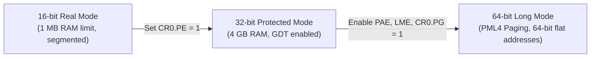
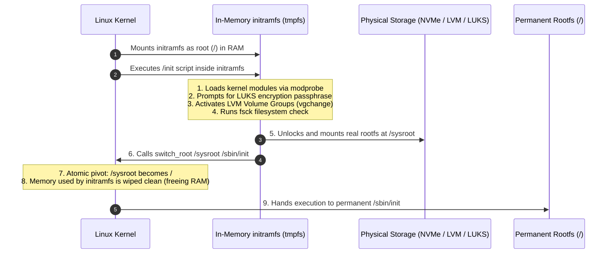

# OS Boot Process

> [!abstract] Mental Model
> The Boot Process is an **architectural relay race**. Inert physical silicon powers on with zero software awareness, executes hardcoded motherboard firmware (UEFI), passes the baton to a multi-stage bootloader (GRUB), traverses CPU mode transitions (16-bit $\rightarrow$ 32-bit $\rightarrow$ 64-bit), decompresses the OS kernel into RAM, initializes memory and hardware subsystems, mounts an ephemeral rootfs (`initramfs`) to load storage drivers, and finally spawns the immortal ancestor of all user processes: **`PID 1` (`systemd`)**.

---

## The 5 Phases of the Boot Sequence

```mermaid
flowchart TD
    subgraph Phase1 [Phase 1: Hardware & Firmware]
        P1["Power Applied -> Reset Vector (0xFFFFFFF0)"] --> P2["POST (Power-On Self-Test)"]
        P2 --> P3["UEFI Firmware executes from SPI Flash"]
        P3 --> P4["Reads GPT & EFI System Partition (ESP)"]
    end

    subgraph Phase2 [Phase 2: Bootloader (GRUB 2)]
        P4 --> G1["Loads GRUB EFI binary (grubx64.efi)"]
        G1 --> G2["Reads /boot/grub/grub.cfg"]
        G2 --> G3["Loads vmlinuz (Kernel) & initramfs into RAM"]
        G3 --> G4["Switches CPU to 64-bit Long Mode & Paging"]
    end

    subgraph Phase3 [Phase 3: Kernel Initialization]
        G4 --> K1["Self-decompresses vmlinux into RAM"]
        K1 --> K2["Initializes IDT, Page Tables & Buddy Allocator"]
        K2 --> K3["Probes hardware, APIC & starts SMP secondary cores"]
    end

    subgraph Phase4 [Phase 4: initramfs & Root Pivot]
        K3 --> I1["Mounts temporary in-memory initramfs"]
        I1 --> I2["Loads storage drivers (NVMe, RAID, LUKS encryption)"]
        I2 --> I3["Mounts real root filesystem on NVMe (/)"]
        I3 --> I4["Executes pivot_root / switch_root"]
    end

    subgraph Phase5 [Phase 5: User Space (PID 1)]
        I4 --> S1["Kernel spawns /sbin/init (systemd) as PID 1"]
        S1 --> S2["Mounts /proc, /sys, /dev"]
        S2 --> S3["Spawns system daemons (sshd, docker, udev)"]
        S3 --> S4["Reaches multi-user.target / Login prompt"]
    end
```

---

## Phase 1: Power-On, POST, and Firmware (BIOS vs UEFI)

1. **Power-On Reset**: When the power button is pressed, the power supply stabilizes voltage and asserts the `POWER_GOOD` signal to the motherboard.
2. **CPU Reset Vector**: The CPU hardware initializes with fixed register states. In x86, the Instruction Pointer starts at physical address `0xFFFFFFF0` (16 bytes below 4 GB in the motherboard's SPI flash ROM).
3. **POST (Power-On Self-Test)**: Firmware verifies critical hardware: testing DRAM banks, initializing CPU voltage regulators, checking PCIe busses, and enumerating video controllers.

```text
Legacy BIOS vs Modern UEFI:

Legacy BIOS (Basic Input/Output System):
+-------------------------------------------------------------------------------+
| - 16-bit Real Mode execution (max 1 MB addressable RAM).                      |
| - MBR (Master Boot Record): 512-byte first sector of disk.                    |
| - Max 4 primary partitions; max disk size 2.2 TB.                             |
| - No native filesystem support (must read raw sectors).                       |
+-------------------------------------------------------------------------------+

Modern UEFI (Unified Extensible Firmware Interface):
+-------------------------------------------------------------------------------+
| - 32-bit / 64-bit execution mode directly in firmware.                        |
| - GPT (GUID Partition Table): supports 128+ partitions; 9.4 Zettabytes disks. |
| - Native FAT32 filesystem driver: reads /EFI/BOOT/BOOTX64.EFI directly.      |
| - Secure Boot: cryptographically validates digital signatures of bootloaders. |
+-------------------------------------------------------------------------------+
```

---

## Phase 2: The Bootloader (GRUB 2) & CPU Mode Transitions

The bootloader's job is to prepare memory, load the kernel binary (`vmlinuz`) and initial ramdisk (`initramfs`), and configure CPU registers before executing the kernel:



### GRUB Execution Steps:
1. `grubx64.efi` is loaded from the **EFI System Partition (ESP)** at `/boot/efi/EFI/ubuntu/grubx64.efi`.
2. GRUB initializes disk drivers, parses `/boot/grub/grub.cfg`, and renders the boot menu.
3. GRUB reads the compressed kernel file `/boot/vmlinuz-<version>` and ramdisk `/boot/initrd.img-<version>` into physical memory.
4. GRUB populates the `boot_params` structure (command-line parameters like `root=UUID=... ro quiet splash`).
5. GRUB passes control to the 64-bit kernel entry point via `jmp`.

---

## Phase 3: Kernel Decompression & Early Hardware Setup

The `/boot/vmlinuz` file is a self-extracting, compressed binary:

```text
Structure of vmlinuz:
+-------------------------------------------------------------------------------+
| Setup Code (Real/Protected Mode entry stub)                                   |
+-------------------------------------------------------------------------------+
| Decompressor Routine (gzip / xz / zstd extraction code)                       |
+-------------------------------------------------------------------------------+
| Compressed Piggybacked Kernel (vmlinux: Core ELF kernel binary)               |
+-------------------------------------------------------------------------------+
```

1. **Decompression**: The decompressor extracts the uncompressed `vmlinux` ELF binary into high memory.
2. **Early Page Tables & IDT**: Installs basic 4-level page tables and loads the Interrupt Descriptor Table (`LIDT`).
3. **Core Subsystem Initialization**:
   - `setup_arch()`: Architecture-specific hardware initialization.
   - `mm_init()`: Initializes the **Buddy Allocator** and **SLUB Allocator**.
   - `sched_init()`: Initializes the CPU runqueues and Completely Fair Scheduler.
   - `init_IRQ()`: Programs the APIC / IO-APIC controllers.
4. **SMP (Symmetric Multiprocessing) Boot**: The primary core (Bootstrap Processor - BSP) fires **Inter-Processor Interrupts (IPIs)** over the APIC bus to wake up secondary cores (Application Processors - APs), bringing all CPU cores online.

---

## Phase 4: `initramfs` and Root Filesystem Pivot

### Why `initramfs` is Mandatory in Production:
To mount a root filesystem on an encrypted NVMe drive with RAID 10 and LVM, the kernel needs drivers for NVMe, `mdadm` RAID, `dm-crypt` (LUKS), and `ext4`.
- If all these drivers were compiled statically into the kernel, the kernel binary would be huge and inflexible.
- Instead, the kernel stays minimal and loads an **`initramfs` (Initial RAM File System)**: a small compressed `cpio` archive containing user-space helper binaries and kernel modules.



---

## Phase 5: User-Space Initialization (`PID 1` / `systemd`)

The kernel completes its boot initialization by executing `kernel_init()`, which replaces itself with the first user-space process:

```c
// Inside Linux kernel init/main.c:
if (!try_to_run_init_process("/sbin/init") ||
    !try_to_run_init_process("/etc/init") ||
    !try_to_run_init_process("/bin/init") ||
    !try_to_run_init_process("/bin/sh"))
        return 0;

panic("No working init found. Try passing init= option to kernel.");
```

### `systemd` Lifecycle:
1. **PID 1**: `systemd` is assigned **Process ID 1**. It is the ancestor of every user process on the machine and acts as the **Subreaper** (adopting orphaned zombie processes).
2. **Mounting Virtual File Systems**: Mounts `/proc` (process info), `/sys` (kernel device tree), `/dev` (`devtmpfs` hardware nodes), and `/run`.
3. **Unit Dependency Resolution**: Parses unit dependency trees (parallelizing service startup using socket activation):
   - `local-fs.target` $\rightarrow$ `sysinit.target` $\rightarrow$ `basic.target` $\rightarrow$ `multi-user.target` (Server ready) $\rightarrow$ `graphical.target` (Desktop).

---

## Production Diagnostics & Boot Failure Analysis

### 1. Boot Performance Profiling with `systemd-analyze`
```bash
# 1. View total boot time breakdown (Firmware, Loader, Kernel, Userspace)
systemd-analyze

# Example Output:
# Startup finished in 2.341s (firmware) + 1.120s (loader) + 2.450s (kernel) + 4.120s (userspace) = 10.031s

# 2. List slowest-starting background services (identifying boot bottlenecks)
systemd-analyze blame | head -n 10

# 3. Print the critical dependency path causing boot delays
systemd-analyze critical-chain
```

### 2. Common Boot Failures & Production Recovery

| Failure / Error | Root Cause | Production Recovery Strategy |
| :--- | :--- | :--- |
| **`Kernel panic - not syncing: VFS: Unable to mount root fs`** | Missing NVMe/RAID driver in `initramfs` or incorrect UUID in `grub.cfg`. | Boot into GRUB menu $\rightarrow$ Select older kernel version $\rightarrow$ Regenerate initramfs: `update-initramfs -u -k all`. |
| **`Emergency Mode / Dropped to dracut shell`** | Failed `fsck` due to corrupted disk superblock or invalid `/etc/fstab` entry. | Mount root read-write: `mount -o remount,rw /` $\rightarrow$ Fix `/etc/fstab` or run `fsck -y /dev/nvme0n1p2`. |
| **Forgotten Root Password / Broken Service** | Cannot authenticate at login prompt. | In GRUB, edit boot parameters and append `init=/bin/bash` or `systemd.unit=rescue.target` $\rightarrow$ Boot directly to root shell $\rightarrow$ Run `passwd`. |

---

## Active Recall & Interview Perspective

### Reasoning Prompts
1. *Why does the kernel need an `initramfs` instead of mounting the real root filesystem directly?*
   - **Answer**: Modern production root filesystems often require complex storage layers: software RAID (`mdadm`), disk encryption (`LUKS`), logical volumes (`LVM`), network storage (`iSCSI`/`NFS`), or specialized filesystem modules (`ZFS`/`XFS`). Embedding every possible storage driver and user-space tool into the static kernel binary is impractical. `initramfs` provides a lightweight user-space environment to assemble these storage layers and unlock the disk before handing off to the real rootfs.
2. *What happens if `PID 1` (`systemd` / `/sbin/init`) crashes or is killed with `kill -9 1`?*
   - **Answer**: The Linux kernel explicitly protects PID 1 from standard signals; `kill -9 1` is ignored. However, if PID 1 crashes (e.g., via `SIGSEGV` or calling `exit()`), the kernel encounters a fatal condition because there is no process remaining to adopt orphans or manage system state. The kernel immediately fires a **Kernel Panic: `Attempted to kill init! exitcode=...`** and halts the machine.
3. *What is the difference between BIOS MBR partitioning and UEFI GPT partitioning?*
   - **Answer**: BIOS uses MBR stored in the first 512-byte sector, limited to 4 primary partitions and 2.2 TB drive sizes, executing in 16-bit Real Mode. UEFI uses GPT, which supports 128+ partitions, drives up to 9.4 ZB, executes in 32/64-bit mode with native FAT32 filesystem support, and provides cryptographic verification via Secure Boot.

---

## Key Takeaways
- The boot process transitions from **motherboard firmware (UEFI) $\rightarrow$ bootloader (GRUB) $\rightarrow$ kernel decompression $\rightarrow$ `initramfs` driver loading $\rightarrow$ permanent root pivot $\rightarrow$ `PID 1` (`systemd`)**.
- The CPU dynamically transitions execution modes from **16-bit Real Mode $\rightarrow$ 32-bit Protected Mode $\rightarrow$ 64-bit Long Mode**.
- `initramfs` is an ephemeral in-memory root filesystem that loads storage drivers and unlocks encrypted volumes before executing `switch_root`.

---

## Related Notes
- [[Operating System]] — Global architecture.
- [[Kernel]] — Kernel memory structures and early initialization.
- [[Privilege Rings and CPU Modes]] — CPU mode transitions (Real $\rightarrow$ Protected $\rightarrow$ Long mode).
- [[Interrupts and Interrupt Handling]] — Programming the APIC and IDT during early boot.
- [[Process Creation and Termination - fork, exec, wait, exit]] — How PID 1 spawns child processes.
- [[Operating Systems MOC]] — Master table of contents for Operating Systems.
