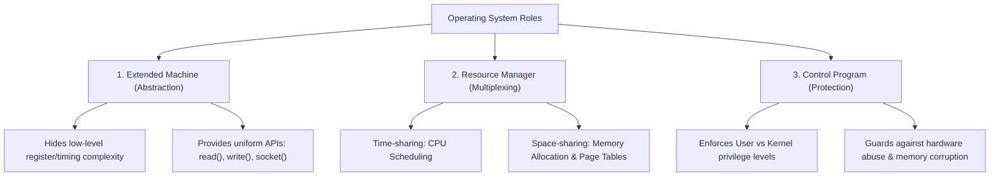

# Operating System

> [!abstract] Mental Model
> The Operating System (OS) is the **master resource multiplexer and virtualization layer** of a computing machine. It transforms raw, hazardous, and scarce physical hardware (CPU cores, DRAM, NVMe blocks, NICs) into safe, isolated, and uniform abstractions (processes, virtual address spaces, file descriptors, network sockets) so multiple untrusted applications can execute concurrently without corrupting each other.

---

## Why This Exists

In early computing (e.g., bare-metal mainframes), programs ran directly on hardware with zero separation:
1. **Direct Hardware Manipulation**: Every program had to implement its own device drivers, disk sector addressing, and memory layouts.
2. **Lack of Isolation**: A bug or rogue pointer in one application would overwrite physical memory, crashing the entire machine or reading private data from previous jobs.
3. **Inefficient Resource Utilization**: If a program blocked waiting for a slow magnetic tape or punched card read, the CPU sat completely idle (0% utilization).

```text
Without OS (Bare Metal):
+-----------------------------------------------+
| Application A (Contains custom device drivers)|
| Direct Physical Memory Access (0x0000-0xFFFF) | -> Direct Hardware Access
+-----------------------------------------------+    (Crash in App = Total Halt)

With Modern OS:
+-------------------+  +-------------------+
|   Application A   |  |   Application B   |  (Isolated Virtual Address Spaces)
|    (User Mode)    |  |    (User Mode)    |
+---------+---------+  +---------+---------+
          | System Calls         | System Calls
+---------v----------------------v---------+
|             OPERATING SYSTEM             |
| - Process Scheduler   - Virtual Memory   |  (Privileged Kernel Mode)
| - VFS & Page Cache    - Device Drivers   |
+-------------------+----------------------+
                    |
+-------------------v----------------------+
|            PHYSICAL HARDWARE             |
|   CPU Cores   |    DRAM    |  Storage/NIC|
+------------------------------------------+
```

The Operating System was invented to solve three fundamental challenges:
- **Virtualization**: Making a single physical CPU appear as infinite virtual CPUs (processes/threads), and fragmented physical RAM appear as dedicated, contiguous 64-bit address spaces.
- **Resource Multiplexing / Concurrency**: Sharing hardware among competing tasks using time-sharing (CPU scheduling) and space-sharing (memory partitioning).
- **Protection and Isolation**: Hardware-enforced boundaries preventing unauthorized access between processes and shielding the kernel from user-space corruption.

---

## Intuition: The Government / City Infrastructure Analogy

Think of an Operating System as the **civil infrastructure and legal authority of a city**:
- **Hardware** is the raw land, electricity grid, and water reservoirs.
- **Applications** are private businesses and citizens trying to operate simultaneously.
- If every business laid its own private electrical wires and seized land at will, chaos would ensue.
- The **OS** manages property boundaries (virtual memory), traffic laws and intersections (CPU scheduler & synchronization), water/power utilities (file system & network stack), and police enforcement (CPU privilege rings).

---

## Core Responsibilities & Architectural Roles

An OS fulfills three distinct primary roles:



### 1. The Extended Machine (Abstraction Layer)
Hardware devices speak complex, model-specific protocols (PCIe config cycles, NVMe command queues, ACPI tables). The OS abstracts these away into clean software primitives:
- Physical disk sectors $\rightarrow$ **Files and Directories** via the [[Virtual File System - VFS|Virtual File System (VFS)]].
- Hardware timers & core interrupts $\rightarrow$ **Threads and Processes**.
- Network Interface Card (NIC) packet buffers $\rightarrow$ **Stream Sockets (`TCP`) and Datagrams (`UDP`)**.

### 2. The Resource Manager (Multiplexing & Arbitration)
When 200 processes run on a 16-core CPU with 32 GB of RAM:
- **Time Multiplexing**: The [[CPU Scheduler and Dispatcher|CPU Scheduler]] assigns time slices (quantums) to runnable threads, swapping execution contexts thousands of times per second.
- **Space Multiplexing**: The [[Virtual Memory Architecture|Virtual Memory Subsystem]] assigns discrete physical frames to virtual pages, swapping dormant pages to disk under memory pressure.

### 3. The Control Program (Protection & Security)
The OS prevents errant software from destroying system stability:
- Isolates memory spaces so Process A cannot read Process B's memory.
- Enforces access control lists (file permissions, capabilities).
- Controls direct hardware execution via CPU [[Privilege Rings and CPU Modes|Privilege Rings]].

---

## Hardware-Assisted Dual-Mode Operation

Modern operating systems rely strictly on CPU hardware support to enforce security boundaries.

```text
CPU Execution Ring Architecture (x86-64):

      [ Ring 3: User Mode (Applications) ]
             |
             |  syscall / sysenter (Trap to Kernel)
             v
      [ Ring 1 & 2: Device Drivers (Mostly unused in modern OS) ]
             |
             v
      [ Ring 0: Kernel Mode / Supervisor Mode ]
             (Full access to all CPU instructions, CR0-CR4, MSRs, MMU)
```

| Feature | User Mode (Ring 3) | Kernel Mode (Ring 0 / Supervisor) |
| :--- | :--- | :--- |
| **Instruction Set** | Restricted (non-privileged only) | Full (privileged instructions enabled: `cli`, `sti`, `invlpg`, `wrmsr`) |
| **Memory Access** | Limited strictly to own virtual address space | Unrestricted access to all physical and kernel virtual memory |
| **I/O Access** | Forbidden direct port/MMIO access | Direct hardware register manipulation and DMA control |
| **Crash Impact** | Process terminates (`SIGSEGV` / Core Dump); OS unaffected | Kernel Panic / Blue Screen of Death (BSOD); system halts |

To transition safely from User Mode to Kernel Mode, software cannot simply jump into kernel memory. It must execute a special CPU instruction (e.g., `SYSCALL` in x86-64 or `SVC` in ARM), which triggers a hardware-controlled context switch into a predefined kernel handler vector.

---

## Subsystem Architecture of a Modern OS

```mermaid
graph TB
    subgraph UserSpace [User Space (Ring 3)]
        App["Application Code"]
        LibC["Standard C Library (libc)"]
        App --> LibC
    end

    subgraph TrapBoundary [Hardware Boundary: System Call Interface]
        SyscallInt["Syscall Dispatcher / sys_call_table"]
    end

    subgraph KernelSpace [Kernel Space (Ring 0)]
        direction TB
        ProcMgmt["Process & Thread Subsystem<br/>(Scheduler, IPC, Signals)"]
        MemMgmt["Memory Management<br/>(Virtual Memory, Page Allocator, TLB)"]
        VFS["Virtual File System (VFS)<br/>(Page Cache, Inodes, ext4/XFS)"]
        NetStack["Network Stack<br/>(Sockets, TCP/IP, Netfilter)"]
        DevDrivers["Device Drivers<br/>(NVMe, GPU, NIC, USB)"]

        SyscallInt --> ProcMgmt
        SyscallInt --> MemMgmt
        SyscallInt --> VFS
        SyscallInt --> NetStack

        ProcMgmt <--> MemMgmt
        VFS <--> MemMgmt
        VFS --> DevDrivers
        NetStack --> DevDrivers
    end

    subgraph Hardware [Physical Hardware]
        CPU["CPU Cores & MMU"]
        RAM["Physical RAM"]
        Disks["NVMe / SSD"]
        NIC["Network Card"]
        
        DevDrivers --> Disks
        DevDrivers --> NIC
        MemMgmt --> CPU
        MemMgmt --> RAM
        ProcMgmt --> CPU
    end

    LibC --> SyscallInt
```

---

## Production Context: Why Software Engineers Must Understand OS Internals

1. **System Call Overhead**: A system call is not a normal function call. It incurs a CPU mode switch, register spilling, kernel stack switching, and potential TLB pollution. High-throughput systems (e.g., Nginx, Redis, Kafka) minimize syscalls using batching (`epoll_wait`, `readv`/`writev`) and [[Zero-Copy IO - sendfile, splice, io_uring|zero-copy mechanics (`sendfile`, `io_uring`)]].
2. **Context Switching & CPU Cache Thrashing**: Spawning 10,000 OS threads causes devastating CPU cache line invalidation and scheduling latency. This drove the adoption of user-space event loops (Node.js) and lightweight green threads (Go goroutines).
3. **Page Faults & Memory Allocations**: Allocating memory (`malloc`) does not immediately assign physical RAM. The OS lazily defers allocation until first write, triggering a [[Demand Paging and Page Faults|minor page fault]]. Under high allocations, page allocation latency creates p99 latency spikes.
4. **I/O Buffering & Page Cache**: Databases (PostgreSQL, MySQL) often bypass or carefully coordinate with the OS [[Page Cache and Buffer Cache|Page Cache]] using `O_DIRECT` to prevent double-buffering and guarantee write durability.

---

## Failure Modes & Edge Cases

| Failure Mode | Root Cause | Symptoms / Observability | Mitigation / Recovery |
| :--- | :--- | :--- | :--- |
| **Kernel Panic / BSOD** | Unhandled kernel exception, memory corruption in driver, or fatal hardware fault. | System freeze, console crash dump, `dmesg` backtrace. | Kernel dump analysis (`kdump`/`crash`), hardware testing, removing faulty kernel modules. |
| **OOM Killer Invocation** | System exhaust physical RAM + swap; kernel protects itself by terminating user processes. | Process killed abruptly (`Exit code 137`), `Out of memory: Kill process <pid>` in `dmesg`. | Configure `vm.overcommit_memory`, tune `oom_score_adj`, set cgroups memory limits. |
| **CPU Starvation / Priority Inversion** | High-priority thread blocked waiting for a lock held by a preempted low-priority thread. | Application latency spikes, high thread wait times. | Priority Inheritance Protocols, lock-free algorithms, proper thread pool sizing. |
| **Fork Bomb (Process Exhaustion)** | Recursive uncontrolled process creation depleting the PID table / thread structures. | `fork: Cannot allocate memory`, system unresponsive to new logins. | Set `ulimit -u` (max user processes) and `pids.max` in cgroups v2. |

---

## Practical Diagnostics & Observability Commands

```bash
# 1. View operating system release, kernel version, and architecture
uname -a
# Example output: Linux production-srv 5.15.0-89-generic #99-Ubuntu SMP x86_64

# 2. Inspect kernel ring buffer messages for hardware errors, OOM kills, and driver logs
sudo dmesg -T --level=err,warn

# 3. View live system resource multiplexing (CPU cores, memory, tasks)
top -b -n 1 | head -n 15

# 4. Check system-wide file descriptor and process limits
sysctl fs.file-nr
sysctl kernel.pid_max

# 5. Trace all system calls made by a live process (observing OS-application interaction)
sudo strace -c -p <PID>
```

---

## Trade-Offs: OS Architectural Decisions

| Decision | Monolithic Kernel (e.g., Linux) | Microkernel (e.g., seL4, QNX) |
| :--- | :--- | :--- |
| **Architecture** | All services (VFS, IPC, drivers, networking) run in privileged Ring 0. | Only bare essentials (IPC, low-level scheduling, address space) in Ring 0; drivers/VFS run in User Mode. |
| **Performance** | **High**: Subsystem communication is direct C function calls with zero IPC overhead. | **Lower**: Inter-subsystem communication requires frequent user-kernel-user IPC messages and context switches. |
| **Reliability** | A bug or crash in a third-party GPU/NIC driver crashes the entire kernel. | A crash in a user-space driver only crashes that driver process; the OS kernel remains healthy. |
| **Attack Surface** | Large attack surface in privileged mode (millions of lines of C in Ring 0). | Minimal trusted codebase (seL4 is mathematically verified ~10,000 LOC). |

---

## Active Recall & Interview Perspective

### Reasoning Prompts
1. *Why cannot a user program directly execute the assembly instruction to read a disk block from an NVMe controller?*
   - **Answer**: Hardware protection. The CPU is in User Mode (Ring 3). Direct I/O instructions (like `in`/`out` or unmapped MMIO addresses) are privileged. Attempting them generates a General Protection Fault (`#GP`), which traps into the OS kernel.
2. *What is the difference between a time-shared and a space-shared resource in an OS?*
   - **Answer**: Time-shared resources (like a CPU core) are allocated to one task for a discrete duration and then preempted for another. Space-shared resources (like RAM or disk sectors) are partitioned into separate regions allocated concurrently to different tasks.
3. *What is the performance cost of a system call compared to a standard user-space function call?*
   - **Answer**: A function call takes ~1-3 CPU cycles (saving `RIP`, jumping). A system call takes ~50-200+ CPU cycles due to switching CPU privilege levels, changing stack pointers, flushing certain pipeline stages, and security mitigations (e.g., KPTI for Meltdown).

---

## Key Takeaways
- The OS is a **resource manager, control program, and extended machine** that multiplexes physical hardware into reliable virtual abstractions.
- Hardware-enforced **dual-mode execution (Ring 0 vs Ring 3)** is the bedrock of system stability and isolation.
- Every interaction between an application and the outside world (storage, network, display) must pass through the **System Call Interface**.

---

## Related Notes
- [[Kernel]] — The privileged core engine of the operating system.
- [[Privilege Rings and CPU Modes]] — Hardware privilege levels enforcing user/kernel separation.
- [[User Mode vs Kernel Mode]] — Deep dive into mode switching and security domains.
- [[System Calls]] — Mechanics of requesting kernel services.
- [[OS Boot Process]] — How the hardware bootstraps into the running operating system.
- [[Operating Systems MOC]] — Master table of contents for Operating Systems.
