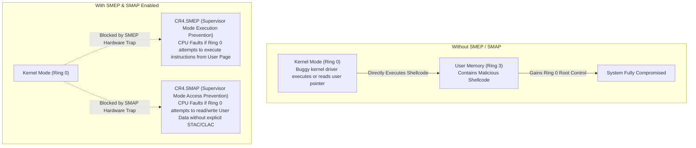

# Privilege Rings and CPU Modes

> [!abstract] Mental Model
> Privilege rings are **hardware-enforced security boundaries hardwired into the CPU silicon**. They ensure that an application cannot simply "decide" to read raw disk blocks, disable hardware interrupts, or inspect another process's memory. The CPU checks its current internal privilege level register before decoding every single machine instruction; if an unprivileged instruction is attempted in User Mode, the CPU halts execution and fires a hardware trap into the kernel.

---

## Why This Exists

If security and access boundaries were enforced purely by software (e.g., in a compiler or library), malicious or buggy machine code could easily bypass them:
1. **Instruction Tampering**: An application could execute the `HLT` (Halt CPU) or `CLI` (Clear Interrupts) assembly instruction, freezing the entire physical machine.
2. **Direct Hardware Hijacking**: Any program could issue I/O instructions (`IN`/`OUT`) to overwrite disk sectors or snoop network buffers directly from the NIC.
3. **Memory Hijacking**: A process could modify the CPU's page directory base register (`CR3` in x86) to point to its own arbitrary page table, granting itself full read/write access to all physical RAM.

To make an OS secure, **the physical CPU silicon must enforce privilege levels at the hardware execution stage**.

---

## Architecture: x86 Protection Rings vs ARM Exception Levels

Modern microprocessor architectures implement hierarchical privilege tiers:

### 1. x86-64 Ring Architecture

```text
               +-------------------------------------------+
               |   Ring -3: Hardware / Management Engine   | (Intel ME / AMD PSP)
               |   +-------------------------------------+ |
               |   |  Ring -2: System Management (SMM)   | | (Firmware, BIOS, Power)
               |   |   +-------------------------------+ | |
               |   |   | Ring -1: Hypervisor (VMX Root)| | | (KVM, ESXi, Hyper-V)
               |   |   |   +-------------------------+ | | |
               |   |   |   |    Ring 0: OS Kernel    | | | | (Linux Kernel, Drivers)
               |   |   |   |   +-------------------+ | | | |
               |   |   |   |   | Ring 1 & 2: Unused| | | | | (Historical / Device Drivers)
               |   |   |   |   |   +-------------+ | | | | |
               |   |   |   |   |   | Ring 3: User| | | | | | (Applications: Node, C++, DB)
               |   |   |   |   |   +-------------+ | | | | |
               |   |   |   |   +-------------------+ | | | |
               |   |   |   +-------------------------+ | | |
               |   |   +-------------------------------+ | |
               |   +-------------------------------------+ |
               +-------------------------------------------+
```

- **Ring 3 (User Mode)**: Current Privilege Level `CPL = 3`. Runs all user applications. Privileged instructions are strictly forbidden.
- **Ring 1 & Ring 2**: Originally designed in the Intel 80286/386 for device drivers and OS services. Unused by modern operating systems (Linux, Windows, macOS) because:
  1. Portability: Non-x86 architectures (ARM, MIPS, RISC-V) historically supported only two levels.
  2. Performance: Cross-ring transitions were historically expensive.
- **Ring 0 (Supervisor / Kernel Mode)**: Current Privilege Level `CPL = 0`. Full control of CPU, memory management units (MMU), and I/O.
- **Ring -1 (VMX Root / Hypervisor)**: Introduced with Intel VT-x / AMD-V. Allows hypervisors (KVM, VMware ESXi) to run guest OS kernels in "Guest Ring 0" while intercepting privileged guest operations via **VM-Exits**.
- **Ring -2 (System Management Mode - SMM)**: Deep firmware execution mode used for thermal throttling, power management, and UEFI runtime services. Suspends OS execution via System Management Interrupts (SMI).
- **Ring -3 (Intel ME / AMD PSP)**: Separate out-of-band co-processor operating even when the main CPU is powered off.

---

### 2. ARMv8-A / ARMv9-A Exception Levels (EL)

ARM modern architectures use **Exception Levels** ordered from lowest privilege (EL0) to highest (EL3):

```text
+--------------------------------------------------------------------------+
|  EL3: Secure Monitor / Firmware (Root Security, TrustZone management)    |
+--------------------------------------------------------------------------+
|  EL2: Hypervisor (Virtualization Host - KVM, Xen on ARM)                 |
+--------------------------------------------------------------------------+
|  EL1: Operating System Kernel (Linux, Android, iOS Kernel)               |
+--------------------------------------------------------------------------+
|  EL0: User Applications (User Space processes, apps, CLI utilities)      |
+--------------------------------------------------------------------------+
```

- Transitions between levels on ARM occur via dedicated instructions:
  - `SVC` (Supervisor Call): EL0 $\rightarrow$ EL1 (Syscall)
  - `HVC` (Hypervisor Call): EL1 $\rightarrow$ EL2 (Hypercall)
  - `SMC` (Secure Monitor Call): EL1/EL2 $\rightarrow$ EL3 (Firmware transition)

---

## Hardware Control Registers & State Encoding

In x86-64, the CPU's current privilege level is tracked in the bottom 2 bits of the **Code Segment (`CS`) register**:

```text
Code Segment (CS) Register:
+------------------------------------+-------+
|  Descriptor Index / Base Selector  |  CPL  |
|          (Bits 15..2)              | (1..0)|
+------------------------------------+-------+
                                        |
                 +----------------------+----------------------+
                 | CPL = 00b : Ring 0 (Privileged Kernel Mode) |
                 | CPL = 11b : Ring 3 (Unprivileged User Mode) |
                 +---------------------------------------------+
```

### Critical Hardware Registers Controlled Strictly in Ring 0:
1. **`CR0` (Control Register 0)**:
   - `PE` (Protection Enable): Enables 32/64-bit protected mode.
   - `PG` (Paging): Enables the hardware MMU.
   - `WP` (Write Protect): Prevents even Ring 0 from writing to read-only user pages (critical security feature).
2. **`CR3` (Page Directory Base Register)**:
   - Holds the physical base address of the top-level page table (**PML4** / **PML5**).
   - Changing `CR3` instantly switches the active virtual address space to another process.
3. **`CR4` (Control Register 4)**:
   - `SMEP` (Supervisor Mode Execution Prevention): Bit 20.
   - `SMAP` (Supervisor Mode Access Prevention): Bit 21.
4. **`IA32_LSTAR` (Long Mode Target Address Register)**:
   - Model-Specific Register (MSR) holding the 64-bit virtual memory entry point for the `SYSCALL` instruction.

---

## Hardware Protection Mechanics

### 1. Privileged vs Non-Privileged Instructions

```text
+---------------------------------------+---------------------------------------+
| Privileged Instructions (Ring 0 Only) | Non-Privileged Instructions (Ring 3)  |
+---------------------------------------+---------------------------------------+
| HLT     : Halt CPU core               | MOV, ADD, SUB, MUL, DIV : Arithmetic  |
| CLI/STI : Disable/Enable Interrupts   | JMP, CALL, RET          : Flow control|
| MOV CRx : Modify Control Registers    | PUSH, POP               : Stack ops   |
| INVLPG  : Invalidate TLB entry        | SYSCALL / SVC           : Trap to OS  |
| WRMSR   : Write Model-Specific Reg    | CMP, TEST               : Comparisons |
| IN / OUT: Direct I/O Port operations  | SSE / AVX instructions  : SIMD math   |
+---------------------------------------+---------------------------------------+
```

If the CPU is at `CPL = 3` and encounters a privileged instruction (e.g., `CLI`):
1. The CPU instruction decoder detects the privilege violation.
2. The CPU cancels execution of that instruction.
3. The CPU triggers **Exception 13: General Protection Fault (`#GP`)**.
4. The OS kernel captures the trap and sends `SIGSEGV` or `SIGILL` to terminate the offending user process.

---

## Hardware Security Mitigations: SMEP and SMAP

Modern CPUs include dedicated silicon features to block kernel-level privilege escalation exploits:



- **SMEP (Supervisor Mode Execution Prevention)**: Prevents the kernel (Ring 0) from executing code located in User Space (Ring 3) memory. Prevents "return-to-user" exploit techniques.
- **SMAP (Supervisor Mode Access Prevention)**: Prevents the kernel from accidentally reading or writing data in User Space memory unless wrapped in explicit `stac` (Set AC Flag) / `clac` (Clear AC Flag) instructions. Forces all data transfers to go through validated kernel routines (`copy_from_user` / `copy_to_user`).

---

## Production Relevance & Cloud Virtualization

1. **Containers vs VMs**: Containers run directly on the host kernel in **Ring 3**, sharing a single **Ring 0** kernel with the host. A kernel vulnerability (Ring 0 escape) compromises all containers on that host. Virtual Machines (VMs) run in **Guest Ring 0 / Guest Ring 3**, shielded by the **Ring -1 (Hypervisor)** hardware boundary.
2. **Performance of Ring Transitions**: Switching rings is not free. Modern `SYSCALL`/`SYSRET` takes ~50–70 ns. In high-frequency trading (HFT) and ultra-high-throughput networking, developers use **Kernel Bypass** (DPDK, Solarflare OpenOnload) or `io_uring` to avoid Ring 3 $\leftrightarrow$ Ring 0 transitions entirely.
3. **KPTI & Meltdown Mitigation**: The Meltdown vulnerability allowed unprivileged Ring 3 code to speculatively read kernel memory across the ring boundary via CPU cache side-channels. **KPTI (Kernel Page Table Isolation)** unmaps kernel memory from the user-space page table, adding page table switching overhead to every syscall.

---

## Failure Modes & Diagnostic Scenarios

| Failure / Exception | Cause | Symptom | Diagnostic Command / Log |
| :--- | :--- | :--- | :--- |
| **General Protection Fault (`#GP`, Vector 13)** | User program attempted privileged instruction or illegal segment register access. | `Segmentation fault (core dumped)` or `Illegal instruction`. | `dmesg -T` reports `#GP` RIP address; `gdb` shows offending instruction. |
| **Invalid Opcode (`#UD`, Vector 6)** | CPU decoded an invalid or unsupported instruction. | Process terminates with `SIGILL`. | Check CPU instruction support via `/proc/cpuinfo`. |
| **SMEP Panic / Kernel Trap** | Kernel attempted to jump into user memory page (often an exploited vulnerability). | Immediate **Kernel Panic**: `unable to execute user-space code (SMEP)`. | Inspect kernel crash dump (`kdump`) for kernel stack trace. |

---

## Practical Diagnostics & CPU Inspection

```bash
# 1. Inspect CPU hardware virtualization and security mitigation flags
lscpu | grep -E "Virtualization|Hypervisor"

# 2. Check for hardware SMEP and SMAP support in CPU flags
grep -m 1 -E "smep|smap|pti|vmx|svm" /proc/cpuinfo

# 3. Check active Kernel Page Table Isolation (KPTI) status
cat /sys/devices/system/cpu/vulnerabilities/meltdown
# Output: Mitigation: PTI

# 4. Verify system call overhead and frequency for a running process
sudo perf top -p <PID>
```

---

## Active Recall & Interview Perspective

### Reasoning Prompts
1. *Why did x86 implement 4 privilege rings, but Linux and Windows only use 2 (Ring 0 and Ring 3)?*
   - **Answer**: Cross-platform portability and performance. Other architectures (like ARM and RISC-V) only had 2 privilege levels historically. Furthermore, segment-based ring transitions between intermediate rings (1 and 2) introduced high latency without offering better security than hardware paging.
2. *Can a user-space application forge its `CPL` by modifying the `CS` register with assembly?*
   - **Answer**: No. The `CS` register cannot be loaded directly with a standard `MOV` instruction. Changing `CS` requires executing control-transfer instructions (`JMP FAR`, `CALL FAR`, `SYSCALL`, `IRET`). The hardware validates that transitions to lower numerical privilege levels (higher authority) must go through validated hardware descriptor tables (GDT/IDT) configured by Ring 0.
3. *What is the security difference between running two microservices in separate Docker containers vs separate KVM Virtual Machines?*
   - **Answer**: Containers share the host's single Ring 0 kernel; if an exploit gains Ring 0 execution via a kernel vulnerability, it controls all containers on that host. VMs run separate guest kernels in Guest Ring 0, protected by the hardware-assisted Ring -1 (VMX Root) hypervisor boundary, which requires a much rarer VM-escape exploit to breach.

---

## Key Takeaways
- Privilege rings are **hardware-enforced silicon gates** verified on every CPU instruction fetch and decode.
- **Ring 3 (EL0)** is restricted User Mode; **Ring 0 (EL1)** is privileged Kernel Mode; **Ring -1 (EL2)** is Hypervisor Mode.
- Security mechanisms like **SMEP** and **SMAP** in CPU control registers prevent kernel-level privilege escalation.

---

## Related Notes
- [[Operating System]] — Global architecture and resource management.
- [[Kernel]] — The master software executing in Ring 0.
- [[User Mode vs Kernel Mode]] — Detailed analysis of mode switches and boundaries.
- [[System Calls]] — How the CPU safely transitions from Ring 3 to Ring 0.
- [[Containers vs Virtual Machines]] — How privilege rings delineate virtualization technologies.
- [[Operating Systems MOC]] — Master table of contents for Operating Systems.
