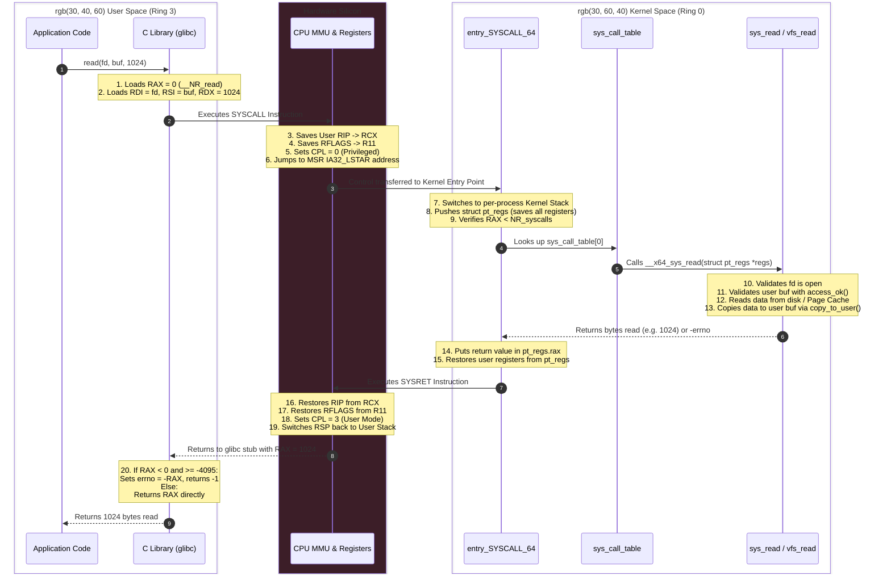

# System Calls

> [!abstract] Mental Model
> A System Call (Syscall) is the **controlled, programmatic border checkpoint** between an unprivileged user application and the privileged kernel. Applications cannot directly manipulate hardware or invoke arbitrary kernel functions; they must present their request and validated arguments to the hardware-guarded System Call Interface, which switches the CPU to [[Privilege Rings and CPU Modes|Ring 0]], executes the operation on the application's behalf, and returns the result across the privilege boundary.

---

## Why This Exists

Without a formalized system call interface:
1. **Uncontrolled Memory Execution**: If user applications could jump directly to any memory address inside the kernel, a malicious program could jump past authentication routines directly into raw disk write functions.
2. **Binary Incompatibility**: If application binaries called internal kernel functions directly, any internal kernel refactoring, patch, or compiler optimization would break every compiled application binary on the system.
3. **Parameter Exploitation**: Without rigid argument validation (e.g., verifying pointers and buffer bounds), user applications could pass kernel pointers to overwrite critical OS data structures.

The System Call Interface guarantees **ABI (Application Binary Interface) stability, hardware privilege switching, and strict input validation**.

---

## The End-to-End System Call Journey (x86-64 Linux)

Here is the exact step-by-step lifecycle when an application calls `read(fd, buf, count)`:



---

## Hardware Calling Conventions: x86-64 vs ARM64

Unlike standard C user-space function calls (which push arguments onto the user stack or use the System V AMD64 ABI), system calls use a **specialized register convention**:

```text
x86-64 Linux Syscall Registers:
+-------------------------------------------------------------------------------+
| Register | Role in System Call                                                |
+-------------------------------------------------------------------------------+
| RAX      | System Call Number (__NR_name) on entry; Return value on exit      |
| RDI      | Argument 1 (e.g., int fd)                                          |
| RSI      | Argument 2 (e.g., const void *buf)                                 |
| RDX      | Argument 3 (e.g., size_t count)                                    |
| R10      | Argument 4 (Note: RCX is clobbered by the CPU during SYSCALL instruction)|
| R8       | Argument 5                                                         |
| R9       | Argument 6                                                         |
+-------------------------------------------------------------------------------+
```

```text
ARM64 (AArch64) Linux Syscall Registers:
+-------------------------------------------------------------------------------+
| Register | Role in System Call                                                |
+-------------------------------------------------------------------------------+
| X8       | System Call Number on entry                                        |
| X0       | Argument 1 on entry; Return value on exit                          |
| X1       | Argument 2                                                         |
| X2       | Argument 3                                                         |
| X3       | Argument 4                                                         |
| X4       | Argument 5                                                         |
| X5       | Argument 6                                                         |
| Instruction: SVC #0 (Supervisor Call)                                         |
+-------------------------------------------------------------------------------+
```

---

## Primary System Call Categories

Modern Unix/Linux provides ~350–450 system calls, categorized into six primary groups:

| Category | Description | Canonical Syscalls |
| :--- | :--- | :--- |
| **Process Control** | Creation, execution, lifecycle, signals, priorities | `fork`, `vfork`, `execve`, `exit`, `wait4`, `kill`, `sched_setaffinity` |
| **File Management** | File lifecycle, descriptors, directories, metadata | `openat`, `close`, `read`, `write`, `lseek`, `statx`, `unlinkat`, `renameat` |
| **Device & I/O Multiplexing** | Event-driven I/O, device control, polling | `ioctl`, `select`, `poll`, `epoll_create1`, `epoll_ctl`, `epoll_wait` |
| **Memory Management** | Address space allocation, virtual memory mapping | `brk`, `mmap`, `munmap`, `mprotect`, `madvise`, `mlock` |
| **Networking & IPC** | Sockets, pipes, message queues, shared memory | `socket`, `bind`, `connect`, `listen`, `accept4`, `pipe2`, `sendto`, `recvfrom` |
| **Time & Information** | Timers, clock synchronization, system information | `clock_gettime`, `gettimeofday`, `nanosleep`, `sysinfo`, `uname` |

---

## Security & Sandboxing: `seccomp` and `seccomp-bpf`

System calls represent the primary attack surface of the OS kernel. If a containerized process is compromised, the attacker can attempt kernel privilege escalation by issuing obscure system calls (e.g., `bpf()`, `ptrace()`, `keyctl()`, `mount()`).

```mermaid
flowchart LR
    App["Application / Container<br/>(Ring 3)"] -->|Syscall Request| SeccompFilter["seccomp-BPF Engine<br/>(In-Kernel JIT Filter)"]
    
    SeccompFilter -->|Allowed (e.g. read, write)| KernelAction["Execute Syscall in Kernel"]
    SeccompFilter -->|Forbidden (e.g. ptrace, reboot)| KillAction["Action: SECCOMP_RET_KILL<br/>Terminates Process with SIGSYS"]
    SeccompFilter -->|Denied Gracefully| ErrAction["Action: SECCOMP_RET_ERRNO<br/>Returns -EPERM immediately"]
```

### Production Application: Docker / Kubernetes Default Seccomp Profile
- The Linux kernel has $>400$ syscalls.
- The standard Docker default seccomp profile disables $\approx 44$ hazardous syscalls (such as `sys_chroot`, `acct`, `add_key`, `kexec_load`, `pivot_root`).
- Chromium / Google Chrome uses seccomp to sandbox browser renderer processes so compromised tabs cannot execute file system or network syscalls directly.

---

## Crucial Failure Modes & Return Error Handling

### 1. The `errno` Translation Mechanism
In the Linux kernel, system calls return a negative value on failure (e.g., `-2` for `-ENOENT` or `-9` for `-EBADF`).
The user-space standard C library (`glibc` / `musl`):
1. Intercepts the return value in register `RAX`.
2. If `RAX` is in the range `[-4095, -1]`, `glibc` negates it, stores it in the thread-local variable `errno`, and returns `-1` to the caller.

```c
// Example: Safe C Syscall Error Checking
int fd = open("/etc/sensitive_config", O_RDONLY);
if (fd == -1) {
    if (errno == ENOENT) {
        fprintf(stderr, "Error: File not found.\n");
    } else if (errno == EACCES) {
        fprintf(stderr, "Error: Permission denied.\n");
    } else {
        perror("open failed");
    }
}
```

### 2. Common Production Syscall Errors

| Error Code | Constant | Root Cause | Engineering Action |
| :--- | :--- | :--- | :--- |
| **Bad Address** | `EFAULT` | User passed an invalid, unmapped, or protected memory pointer to the kernel. | Fix memory bugs; ensure buffer is allocated and within address space. |
| **Interrupted Syscall** | `EINTR` | A blocking syscall (`read`, `epoll_wait`) was interrupted by a signal before completing. | Wrap syscall in a retry loop or register signal handlers with `SA_RESTART`. |
| **Resource Unavailable** | `EAGAIN` / `EWOULDBLOCK` | Non-blocking socket/fd has no data available to read or buffer space to write. | Wait for readiness event from `epoll_wait()`. |
| **Too Many Open Files** | `EMFILE` / `ENFILE` | Process (`EMFILE`) or System-wide (`ENFILE`) file descriptor limit exceeded. | Increase `ulimit -n` and tune `fs.file-max`; check for socket/file descriptor leaks. |
| **Broken Pipe** | `EPIPE` | Attempted write to a socket/pipe whose reading end has closed. | Handle `SIGPIPE` signal or use `send()` with `MSG_NOSIGNAL` flag. |

---

## Practical Diagnostics & Observability Commands

```bash
# 1. Trace all system calls executed by a command in real time
strace -f -tt -T -e trace=file,network ls -l /var/log

# 2. Attach to a running production process and aggregate syscall statistics
sudo strace -c -p <PID>

# 3. Trace only failed system calls (useful for debugging permissions/file errors)
sudo strace -e 'trace=!all' -z -p <PID>

# 4. Check if a process is restricted by seccomp filtering
grep -i "Seccomp" /proc/<PID>/status
# Seccomp: 0 = disabled, 1 = strict, 2 = filter (seccomp-bpf active)

# 5. Measure latency distribution of system calls across the entire system using bpftrace
sudo bpftrace -e 'tracepoint:raw_syscalls:sys_enter { @[comm] = count(); }'
```

---

## Active Recall & Interview Perspective

### Reasoning Prompts
1. *Why does `read()` return `-1` and set `errno` in C, whereas the Linux kernel returns `-EBADF` directly in `RAX`?*
   - **Answer**: The POSIX C API standard mandates that functions return `-1` on error and populate a thread-local variable `errno` for portability across different Unix OS kernels. The Linux kernel internally avoids global or thread-local state in Ring 0 for performance and simplicity, encoding errors directly as negative numbers in the return register.
2. *What is `EINTR` and how should production network servers handle it?*
   - **Answer**: When a thread is blocked inside a slow system call (like `epoll_wait()`, `read()`, or `accept()`) and a POSIX signal arrives (like `SIGALRM` or `SIGCHLD`), the kernel unblocks the thread so it can execute the signal handler. The interrupted syscall returns `-1` with `errno = EINTR`. Robust production software must check for `EINTR` and immediately retry the syscall instead of treating it as a fatal failure.
3. *How does `seccomp-bpf` sandbox processes in container runtimes like Docker and Kubernetes?*
   - **Answer**: `seccomp-bpf` attaches an in-kernel Berkeley Packet Filter (eBPF) program to the process's syscall entry point. On every system call, the filter inspects the syscall number and arguments. If the syscall is unauthorized, the filter intercepts it before execution, returning an immediate error (`EPERM`) or terminating the process with `SIGSYS`.

---

## Key Takeaways
- System Calls are the **sole legitimate entry portal** for user-space applications to request hardware and OS services.
- The `SYSCALL` instruction performs an atomic hardware transition: saving user state, switching to Ring 0, loading the kernel stack, and jumping to `entry_SYSCALL_64`.
- Sandboxing technologies like **`seccomp-bpf`** filter system calls at the kernel gate to enforce container isolation.

---

## Related Notes
- [[Operating System]] — Global OS role and resource arbitration.
- [[Kernel]] — The privileged execution engine in Ring 0.
- [[Privilege Rings and CPU Modes]] — Hardware protection mechanisms.
- [[User Mode vs Kernel Mode]] — Execution boundary and mode switch overhead.
- [[Interrupts and Interrupt Handling]] — Asynchronous hardware and software interrupt handling.
- [[File Descriptors and File Tables]] — How file syscalls resolve open resources.
- [[Operating Systems MOC]] — Master table of contents for Operating Systems.
