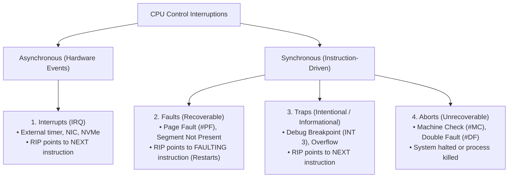
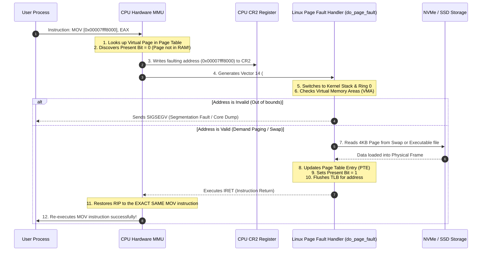

# Traps and Exceptions

> [!abstract] Mental Model
> While a hardware interrupt is an *asynchronous* tap on the shoulder from an external device (like a network card), a **Trap or Exception is a synchronous CPU event triggered directly by the instruction currently being executed**. It represents either an unexpected anomalous condition (e.g., divide by zero, page fault) or an intentional programmatic handoff (e.g., a debugger breakpoint or legacy system call).

---

## The Taxonomy of CPU Control Transfers

In processor architecture (x86 and ARM), CPU control interruptions are categorized into four distinct classes:



---

## Architectural Comparison: Faults vs Traps vs Aborts vs Interrupts

| Type | Synchronicity | Saved Return `RIP` Pointer | Recoverable? | Canonical Examples |
| :--- | :--- | :--- | :--- | :--- |
| **Fault** | Synchronous | Points to the **exact faulting instruction** | **Yes** (Kernel repairs condition and CPU re-executes instruction) | Page Fault (`#PF` Vector 14), Divide-by-Zero (`#DE` Vector 0), General Protection Fault (`#GP` Vector 13) |
| **Trap** | Synchronous | Points to the **subsequent instruction** | **Yes** (Used for notifications, debugging, system calls) | Breakpoint (`#BP` / `INT 3` Vector 3), Overflow (`#OF` Vector 4), Trap Flag single-stepping |
| **Abort** | Synchronous / Hardware | Unpredictable / Invalid | **No** (Fatal hardware error or cascading double fault) | Machine Check (`#MC` Vector 18), Double Fault (`#DF` Vector 8) |
| **Interrupt** | Asynchronous | Points to the **next instruction** | **Yes** (Normal background device notification) | Timer Tick, NIC Packet arrival, Keyboard stroke |

---

## The Anatomy of a Recoverable Fault: The Page Fault (`#PF`)

The Page Fault is the single most critical exception in modern virtual memory systems. It is **not necessarily an error**; it is the fundamental mechanism that enables [[Demand Paging and Page Faults|Demand Paging]], [[Copy-on-Write - CoW|Copy-on-Write (CoW)]], and memory-mapped files (`mmap`).



> [!important] Why Faults Must Save the Faulting `RIP`
> If a Page Fault saved the *next* instruction's address, the CPU would skip the memory read/write that triggered the fault, leading to silent memory corruption. By saving the *faulting* instruction's `RIP`, the CPU seamlessly retries the operation once the kernel has brought the missing page into physical RAM.

---

## How Debuggers Work: `INT 3` and the CPU Trap Flag

Software debuggers (such as `gdb`, `lldb`, and Go's `delve`) rely entirely on CPU hardware traps:

```text
Assembly Code of Target Application:
Original Code:
  0x401000: 48 89 5c 24 08    mov QWORD PTR [rsp+0x8], rbx
  0x401005: 48 89 6c 24 10    mov QWORD PTR [rsp+0x10], rbp

When you run "break *0x401000" in GDB:
1. GDB reads original byte 0x48 at 0x401000 and saves it internally.
2. GDB writes single-byte opcode 0xCC (INT 3) into memory at 0x401000.

Modified Code in Memory:
  0x401000: CC                int 3  (Breakpoint Trap)
  0x401001: 89 5c 24 08       ...

Execution:
1. CPU executes opcode 0xCC.
2. CPU generates Trap Vector 3 (#BP).
3. Kernel intercepts #BP and sends SIGTRAP signal to the parent process (GDB).
4. GDB restores the original byte 0x48 and gives you the interactive prompt.
```

### Hardware Single-Stepping: The Trap Flag (`TF`)
When you type `stepi` (single step) in a debugger:
1. GDB sets the **Trap Flag (`TF`, bit 8)** in the CPU's `RFLAGS` register.
2. The CPU executes exactly **one** machine instruction.
3. The CPU hardware automatically fires **Vector 1: Debug Exception (`#DB`)** after that single instruction finishes.
4. The debugger halts the program and displays the updated register state.

---

## The Double Fault (`#DF`) and IST (Interrupt Stack Table)

A **Double Fault (`#DF`, Vector 8)** occurs when the CPU encounters an exception while attempting to invoke the handler for a prior exception.

### The Classic Double Fault Scenario: Kernel Stack Overflow
```text
1. Kernel function encounters deep recursion or large stack allocation.
2. Kernel Stack overflows past its 8KB boundary into an unmapped guard page.
3. The CPU attempts to push user registers to trigger a Page Fault (#PF).
4. Pushing registers onto the overflowed stack fails (another Page Fault!).
5. The CPU detects an exception within an exception -> Escalates to Double Fault (#DF).
6. If the Double Fault handler uses the same broken stack, it triggers a TRIPLE FAULT.
7. Triple Fault causes the CPU hardware to immediately reset the computer (Instant Reboot).
```

### The Solution: The Interrupt Stack Table (IST)
In x86-64, the CPU **Task State Segment (TSS)** defines up to **7 dedicated, independent stacks (IST 1..7)**:

```text
Task State Segment (TSS) IST Pointers:
+-------------------------------------------------------------+
| IST 1 -> Dedicated Known-Good Stack for Double Fault (#DF)  |
| IST 2 -> Dedicated Known-Good Stack for Non-Maskable Int(NMI|
| IST 3 -> Dedicated Known-Good Stack for Machine Check (#MC) |
| IST 4 -> Dedicated Known-Good Stack for Debug Exception(#DB)|
+-------------------------------------------------------------+
```
When a Double Fault occurs, the CPU **forces `RSP` to point to IST 1**, guaranteeing that the kernel crash handler has a valid, uncorrupted stack to capture a register backtrace and print a crash log.

---

## Production Diagnostics & Observability Commands

```bash
# 1. Inspect kernel messages for CPU trap and segmentation fault logs
dmesg -T | grep -E "segfault|trap|divide error|general protection"
# Example Output:
# a.out[14521]: segfault at 0 ip 0000000000401126 sp 00007ffca7b823e0 error 4 in a.out

# 2. View minor (cached) vs major (disk I/O) page faults for a running process
ps -o pid,min_flt,maj_flt,cmd -p <PID>

# 3. System-wide page fault rate per second
sar -B 1 5
# Look at:
#   fault/s  : total page faults per second
#   majflt/s : major faults requiring disk read (critical performance indicator)

# 4. Check for Machine Check Exceptions (MCE - Hardware Memory/CPU errors)
sudo rasdaemon --record
```

---

## Common Production Signals Mapped to Exceptions

| CPU Exception Vector | Exception Name | Linux Signal Delivered to Process | Common Root Cause |
| :--- | :--- | :--- | :--- |
| **Vector 0** | `#DE` (Divide Error) | `SIGFPE` (Floating Point Exception) | Integer division by zero (`x / 0`) or modulo by zero. |
| **Vector 1** | `#DB` (Debug) | `SIGTRAP` | Hardware watchpoint hit or CPU Trap Flag single-step. |
| **Vector 3** | `#BP` (Breakpoint) | `SIGTRAP` | Software breakpoint (`int 3` / `0xCC`) hit in debugger. |
| **Vector 6** | `#UD` (Invalid Opcode) | `SIGILL` (Illegal Instruction) | Executing unsupported CPU instructions (e.g., AVX-512 on legacy CPU). |
| **Vector 13** | `#GP` (General Protection) | `SIGSEGV` | Privilege violation or writing to read-only memory segment. |
| **Vector 14** | `#PF` (Page Fault) | `SIGSEGV` (if invalid) / Transparently handled | Dereferencing NULL pointer, stack growth, demand paging, CoW. |
| **Vector 18** | `#MC` (Machine Check) | System Halt / Kernel Panic | Hardware ECC memory bit-flip or CPU bus parity error. |

---

## Active Recall & Interview Perspective

### Reasoning Prompts
1. *Why does a Page Fault restart the faulting instruction, whereas an Interrupt returns to the next instruction?*
   - **Answer**: A Page Fault is a synchronous **Fault**; the instruction failed to complete because its operand address was not mapped into physical RAM. Once the kernel brings the page into RAM, the instruction must be re-executed from scratch to actually perform the memory read/write. An Interrupt is an asynchronous external event unrelated to the current instruction; the current instruction already completed successfully before the interrupt was serviced, so execution must resume at the next instruction.
2. *What is a Triple Fault and what are its consequences in modern x86 hardware?*
   - **Answer**: A Triple Fault occurs when the CPU generates an exception while attempting to invoke the Double Fault (`#DF`) handler. Because the CPU cannot safely execute any further handlers, it asserts the hardware reset line, causing an immediate, ungraceful hard reboot of the machine.
3. *How does `gdb` catch a breakpoint without modifying the entire program binary on disk?*
   - **Answer**: `gdb` attaches to the running process using the `ptrace` system call, which temporarily marks the process's code segment writable. It overwrites the first byte of the target machine instruction in memory with `0xCC` (`INT 3`). When the CPU hits `0xCC`, it traps into the kernel, which notifies `gdb` via `SIGTRAP`.

---

## Key Takeaways
- **Exceptions and Traps are synchronous CPU events** generated directly by instruction execution.
- **Faults** (like Page Faults) restart the instruction; **Traps** (like Breakpoints) advance to the next instruction; **Aborts** halt execution.
- The **Interrupt Stack Table (IST)** provides isolated, dedicated stack frames to handle Double Faults and Machine Checks without crashing the kernel.

---

## Related Notes
- [[Operating System]] — Core architectural model.
- [[Kernel]] — Kernel execution and error trapping.
- [[Privilege Rings and CPU Modes]] — Hardware privilege gates.
- [[Interrupts and Interrupt Handling]] — Asynchronous hardware interrupt dispatching.
- [[System Calls]] — Intentional trap-based kernel transitions.
- [[Demand Paging and Page Faults]] — In-depth mechanics of virtual memory page fault resolution.
- [[Operating Systems MOC]] — Master table of contents for Operating Systems.
