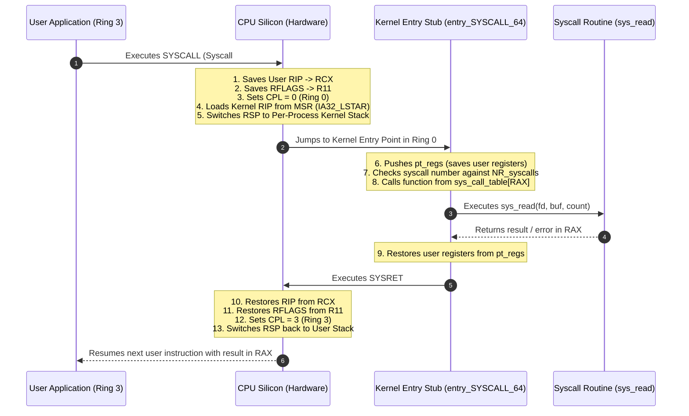
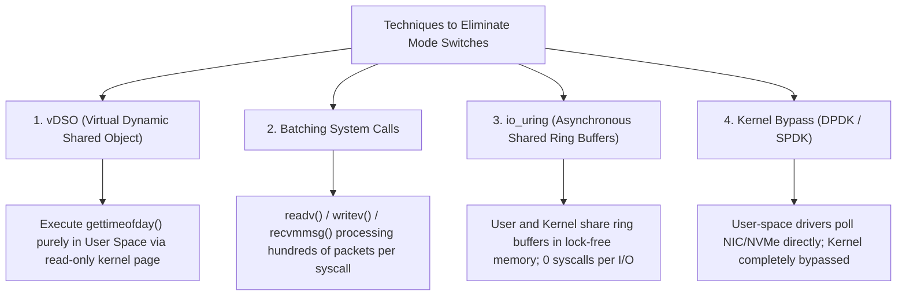

# User Mode vs Kernel Mode

> [!abstract] Mental Model
> User Mode and Kernel Mode are **two separate execution realities operating on the same physical CPU core**. User Mode is a strictly bounded, sandboxed virtual playground where an application can only touch its own private memory and cannot speak to hardware. Kernel Mode is the unrestricted, bare-metal operational tier where the OS kernel controls CPU registers, page mapping tables, physical interrupts, and hardware devices.

---

## Why This Exists

If an operating system allowed applications to run in the same privilege domain as the kernel:
1. **Zero Fault Isolation**: A single null-pointer dereference or buffer overflow in a user script would crash the entire physical computer, killing all concurrent tenants.
2. **Total Insecurity**: Any process could scan physical RAM to extract private encryption keys, database records, or passwords belonging to other users.
3. **Hardware Chaos**: Two processes writing to the disk controller registers simultaneously would corrupt disk partition tables and sector headers.

The separation between User Mode and Kernel Mode establishes a **hardware-guaranteed blast radius**: an application crash remains strictly confined to its own process.

---

## Architectural Comparison: User Mode vs Kernel Mode

```text
+-----------------------------------------------------------------------------------+
| FEATURE               | USER MODE (Ring 3 / EL0)      | KERNEL MODE (Ring 0 / EL1) |
+-----------------------------------------------------------------------------------+
| CPU Privilege (CPL)   | CPL = 3 (Unprivileged)        | CPL = 0 (Full Supervisor)  |
| Instruction Access    | Restricted instructions only  | All instructions enabled   |
| Memory Access         | Lower-half virtual memory only| All virtual & physical RAM |
| Direct Hardware I/O   | Strictly Forbidden            | Full Read / Write access   |
| Hardware Interrupts   | Handled automatically by CPU  | Can enable/disable (cli/sti|
| Active Stack          | User Stack (grows dynamically)| Dedicated Kernel Stack (8K)|
| Crash Consequence     | SIGSEGV / Process Death       | Kernel Panic / System Halt |
+-----------------------------------------------------------------------------------+
```

---

## Critical Distinction: Mode Switch vs Context Switch

A frequent point of confusion in system design interviews is conflating a **Mode Switch** with a **Context Switch**:

```mermaid
flowchart TD
    subgraph ModeSwitch ["Mode Switch (Privilege Transition)"]
        direction TB
        A1["Process A (User Mode: Ring 3)"] -->|SYSCALL / Interrupt| A2["Process A (Kernel Mode: Ring 0)"]
        A2 -->|SYSRET / IRET| A1
        Note1["Same Process A<br/>Same Virtual Memory (CR3 unchanged)<br/>Cost: ~50 - 150 ns"]
    end

    subgraph ContextSwitch ["Context Switch (Process / Thread Switch)"]
        direction TB
        B1["Process A (Kernel Mode)"] -->|CPU Scheduler / schedule()| B2["Process B (Kernel Mode)"]
        B2 -->|SYSRET| B3["Process B (User Mode)"]
        Note2["Different Processes<br/>Switch CR3 (Page Tables) + Flush TLB<br/>Cost: ~1 - 5 µs (High Cache Pollution)"]
    end
```

| Dimension | Mode Switch | Context Switch |
| :--- | :--- | :--- |
| **What Changes?** | CPU privilege level (Ring 3 $\leftrightarrow$ Ring 0) and stack pointer (`RSP`). | Active execution thread/process, CPU register state, and virtual address space. |
| **Address Space (`CR3`)**| **Unchanged** (except when KPTI is active). | **Changed** if switching between different processes (triggers TLB invalidation). |
| **Trigger** | `SYSCALL` instruction, software trap, or hardware interrupt. | Preemption timer tick, blocking I/O operation, yielding CPU (`sched_yield`). |
| **Overhead** | Fast (~50–150 nanoseconds). | Heavy (~1–5 microseconds + major CPU cache misses). |

> [!important] Key Takeaway
> **Every Context Switch between user processes requires a Mode Switch, but NOT every Mode Switch causes a Context Switch.** A simple `getpid()` system call performs a Mode Switch to Ring 0 and immediately returns to Ring 3 within the exact same process context.

---

## Step-by-Step Mechanics of a Mode Switch (x86-64)



---

## Cost Breakdown of Mode Transitions

Why do high-throughput backend engineers obsess over reducing mode switches?

1. **CPU Instruction Pipeline Flush**: The CPU's out-of-order execution pipeline and branch predictors must serialize and flush speculative instructions during ring transitions.
2. **Register Spilling (`struct pt_regs`)**: The kernel entry stub must save 15+ general-purpose registers to the kernel stack so user execution can be resumed identically.
3. **CPU Cache Pollution**: Kernel code paths touch kernel page tables, data structures, and memory buffers, displacing hot application data from L1/L2 CPU caches.
4. **Security Mitigations (KPTI Overhead)**: On Meltdown-vulnerable CPUs, **Kernel Page Table Isolation (KPTI)** forces the CPU to switch the `CR3` page table register twice on *every* mode switch (once entering Ring 0, once returning to Ring 3), multiplying overhead.

---

## High-Performance Engineering: Eliminating Mode Switches

Production systems employ specific architectures to avoid mode-switching penalties:



### 1. vDSO (Virtual Dynamic Shared Object)
For frequent read-only queries like `clock_gettime()`, `gettimeofday()`, and `time()`, the kernel maps a read-only memory page (**vvar/vdso**) directly into the user address space. The application reads hardware timer registers (e.g., `RDTSC`) and computes the time entirely in **User Mode without a single mode switch**.

### 2. `io_uring`
Modern Linux asynchronous I/O engine using two shared ring buffers (Submission Queue `SQ` and Completion Queue `CQ`) mapped in shared memory between User Space and Kernel Space. An application submits thousands of read/write requests by writing to the SQ without issuing a syscall, while a kernel worker thread drains them asynchronously.

### 3. Kernel Bypass (DPDK / SPDK)
Used in High-Frequency Trading (HFT) and ultra-low-latency packet processing. Dedicated NICs are unbound from the kernel network stack and mapped directly to user-space memory via memory-mapped I/O (MMIO). The application polls the hardware ring buffer in User Space, achieving sub-microsecond latencies.

---

## Production Diagnostics & Observability

### 1. Distinguishing User vs System CPU Usage
In production metrics (e.g., Prometheus / Datadog / `top`):
- **`%us` (User Time)**: Percentage of CPU spent executing user-space code (business logic, garbage collection, JSON parsing).
- **`%sy` (System Time)**: Percentage of CPU spent executing in **Kernel Mode** handling system calls, page faults, and software interrupts.

```bash
# Monitor User vs Kernel CPU utilization breakdown every 1 second
vmstat 1
# Columns of interest:
#   us: user mode time
#   sy: kernel mode time
#   cs: context switches per second
#   in: hardware interrupts per second
```

> [!tip] Performance Rule of Thumb
> If `%sy` exceeds **20–30%** on a database or backend server, the application is suffering from a **system call storm**, excessive context switching, or severe lock contention in kernel space.

### 2. Identifying High-Frequency System Calls
```bash
# Count and time all system calls for a process over 10 seconds
sudo strace -c -p <PID>

# Example Output:
# % time     seconds  usecs/call     calls    errors syscall
# ------ ----------- ----------- --------- --------- ----------------
#  65.42    0.045210           3     15000           futex
#  20.18    0.013940           1     10000           epoll_wait
#  14.40    0.009950           2      5000           read
```

---

## Failure Modes & Edge Cases

| Failure Mode | Root Cause | System Behavior | Mitigation |
| :--- | :--- | :--- | :--- |
| **Kernel Mode Dereference of Invalid User Pointer** | Application passes a bogus pointer (e.g. `0x00`) to a syscall (`read(fd, NULL, 1024)`). | If unchecked, kernel would crash with Page Fault in Ring 0. Kernel uses `copy_from_user()` / `access_ok()` to return `EFAULT` safely. | Always validate user pointers; hardware SMAP enforces this. |
| **System Call Storm / Mode Switch Overhead** | Application issues millions of tiny individual syscalls (e.g., `write()` 1 byte at a time in a loop). | `%sy` spikes to 90%, application throughput collapses. | Use buffered I/O (`BufferedReader`, `fread`), batch syscalls (`writev`), or use `io_uring`. |
| **Signal Delivery across Mode Boundary** | Delivering an asynchronous signal (`SIGINT`, `SIGTERM`) requires the kernel to construct a fake stack frame on the user stack and force a return to the signal handler in User Mode. | Signal handler overhead, potential user stack overflow if stack is small. | Use `sigaltstack()` for dedicated signal execution stacks. |

---

## Active Recall & Interview Perspective

### Reasoning Prompts
1. *Does a system call always trigger a context switch?*
   - **Answer**: No. A system call triggers a **mode switch** from User Mode to Kernel Mode. If the requested operation is immediate (e.g., `getpid()` or reading cached data from the Page Cache), the kernel executes the request and returns immediately to the same process in User Mode without any context switch. It only triggers a context switch if the process must block (e.g., waiting for disk I/O, network packet, or a locked mutex).
2. *Why is `clock_gettime()` so fast in modern Linux compared to legacy Unix systems?*
   - **Answer**: Modern Linux uses the **vDSO** (Virtual Dynamic Shared Object), mapping a read-only page of kernel timing data into user space. The C library reads the CPU's hardware cycle counter (`RDTSC`) and calculates wall-clock time directly in User Mode without executing the `SYSCALL` instruction or switching privilege rings.
3. *What prevents a malicious user program from reading kernel memory mapped in the upper half of its virtual address space?*
   - **Answer**: The hardware MMU page table entries for the upper-half addresses have the **User/Supervisor (U/S) bit set to 0 (Supervisor only)**. When the CPU is executing with `CPL = 3` (User Mode), any instruction attempting to read or write an address with `U/S = 0` causes the hardware MMU to trigger an immediate **Page Fault (`#PF`)**, halting execution before any data is leaked.

---

## Key Takeaways
- **User Mode (Ring 3)** is isolated and safe; **Kernel Mode (Ring 0)** is all-powerful and privileged.
- A **Mode Switch** changes CPU privilege levels within the same process; a **Context Switch** swaps the running process/thread and changes virtual address spaces.
- High-performance systems minimize mode switching using **vDSO**, **I/O batching**, **`io_uring`**, and **Kernel Bypass (DPDK)**.

---

## Related Notes
- [[Operating System]] — Architecture and resource multiplexing.
- [[Kernel]] — Subsystems and execution contexts in Ring 0.
- [[Privilege Rings and CPU Modes]] — Hardware architecture behind protection levels.
- [[System Calls]] — Deep dive into the syscall interface and dispatch table.
- [[Context Switching]] — Mechanics, CPU cache impact, and scheduling costs.
- [[Operating Systems MOC]] — Master table of contents for Operating Systems.
