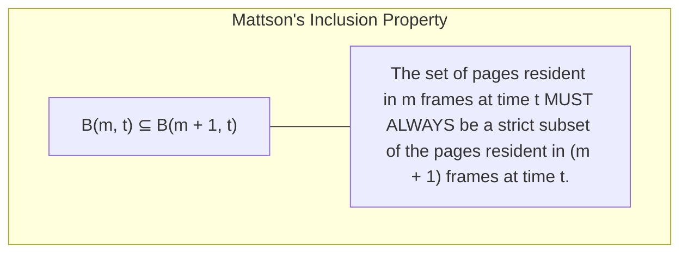
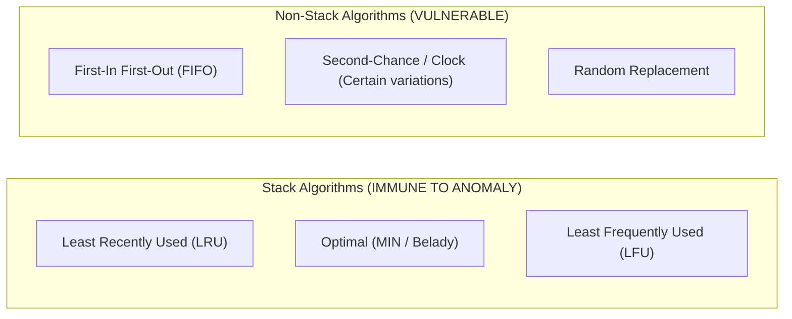

# Belady's Anomaly

> [!abstract] Mental Model
> Belady's Anomaly is the **Braess's Paradox of Computer Memory**:
> - Everyday intuition dictates: *"If I buy more physical RAM (more page frames), my system MUST experience fewer page faults."*
> - In 1969, computer scientist **Laszlo Belady proved mathematically** that under certain replacement policies (**FIFO**), allocating **more physical memory frames can paradoxically INCREASE the total number of page faults**.

---

## Formal Definition

> [!danger] Definition: Belady's Anomaly
> A phenomenon in non-stack page replacement algorithms where increasing the number of physical page frames allocated to a process results in an **increased (or equal) number of page faults** for the exact same memory reference string.

$$\mathbf{M_1 < M_2 \quad \text{yet} \quad \text{Faults}(M_1) < \text{Faults}(M_2)}$$

---

## Step-by-Step Mathematical Proof Trace

Consider the canonical 12-reference string:
$$\mathbf{1, \ 2, \ 3, \ 4, \ 1, \ 2, \ 5, \ 1, \ 2, \ 3, \ 4, \ 5}$$

```mermaid
flowchart TD
    subgraph ThreeFrames ["Simulation A: 3 Physical Frames (FIFO)"]
        A1["Ref 1 -> [1, -, -] (Fault 1)"]
        A2["Ref 2 -> [1, 2, -] (Fault 2)"]
        A3["Ref 3 -> [1, 2, 3] (Fault 3)"]
        A4["Ref 4 -> [4, 2, 3] (Fault 4 - Evict 1)"]
        A5["Ref 1 -> [4, 1, 3] (Fault 5 - Evict 2)"]
        A6["Ref 2 -> [4, 1, 2] (Fault 6 - Evict 3)"]
        A7["Ref 5 -> [5, 1, 2] (Fault 7 - Evict 4)"]
        A8["Ref 1 -> [5, 1, 2] (HIT!)"]
        A9["Ref 2 -> [5, 1, 2] (HIT!)"]
        A10["Ref 3 -> [5, 3, 2] (Fault 8 - Evict 1)"]
        A11["Ref 4 -> [5, 3, 4] (Fault 9 - Evict 2)"]
        A12["Ref 5 -> [5, 3, 4] (HIT!)"]
        A_Result["TOTAL FAULTS WITH 3 FRAMES = 9 FAULTS"]
        
        A1 --> A2 --> A3 --> A4 --> A5 --> A6 --> A7 --> A8 --> A9 --> A10 --> A11 --> A12 --> A_Result
    end

    subgraph FourFrames ["Simulation B: 4 Physical Frames (FIFO)"]
        B1["Ref 1 -> [1, -, -, -] (Fault 1)"]
        B2["Ref 2 -> [1, 2, -, -] (Fault 2)"]
        B3["Ref 3 -> [1, 2, 3, -] (Fault 3)"]
        B4["Ref 4 -> [1, 2, 3, 4] (Fault 4)"]
        B5["Ref 1 -> [1, 2, 3, 4] (HIT!)"]
        B6["Ref 2 -> [1, 2, 3, 4] (HIT!)"]
        B7["Ref 5 -> [5, 2, 3, 4] (Fault 5 - Evict 1)"]
        B8["Ref 1 -> [5, 1, 3, 4] (Fault 6 - Evict 2)"]
        B9["Ref 2 -> [5, 1, 2, 4] (Fault 7 - Evict 3)"]
        B10["Ref 3 -> [5, 1, 2, 3] (Fault 8 - Evict 4)"]
        B11["Ref 4 -> [4, 1, 2, 3] (Fault 9 - Evict 5)"]
        B12["Ref 5 -> [4, 5, 2, 3] (Fault 10 - Evict 1)"]
        B_Result["TOTAL FAULTS WITH 4 FRAMES = 10 FAULTS!"]
        
        B1 --> B2 --> B3 --> B4 --> B5 --> B6 --> B7 --> B8 --> B9 --> B10 --> B11 --> B12 --> B_Result
    end
```

### The Anomaly Confirmed:
- **3 Frames**: Yields **9 Page Faults**.
- **4 Frames**: Yields **10 Page Faults** ($+11.1\%$ worse performance despite $+33.3\%$ more RAM!).

---

## Why Does This Happen? Mattson's Stack Principle (1970)

In 1970, computer scientist **Robert Mattson** formulated the mathematical foundation explaining why some algorithms suffer from Belady's Anomaly while others are strictly immune:

---

### The Stack Algorithm Invariant:
If an algorithm obeys the **Inclusion Property**, any page that would hit in an $m$-frame system is **guaranteed** to hit in an $(m+1)$-frame system.

---

## Stack Algorithm Proof: Why LRU is Mathematically Immune

In **LRU**, the $m$ pages resident in memory at any instant $t$ are strictly the $m$ most recently referenced unique pages. 

If we expand memory capacity to $m + 1$ frames, the resident set at time $t$ becomes the $m + 1$ most recently referenced unique pages. By definition:

$$\mathbf{\text{Top } m \text{ most recent pages} \subset \text{Top } (m + 1) \text{ most recent pages}}$$

Therefore:
$$\mathbf{B_{\text{LRU}}(m, t) \subset B_{\text{LRU}}(m + 1, t) \quad \forall t}$$

Because the $m$-frame contents are always contained within the $(m+1)$-frame contents, **a page hit in $m$ frames can NEVER become a page fault in $m+1$ frames**. LRU is mathematically guaranteed to be monotonic.

---

## Active Recall & Interview Perspective

### Reasoning Prompts
1. *What is Belady's Anomaly, and which common page replacement algorithm suffers from it?*
   - **Answer**: Belady's Anomaly is the counter-intuitive phenomenon where allocating more physical memory frames to a process causes an increase in total page faults for a given memory reference string. It occurs in **FIFO (First-In First-Out)** page replacement because FIFO evicts pages based solely on entry arrival time rather than access recency or frequency, causing it to discard critical working-set pages that happened to arrive early.
2. *What is a Stack Algorithm, and what property makes it immune to Belady's Anomaly?*
   - **Answer**: A **Stack Algorithm** is a class of page replacement algorithms that satisfies **Mattson's Inclusion Property**: at any point in time $t$, the set of pages held in memory with $m$ frames is a strict subset of the set of pages that would be held with $m + 1$ frames ($B(m, t) \subseteq B(m+1, t)$). Because every page present in smaller memory is guaranteed to be present in larger memory, increasing frame count can never convert a page hit into a page fault. **LRU** and **Optimal (MIN)** are provably stack algorithms and thus strictly immune.
3. *Can Belady's Anomaly occur in the Optimal (MIN) page replacement algorithm?*
   - **Answer**: **No.** Optimal page replacement always evicts the page whose next reference is farthest in the future. At any time $t$, an $m$-frame system contains the $m$ pages whose next references occur earliest in the future, while an $(m+1)$-frame system contains those same $m$ pages plus one additional page. Because $B_{\text{OPT}}(m, t) \subset B_{\text{OPT}}(m+1, t)$, Optimal satisfies the inclusion property and is mathematically immune to Belady's Anomaly.

---

## Key Takeaways
- **Belady's Anomaly** proves that FIFO replacement can cause **more page faults when given more RAM**.
- **Mattson's Inclusion Property ($B(m) \subseteq B(m+1)$)** defines **Stack Algorithms**, which are mathematically immune.
- **LRU and Optimal** are stack algorithms (immune); **FIFO and Random** are non-stack algorithms (vulnerable).

---

## Related Notes
- [[Operating System]] — Memory subsystem.
- [[Paging Architecture]] — Frame allocation.
- [[Demand Paging and Page Faults]] — Faulting mechanics.
- [[Page Replacement Algorithms - FIFO, LRU, Clock, Optimal]] — Core replacement algorithms.
- [[Working Set Model and Thrashing]] — Working set and system collapse.
- [[Operating Systems MOC]] — Master table of contents for Operating Systems.
