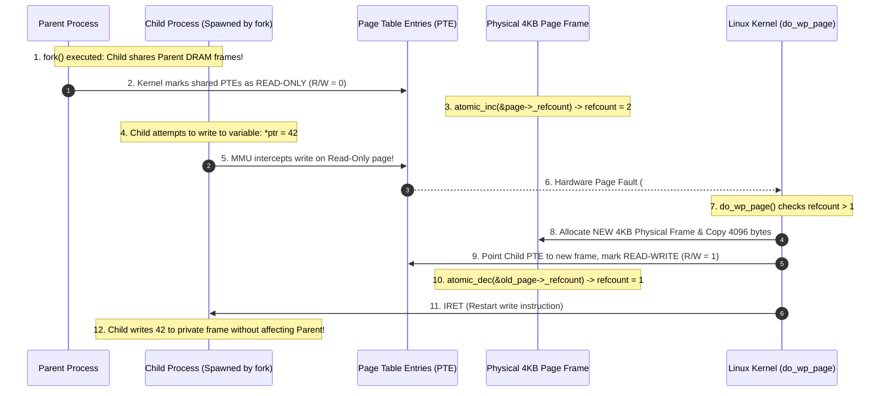
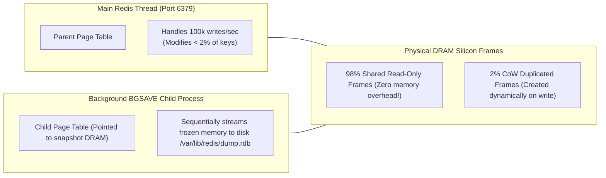
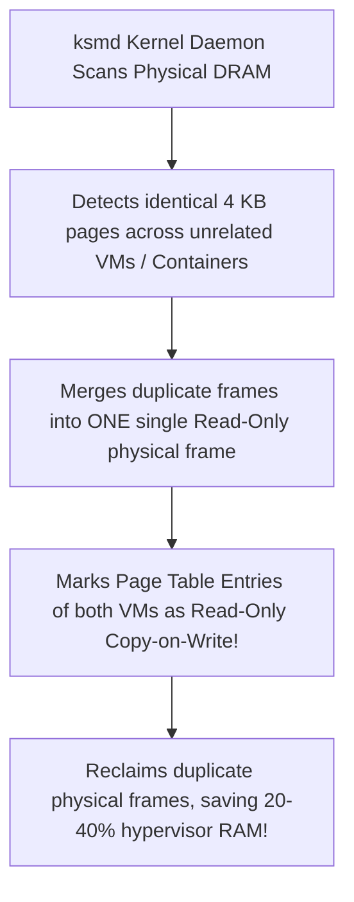

# Copy-on-Write (CoW)

> [!abstract] Mental Model
> Copy-on-Write is a **shared read-only Google Doc that only creates a private branch when you type a modification**:
> - In early UNIX, `fork()` physically cloned every byte of the parent process's memory into new DRAM chips. For a 16 GB database, `fork()` would stall the server for 200 ms and demand an extra 16 GB of RAM, only for the child to call `execve()` 5 microseconds later and discard the copied memory entirely.
> - With **Copy-on-Write (CoW)**, `fork()` takes **$< 10\ \mu\text{s}$**: the child simply receives a duplicate page table pointing to the **exact same physical DRAM frames as the parent**, with all shared pages marked **Read-Only**. Physical duplication only occurs if and when a process writes to a specific 4 KB page.

---

## The CoW Execution Lifecycle



---

## Kernel Internal Mechanics: `do_wp_page()`

When a write-protection fault occurs on a CoW page, the Linux kernel executes `do_wp_page()` (`mm/memory.c`):

```mermaid
flowchart TD
    Fault["Hardware #PF (Protection Violation on Write)"] --> CheckRef{"page_count(page) == 1?"}
    
    CheckRef -->|YES (Sole Remaining Owner)| Reuse["Fast Path: No Memory Copy Needed!<br/>• Mark PTE as Read-Write (R/W = 1)<br/>• Execute INVLPG to flush TLB entry"]
    
    CheckRef -->|NO (Multiple References)| Clone["Slow Path: Allocate & Duplicate<br/>1. alloc_page(GFP_HIGHUSER_MOVABLE)<br/>2. cow_user_page(new_page, old_page) -> 4KB memcpy<br/>3. Set Child PTE = new_pfn (R/W = 1)<br/>4. atomic_dec(&old_page->_refcount)"]
    
    Reuse --> Resume["Resume CPU Execution"]
    Clone --> Resume
```

---

## Production Impact: The Redis Fork-Snapshot Architecture

Redis relies fundamentally on Copy-on-Write for non-blocking persistence (**RDB Background Save - `BGSAVE`** and **AOF Rewrite**):



> [!important] The Redis CoW Memory Trap
> If a workload performs high-frequency random writes across 100% of its database keys during a `BGSAVE`, Copy-on-Write will gradually duplicate *every single page frame*, causing memory usage to balloon by $2\times$ and risking immediate termination by the Linux **OOM Killer**.

---

## The Inverse of CoW: Kernel Samepage Merging (KSM)

While CoW splits pages on write, **Kernel Samepage Merging (KSM - `mm/ksm.c`)** performs the reverse operation:



---

## Production Commands & CoW Monitoring

```bash
# 1. Inspect Copy-on-Write memory footprint for a process in /proc/PID/smaps
cat /proc/<PID>/smaps | grep -i "cow"
# Output:
# Shared_Clean:      102400 kB (Shared CoW memory untouched)
# Shared_Dirty:           0 kB
# Private_Dirty:       4096 kB (Memory written and duplicated via CoW)

# 2. Monitor Kernel Samepage Merging (KSM) deduplication metrics
cat /sys/kernel/mm/ksm/pages_sharing
# (Number of physical page frames saved by KSM deduplication)
```

---

## Active Recall & Interview Perspective

### Reasoning Prompts
1. *Why does Linux mark shared pages as Read-Only in BOTH the Parent and Child page tables during `fork()`?*
   - **Answer**: The kernel cannot predict whether the parent or the child will be the first process to perform a write operation. By marking the Page Table Entries of **both** processes as Read-Only (`R/W = 0`), the hardware MMU guarantees that whichever process attempts to write first will trigger a write-protection Page Fault (`#PF`). This trap gives the kernel control to allocate a new physical frame, duplicate the 4KB contents, update only the writing process's PTE to point to the new frame with write permissions (`R/W = 1`), and leave the other process referencing the original frame untouched.
2. *What is the difference between `fork()` and `vfork()` in systems programming?*
   - **Answer**: `fork()` creates a new process with an independent copy of the parent's page tables protected by Copy-on-Write; parent and child run concurrently in separate address spaces. `vfork()` was an early optimization created before hardware CoW was efficient: `vfork()` completely suspends the parent process while the child borrows the parent's exact address space and page tables without copying anything. The child is strictly forbidden from modifying memory or returning from the function, and must immediately call `execve()` or `_exit()`, after which the parent process resumes. Today, standard `fork()` with CoW or `posix_spawn()` is preferred.
3. *Why does a memory-heavy process experience a sudden spike in Minor Page Faults immediately following a `fork()` call?*
   - **Answer**: After a `fork()`, all writable heap and stack pages are marked Read-Only in both parent and child page tables. As the parent and child resume executing and write to their local variables or data structures, every single initial write to a distinct $4\text{ KB}$ page triggers a write-protection Page Fault. Because the page is already in physical DRAM, the kernel resolves these traps in microseconds via `do_wp_page()` without disk I/O, recording them as a large burst of **Minor Page Faults**.

---

## Key Takeaways
- **Copy-on-Write (CoW)** enables near-instantaneous `fork()` by sharing physical frames and deferring duplication until an actual write occurs.
- The kernel traps writes via **Read-Only (`R/W = 0`) PTEs**, handling duplication in **`do_wp_page()`** and tracking owners via `struct page._refcount`.
- CoW powers **Redis background snapshots** and the **Fork-Exec** pattern, while **KSM** performs reverse CoW memory deduplication.

---

## Related Notes
- [[Operating System]] — Memory subsystem fundamentals.
- [[Process Creation and Termination - fork, exec, wait, exit]] — `fork()` internals.
- [[Paging Architecture]] — PTE bitfield permissions.
- [[Demand Paging and Page Faults]] — Faulting mechanisms.
- [[Virtual Memory Architecture]] — Virtual memory structures.
- [[Page Replacement Algorithms - FIFO, LRU, Clock, Optimal]] — Page eviction policies.
- [[Operating Systems MOC]] — Master table of contents for Operating Systems.
