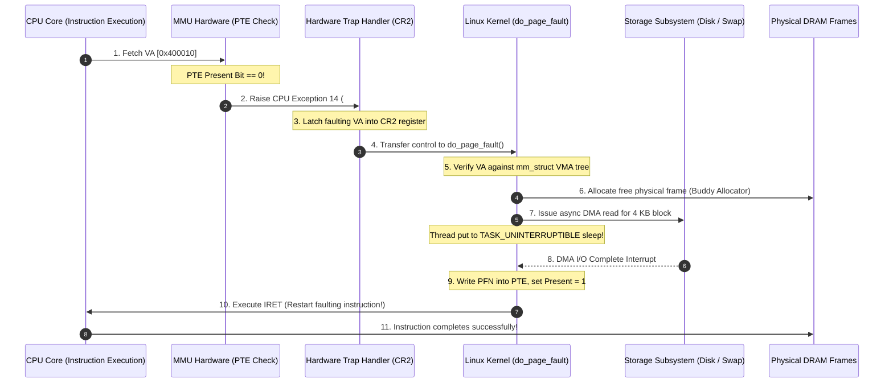
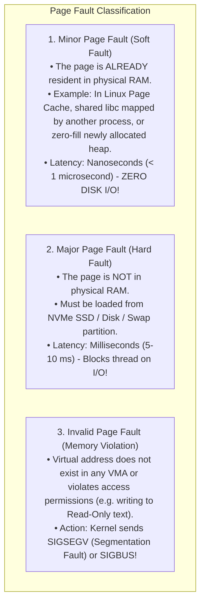

# Demand Paging and Page Faults

> [!abstract] Mental Model
> Demand paging is **video streaming (YouTube / Netflix) vs downloading a 100 GB Blu-Ray disc**:
> - In legacy batch operating systems, an entire 100 MB program had to be copied sequentially into physical DRAM before the CPU could execute instruction 0.
> - With **Demand Paging (Lazy Loading)**, a process launches in **0.1 milliseconds with 0 pages in RAM**. When the CPU tries to execute instruction 0, the hardware encounters an unmapped page and raises a **Page Fault (`#PF`)**. The kernel catches the trap, loads that single $4\text{ KB}$ page into RAM, and resumes the CPU. **Pages are only materialized when touched.**

---

## The 6-Step Hardware Page Fault Sequence



---

## Page Fault Taxonomy: Minor vs Major vs Invalid



---

## The Economic Math of Page Fault Service Time

The mathematical formula governing **Effective Memory Access Time (EAT)** with Demand Paging:

$$\mathbf{\text{EAT} = (1 - p) \cdot t_{\text{RAM}} + p \cdot t_{\text{PageFault}}}$$

- $p$: **Page Fault Rate** ($0 \le p \le 1$).
- $t_{\text{RAM}}$: DRAM access latency ($\approx 100\text{ ns}$).
- $t_{\text{PageFault}}$: Major page fault service time from storage ($\approx 8\text{ ms} = 8,000,000\text{ ns}$).

---

### Numerical Proof of Acceptable Page Fault Rates:
Suppose we want memory access performance degradation to remain **under $10\%$** ($\text{EAT} \le 110\text{ ns}$):

$$110\text{ ns} = (1 - p) \cdot 100\text{ ns} + p \cdot (8,000,000\text{ ns})$$
$$110 = 100 - 100p + 8,000,000p$$
$$10 = 7,999,900p \implies \mathbf{p < 0.00000125 \quad (1 \text{ fault per } 800,000 \text{ memory accesses!})}$$

> [!important] The Locality Anchor
> If programs did not exhibit strong **Temporal and Spatial Locality of Reference**, demand paging would collapse modern computers into continuous disk thrashing.

---

## Linux Hardware Registers: `CR2` and Error Codes

When an x86 CPU raises Exception Vector 14 (`#PF`), the hardware provides the kernel with two critical diagnostic pieces:

1. **`CR2` Control Register**: Automatically captures the exact 64-bit Virtual Address that triggered the fault.
2. **Hardware Error Code (Pushed to Stack)**:
   - **Bit 0 (`P`)**: `0` = Fault caused by non-present page; `1` = Fault caused by page-protection violation.
   - **Bit 1 (`W/R`)**: `0` = Fault occurred on Memory Read; `1` = Fault occurred on Memory Write.
   - **Bit 2 (`U/S`)**: `0` = Fault occurred in Kernel Mode (Ring 0); `1` = Fault occurred in Userspace (Ring 3).
   - **Bit 4 (`I/D`)**: `1` = Fault occurred during Instruction Fetch (Violation of `NX` No-Execute bit).

---

## Production Diagnostics & Performance Monitoring

```bash
# 1. View live Minor vs Major page faults for a running process
ps -o pid,min_flt,maj_flt,cmd -p <PID>

# Output format:
#   PID  MINFL  MAJFL CMD
# 24810 184512      4 /usr/bin/node server.js
# (High MAJFL indicates severe memory pressure, disk swapping, or cold startup!)

# 2. Measure page fault metrics during execution using perf
perf stat -e page-faults,minor-faults,major-faults ./my_workload
```

---

## Active Recall & Interview Perspective

### Reasoning Prompts
1. *Why does the CPU hardware restart the exact instruction that triggered a Page Fault rather than moving to the next instruction?*
   - **Answer**: A Page Fault is classified as a CPU **Fault** (a restartable exception), not a Trap or Abort. When an instruction like `MOV RAX, [RDI]` faults, the read operation was never completed because the target page was not in DRAM. The kernel's `#PF` handler resolves the missing page, updates the page table, and executes `IRET`, restoring the Instruction Pointer (`RIP`) back to the *same* `MOV` instruction so the CPU can execute it properly now that the data is resident in memory.
2. *What is the difference between a Minor Page Fault and a Major Page Fault in Linux?*
   - **Answer**: A **Minor Page Fault** occurs when the required page is already in physical DRAM (for example, shared library code loaded by another process, cached file data in the OS Page Cache, or a zero-filled anonymous heap page), requiring only page table entry updates without disk I/O (taking $< 1\ \mu\text{s}$). A **Major Page Fault** occurs when the page does not exist in physical RAM and must be read from disk storage or swap space, blocking the thread on asynchronous DMA I/O for milliseconds.
3. *What happens inside `do_page_fault()` when a process dereferences a `NULL` pointer (`*(int*)0 = 5;`)?*
   - **Answer**: The CPU attempts to write to virtual address `0x00000000`. The MMU finds `Present = 0` and triggers a `#PF` exception, latching `0x0` into `CR2`. The Linux kernel `do_page_fault()` handler searches the process's `mm_struct` Red-Black tree for a `vm_area_struct` covering address `0x0`. Because valid user VMAs typically begin at `0x400000` (leaving the low 4 MB unmapped as a null-pointer guard zone), no VMA matches. The kernel identifies an unmapped illegal memory access and dispatches a `SIGSEGV` (Segmentation Fault) signal, terminating the process and generating a core dump.

---

## Key Takeaways
- **Demand Paging** loads pages into physical RAM lazily upon initial memory reference, minimizing process startup latency and memory consumption.
- A **Page Fault (`#PF`)** triggers hardware exception 14, latching the target address into **`CR2`** and invoking `do_page_fault()`.
- **Minor Page Faults** resolve in RAM with zero disk I/O, while **Major Page Faults** block on storage I/O.

---

## Related Notes
- [[Operating System]] — Core exception handling.
- [[Traps and Exceptions]] — Exception vector classifications.
- [[Process Address Space]] — Virtual address mappings.
- [[Paging Architecture]] — Page Table Entry flags (`Present`).
- [[Page Tables and Multi-Level Page Tables]] — Page table walk mechanics.
- [[Virtual Memory Architecture]] — Global VMA subsystem.
- [[Copy-on-Write - CoW]] — CoW page fault mechanics.
- [[Operating Systems MOC]] — Master table of contents for Operating Systems.
