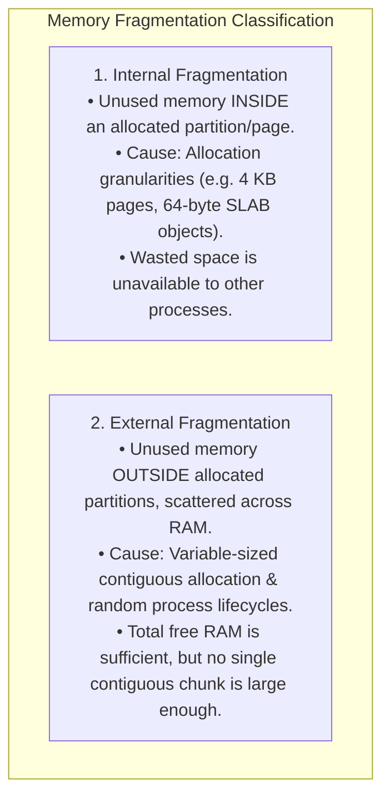
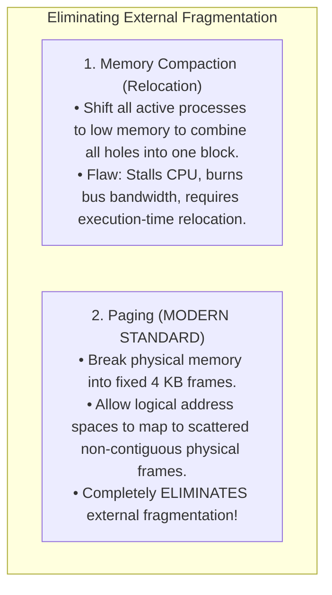
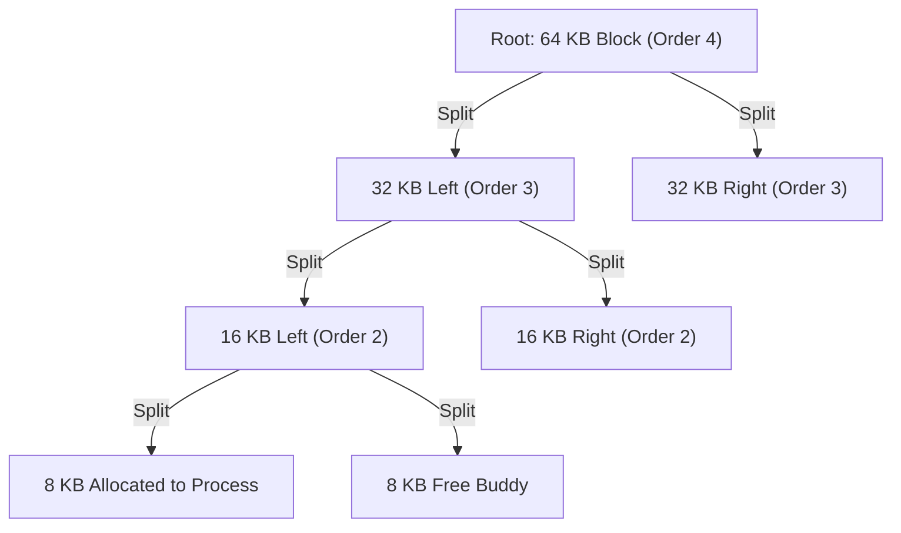

# Internal vs External Fragmentation

> [!abstract] Mental Model
> Consider storage waste in a logistics warehouse:
> - **Internal Fragmentation (The Oversized Box)**: You rent an entire $40\text{-foot}$ shipping container ($4\text{ KB}$ page) to ship a single pair of shoes ($64\text{ bytes}$). The wasted space sits **inside the allocated boundary**, locked away and unusable by anyone else.
> - **External Fragmentation (The Scattered Floor)**: A warehouse floor has $100\text{ MB}$ of total free space, but it is shattered into thousands of tiny $20\text{ KB}$ gaps between stored boxes. When a customer arrives with a $2\text{ MB}$ pallet requiring contiguous space, **the warehouse rejects the order even though total free space vastly exceeds $2\text{ MB}$**.

---

## Architectural Comparison Matrix



| Dimension | Internal Fragmentation | External Fragmentation |
| :--- | :--- | :--- |
| **Location of Waste** | **Inside** the process's allocated partition/page frame. | **Outside** allocated partitions, in the gaps between processes. |
| **Underlying Cause** | Fixed-size allocation quanta ($4\text{ KB}$ pages, power-of-two blocks). | Variable-sized allocations with dynamic contiguous placement. |
| **System Paradigm** | **Paging systems**, Fixed Partitioning (MFT), SLAB allocators. | **Contiguous allocation (MVT)**, pure Segmentation. |
| **Mathematical Average** | Approximately **$0.5 \times \text{Page Size}$** per allocated segment. | Up to **$\approx 33\text{–}50\%$** of total memory capacity (Knuth's Rule). |
| **Architectural Solution** | Smaller page sizes, multi-size SLAB/SLUB object caches. | **Paging (Non-contiguous mapping)**, Memory Compaction. |

---

## The Mathematical Foundation: Knuth's 50-Percent Rule

Pioneered by Donald Knuth in *The Art of Computer Programming*, the **50-Percent Rule** governs equilibrium systems using First-Fit dynamic contiguous allocation:

$$\mathbf{H \approx 0.5 \times N}$$

- **Theorem**: If $N$ allocated blocks are active in memory, the system will naturally equilibrate to approximately **$0.5 N$ free holes**.
- **The Consequence**: As a result of these scattered holes, approximately **one-third ($33\%$) of total physical memory is rendered unusable** due to external fragmentation.

---

## Solutions to External Fragmentation



---

## The Linux Kernel Solution: The Binary Buddy Allocator

To manage physical DRAM page allocation while minimizing external fragmentation, the Linux kernel utilizes the **Binary Buddy System** (`mm/page_alloc.c`):



---

### Buddy Allocation Mechanics:
1. **Power-of-Two Allocation**: Memory is divided into blocks of size $2^0, 2^1, \dots, 2^{10}$ pages ($4\text{ KB}$ to $4\text{ MB}$ in Linux).
2. **Recursive Splitting**: When an 8 KB block is requested and only 64 KB is free, the allocator repeatedly bisects the block into equal pairs ("Buddies") until an 8 KB block is produced.
3. **Hardware Bitwise Buddy Address Calculation**:
   $$\mathbf{\text{Buddy Address} = \text{Address} \oplus (1 \ll \text{Order})}$$
4. **Coalescing on Free**: When a block is freed, the kernel computes its buddy's address in $O(1)$ time. If the buddy is also free, they instantly merge back into a higher-order block, preventing external fragmentation from accumulating.

---

## Production SLAB/SLUB Layer: Neutralizing Internal Fragmentation

While the Buddy Allocator manages coarse $4\text{ KB}$ pages, kernel data structures (`struct task_struct`, `struct inode`, `struct file`) are only tens or hundreds of bytes. Allocating a full $4\text{ KB}$ page for a 128-byte struct would cause **$96.8\%$ internal fragmentation**.

The Linux **SLUB (Slab Allocator)** carves Buddy pages into pre-sized object pools:


---

## Production Inspection: Linux Fragmentation Metrics

```bash
# 1. Inspect Physical Memory Fragmentation across Buddy Orders (0 = 4KB, 10 = 4MB)
cat /proc/buddyinfo

# Output format:
# Node 0, zone Normal  120  45  30  12   4   2   1   0   0   0   0
# (Notice: As high orders drop to 0, external fragmentation prevents large allocations!)

# 2. Check Slab Cache usage and internal object sizing
sudo slabtop
```

---

## Active Recall & Interview Perspective

### Reasoning Prompts
1. *Why does Paging completely eliminate External Fragmentation while introducing Internal Fragmentation?*
   - **Answer**: Paging eliminates external fragmentation because physical memory is divided into uniform fixed-size units called **Page Frames** ($4\text{ KB}$). Any free frame anywhere in physical DRAM can satisfy a page allocation for any process, eliminating the requirement for contiguous physical memory. However, because a process's memory demand rarely matches an exact multiple of $4\text{ KB}$, the final page allocated to a process is only partially filled, leaving the remainder of that $4\text{ KB}$ frame unused as **Internal Fragmentation** (averaging $2\text{ KB}$ per allocated segment).
2. *How does the Buddy Allocator calculate the address of a block's buddy in $O(1)$ time?*
   - **Answer**: Because all buddy blocks are aligned to power-of-two boundaries ($2^k$), the starting address of a block and its buddy differ in exactly **one bit**—the bit at position $k$. The allocator computes the buddy's address instantaneously using a single bitwise XOR instruction: `buddy_address = block_address ^ (1 << k)`.
3. *What is Memory Compaction and why is it expensive in production servers?*
   - **Answer**: Memory Compaction is the process of sweeping through fragmented physical RAM, shifting all active memory blocks toward one contiguous end, and merging all scattered free holes into a single massive free block. It is computationally expensive because it requires stopping or pausing processes, updating memory descriptors/page tables, and copying gigabytes of raw memory over the memory bus, creating severe latency spikes and cache-line invalidations.

---

## Key Takeaways
- **Internal Fragmentation**: Wasted space *inside* fixed-size allocated units ($4\text{ KB}$ pages, SLAB slots).
- **External Fragmentation**: Scattered free space *outside* allocations that cannot satisfy contiguous requests; governed by **Knuth's 50% Rule**.
- The **Linux Buddy Allocator** and **SLUB Cache** pair power-of-two frame coalescing with fine-grained object pools to minimize both fragmentation vectors.

---

## Related Notes
- [[Operating System]] — Memory architecture.
- [[Logical vs Physical Address Space]] — Virtual-to-physical layers.
- [[Memory Allocation - Contiguous, Fixed, Variable Partitioning]] — Allocation algorithms.
- [[Paging Architecture]] — The universal solution to external fragmentation.
- [[Segmentation]] — Segmentation and fragmentation.
- [[Virtual Memory Architecture]] — Virtual memory management.
- [[Operating Systems MOC]] — Master table of contents for Operating Systems.
