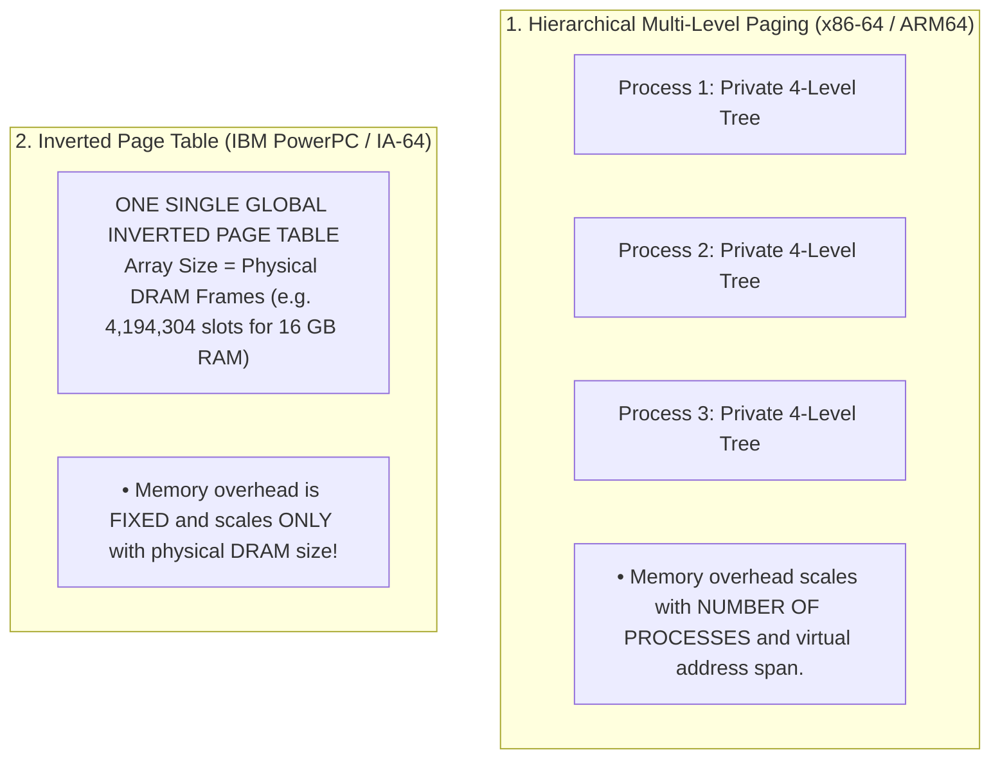
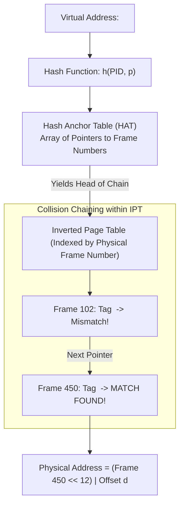
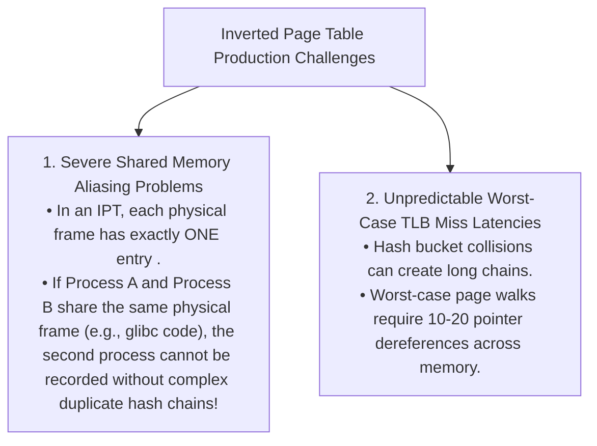

# Inverted Page Tables (IPT)

> [!abstract] Mental Model
> Consider a **luxury hotel key rack vs guest registration ledgers**:
> - **Hierarchical Page Tables** give every guest (process) their own massive 1,000-page book listing every possible room they *might* visit.
> - An **Inverted Page Table (IPT)** is a **single master key rack behind the reception desk indexed by physical room number (Frame)**. Hook #42 holds a tag reading: *"Occupied by Guest 104 (PID), Room 5 (Virtual Page)"*. 
> - Because there is **only one entry per physical DRAM frame**, the total page table memory overhead is fixed to a tiny fraction of physical RAM, **completely independent of how many thousands of processes are running**.

---

## Architectural Taxonomy: Per-Process vs Inverted Page Tables

---

## The Mathematical Memory Savings

For a system with $16\text{ GB}$ physical DRAM and $4\text{ KB}$ page frames:

$$\text{Total Physical Frames} = \frac{16\text{ GB}}{4\text{ KB}} = 4,194,304\text{ frames}$$
$$\text{IPT Entry Size} = 16\text{ bytes } (\text{PID} + \text{Virtual Page Number} + \text{Next Pointer} + \text{Flags})$$
$$\mathbf{\text{Total System-Wide IPT Overhead} = 4,194,304 \times 16\text{ B} = \mathbf{64\text{ MB Fixed RAM}}}$$

Whether the server runs 1 process or 50,000 processes, **the entire operating system page table overhead never exceeds 64 MB**!

---

## The Translation Bottleneck: The Hash Anchor Table (HAT)

In traditional paging, finding Frame $f$ from Page $p$ is a direct $O(1)$ array index lookup (`PT[p]`). In an Inverted Page Table, finding which Frame contains $\langle \text{PID}, p \rangle$ would require scanning the entire 4-million-entry array ($O(N)$ linear search).

To restore $O(1)$ hardware search speeds, CPUs implement a **Hash Anchor Table (HAT)**:

---

## Translation Flow Algorithm

1. CPU generates $\langle \text{PID}, p, d \rangle$.
2. MMU hardware hashes $\text{PID}$ and $p$: $\text{Index} = h(\text{PID}, p) \pmod{|\text{HAT}|}$.
3. MMU dereferences $\text{HAT}[\text{Index}]$ to get the first Physical Frame Number ($f_0$).
4. MMU checks $\text{IPT}[f_0]$. If $\text{IPT}[f_0].\text{PID} == \text{PID}$ and $\text{IPT}[f_0].\text{VPN} == p$:
   - **Translation Success**: $\text{Physical Address} = (f_0 \ll 12) \ | \ d$.
5. If mismatch, follow collision pointer $\text{IPT}[f_0].\text{next}$ down the chain.
6. If end of chain reached with no match $\to$ **Hardware Page Fault (`#PF`)**!

---

## Why Modern x86-64 and ARM64 Avoid Inverted Page Tables

Despite massive RAM savings, modern general-purpose commodity processors chose Hierarchical Multi-Level Paging due to two severe engineering hurdles:

---

## Historical Deployments

Inverted and Hashed Page Tables were celebrated in high-end 64-bit enterprise RISC servers:
- **IBM PowerPC (POWER architecture / AIX)**: Segmented inverted page tables with hardware hash lookups.
- **Intel / HP IA-64 Itanium**: Virtual hash page tables with software-assisted TLB refill handlers.
- **Sun UltraSPARC**: Software-managed TLBs backed by inverted TSB (Translation Storage Buffer) hash caches.

---

## Active Recall & Interview Perspective

### Reasoning Prompts
1. *What is the primary advantage of an Inverted Page Table over a Hierarchical Multi-Level Page Table?*
   - **Answer**: The primary advantage is **fixed, minimal memory overhead**. Traditional hierarchical page tables allocate private multi-level trees for every process, consuming memory proportional to the virtual address space and process count (potentially gigabytes across thousands of containers). An Inverted Page Table maintains only one entry per physical DRAM frame for the entire system, fixing the page table memory consumption to a tiny fraction ($\approx 0.5\text{–}1\%$) of physical RAM regardless of process count.
2. *Why does Shared Memory (e.g., `shmget`, `mmap` shared) pose a major design challenge in Inverted Page Tables?*
   - **Answer**: In an Inverted Page Table, the array is strictly indexed by Physical Frame Number; each slot has space to record only a single $\langle \text{PID}, \text{Virtual Page} \rangle$ owner. When multiple processes share the same physical DRAM frame, that frame has multiple virtual addresses across different PIDs. Representing these multiple virtual aliases requires maintaining complex secondary collision chains or translation descriptors, adding substantial overhead and complexity to memory management.
3. *Why are Inverted Page Tables heavily reliant on high Translation Lookaside Buffer (TLB) hit rates?*
   - **Answer**: In an IPT, resolving a TLB miss requires computing a hash function, indexing the Hash Anchor Table, and potentially traversing a linked list of collision pointers across memory. Because hash traversal cannot match the guaranteed, predictable structure of hardware radix-tree page table walks, an IPT would suffer unacceptable latency degradation without an extremely large, fast TLB that absorbs $> 99\%$ of translation requests.

---

## Key Takeaways
- **Inverted Page Tables** maintain a single global table indexed by **Physical Frame Number**, fixing memory overhead to physical RAM size.
- Lookups use a **Hash Anchor Table (HAT)** with collision chaining to achieve average $O(1)$ translation speeds.
- Modern x86-64 and ARM64 CPUs favor **Hierarchical Radix Trees** due to simpler hardware walkers and native **Shared Memory aliasing**.

---

## Related Notes
- [[Operating System]] — Memory architecture paradigms.
- [[Logical vs Physical Address Space]] — Address mapping fundamentals.
- [[Paging Architecture]] — Standard paging concepts.
- [[Page Tables and Multi-Level Page Tables]] — Hierarchical tree alternative.
- [[Translation Lookaside Buffer - TLB]] — Hardware MMU translation cache.
- [[Demand Paging and Page Faults]] — Faulting mechanisms.
- [[Operating Systems MOC]] — Master table of contents for Operating Systems.
