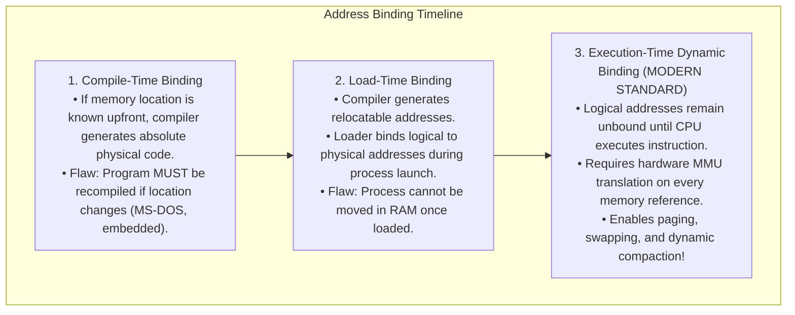
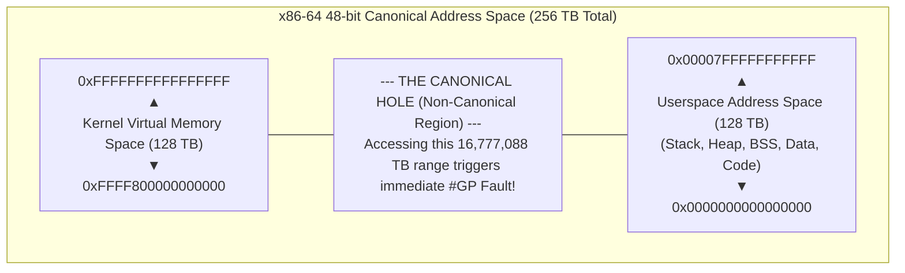

# Logical vs Physical Address Space

> [!abstract] Mental Model
> Think of **Logical vs Physical Addresses** as **Apartment Unit Numbers vs GPS Coordinates**:
> - Every apartment building in the city has an "Apartment 101" (**Logical / Virtual Address**). The tenant inside only needs to know they live in "Unit 101" without worrying about where the building sits on Earth.
> - The city postal carrier and navigation satellites map "Building B, Unit 101" to exact global latitude/longitude coordinates (**Physical Address** on physical DRAM chips).
> - The **Memory Management Unit (MMU)** is the real-time hardware GPS translator sitting between the CPU core and the memory bus.

---

## Architectural Definitions

```mermaid
flowchart LR
    CPU["CPU Core<br/>(Generates Logical/Virtual Address)"] -->|Virtual Address (VA)| MMU["Memory Management Unit (MMU)<br/>(Hardware Translation Engine)"]
    MMU -->|Physical Address (PA)| RAM["Physical DRAM Silicon Chips<br/>(Bus Line Addresses)"]
```

| Dimension | Logical (Virtual) Address Space | Physical Address Space |
| :--- | :--- | :--- |
| **Generated By** | The **CPU execution unit** during instruction fetch/load/store. | Computed by the **MMU hardware**; presented on the memory bus pins. |
| **Visibility** | Directly visible to application code and pointers. | **Completely invisible** to userspace applications; managed by the OS kernel. |
| **Span** | Determined by CPU architecture bitwidth ($2^{32} = 4\text{ GB}$ or $2^{48} = 256\text{ TB}$). | Determined by physical DRAM installed in motherboard slots (e.g., $16\text{ GB}, 64\text{ GB}$). |
| **Continuity** | Appears completely flat, contiguous, and isolated ($0 \dots \text{Max}$). | Highly fragmented, non-contiguous, and scattered across physical frames. |

---

## The Three Stages of Address Binding

How does program symbolic code (`int count = 10;`) get bound to physical memory addresses?



---

## Hardware Translation: Base and Limit Registers

Before modern multi-level paging was established, hardware implemented dynamic execution-time binding via **Base (Relocation) and Limit Registers**:

```mermaid
flowchart TD
    CPU_VA["CPU Generates Logical Address L"] --> CheckLimit{"L < Limit Register?"}
    
    CheckLimit -->|NO (Illegal Memory Access)| Trap["TRAP to Kernel:<br/>Segmentation Fault / #GP Exception"]
    
    CheckLimit -->|YES| AddBase["Physical Address = Base Register + L"]
    AddBase --> MemoryBus["Assert Physical Address on DRAM Bus"]
```

### The Invariants:
1. **Base Register (Relocation Register)**: Holds the smallest physical address allocated to the process.
2. **Limit Register**: Specifies the exact size range of the process's logical address space.
3. **Hardware Protection**: If $L \ge \text{Limit}$, the MMU hardware immediately prevents the memory bus assertion and triggers a CPU trap, guaranteeing that **no process can ever read or corrupt another process's memory**.

---

## 64-Bit Canonical Virtual Address Space (Linux x86-64)

In modern 64-bit x86-64 architectures, CPUs currently implement **48-bit Virtual Addressing** (expandable to 57-bit via 5-level paging):



- **Canonical Addressing Rule**: Bits 47 through 63 must be an exact copy of bit 47 (sign-extension). Any pointer dereference outside canonical ranges triggers an immediate hardware General Protection Fault (`#GP`).

---

## Why Logical-Physical Separation is Essential in Systems Architecture

1. **Process Isolation & Memory Safety**: Process $A$ and Process $B$ can both use logical address `0x400000` simultaneously; the MMU maps them to completely separate physical DRAM frames.
2. **The Contiguity Illusion**: A process can allocate a contiguous $1\text{ GB}$ buffer; in physical RAM, the MMU maps this to 262,144 scattered 4 KB frames without requiring contiguous physical silicon space.
3. **Overcommitment & Virtual Memory**: The sum of logical address spaces across all running processes can vastly exceed physical DRAM (e.g., running 50 processes each allocating 4 GB on a 16 GB RAM server) via [[Demand Paging and Page Faults|Demand Paging]].

---

## Production Diagnostics & Inspection

```bash
# 1. View complete Virtual Memory Area (VMA) layout of a running process
cat /proc/<PID>/maps

# Output format:
# address           perms offset  dev   inode      pathname
# 00400000-00452000 r-xp 00000000 08:02 173521     /usr/bin/app (Text segment)
# 00651000-00652000 r--p 00051000 08:02 173521     /usr/bin/app (Read-only data)
# 00652000-00655000 rw-p 00052000 08:02 173521     /usr/bin/app (Data/BSS)
# 0184b000-0186c000 rw-p 00000000 00:00 0          [heap]
# 7ffc5a210000-7ffc5a231000 rw-p 00000000 00:00 0  [stack]

# 2. Detailed memory consumption breakdown per segment
pmap -x <PID>
```

---

## Active Recall & Interview Perspective

### Reasoning Prompts
1. *Why is Execution-Time address binding mandatory for modern operating systems?*
   - **Answer**: Execution-time dynamic binding allows processes to be moved freely across physical memory during runtime (such as when paging in/out from swap, compacting memory, or resizing heaps). If addresses were bound at compile-time or load-time, a process would be permanently pinned to its initial physical RAM location, making demand paging, copy-on-write, and memory overcommitment impossible.
2. *What is the role of the MMU when a pointer is dereferenced in C?*
   - **Answer**: When a CPU core executes an instruction dereferencing a pointer (e.g., `MOV RAX, [RDI]`), the pointer holds a **Logical (Virtual) Address**. The MMU hardware intercepts this address, checks access permissions (Read/Write/Execute) and limits, consults the Translation Lookaside Buffer (TLB) and multi-level page tables, translates the logical address into a **Physical Address**, and places the physical address onto the system memory bus to read the DRAM cache line.
3. *What causes a Segmentation Fault (`SIGSEGV`) at the hardware level?*
   - **Answer**: At the hardware level, a segmentation fault occurs when the CPU attempts to translate a virtual address that either: (1) exceeds the segment Limit register, (2) attempts an unauthorized operation (e.g., writing to a page marked Read-Only), or (3) maps to an invalid/unallocated page table entry (bit `0` Present flag is 0). The MMU raises an unhandled Page Fault (`#PF`) or General Protection Fault (`#GP`) exception, prompting the kernel trap handler to dispatch a `SIGSEGV` signal to the offending process.

---

## Key Takeaways
- **Logical Addresses** are generated by the CPU; **Physical Addresses** reference actual DRAM silicon.
- The **MMU** translates virtual addresses to physical addresses dynamically on every memory access.
- Execution-time binding provides **process isolation, contiguous memory illusions, and overcommitment**.

---

## Related Notes
- [[Operating System]] — Memory subsystem foundation.
- [[Privilege Rings and CPU Modes]] — Hardware protection rings.
- [[Process Address Space]] — Virtual layout (Stack, Heap, BSS, Text).
- [[Memory Allocation - Contiguous, Fixed, Variable Partitioning]] — Allocation schemes.
- [[Internal vs External Fragmentation]] — Memory fragmentation challenges.
- [[Paging Architecture]] — The universal modern translation mechanism.
- [[Segmentation]] — Alternate logical segmentation model.
- [[Translation Lookaside Buffer - TLB]] — Hardware MMU translation cache.
- [[Virtual Memory Architecture]] — High-level virtual memory design.
- [[Operating Systems MOC]] — Master table of contents for Operating Systems.
