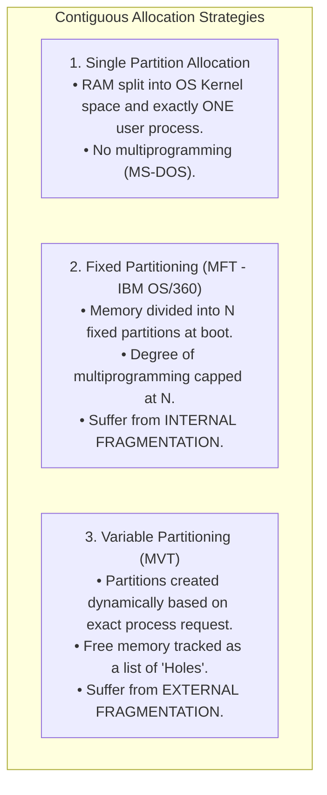
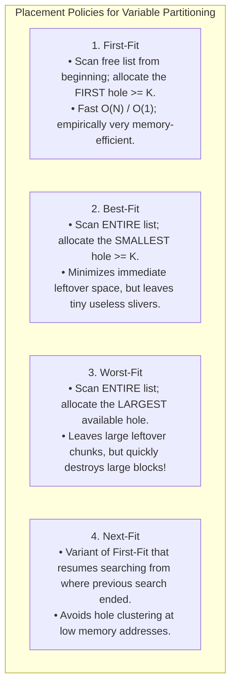

# Contiguous Memory Allocation: Fixed vs Variable Partitioning

> [!abstract] Mental Model
> Contiguous memory allocation is like **managing a highway parking lot**:
> - **Fixed Partitioning (MFT)**: The lot is permanently painted with standard bus-sized spots ($50\text{ MB}$ each). When a compact motorcycle ($2\text{ MB}$) parks in a bus spot, $48\text{ MB}$ is completely wasted (**Internal Fragmentation**).
> - **Variable Partitioning (MVT)**: An unstriped open dirt lot where vehicles park bumper-to-bumper according to their exact length. As vehicles depart at random times, arbitrary unfillable gaps form between parked cars (**External Fragmentation**).

---

## Contiguous Allocation Taxonomy

---

## Fixed vs Variable Partitioning: The Core Trade-Offs

| Dimension | Fixed Partitioning (MFT) | Variable Partitioning (MVT) |
| :--- | :--- | :--- |
| **Partition Boundaries** | Static; established at system boot time. | Dynamic; created and destroyed on process birth/death. |
| **Partition Sizes** | Equal or predefined unequal fixed blocks. | Exactly sized to match process memory requirements. |
| **Multiprogramming Degree** | Hard ceiling: exactly **$N$ processes**. | Dynamic: limited only by total available RAM. |
| **Internal Fragmentation** | **Severe** (Process rarely fills the fixed partition). | **Zero** (Allocated size equals requested size). |
| **External Fragmentation** | **Zero** (No unallocated gaps between slots). | **Severe** (Random departures scatter holes). |

---

## Dynamic Storage Allocation Placement Algorithms

When Process $P$ requests $K$ bytes of memory under Variable Partitioning, the OS scans its **Free-List of Holes** using one of four classic heuristic placement policies:

---

## Numerical Simulation & Comparative Analysis

### System Setup:
Given free memory holes in order: **`100 KB`, `500 KB`, `200 KB`, `300 KB`, `600 KB`**.
A sequence of three processes arrive: $P_1 = 212\text{ KB}$, $P_2 = 417\text{ KB}$, $P_3 = 112\text{ KB}$.

```mermaid
flowchart TD
    subgraph FirstFitSimulation ["First-Fit Allocation Trace"]
        P1_FF["P1 (212 KB) -> Allocated in 500 KB hole (Leaves 288 KB)"]
        P2_FF["P2 (417 KB) -> Allocated in 600 KB hole (Leaves 183 KB)"]
        P3_FF["P3 (112 KB) -> Allocated in 288 KB hole (Leaves 176 KB)"]
        Success_FF["RESULT: ALL 3 PROCESSES SUCCESSFULLY ALLOCATED!"]
        P1_FF --> P2_FF --> P3_FF --> Success_FF
    end

    subgraph BestFitSimulation ["Best-Fit Allocation Trace"]
        P1_BF["P1 (212 KB) -> Allocated in 300 KB hole (Leaves 88 KB)"]
        P2_BF["P2 (417 KB) -> Allocated in 500 KB hole (Leaves 83 KB)"]
        P3_BF["P3 (112 KB) -> Allocated in 200 KB hole (Leaves 88 KB)"]
        Success_BF["RESULT: ALL 3 ALLOCATED (Leaves tiny 88 KB & 83 KB slivers)"]
        P1_BF --> P2_BF --> P3_BF --> Success_BF
    end
```

---

## Production Algorithmic Comparison

| Algorithm | Search Time Complexity | Storage Overhead | Empirical Fragmentation | Production Verdict |
| :--- | :--- | :--- | :--- | :--- |
| **First-Fit** | **$O(1)$** (with segregated free-lists) / $O(N)$ | Minimal | Low | **Industry Standard** (Fastest & lowest memory overhead). |
| **Best-Fit** | **$O(\log N)$** (with balanced Red-Black tree of hole sizes) | Moderate | High (produces unusable sub-16B fragments) | Good for small fixed allocations. |
| **Worst-Fit** | **$O(\log N)$** (Max-Heap priority queue) | Moderate | Catastrophic | **Avoid in Production** (Destroys large blocks). |
| **Next-Fit** | **$O(1)$** average | Minimal | Slightly worse than First-Fit | Used in specialized circular ring allocators. |

---

## Active Recall & Interview Perspective

### Reasoning Prompts
1. *Why does First-Fit consistently outperform Best-Fit in both execution speed and overall storage utilization in empirical benchmarks?*
   - **Answer**: First-Fit is faster because it terminates its search immediately upon encountering the first eligible hole, whereas Best-Fit must scan the entire free-list (or traverse a balanced search tree) to find the absolute minimum eligible size. Furthermore, Best-Fit creates severe long-term fragmentation by continuously shaving small slivers off holes ($H - \text{Size} \approx 0$), leaving behind tiny fragments that are too small to satisfy any subsequent process requests. First-Fit tends to preserve larger leftover blocks toward the end of the address space.
2. *What is the difference between MFT (Multiprogramming with Fixed Tasks) and MVT (Multiprogramming with Variable Tasks)?*
   - **Answer**: In MFT, physical memory is statically divided into a fixed number of predetermined partitions at boot time; a process occupies one entire partition, causing **Internal Fragmentation** if the process is smaller than the partition, and capping the maximum degree of multiprogramming to the partition count. In MVT, memory is allocated dynamically from free pools to exactly match each process's size; this eliminates internal fragmentation, but introduces **External Fragmentation** as processes terminate and leave scattered non-contiguous holes.
3. *Why did modern operating systems completely abandon contiguous memory allocation in favor of Paging?*
   - **Answer**: Contiguous memory allocation requires the entire physical address space of a process to reside in an unbroken linear sequence of physical DRAM addresses. As processes allocate and free memory, External Fragmentation inevitably scatters free memory into small disconnected holes, requiring expensive memory compaction (pausing the system and copying hundreds of megabytes of RAM). Paging completely breaks the contiguity requirement: a logical contiguous address space is mapped to non-contiguous $4\text{ KB}$ physical frames via hardware page tables, eliminating external fragmentation entirely.

---

## Key Takeaways
- **Fixed Partitioning (MFT)** introduces **Internal Fragmentation** and static process limits.
- **Variable Partitioning (MVT)** eliminates internal fragmentation but creates **External Fragmentation**.
- **First-Fit** is empirically faster and produces less severe fragmentation than **Best-Fit** and **Worst-Fit**.

---

## Related Notes
- [[Operating System]] — Memory allocation evolution.
- [[Process Address Space]] — Virtual segments in memory.
- [[Logical vs Physical Address Space]] — Physical translation layer.
- [[Internal vs External Fragmentation]] — Deep dive into fragmentation mechanics.
- [[Paging Architecture]] — The non-contiguous solution to fragmentation.
- [[Segmentation]] — Variable-sized logical partition architecture.
- [[Operating Systems MOC]] — Master table of contents for Operating Systems.
