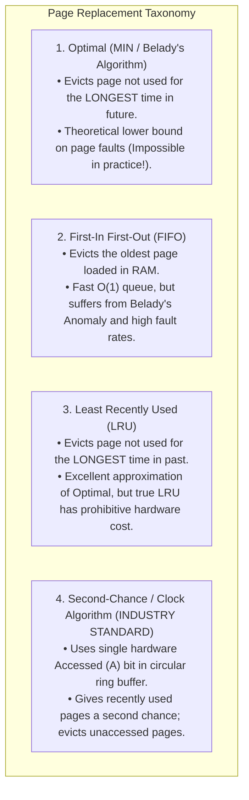
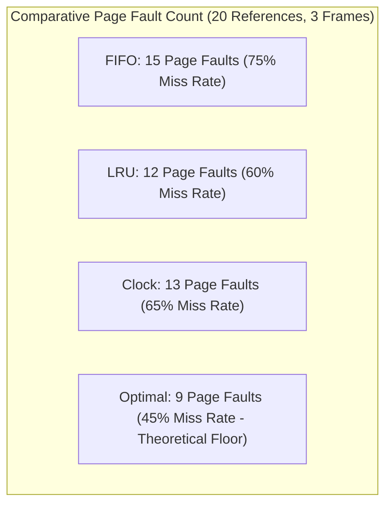
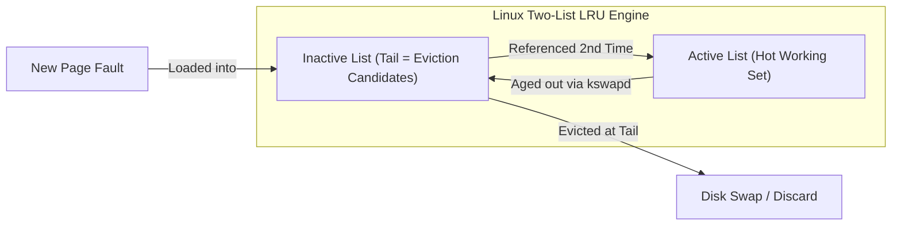

# Page Replacement Algorithms: FIFO, LRU, Clock, and Optimal

> [!abstract] Mental Model
> Page replacement is **managing a crowded desktop workbench**:
> - Your physical desktop (**RAM Frames**) only holds 3 reference books at a time.
> - When you must read a 4th book (**Page Fault**), which book do you pack away into the basement storage crate (**Disk Swap**)?
> - A bad algorithm throws away the dictionary you use every 30 seconds (**FIFO**); an ideal algorithm packs away the tax report you won't touch until next April (**Optimal / LRU**).

---

## The Algorithmic Hierarchy



---

## 1. Optimal Page Replacement (MIN / Belady's Algorithm)

- **Rule**: When a frame must be freed, evict the page that **will not be referenced for the longest duration into the future**.
- **Properties**: Proven mathematically to produce the absolute minimum number of page faults for any fixed number of frames.
- **Production Status**: **Unimplementable** in general operating systems because the kernel cannot foretell future CPU branch instructions. Used universally as an offline empirical benchmark to evaluate other algorithms.

---

## 2. First-In First-Out (FIFO)

- **Rule**: Maintain a simple FIFO queue of pages; evict the page at the head of the queue (the oldest page).
- **Flaws**:
  - The oldest page might be the most frequently accessed global variable or runtime library (`libc`).
  - Prone to **[[Belady's Anomaly]]**: increasing the number of physical frames can actually *increase* the total number of page faults!

---

## 3. Least Recently Used (LRU)

- **Rule**: Evict the page that has not been referenced for the longest period in the past, exploiting the principle of **Temporal Locality**.
- **Hardware Bottleneck of True LRU**:
  - Requires updating a timestamp counter or moving a doubly-linked list node on **every single CPU instruction dereference** ($1\text{–}4\text{ billion times per second}$).
  - Doing this in software triggers catastrophic overhead; doing this in pure hardware requires prohibitive silicon transistor budgets.

---

## 4. The Industry Standard: The Second-Chance (Clock) Algorithm

The **Clock Algorithm** provides an $O(1)$ hardware-assisted approximation of LRU using a single bit: the **Accessed (`A`) bit** in the Page Table Entry:

```mermaid
flowchart TD
    ClockHand["Clock Hand Points to Frame i"] --> ReadBit{"Inspect Accessed Bit (A)"}
    
    ReadBit -->|A == 1 (Recently Used)| ClearBit["Clear Bit (Set A = 0)<br/>Advance Clock Hand to (i + 1) % N<br/>(Gives page a Second Chance!)"]
    
    ClearBit --> ClockHand
    
    ReadBit -->|A == 0 (Unused since last sweep)| Evict["VICTIM FOUND!<br/>Evict Page in Frame i to Swap<br/>Advance Hand to (i + 1) % N"]
```

---

### Enhanced Clock Algorithm (Accessed + Dirty Bits):
Modern kernels evaluate two hardware bits: **Accessed (`A`)** and **Dirty (`D`)**:

| Category | Vector $\langle A, D \rangle$ | Page Status | Eviction Priority |
| :--- | :--- | :--- | :--- |
| **$(0, 0)$** | **Neither accessed nor dirty** | Cold, clean page. | **1st Priority (Best Victim - Zero I/O cost!)** |
| **$(0, 1)$** | **Not accessed, but dirty** | Cold, modified page. | **2nd Priority (Requires 1 disk write)** |
| **$(1, 0)$** | **Accessed recently, clean** | Hot, unmodified page. | **3rd Priority (Clear $A \to 0$, keep in RAM)** |
| **$(1, 1)$** | **Accessed recently and dirty** | Hot, modified page. | **4th Priority (Clear $A \to 0$, keep in RAM)** |

---

## Comparative Numerical Simulation

Given Reference String: **`7, 0, 1, 2, 0, 3, 0, 4, 2, 3, 0, 3, 2, 1, 2, 0, 1, 7, 0, 1`** with **3 Physical Frames**:



---

## Production Focus: The Linux Two-List Active/Inactive LRU

The Linux kernel (`mm/swap.c`) implements an advanced **Two-List LRU Cache**:



- **Protection Against Large File Scans**: If a backup script reads a $100\text{ GB}$ file, pages enter the `Inactive List` only. Because they are read once, they are evicted without flushing the hot `Active List` (preventing application cache thrashing).

---

## Active Recall & Interview Perspective

### Reasoning Prompts
1. *Why is the Optimal Page Replacement algorithm impossible to implement in a real operating system?*
   - **Answer**: Optimal page replacement requires prior knowledge of the future memory reference string (knowing exactly when every page will next be requested). Because general-purpose application execution depends on dynamic user inputs, network events, and runtime conditional branches, the OS cannot predict future memory access sequences with certainty. Optimal is used exclusively as a theoretical ceiling to benchmark practical heuristic algorithms.
2. *How does the Clock Algorithm approximate LRU in $O(1)$ time without per-reference software overhead?*
   - **Answer**: The Clock Algorithm relies on the CPU hardware MMU to set the **Accessed bit (`A = 1`)** in the Page Table Entry whenever a page is read or written, requiring zero OS software overhead during normal execution. When memory pressure triggers page replacement, the kernel scans frames circularly: if a page has `A = 1`, the kernel clears it to `0` and moves on (granting a second chance); if `A = 0`, the page has not been touched since the previous sweep and is immediately chosen as the eviction victim.
3. *Why does the Linux kernel maintain two separate LRU lists (Active and Inactive) instead of a single global queue?*
   - **Answer**: A single LRU list is vulnerable to sequential memory scans (e.g. running `grep -r` or streaming a massive file). A large sequential read would flood a single list with thousands of pages used only once, evicting the entire long-term active working set of critical applications (like web servers or databases). By placing new pages onto an `Inactive List` and only promoting them to the `Active List` upon a **second reference**, Linux ensures single-use streaming data is discarded quickly without polluting hot application memory.

---

## Key Takeaways
- **Optimal (MIN)** provides the mathematical theoretical minimum page fault baseline ($PF_{\min}$).
- **FIFO** suffers from **Belady's Anomaly**; **LRU** is near-optimal but constrained by hardware cost.
- The **Clock Algorithm** and **Linux Two-List LRU** provide fast, robust $O(1)$ production approximations using the hardware Accessed bit.

---

## Related Notes
- [[Operating System]] — Memory subsystem.
- [[Paging Architecture]] — Hardware Accessed and Dirty bits.
- [[Demand Paging and Page Faults]] — What triggers page replacement.
- [[Belady's Anomaly]] — FIFO anomaly deep dive.
- [[Working Set Model and Thrashing]] — Preventing thrashing collapse.
- [[Swapping and Swap Space Management]] — Where evicted pages go.
- [[Operating Systems MOC]] — Master table of contents for Operating Systems.
