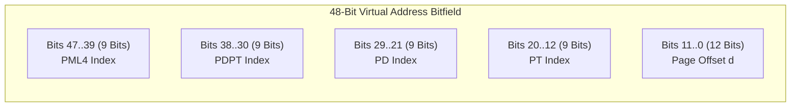
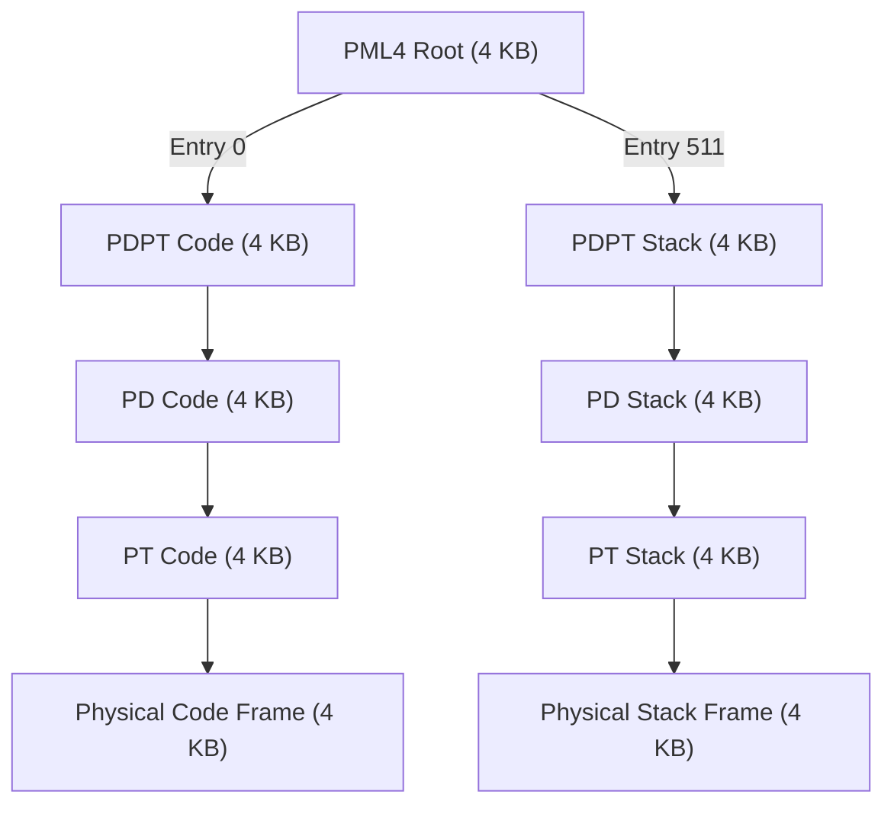

# Page Tables and Multi-Level Page Tables

> [!abstract] Mental Model
> Imagine a **global city phone directory with 281 trillion entries (64-bit space)**:
> - If you printed a **Flat Single-Level Directory**, every single citizen's book would be $33\text{ Million Gigabytes}$ thick, even if the resident only knows two people.
> - A **Multi-Level Page Table** is a **hierarchical tree index**: Volume $\to$ Chapter $\to$ Page $\to$ Entry. If a resident only has numbers in New York and Tokyo, you only print the title covers and those two specific pages ($< 32\text{ KB}$). **Empty, unallocated regions of virtual space consume exactly $0$ bytes of physical DRAM.**

---

## The Catastrophic Math of Flat Page Tables

Why is a flat, single-level page table physically impossible on modern architectures?

### 1. In 32-bit Systems ($4\text{ GB}$ Address Space, $4\text{ KB}$ Pages):
$$\text{Number of Pages} = \frac{2^{32}}{2^{12}} = 2^{20} = 1,048,576 \text{ pages}$$
$$\text{Page Table Size} = 1,048,576 \times 4\text{ bytes (PTE)} = \mathbf{4\text{ MB per process}}$$
*(Running 200 processes requires 800 MB of RAM strictly for page table arrays!)*

### 2. In 64-bit Systems ($48\text{–bit}$ Canonical Space, $4\text{ KB}$ Pages):
$$\text{Number of Pages} = \frac{2^{48}}{2^{12}} = 2^{36} = 68,719,476,736 \text{ pages}$$
$$\text{Page Table Size} = 2^{36} \times 8\text{ bytes (PTE)} = \mathbf{512\text{ Gigabytes per process!}}$$
*(A flat 64-bit page table would bankrupt modern RAM on a single empty process!)*

---

## Architectural Mechanics: The x86-64 4-Level Radix Tree (PML4)

Modern x86-64 CPUs implement a **4-Level Hierarchical Radix Tree** dividing the 48-bit virtual address into a **`9-9-9-9-12`** bit pattern:



---

## The Complete Hardware Page Table Walk in Silicon

When a Translation Lookaside Buffer (TLB) miss occurs, the CPU's **Hardware Page Table Walker** traverses memory pointers starting from the **`CR3` Control Register**:

```mermaid
flowchart TD
    CR3["CR3 Control Register<br/>(Holds Physical Base of PML4 Table)"] -->|Index by VA[47..39]| PML4["Level 4: PML4 Table<br/>(512 Entries x 8B = 4 KB)"]
    
    PML4 -->|Points to Physical Frame of| PDPT["Level 3: PDPT Table<br/>(Page Directory Pointer Table)"]
    
    PDPT -->|Index by VA[38..30]| PD["Level 2: Page Directory (PD)<br/>(Points to PT or 2MB Huge Page)"]
    
    PD -->|Index by VA[29..21]| PT["Level 1: Page Table (PT)<br/>(Points to 4KB Physical Frame)"]
    
    PT -->|Index by VA[20..12]| Frame["Physical 4KB DRAM Frame"]
    
    Frame -->|Add Offset VA[11..0]| PhysicalMemory["TARGET PHYSICAL BYTE IN DRAM!"]
```

---

## Why 9 Bits Per Level? (The $4\text{ KB}$ Geometric Harmony)

Notice that every single level of the hierarchy indexes exactly $9\text{ bits}$:
$$2^9 = \mathbf{512\text{ entries per table}}$$
$$\text{Table Memory Footprint} = 512\text{ entries} \times 8\text{ bytes per PTE} = \mathbf{4096\text{ bytes} = 4\text{ KB}}$$

> [!important] Geometric Alignment
> Because every intermediate directory table is **exactly $4\text{ KB}$ in size**, every level of the page table tree fits perfectly inside a standard **$4\text{ KB}$ physical page frame**. The operating system allocates and frees page table levels using standard page frame allocators!

---

## Memory Footprint of Sparse Allocations

Consider a process that only uses **$8\text{ KB}$ of RAM** ($4\text{ KB}$ Code at `0x400000`, $4\text{ KB}$ Stack at `0x7FFFFFFFE000`):



- **Flat 64-bit Table Cost**: $512\text{ GB}$.
- **Multi-Level Table Cost**: Exactly **7 tables $\times 4\text{ KB} = \mathbf{28\text{ KB}}$**!
- **Storage Reduction Factor**: **$> 18,000,000\times$ memory reduction!**

---

## The Next Evolution: 5-Level Paging (PML5)

With server databases exceeding $128\text{ TB}$ RAM, Intel introduced **5-Level Paging (PML5)** in Ice Lake / Xeon scalable processors:
- Adds a 5th 9-bit level (`PML5 Index`: bits 56 to 48).
- Expands Virtual Address space from **$256\text{ TB}$ ($2^{48}$)** to **$128\text{ Petabytes}$ ($2^{57}$)**.
- Expands Physical Address limits to **$4\text{ Petabytes}$ ($2^{52}$)**.

---

## Active Recall & Interview Perspective

### Reasoning Prompts
1. *Why does a memory lookup under multi-level paging require 5 physical DRAM memory accesses instead of 1 on a TLB miss?*
   - **Answer**: On an x86-64 CPU with 4-level paging, if a virtual address is not cached in the TLB, the hardware MMU walker must sequentially fetch pointers through all 4 hierarchical table levels: (1) read PML4 entry, (2) read PDPT entry, (3) read Page Directory entry, (4) read Page Table entry, and finally (5) read the actual target data byte from physical DRAM. Each dereference is a separate memory bus access unless cached in L1/L2/L3 CPU data caches.
2. *What register stores the root of the page table hierarchy in x86, and what happens to it during a Context Switch?*
   - **Answer**: The **`CR3` Control Register** (Page Directory Base Register - PDBR) stores the physical address of the active process's PML4 root table. During a process context switch, the kernel writes the physical address of the newly scheduled process's PML4 into `CR3`. Loading `CR3` automatically invalidates/flushes all non-global entries in the Translation Lookaside Buffer (TLB), ensuring the CPU does not translate addresses using stale mappings from the previous process.
3. *How do $2\text{ MB}$ Huge Pages shorten the Page Table Walk?*
   - **Answer**: When bit 7 (`Page Size` / `PS`) is set to 1 in a Page Directory (Level 2) entry, the hardware MMU treats that entry as a direct mapping to a contiguous $2\text{ MB}$ physical frame rather than a pointer to a Level 1 Page Table. The walk terminates after Level 2 (skipping Level 1 entirely), reducing the translation overhead from 4 table dereferences down to 3.

---

## Key Takeaways
- **Multi-Level Page Tables** transform linear translation arrays into a **sparse Radix Tree**, dropping page table overhead from $512\text{ GB}$ to $< 64\text{ KB}$ for sparse processes.
- The **x86-64 PML4 architecture** splits 48-bit addresses into four 9-bit directory indices and a 12-bit offset.
- Translation begins at the physical address stored in **`CR3`**, requiring **TLB caching** to avoid 5-DRAM-access latency penalties.

---

## Related Notes
- [[Operating System]] — Memory translation systems.
- [[Logical vs Physical Address Space]] — Virtual-to-physical address layout.
- [[Paging Architecture]] — Page and frame fundamentals.
- [[Inverted Page Tables]] — The frame-centric alternative to hierarchical trees.
- [[Translation Lookaside Buffer - TLB]] — Hardware MMU translation cache.
- [[Demand Paging and Page Faults]] — Faulting on non-present PTEs.
- [[Virtual Memory Architecture]] — Global virtual memory layout.
- [[Operating Systems MOC]] — Master table of contents for Operating Systems.
