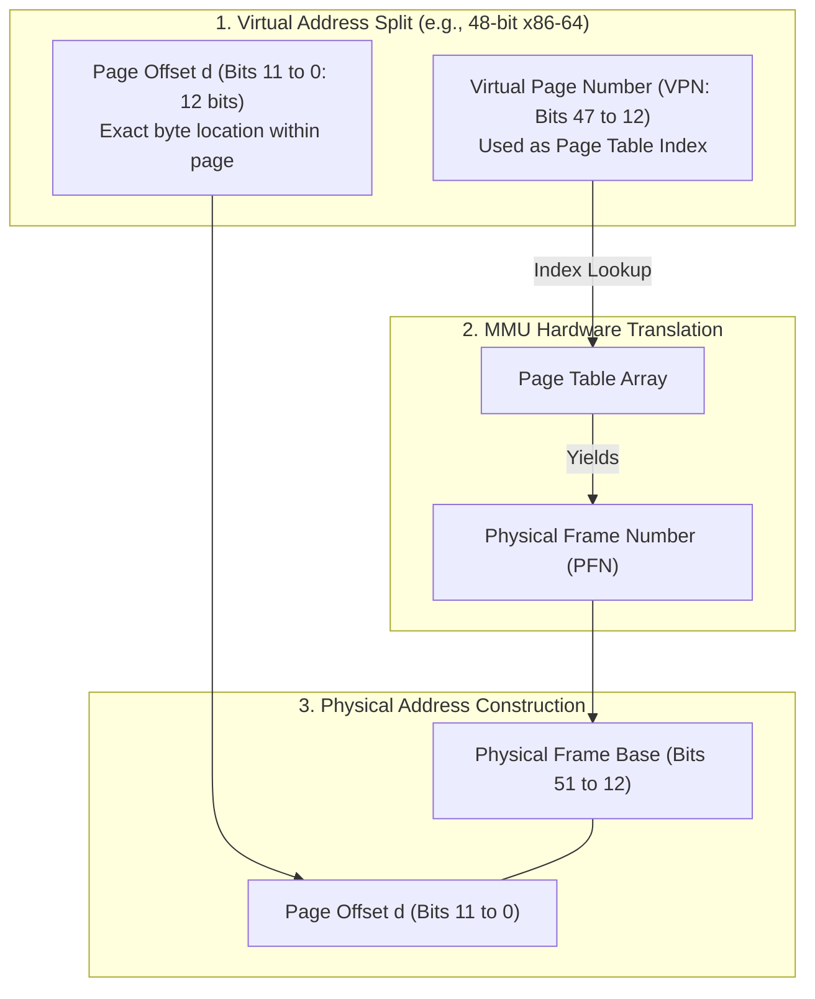

# Paging Architecture

> [!abstract] Mental Model
> Paging is a **grid-ruled notebook index system**:
> - Physical DRAM is pre-divided into fixed-size slots called **Frames** ($f$).
> - A process's logical address space is divided into identical-sized blocks called **Pages** ($p$).
> - The **Page Table** is the index ledger translating Page $p \to \text{Frame } f$.
> - Because **any page can reside in any physical frame anywhere in DRAM**, the OS achieves complete contiguous memory illusion for user applications while **eliminating External Fragmentation forever**.

---

## Hardware Address Translation & Bit Arithmetic

For standard **$4\text{ KB}$ ($2^{12}\text{ bytes}$)** page sizes on modern CPUs:



---

### The Mathematical Bit Formulas:
Given a Virtual Address $VA$ and page size $S = 4096 = 2^{12}$:
$$\mathbf{p = VA \gg 12 \quad (\text{Page Number})}$$
$$\mathbf{d = VA \ \& \ 0\text{xFFF} \quad (\text{Page Offset})}$$
$$\mathbf{\text{Physical Address} = (PFN \ll 12) \ | \ d}$$

---

## The x86-64 Page Table Entry (PTE) Bitfield Architecture

Every 64-bit Page Table Entry in x86-64 silicon packs physical frame addresses and hardware security flags into a single 8-byte word:

```mermaid
flowchart LR
    PTE["64-Bit Page Table Entry (PTE) Layout"]
    
    NX["Bit 63: NX (No-Execute)"]
    PFN["Bits 51..12: Physical Frame Base Address (40 Bits)"]
    G["Bit 8: Global (G)"]
    D["Bit 6: Dirty (D)"]
    A["Bit 5: Accessed (A)"]
    PCD["Bit 4: Cache Disable (PCD)"]
    PWT["Bit 3: Write-Through (PWT)"]
    US["Bit 2: User/Supervisor (U/S)"]
    RW["Bit 1: Read/Write (R/W)"]
    P["Bit 0: Present (P)"]

    PTE --- NX --- PFN --- G --- D --- A --- PCD --- PWT --- US --- RW --- P
```



---

### Hardware Bitfield Semantics:

| Bit Position | Mnemonic | Hardware Role |
| :--- | :--- | :--- |
| **Bit 0** | **`P` (Present)** | **1** = Frame is resident in physical DRAM; **0** = Page is swapped to disk or unallocated $\to$ Triggers **Page Fault (`#PF`)**. |
| **Bit 1** | **`R/W` (Read/Write)** | **1** = Read-Write allowed; **0** = Read-Only $\to$ Writing triggers Access Violation (`SIGSEGV`). |
| **Bit 2** | **`U/S` (User/Supervisor)**| **1** = Accessible in Ring 3 Userspace; **0** = Restricted to Ring 0 Kernel Mode. |
| **Bit 5** | **`A` (Accessed)** | Set automatically by CPU silicon on read/write; used by kernel LRU page replacement engines. |
| **Bit 6** | **`D` (Dirty)** | Set automatically by CPU silicon on memory write; informs kernel that page must be flushed to disk. |
| **Bit 7** | **`PS` (Page Size)** | In PDE/PDPE level: **1** = Huge Page ($2\text{ MB}$ or $1\text{ GB}$); **0** = standard $4\text{ KB}$ sub-table. |
| **Bit 8** | **`G` (Global)** | If 1, entry is NOT flushed from TLB when `CR3` register is reloaded during context switches. |
| **Bit 63** | **`NX` / `XD` (No-Execute)**| **1** = Instruction execution forbidden $\to$ Hardware immunity against buffer-overflow shellcode exploits. |

---

## Page Size Economics: $4\text{ KB}$ vs Huge Pages ($2\text{ MB} / 1\text{ GB}$)

Modern server architectures support three page sizes:

| Dimension | Standard Page ($4\text{ KB}$) | Huge Page ($2\text{ MB}$) | Giant Page ($1\text{ GB}$) |
| :--- | :--- | :--- | :--- |
| **Page Offset Bits** | 12 bits ($2^{12}$) | 21 bits ($2^{21}$) | 30 bits ($2^{30}$) |
| **Page Table Traversal Levels** | 4 Levels (PML4 $\to$ PDPT $\to$ PD $\to$ PT) | 3 Levels (PML4 $\to$ PDPT $\to$ PD) | 2 Levels (PML4 $\to$ PDPT) |
| **TLB Entry Coverage** | $4\text{ KB}$ RAM per TLB slot | **$2\text{ MB}$ RAM per TLB slot ($512\times$)** | **$1\text{ GB}$ RAM per TLB slot ($262,144\times$)** |
| **Internal Fragmentation Risk** | Negligible ($\approx 2\text{ KB}$ avg) | High ($\approx 1\text{ MB}$ avg) | Extreme ($\approx 500\text{ MB}$ avg) |
| **Primary Production Domain** | General web servers, microservices. | **Databases (PostgreSQL, MySQL, Redis), JVM heaps**. | High-Frequency Trading, KVM hypervisors. |

---

## Production Focus: Linux Transparent Huge Pages (THP)

In database workloads (PostgreSQL/Oracle/MongoDB), standard $4\text{ KB}$ pages result in millions of TLB misses. Linux introduces **Transparent Huge Pages (THP)** to coalesce $512$ adjacent $4\text{ KB}$ pages into $2\text{ MB}$ huge pages automatically via the `khugepaged` kernel daemon:

```bash
# 1. Inspect Transparent Huge Page configuration
cat /sys/kernel/mm/transparent_hugepage/enabled
# Options: [always] madvise never

# 2. Check Huge Page allocation and TLB metrics
grep -i "huge" /proc/meminfo
# Output:
# AnonHugePages:   2097152 kB
# ShmemPmdMapped:        0 kB
# HugePages_Total:       0
# Hugepagesize:       2048 kB
```

---

## Active Recall & Interview Perspective

### Reasoning Prompts
1. *Why does the Page Offset ($d$) remain completely unchanged during address translation?*
   - **Answer**: Because both the logical page and physical frame have the exact same fixed power-of-two size ($2^{12} = 4096\text{ bytes}$). The page offset $d$ represents the exact relative byte distance from the start of the block. Translation only changes the base boundary location of the block (from Virtual Page Number to Physical Frame Number), while the relative intra-block byte offset ($0 \dots 4095$) is identical in both virtual and physical spaces.
2. *What happens inside the CPU hardware when an instruction attempts to execute code from a page with the `NX` (No-Execute) bit set to 1?*
   - **Answer**: When the Instruction Fetch unit loads an instruction pointer (`RIP`) whose translating Page Table Entry has bit 63 (`NX`) set to 1, the MMU hardware immediately denies the fetch and raises a Page Fault (`#PF`) CPU exception with error code bit 4 (`I/D` = Instruction fetch violation). The Linux kernel trap handler translates this hardware exception into a `SIGSEGV` (Segmentation Fault) signal, immediately terminating the process and preventing malicious stack/heap shellcode execution.
3. *Why do Large Database Engines (e.g., PostgreSQL, Redis) experience up to a 20-30% performance boost when configured with $2\text{ MB}$ Huge Pages?*
   - **Answer**: Large databases allocate tens or hundreds of gigabytes of RAM. With standard $4\text{ KB}$ pages, a 64 GB buffer pool requires 16,777,216 page entries, creating massive page table trees (hundreds of megabytes) that overwhelm the CPU's limited L1/L2 Translation Lookaside Buffer (TLB - typically only 1,024 to 2,048 entries), causing continuous TLB misses and slow 4-level DRAM page walks. With $2\text{ MB}$ Huge Pages, the number of entries drops by $512\times$ to only 32,768, allowing the active working set to fit entirely inside the TLB cache, slashing memory access latency.

---

## Key Takeaways
- **Paging** maps fixed-size Virtual Pages to Physical Frames via hardware MMU page tables, eliminating external fragmentation.
- The **Page Table Entry (PTE)** encodes physical frame addresses alongside protection flags (`Present`, `R/W`, `User/Supervisor`, `Dirty`, `NX`).
- **Huge Pages ($2\text{ MB}$)** expand TLB coverage by $512\times$, eliminating page-walk stalls in database buffer pools.

---

## Related Notes
- [[Operating System]] — Memory subsystems.
- [[Logical vs Physical Address Space]] — Virtual-to-physical address translation.
- [[Internal vs External Fragmentation]] — Why paging was invented.
- [[Page Tables and Multi-Level Page Tables]] — Hierarchical page table trees.
- [[Translation Lookaside Buffer - TLB]] — Hardware MMU translation cache.
- [[Demand Paging and Page Faults]] — The Present bit `#PF` workflow.
- [[Operating Systems MOC]] — Master table of contents for Operating Systems.
