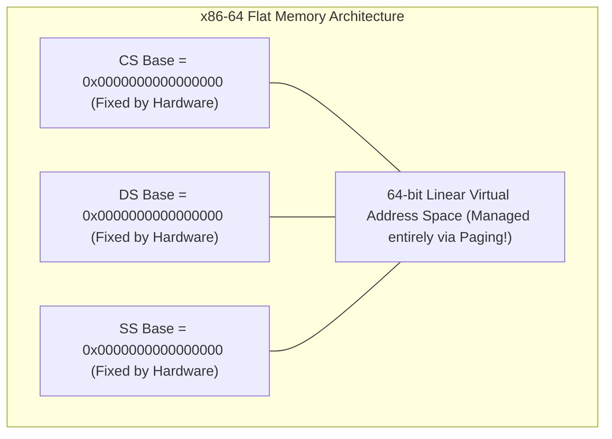

# Memory Segmentation

> [!abstract] Mental Model
> While [[Paging Architecture|Paging]] views memory like a **cold mathematical spreadsheet** (chopping memory into rigid $4\text{ KB}$ squares regardless of what data is stored), **Segmentation** views memory through the **programmer's architectural blueprint**: a collection of variable-length, semantically distinct logical chambers—the **Code Segment (Read-Execute)**, the **Data Segment (Read-Write)**, the **Stack Segment (Grow-Down)**, and the **Heap Segment**.

---

## Logical-to-Physical Translation Mechanics

A logical address under segmentation consists of a two-tuple: **$\langle \text{Segment Number } s, \text{ Segment Offset } d \rangle$**:

```mermaid
flowchart TD
    CPU_Addr["CPU Generates Logical Address <s, d>"] --> Lookup["Index Segment Table via Segment s"]
    
    Lookup --> CheckLimit{"Offset d < Limit?"}
    
    CheckLimit -->|NO (Illegal Segment Overflow)| Trap["TRAP to Kernel:<br/>General Protection Fault (#GP / SIGSEGV)"]
    
    CheckLimit -->|YES| Calc["Physical Address = Base Address + Offset d"]
    Calc --> DRAM["Assert Physical Address on Memory Bus"]
```

---

### Hardware Segment Table Entry Layout:
Each entry in the hardware **Segment Table** contains:
1. **Base Address**: The physical starting address of the segment in DRAM.
2. **Limit (Length)**: The exact size of the segment.
3. **Protection & Privilege Flags**: Read, Write, Execute permissions, and Descriptor Privilege Level (DPL / Ring 0 to Ring 3).

---

## Combined Architecture: Segmented Paging (x86-32 Protected Mode)

In 32-bit x86 Intel architectures, memory translation is a two-stage pipeline where **Segmentation feeds into Paging**:


- **Global Descriptor Table (GDT)**: System-wide table defining OS kernel and userspace segments.
- **Local Descriptor Table (LDT)**: Per-process descriptor table.
- **Segment Registers**:
  - `CS` (Code Segment): Holds Ring 0 / Ring 3 privilege selector.
  - `DS` (Data Segment): Default for global/static variables.
  - `SS` (Stack Segment): Stack pointer operations (`RSP`/`ESP`).
  - `ES`, `FS`, `GS`: General-purpose segment selectors.

---

## The Modern Reality: The "Flat Memory Model" of x86-64

When AMD and Intel engineered the **64-bit x86-64 Long Mode**, pure segmentation was rendered obsolete:

> [!important] The Long Mode Flat Model
> In 64-bit mode, the processor hardware **forces the Base of `CS`, `DS`, `ES`, and `SS` to $0$ and disables hardware limit checks**. The entire 64-bit address space is treated as a single, flat, linear virtual continuum, delegating 100% of memory management and protection to **Multi-Level Paging**.



---

### The Surviving Exceptions: `%fs` and `%gs`
The only segment registers that retain arbitrary base addresses in 64-bit kernels are `FS` and `GS`:
1. **`%fs` (Userspace Thread-Local Storage)**: In glibc/Linux, `%fs:0x0` points to the thread's `struct pthread` (supporting `thread_local` variables and the **`%fs:0x28` Stack Canary guard** for buffer-overflow detection).
2. **`%gs` (Kernel Per-CPU Storage)**: In the Linux kernel, `%gs` points to per-CPU data structures (current CPU `task_struct`, interrupt stacks, runqueues).

---

## Segmentation vs Paging: The Definitive Comparison

| Metric | Segmentation | Paging |
| :--- | :--- | :--- |
| **Unit Size** | **Variable size** (Matches semantic code/data modules). | **Fixed size** ($4\text{ KB}, 2\text{ MB}, 1\text{ GB}$). |
| **Programmer Visibility** | **Visible** (Compiler/linker understands segments). | **Completely Transparent** (Managed invisibly by OS/MMU). |
| **Fragmentation Type** | **Severe External Fragmentation** (Variable gaps in RAM). | **Internal Fragmentation only** ($\approx 2\text{ KB}$ on last page). |
| **Hardware Overhead** | 2 registers (Base + Limit) per segment. | Multi-level tree structures in DRAM + TLB cache. |
| **Modern Status** | Deprecated in 64-bit CPU modes (except for `FS`/`GS` TLS). | **Universal industry standard** on all modern hardware. |

---

## Active Recall & Interview Perspective

### Reasoning Prompts
1. *Why did 64-bit CPU architectures (x86-64, ARM64, RISC-V) abandon hardware memory segmentation in favor of pure Paging?*
   - **Answer**: Segmentation introduces severe **External Fragmentation** because segments have arbitrary, variable lengths; allocating and relocating variable segments in physical RAM requires complex compaction and fragmented free-lists. In contrast, Paging uses uniform, fixed-size $4\text{ KB}$ frames that completely eliminate external fragmentation. Furthermore, paging naturally integrates with modern virtual memory features (Demand Paging, Copy-on-Write, Page Swapping, Memory-Mapped I/O), which are extremely difficult to implement cleanly over variable-length segments.
2. *How is the `%fs` segment register used by modern C compilers for security?*
   - **Answer**: In x86-64 Linux, GCC and Clang insert a random 64-bit value called a **Stack Canary** into the prologue of functions vulnerable to buffer overflows. The canary value is loaded directly from Thread-Local Storage using the `FS` segment register: `mov rax, QWORD PTR fs:0x28`. Before returning, the function compares the local stack canary against `fs:0x28`; if a buffer overflow altered the stack, the values mismatch, and the program halts with `*** stack smashing detected ***` via `__stack_chk_fail()`.
3. *What is the difference between a Segment Selector and a Segment Descriptor in x86?*
   - **Answer**: A **Segment Selector** is a 16-bit value stored in a CPU segment register (`CS`, `DS`, etc.) containing a 13-bit index, a Table Indicator bit (0 = GDT, 1 = LDT), and a 2-bit Requested Privilege Level (RPL). A **Segment Descriptor** is an 8-byte entry located *inside* the GDT/LDT memory table that specifies the actual 32-bit Base physical address, 20-bit Limit size, and access flags (DPL, Read/Write/Execute, Present) corresponding to that selector.

---

## Key Takeaways
- **Segmentation** divides memory into variable-length logical units based on program structure (Code, Data, Stack).
- Hardware enforces protection via **Base and Limit registers**, trapping out-of-bounds accesses as `#GP` faults.
- 64-bit architectures use a **Flat Memory Model**, disabling segmentation except for **`FS`/`GS` Thread-Local Storage**.

---

## Related Notes
- [[Operating System]] — Memory subsystem evolution.
- [[Privilege Rings and CPU Modes]] — DPL protection in segment descriptors.
- [[Logical vs Physical Address Space]] — Address binding layers.
- [[Process Address Space]] — Virtual segment divisions.
- [[Internal vs External Fragmentation]] — Why segmentation causes external fragmentation.
- [[Paging Architecture]] — The replacement fixed-size model.
- [[Page Tables and Multi-Level Page Tables]] — Modern translation trees.
- [[Operating Systems MOC]] — Master table of contents for Operating Systems.
