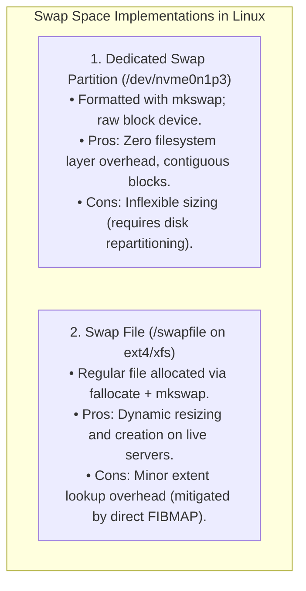
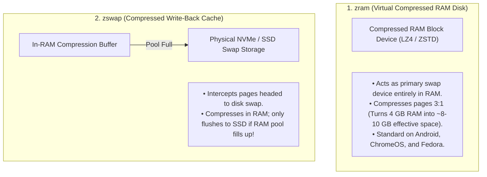
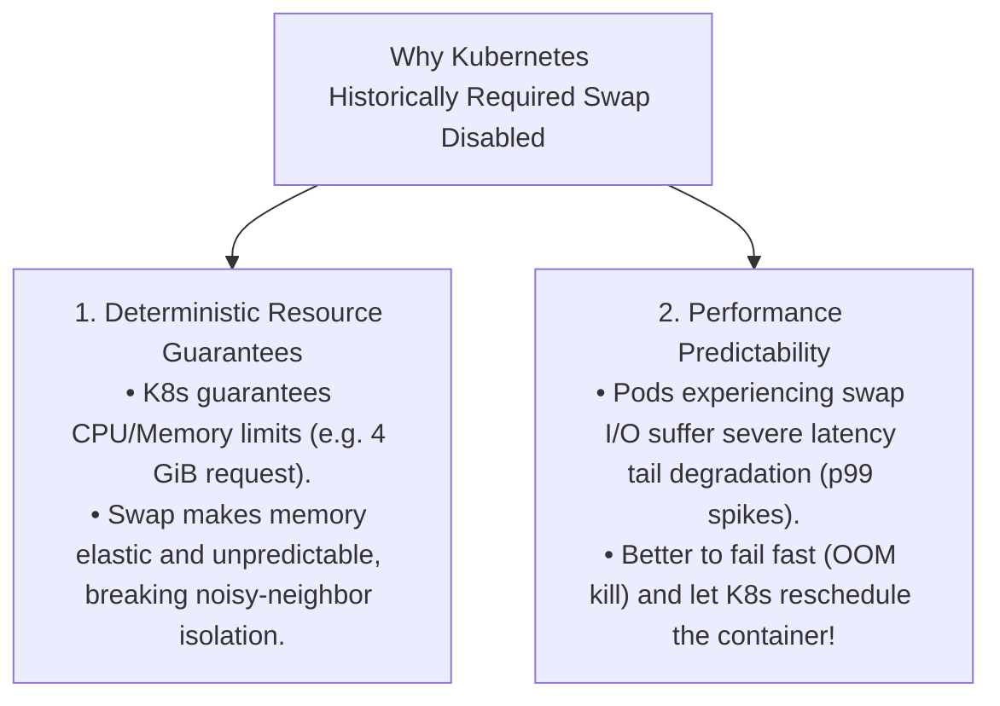

# Swapping and Swap Space Management

> [!abstract] Mental Model
> Swap space is an **off-site storage warehouse annex for a crowded storefront**:
> - The storefront shelves (**Physical DRAM**) must remain stocked with active, high-velocity merchandise (**Active Working Sets & File Caches**).
> - When storage shelves fill up, the manager boxes up seasonal, dormant inventory (**Cold Anonymous Heap/Stack Pages**) and trucks them to the warehouse annex (**Swap Space on NVMe/SSD**).
> - When a customer asks for a boxed item, the manager fetches it back to the store floor (**Swap-In via Major Page Fault**).

---

## Swap Space Architectures: Swap Partition vs Swap File



| Dimension | Swap Partition | Swap File |
| :--- | :--- | :--- |
| **Location** | Dedicated raw disk partition (e.g. `/dev/sda2`). | File on existing root filesystem (e.g. `/swapfile`). |
| **Performance** | **Maximum** (Direct raw block I/O). | **Identical on modern kernels** (Kernel bypasses VFS via direct block extents). |
| **Resizability** | Rigid (Requires partition table alterations). | **Dynamic** (Can be added or destroyed in 5 seconds). |
| **Btrfs / ZFS Support** | Native. | Requires `nodatacow` attribute to prevent Copy-on-Write corruption. |

---

## The Linux `vm.swappiness` Heuristic Balancing Engine

The Linux kernel reclaimer (`kswapd`) balances two competing goals:
1. Reclaiming **File Page Cache** (discarding clean executable code/file buffers).
2. Reclaiming **Anonymous Memory** (writing dynamic heap/stack pages to Swap).

Controlled via `/proc/sys/vm/swappiness` (Range: `0` to `200`, Default: `60`):

```mermaid
flowchart LR
    kswapd["kswapd Memory Reclaimer"] --> Balance{"Evaluate vm.swappiness"}
    
    Balance -->|Low swappiness (0-10)| FileFavored["Aggressively evicts Page Cache files<br/>Keeps anonymous heap in RAM"]
    Balance -->|Default (60)| Balanced["Balanced eviction of cold heap and cold page cache"]
    Balance -->|High swappiness (100-200)| AnonFavored["Aggressively swaps anonymous memory to disk<br/>Maximizes RAM available for Page Cache!"]
```

---

### The Kernel Mathematical Weighting Formula:
During page reclaim passes, the kernel calculates scan targets using:

$$\mathbf{\text{Anon Weight} = \text{swappiness}}$$
$$\mathbf{\text{File Weight} = 200 - \text{swappiness}}$$

- **At `swappiness = 60`**: Anon weight = $60$, File weight = $140$. File page cache is $2.33\times$ more likely to be reclaimed than anonymous heap pages.
- **At `swappiness = 0`**: Kernel will **never** swap anonymous pages unless the system faces imminent Out-Of-Memory (`free + file_pages < high_watermark`).
- **At `swappiness = 100`**: Equal parity ($100 : 100$) between anonymous swap and page cache eviction.

---

## Modern Next-Gen Memory Compression: `zswap` vs `zram`

Modern operating systems eliminate slow disk swap bottlenecks using **In-Memory Compressed Swapping**:



---

## Production Focus: The Kubernetes Swap Controversy

In enterprise Kubernetes clusters, the historical mandate was `swapoff -a` (Disabling swap entirely). Why?



> [!important] Kubernetes 1.28+ NodeSwap
> Modern Kubernetes clusters support `NodeSwap` with `LimitedSwap` QoS, allowing low-priority batch containers to utilize SSD swap while isolating mission-critical pods.

---

## Production Linux Administration & Commands

```bash
# 1. Create and Activate a 4 GB High-Performance Swap File
sudo fallocate -l 4G /swapfile
sudo chmod 600 /swapfile
sudo mkswap /swapfile
sudo swapon /swapfile

# 2. Persist swap in /etc/fstab:
# /swapfile swap swap defaults 0 0

# 3. View active swap devices and utilization metrics
swapon --show
# NAME      TYPE SIZE USED PRIO
# /swapfile file   4G 256M   -2

# 4. Check swappiness and tune dynamically
sysctl vm.swappiness=10
```

---

## Active Recall & Interview Perspective

### Reasoning Prompts
1. *Why does disabling Swap completely (`swapoff -a`) sometimes cause system performance degradation even on servers with 64 GB of RAM?*
   - **Answer**: Even on large servers, processes frequently allocate anonymous pages that are initialized once and never touched again (e.g. boot configurations, idle worker stacks, unused library initializations). If swap is enabled, the kernel can page out these completely dead anonymous pages to swap space, freeing up valuable physical DRAM frames to expand the **Linux Page Cache** (caching database indexes and filesystem metadata). Disabling swap completely traps dead memory in physical RAM forever, reducing the memory available for high-speed file I/O caching.
2. *What is the difference between `zram` and `zswap` in Linux memory management?*
   - **Answer**: **`zram`** creates a virtual block device directly in RAM that functions as a standalone swap partition; pages sent to `zram` are compressed (via LZ4/ZSTD) and stored in RAM without any backing physical disk. **`zswap`** is a compressed write-back cache sitting *in front* of a real physical storage swap partition (SSD/HDD); when a page is evicted, `zswap` compresses it in RAM, and only flushes it out to the physical SSD if the compressed `zswap` memory pool becomes exhausted.
3. *How does `vm.swappiness = 1` differ from `vm.swappiness = 0` in modern Linux kernels?*
   - **Answer**: In Linux kernel 3.5+, setting `vm.swappiness = 0` instructs the kernel to avoid swapping anonymous pages until the absolute last resort (when free memory and clean page cache are completely exhausted, bordering on an Out-Of-Memory condition). Setting `vm.swappiness = 1` enables the minimum possible aggressive swapping behavior while still permitting the kernel to proactively swap out completely dormant, cold anonymous pages to prevent memory pressure spikes.

---

## Key Takeaways
- **Swapping** evicts cold anonymous memory pages to disk or compressed RAM pools to prioritize physical RAM for active working sets and page caches.
- **`vm.swappiness`** controls the mathematical ratio between reclaiming file-backed page caches vs swapping anonymous memory.
- **`zram` and `zswap`** compress pages in RAM at speeds $100\times$ faster than physical SSD writes, eliminating traditional swap I/O latency stalls.

---

## Related Notes
- [[Operating System]] — Memory subsystem.
- [[Logical vs Physical Address Space]] — Address mapping.
- [[Paging Architecture]] — Frame eviction and reload.
- [[Virtual Memory Architecture]] — Anonymous vs file-backed memory.
- [[Demand Paging and Page Faults]] — Major page fault swap-ins.
- [[Page Replacement Algorithms - FIFO, LRU, Clock, Optimal]] — Page selection policies.
- [[Working Set Model and Thrashing]] — Preventing swap storms.
- [[Operating Systems MOC]] — Master table of contents for Operating Systems.
