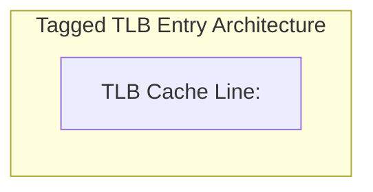
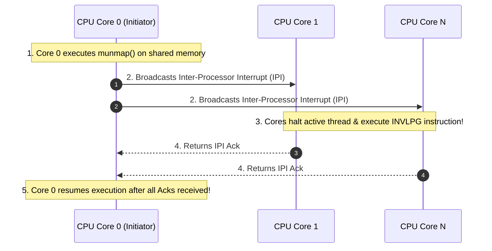

# Translation Lookaside Buffer (TLB)

> [!abstract] Mental Model
> The **TLB (Translation Lookaside Buffer)** is the **hardware speed-dial cache of the MMU**:
> - Without speed-dial, every single memory access (instruction fetch, variable read, stack push) requires the CPU to walk through a 4-level page table tree across slow external DRAM, taking up to **$200\text{–}300\text{ nanoseconds}$**.
> - With the TLB, recently translated **Virtual Page $\to$ Physical Frame** mappings are cached directly inside the CPU silicon in ultra-fast **Content-Addressable Memory (CAM)**, resolving translations in **$< 1\text{ CPU clock cycle} (< 0.5\text{ ns})$**.

---

## Hardware Silicon Architecture

```mermaid
flowchart TD
    VA["CPU Generates Virtual Address (VPN + Offset)"] --> TLB_Lookup{"Is VPN in TLB Cache?<br/>(Parallel Silicon CAM Search)"}
    
    TLB_Lookup -->|TLB HIT (1 Cycle / < 0.5 ns)| GetPFN["Retrieve Physical Frame Number (PFN) from TLB"]
    GetPFN --> AssertBus["Assert Physical Address = (PFN << 12) | Offset"]
    
    TLB_Lookup -->|TLB MISS (50-200 ns Stall)| PageWalk["Hardware Page Table Walker (4 DRAM Dereferences)<br/>PML4 -> PDPT -> PD -> PT"]
    PageWalk --> InstallTLB["Install Translated Entry into TLB"]
    InstallTLB --> AssertBus
```

---

## The Mathematical Performance Metric: EMAT

The performance of an operating system's memory subsystem is defined by **Effective Memory Access Time (EMAT)**:

$$\mathbf{\text{EMAT} = \alpha \cdot (t_{\text{TLB}} + t_{\text{RAM}}) + (1 - \alpha) \cdot (t_{\text{TLB}} + (L + 1) \cdot t_{\text{RAM}})}$$

- $\alpha$: **TLB Hit Ratio** (typically $0.98\text{–}0.99$ in production).
- $t_{\text{TLB}}$: TLB lookup time ($\approx 1\text{ ns}$).
- $t_{\text{RAM}}$: DRAM access latency ($\approx 50\text{ ns}$).
- $L$: Page Table tree levels ($L = 4$ in x86-64 48-bit paging).

---

### Numerical Proof of TLB Criticality:
1. **With $99\%$ TLB Hit Rate ($\alpha = 0.99$)**:
   $$\text{EMAT} = 0.99 \times (1 + 50) + 0.01 \times (1 + 5 \times 50) = 0.99 \times 51 + 0.01 \times 251 = \mathbf{53.0\text{ ns}}$$
2. **With Zero TLB Caching ($\alpha = 0.00$)**:
   $$\text{EMAT} = 1 + (4 + 1) \times 50 = \mathbf{251.0\text{ ns} \quad (4.73\times \text{ slower!})}$$

*Without the TLB, every program would execute nearly $5\times$ slower due to page-table walk stalls.*

---

## Context Switches & Process Tagging: PCID and ASID

In early x86 CPUs, switching processes required writing the new PML4 root address into `CR3`. Reloading `CR3` triggered an **automatic total flush of the TLB**, forcing the new process to start with an empty cache and suffer massive TLB miss cascades.

Modern CPUs solve this using **Tagged TLBs**:



- **x86-64 PCID (Process Context Identifiers)**: Enabled via `CR4.PCIDE = 1`. Allows up to $4,096$ processes to co-exist in the TLB simultaneously.
- **ARM64 ASID (Address Space Identifiers)**: Supports 8-bit or 16-bit ASID tags.
- **Result**: Context switches no longer flush the TLB, preserving warm translation caches across scheduler handoffs.

---

## The Multi-Core Scalability Hazard: TLB Shootdown

When a CPU core modifies a shared memory mapping (e.g., `munmap()`, page migration, page permission change), all other CPU cores caching that translation must invalidate their local TLB entries:



> [!danger] The IPI Shootdown Storm
> In 128-core and 256-core NUMA servers, broadcasting Inter-Processor Interrupts (IPIs) across socket interconnects stalls all running cores, creating a severe **TLB Shootdown Bottleneck** in memory-heavy multithreaded runtimes.

---

## Hardware Assembly Instructions

```nasm
; Invalidate a single virtual address translation in local TLB:
INVLPG [rdi]

; Invalidate entire TLB (Non-PCID mode - reload CR3):
mov rax, cr3
mov cr3, rax

; Flush TLB without clearing entries for other PCIDs:
INVPCID rdi, [rsi]
```

---

## Active Recall & Interview Perspective

### Reasoning Prompts
1. *Why is the TLB organized as Content-Addressable Memory (CAM) rather than standard RAM?*
   - **Answer**: Standard RAM requires an array index address to fetch data ($O(1)$ by index). In the TLB, the CPU doesn't know the index; it possesses a Virtual Page Number and needs to know if that VPN exists anywhere in the cache. A CAM (Content-Addressable Memory) compares the input VPN against **all cached TLB entries simultaneously in parallel in silicon within a fraction of a nanosecond**, providing instantaneous single-cycle hit/miss evaluation.
2. *What is a TLB Shootdown and why does it degrade multithreaded application performance?*
   - **Answer**: A TLB Shootdown occurs on multi-core systems when one CPU core modifies or unmaps a page table entry (e.g., freeing shared memory or changing page permissions) that other cores might have cached in their local per-core TLBs. To prevent stale, unsafe memory accesses, the initiating core must send **Inter-Processor Interrupts (IPIs)** to all other cores, forcing them to interrupt their active workloads, execute the `INVLPG` instruction to flush the stale entry, and return an acknowledgment. On high-core servers, these IPI synchronization barriers cause severe CPU stalling.
3. *How do Huge Pages ($2\text{ MB}$) reduce TLB miss rates?*
   - **Answer**: Each TLB entry maps one page. With standard $4\text{ KB}$ pages, a 1,024-entry TLB can only cover $1024 \times 4\text{ KB} = 4\text{ MB}$ of memory. With $2\text{ MB}$ Huge Pages, the same 1,024-entry TLB covers $1024 \times 2\text{ MB} = \mathbf{2\text{ Gigabytes}}$ of memory ($512\times$ greater coverage), allowing large database buffer pools or JVM heaps to fit entirely inside the TLB cache without triggering costly 4-level page table walks.

---

## Key Takeaways
- The **TLB** is an on-chip associative cache that resolves virtual address translations in **$< 1\text{ clock cycle}$**.
- **Effective Memory Access Time (EMAT)** proves that memory performance collapses without a $> 98\%$ TLB hit rate.
- **PCID / ASID tagging** eliminates TLB flushes on context switches, while **TLB Shootdowns** coordinate multi-core consistency via IPIs.

---

## Related Notes
- [[Operating System]] — Hardware MMU coordination.
- [[Logical vs Physical Address Space]] — Virtual-to-physical translation.
- [[Paging Architecture]] — Page frame mechanics.
- [[Page Tables and Multi-Level Page Tables]] — The page tables backing the TLB.
- [[Inverted Page Tables]] — IPT reliance on TLB hit rates.
- [[Demand Paging and Page Faults]] — Handling non-present translations.
- [[Operating Systems MOC]] — Master table of contents for Operating Systems.
