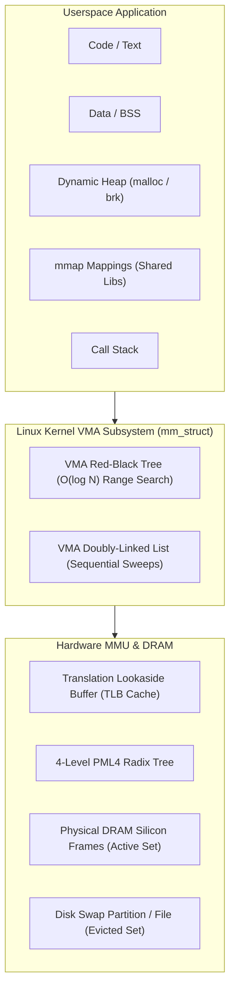
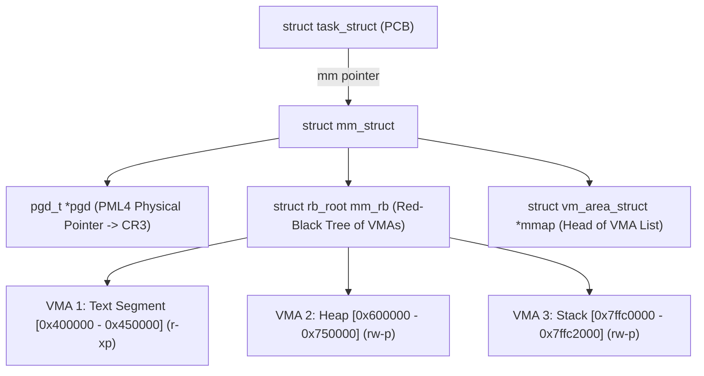
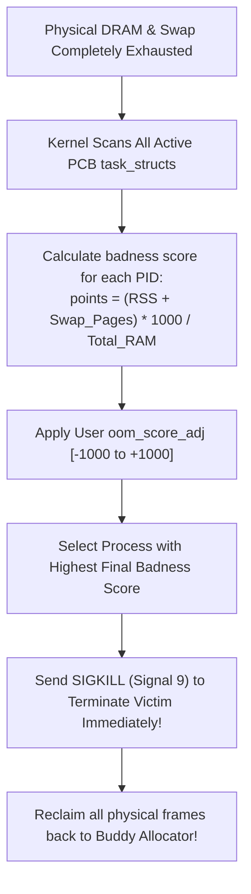

# Virtual Memory Architecture

> [!abstract] Mental Model
> Virtual memory functions like a **fractional-reserve banking system**:
> - A commercial bank with $\$100\text{M}$ in physical cash in its vault (**Physical DRAM**) can safely issue $\$1\text{B}$ in account balances and loans (**Virtual Address Space**), betting that not every depositor will withdraw their money on the same afternoon.
> - As long as programs only touch what they need (**Demand Paging**), the operating system can run 100 processes allocating 4 GB each on a single 16 GB server.
> - If every process attempts to touch all their virtual pages simultaneously, the bank faces a run on its reserves: it borrows emergency liquidity (**Disk Swap**) or sends in the liquidators to terminate the biggest spenders (**The Linux OOM Killer**).

---

## The Virtual Memory Architectural Stack



---

## Linux Kernel Representation: `mm_struct` and `vm_area_struct`

In Linux, a process's virtual memory map is defined by `struct mm_struct` (`include/linux/mm_types.h`):



---

### VMA Anatomy (`struct vm_area_struct`):
Every contiguous range of virtual addresses with uniform permissions is tracked as a **Virtual Memory Area (VMA)**:
1. `vm_start` & `vm_end`: The virtual boundary coordinates.
2. `vm_flags`: Permissions (`VM_READ`, `VM_WRITE`, `VM_EXEC`, `VM_SHARED`, `VM_MAYSHARE`).
3. `vm_file`: Pointer to `struct file` if backed by a disk file (e.g. `libc.so`), or `NULL` if anonymous memory.
4. **Dual Data Structure Design**: VMAs are linked in a sequential doubly-linked list for iteration (`/proc/pid/maps`) and indexed inside an Augmented Red-Black Tree (`mm_rb`) for high-speed $O(\log N)$ address lookup during **Page Faults**.

---

## Anonymous Memory vs File-Backed Memory

Virtual pages fall into two distinct operational classes:

| Attribute | Anonymous Memory | File-Backed Memory |
| :--- | :--- | :--- |
| **Origin** | Dynamic heap (`malloc`), stack variables, BSS. | Executables, shared libraries, `mmap()` files. |
| **Disk Backing** | **None** (Has no named file in the filesystem). | Linked directly to a disk file inode (`vm_file != NULL`). |
| **Eviction Mechanism** | Must be written to **Swap Space**; cannot be dropped. | If clean (unmodified), can be **instantly discarded** from RAM and re-read from disk when needed. |
| **Dirty Page Handling** | Flushed to Swap partition. | Flushed back to the original file on disk via `fsync` / `pdflush`. |

---

## Linux Memory Overcommitment Policies

By default, Linux permits memory overcommitment, allowing `malloc()` to succeed even if physical RAM and Swap are exhausted, relying on the fact that programs rarely populate their allocated virtual spaces immediately.

Controlled via `/proc/sys/vm/overcommit_memory`:

| Mode | Semantic | Behavior | Production Use Case |
| :--- | :--- | :--- | :--- |
| **`0`** | **Heuristic Overcommit (Default)** | Kernel uses heuristics to deny obvious wild memory allocations while permitting moderate overcommit. | Standard desktop / general Linux servers. |
| **`1`** | **Always Overcommit** | Kernel **never checks memory limits**; `malloc()` always succeeds until physical exhaustion. | **Databases (Redis, PostgreSQL)** to ensure `fork()` succeeds during background snapshots. |
| **`2`** | **Strict Do Not Overcommit** | Total virtual memory is strictly capped: $\mathbf{\text{CommitLimit} = \text{Swap} + (\text{RAM} \times \text{overcommit_ratio} / 100)}$. | High-reliability financial trading systems, safety-critical aerospace nodes. |

---

## The Linux Out-Of-Memory (OOM) Killer

When physical RAM and swap are $100\%$ exhausted and the kernel cannot reclaim memory from page caches, the kernel triggers the **OOM Killer (`mm/oom_kill.c`)**:



### Tuning OOM Priorities:
```bash
# Protect critical database from OOM Killer:
echo -1000 > /proc/<PID>/oom_score_adj

# Make a worker queue victim-first:
echo 1000 > /proc/<PID>/oom_score_adj
```

---

## Production Diagnostics & Virtual Memory Inspection

```bash
# 1. Check Global System Memory Commit & Overcommit Limits
grep -i "commit" /proc/meminfo
# Output:
# CommitLimit:    32857180 kB (Maximum allocatable virtual memory in mode 2)
# Committed_AS:   18420100 kB (Total virtual memory currently promised to all processes)

# 2. View Max VMA mappings limit (Elasticsearch requires >= 262144)
sysctl vm.max_map_count
```

---

## Active Recall & Interview Perspective

### Reasoning Prompts
1. *Why does `malloc(1024 * 1024 * 1024)` (1 GB) return almost instantaneously in C on Linux without consuming 1 GB of physical RAM?*
   - **Answer**: `malloc()` interacts with the kernel via `brk()` or `mmap()` to allocate **Virtual Memory Areas (VMAs)**. The kernel simply creates or extends a `vm_area_struct` in the process's `mm_struct` Red-Black tree with read/write permissions, but **allocates zero physical DRAM frames** and initializes the corresponding Page Table Entries with the `Present` bit set to 0. Physical memory is only materialized page-by-page later when the CPU executes an instruction that actually writes or reads a byte inside that 1 GB buffer, triggering a **Demand Page Fault (`#PF`)**.
2. *What is the fundamental difference between Anonymous Memory and File-Backed Memory during kernel page reclamation?*
   - **Answer**: File-backed memory has an explicit backing store on disk (the executable binary, shared library, or memory-mapped file). If a file-backed page has not been modified (is clean), the kernel can instantly evict it by freeing its physical frame without writing anything to disk, because it can be reloaded from the file at any time. Anonymous memory (stack, heap, static variables) has no disk file; the kernel can only reclaim its physical frame by writing its contents to a designated **Swap Space**. If swap is disabled, anonymous pages cannot be evicted and are locked in RAM until process termination.
3. *Why does Redis require `/proc/sys/vm/overcommit_memory` set to `1` in production?*
   - **Answer**: When Redis creates an RDB background snapshot, it executes `fork()` to spawn a child process that dumps memory to disk. Under strict memory checks, the kernel would observe that Redis is requesting an exact duplicate of its current virtual address space (e.g. 32 GB), and would fail the `fork()` call if free RAM is less than 32 GB. Setting `overcommit_memory = 1` forces the kernel to grant the `fork()` unconditionally, knowing that thanks to **Copy-on-Write (CoW)**, the child will share the parent's physical pages and only modify a tiny fraction ($< 1\text{–}5\%$) during the snapshot.

---

## Key Takeaways
- **Virtual Memory** decouples logical memory addressing from physical hardware constraints through kernel `struct mm_struct` and `vm_area_struct` abstractions.
- **Overcommit Policies** allow memory oversubscription, backed by the **OOM Killer** as the ultimate safety valve.
- **Anonymous memory** requires swap for eviction, whereas **clean file-backed memory** can be dropped instantly.

---

## Related Notes
- [[Operating System]] — Core memory architecture.
- [[Logical vs Physical Address Space]] — Virtual address translation foundations.
- [[Process Address Space]] — Process virtual layout.
- [[Paging Architecture]] — Hardware frame mapping.
- [[Page Tables and Multi-Level Page Tables]] — Radix tree translation.
- [[Demand Paging and Page Faults]] — Lazy page allocation mechanics.
- [[Copy-on-Write - CoW]] — Zero-copy memory sharing during fork.
- [[Operating Systems MOC]] — Master table of contents for Operating Systems.
