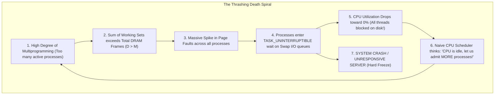
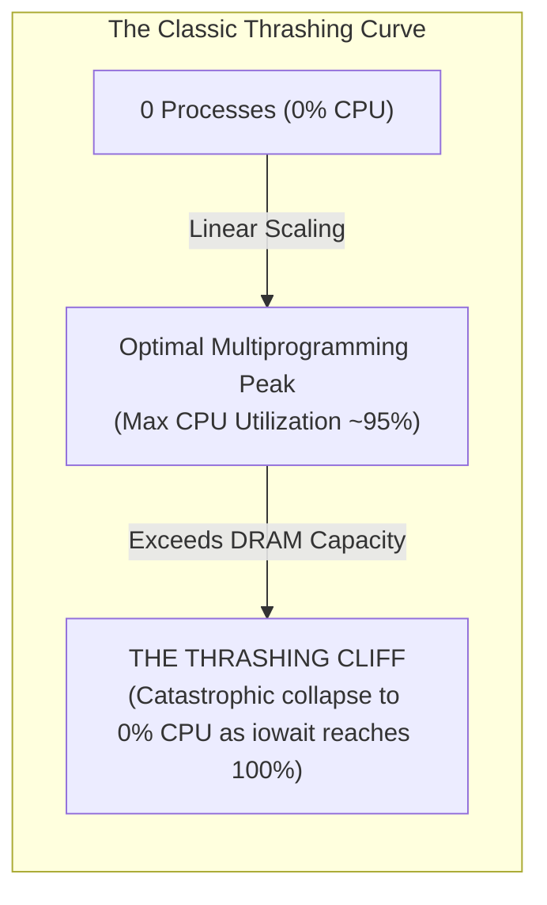
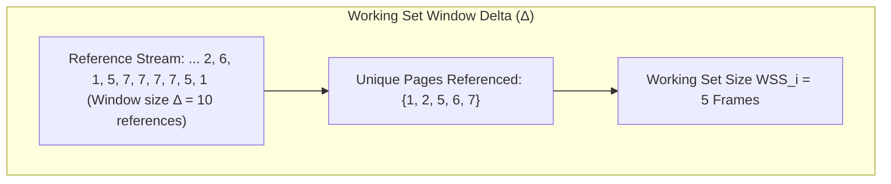

# Working Set Model and Thrashing

> [!abstract] Mental Model
> Thrashing is **a student trying to study for 8 finals simultaneously on a tiny single desk**:
> - The desk (**Physical DRAM Frames**) only holds 2 open textbooks.
> - The student needs to reference all 8 subjects concurrently. Every 10 seconds, they must close a book, run across the library to return it, fetch another, open it, read one sentence, and run back again.
> - **$99\%$ of their time is spent walking back and forth to library shelves (Disk Swap I/O), and $1\%$ actually studying (CPU execution).** The system grinds to a complete halt even though the CPU is sitting idle waiting on disk queues.

---

## The Mechanics of Thrashing



---

## The Thrashing Curve: CPU Utilization vs Multiprogramming



---

## Peter Denning's Working Set Model (1968)

Pioneered by Peter Denning, the **Working Set Model** is anchored in the **Principle of Locality**:
1. **Temporal Locality**: Recently accessed memory locations will likely be referenced again soon.
2. **Spatial Locality**: Memory addresses adjacent to recently accessed locations will likely be referenced soon.



---

### The Mathematical Invariant:
Let $WSS_i$ be the Working Set Size of process $P_i$. The **Total System Demand ($D$)** is:

$$\mathbf{D = \sum_{i=1}^{N} WSS_i}$$

- **If $D \le M$ (Total Physical Frames)**: All active working sets fit comfortably in RAM; page faults occur only on cold initial touches.
- **If $D > M$**: Physical RAM cannot accommodate all active working sets. **The system will inevitably thrash.**

---

## Prevention Strategy 1: Working Set Admission Control

The operating system monitors $WSS_i$ for every process:
- If $D + WSS_{\text{new}} \le M$: Admit the new process.
- If $D > M$: **Suspend / Swap out an entire process** (moving all its pages to disk and freeing its frames). Re-allocating those freed frames to the remaining processes eliminates thrashing immediately!

---

## Prevention Strategy 2: Page Fault Frequency (PFF)

Rather than tracking reference windows in software, **Page Fault Frequency (PFF)** measures the hardware fault frequency ($F_i$) of each process:

```mermaid
flowchart TD
    FaultRate["Monitor Process Page Fault Rate F_i"] --> CheckHigh{"F_i > Upper Threshold U?"}
    
    CheckHigh -->|YES (Process is thrashing!)| GiveFrames["Allocate MORE physical frames to Process P_i"]
    
    CheckHigh -->|NO| CheckLow{"F_i < Lower Threshold L?"}
    
    CheckLow -->|YES (Process has excess RAM)| ReclaimFrames["Reclaim unused frames from Process P_i"]
    
    CheckLow -->|NO| Stable["Process is in Equilibrium"]
    
    GiveFrames --> CheckRAM{"No Free Frames Left in System?"}
    CheckRAM -->|YES| SuspendProc["Suspend a process entirely to free memory pool!"]
```

---

## Modern Production Observability: Linux PSI (Pressure Stall Information)

In high-scale cloud infrastructure (Kubernetes / Meta / Google), detecting thrashing via CPU utilization is too late. Linux 4.20+ introduced **PSI (Pressure Stall Information)**:

```bash
# 1. Inspect Memory Pressure Metrics
cat /proc/pressure/memory

# Output format:
# some avg10=0.00 avg60=0.00 avg300=0.00 total=124805
# full avg10=28.50 avg60=14.20 avg300=5.10 total=4819203
# (full > 0 indicates 100% of non-idle CPU cores are stalled waiting on memory/swap I/O -> THRASHING!)

# 2. Live System Thrash Diagnostics via vmstat
vmstat 1
# (Watch columns 'si' (swap-in) and 'so' (swap-out). Sustained double-digit MB/s indicates thrashing!)
```

---

## Active Recall & Interview Perspective

### Reasoning Prompts
1. *What causes a computer to experience high disk I/O wait (`%iowait`) and low CPU utilization during Thrashing?*
   - **Answer**: Thrashing occurs when the sum of the working sets of all running processes exceeds total physical DRAM ($\sum WSS_i > M$). Every time a process is scheduled, it almost immediately accesses a page that was evicted to swap to make room for another process, triggering a Major Page Fault. The CPU scheduler switches to another process, which promptly page-faults on its own missing data. Soon, **every active process is waiting in the disk I/O queue (`TASK_UNINTERRUPTIBLE`)**, leaving the CPU with zero runnable threads and causing CPU utilization to collapse while disk utilization hits $100\%$.
2. *How does the Page Fault Frequency (PFF) algorithm dynamically stabilize a system under heavy load?*
   - **Answer**: PFF establishes upper ($U$) and lower ($L$) page fault rate thresholds for each process. If a process's page fault rate exceeds $U$, the kernel detects that its current frame allocation is smaller than its working set and grants it additional page frames. If its fault rate falls below $L$, the kernel trims its allocated frames to prevent memory waste. If the system runs out of free frames while attempting to satisfy high fault rates, the scheduler **suspends an entire process**, swapping its whole state to disk to distribute its frames among the remaining processes and eliminate the thrashing cycle.
3. *What is the difference between `some` and `full` memory stall pressure in Linux `/proc/pressure/memory`?*
   - **Answer**: `some` measures the percentage of time that *at least one* CPU task is stalled waiting for memory (page reclamation, swap read/write, or file cache reads) while other CPUs may still be doing productive work. `full` measures the percentage of time where **ALL runnable tasks on the system are simultaneously stalled on memory I/O**, representing complete system starvation where no productive work is occurring. A spike in `full` memory PSI is the definitive production signature of thrashing.

---

## Key Takeaways
- **Thrashing** occurs when total working set demand exceeds physical RAM ($\sum WSS_i > M$), causing CPU execution to collapse while disk swap queues saturate.
- **Working Set Model** and **Page Fault Frequency (PFF)** prevent thrashing by enforcing dynamic frame admission and suspending processes when memory is oversubscribed.
- Modern production environments monitor thrashing via **Linux PSI (`/proc/pressure/memory`)**.

---

## Related Notes
- [[Operating System]] — Core memory subsystem.
- [[CPU Scheduler and Dispatcher]] — Multiprogramming degree control.
- [[Paging Architecture]] — Frame allocation mechanics.
- [[Demand Paging and Page Faults]] — Major page faults.
- [[Page Replacement Algorithms - FIFO, LRU, Clock, Optimal]] — Page eviction strategies.
- [[Swapping and Swap Space Management]] — Where pages are swapped during thrashing.
- [[Operating Systems MOC]] — Master table of contents for Operating Systems.
