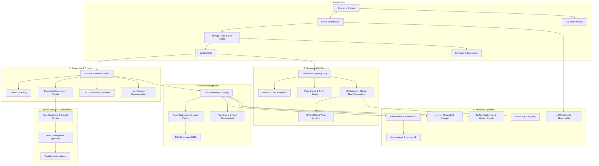

# Operating Systems MOC

> [!abstract] Subject Roadmap
> Operating Systems serve as the foundational interface between hardware and application software, managing CPU execution, memory isolation, persistent storage, and I/O concurrency.

---

## 🏛️ Architecture & Knowledge Graph

---

## 📑 Curriculum & Notes Directory (93 Canonical Notes - 100% Complete)

### 1. Foundations (10/10)
- [[Operating System]] — Core abstraction, resource multiplexer, control program.
- [[Kernel]] — Subsystem decomposition, monolithic vs microkernel vs hybrid models.
- [[Privilege Rings and CPU Modes]] — Hardware protection, x86 Ring 0/3, ARM EL0-EL3.
- [[User Mode vs Kernel Mode]] — Privilege separation, boundary overhead, memory protection.
- [[System Calls]] — Syscall dispatch, trap handlers, software interrupts, `strace` observability.
- [[Interrupts and Interrupt Handling]] — Hardware IRQs, IDT, Top-Half vs Bottom-Half, ISRs.
- [[Traps and Exceptions]] — Synchronous faults, traps, aborts, architectural handling.
- [[OS Boot Process]] — POST, BIOS/UEFI, Bootloaders, Kernel init, systemd/PID 1.
- [[Kernel Architecture - Monolithic vs Microkernel vs Hybrid]] — Architecture comparisons, seL4, Linux, Mach, Windows NT.
- [[Kernel Modules and Device Drivers]] — Dynamically loadable kernel modules (LKMs), character/block drivers, symbol exports.

### 2. Processes & Lifecycle (9/9)
- [[Program vs Process]] — Passive binary vs active executing instance, memory layout.
- [[Process Address Space]] — Text, Data, BSS, Heap, Stack, Memory mapping region.
- [[Process States and Lifecycle]] — State transitions (New, Ready, Running, Waiting, Terminated).
- [[Process Control Block]] — PCB fields, process accounting, kernel task structure (`task_struct`).
- [[Process Creation and Termination - fork, exec, wait, exit]] — Copy-on-Write fork, address space replacement.
- [[Zombie and Orphan Processes]] — `wait()` reaping, PID table exhaustion, subreapers.
- [[Daemons and Background Services]] — Process detachment, double-forking, systemd units.
- [[Context Switching]] — Register preservation, kernel stack switching, TLB invalidation, cost analysis.
- [[Inter-Process Communication - IPC]] — Pipes, FIFOs, Shared Memory, Message Queues, UNIX Domain Sockets.

### 3. Threads & Multithreading (6/6)
- [[Thread]] — Lightweight process, shared address space, thread-local storage (TLS).
- [[Process vs Thread]] — Resource isolation vs shared memory concurrency comparison.
- [[User-Level Threads vs Kernel Threads]] — Green threads vs OS threads, blocking syscall impacts.
- [[Multithreading Models - 1-1, N-1, M-N|Multithreading Models - 1:1, N:1, M:N]] — Go goroutines, Java Project Loom, POSIX pthreads.
- [[Thread Pools and Worker Queues]] — Sizing, queue saturation, backpressure, thread churn.
- [[Thread Safety and Reentrancy]] — Race conditions, thread-local storage, reentrant routines.

### 4. CPU Scheduling (10/10)
- [[CPU Scheduler and Dispatcher]] — Long, medium, short-term schedulers, dispatch latency.
- [[Preemptive vs Non-Preemptive Scheduling]] — Cooperative vs preemptive preemption triggers.
- [[Scheduling Metrics - Turnaround, Response, Waiting Time]] — Formal metrics and trade-offs.
- [[First-Come First-Served - FCFS]] — Non-preemptive convoy effect analysis.
- [[Shortest Job First - SJF and SRTF]] — Optimal average waiting time, exponential smoothing prediction.
- [[Round Robin Scheduling]] — Quantum sizing, interactive responsiveness vs throughput.
- [[Priority Scheduling and Aging]] — Priority inversion, priority inheritance protocol.
- [[Multilevel Queue and MLFQ]] — Adaptive dynamic priority adjustment, starvation prevention.
- [[Linux CFS - Completely Fair Scheduler]] — Red-Black tree, `vruntime`, latency targeting.
- [[Real-Time Scheduling - Rate Monotonic and EDF]] — Hard/soft deadlines, utilization bounds.

### 5. Synchronization & Concurrency (13/13)
- [[Race Conditions and Data Races]] — Atomic vs non-atomic operations, read-modify-write bugs.
- [[Critical Section Problem]] — Mutual exclusion, progress, bounded waiting criteria.
- [[Hardware Synchronization Primitives - CAS, TAS, LL-SC]] — Atomic instructions, memory bus locks.
- [[Memory Ordering and Memory Barriers]] — Sequential consistency, acquire-release, out-of-order execution.
- [[Spinlocks]] — Busy-waiting, CPU cycle burning, appropriate kernel use cases.
- [[Producer-Consumer Pattern - Bounded Queues and Condition Variables]] — Sleeping locks, futex (Fast Userspace Mutex) architecture in Linux.
- [[Binary and Counting Semaphores]] — Signaling vs mutual exclusion, POSIX semaphores.
- [[Producer-Consumer Pattern - Bounded Queues and Condition Variables]] — Wait queues, spurious wakeups, `pthread_cond_wait`.
- [[Monitors]] — High-level language synchronization abstractions (Java `synchronized`).
- [[Reader-Writer Problem and RWLocks]] — Reader starvation vs writer starvation, fair locks.
- [[Producer-Consumer Problem]] — Bounded buffer synchronization with semaphores/mutexes.
- [[Dining Philosophers Problem]] — Resource hierarchy solution, arbitrator solution.
- [[Lock-Free and Wait-Free Data Structures]] — Lock-free queues, ABA problem, hazard pointers.

### 6. Deadlocks (6/6)
- [[Deadlock Fundamentals and Coffman Conditions]] — Mutual exclusion, Hold & Wait, No Preemption, Circular Wait.
- [[Resource Allocation Graph]] — Cycle detection in single/multi-unit resource graphs.
- [[Deadlock Prevention Strategies]] — Violating Coffman conditions in design.
- [[Deadlock Avoidance and Banker's Algorithm]] — Safe states, resource claims, matrix computation.
- [[Deadlock Detection and Recovery]] — Wait-for graphs, process termination, resource preemption.
- [[Deadlock vs Livelock vs Starvation]] — Definitive comparison and mitigation patterns.

### 7. Memory Management & Virtual Memory (15/15)
- [[Logical vs Physical Address Space]] — Address translation, hardware MMU.
- [[Memory Allocation - Contiguous, Fixed, Variable Partitioning]] — First-fit, Best-fit, Worst-fit.
- [[Internal vs External Fragmentation]] — Compaction, page-based solutions.
- [[Paging Architecture]] — Page size, frames, offset calculation, page bitmasks.
- [[Segmentation]] — Logical segmentation, segment registers, x86 protection.
- [[Page Tables and Multi-Level Page Tables]] — 4-level paging in x86-64 (PML4, PDPT, PD, PT), memory overhead.
- [[Inverted Page Tables]] — Hash-based frame mapping for 64-bit architectures.
- [[Translation Lookaside Buffer - TLB]] — TLB hit/miss, TLB shootdown, tagged TLBs (ASID/PCID).
- [[Virtual Memory Architecture]] — Overcommitting memory, sparse address spaces, swap backing.
- [[Demand Paging and Page Faults]] — Major vs minor page faults, disk I/O latency.
- [[Copy-on-Write - CoW]] — Read-only page sharing, write fault duplication.
- [[Page Replacement Algorithms - FIFO, LRU, Clock, Optimal]] — LRU approximation, active/inactive lists.
- [[Belady's Anomaly]] — Anomaly explanation, stack algorithms property.
- [[Working Set Model and Thrashing]] — Page fault frequency, memory pressure, OOM Killer.
- [[Swapping and Swap Space Management]] — Swap partitions, zswap/zram compressed RAM.

### 8. File Systems (11/11)
- [[File Concept and File Attributes]] — File types, access control, metadata attributes.
- [[File Descriptors and File Tables]] — Process fd table, system-wide open file table, inode table.
- [[Directory Structures and Path Resolution]] — Directory trees, dentry cache (dcache), pathname traversal.
- [[File Allocation Methods - Contiguous, Linked, Indexed]] — Allocation trade-offs and fragmentation.
- [[Inodes and File System Metadata]] — Inode fields, direct/indirect blocks, directory entries (`dentry`).
- [[Hard Links vs Symbolic Links]] — Inode link count, cross-filesystem linking limitations.
- [[Virtual File System - VFS]] — VFS abstraction layer, `file_operations` dispatch in Linux.
- [[Page Cache and Buffer Cache]] — Write-back, `sync()`, dirty page flushing, `readahead`.
- [[Journaling File Systems and Crash Consistency]] — Write-Ahead Logging in filesystems, ext4 journaling modes.
- [[ext4 Architecture Overview]] — Extents, 48-bit addressing, delayed allocation, flex block groups.
- [[XFS and ZFS Overview]] — Allocation groups, B+ trees, Copy-on-Write pools, Merkle trees, ARC.

### 9. Storage & I/O Subsystems (6/6)
- [[IO Hardware - Port-Mapped vs Memory-Mapped IO]] — PMIO vs MMIO, device controllers, PCIe BARs.
- [[Direct Memory Access - DMA]] — DMA controller, bus mastering, scatter-gather DMA ring buffers.
- [[Polling vs Interrupt-Driven IO]] — Busy waiting, interrupt storms, Linux NAPI polling.
- [[Disk Scheduling Algorithms - SSTF, SCAN, C-SCAN]] — Rotational physics, elevator schedulers, `blk-mq`.
- [[RAID Levels and Reliability]] — RAID 0, 1, 5, 6, 10, write penalty, URE hazard on rebuilds.
- [[Solid State Drives - Flash Memory, Wear Leveling, TRIM]] — NAND flash physics, FTL, WAF, Static Wear Leveling, TRIM.

### 10. Advanced Systems Concepts (7/7)
- [[Virtualization and Hypervisors - Type 1 vs Type 2]] — Bare-metal vs hosted hypervisors, Intel VT-x, VMCS, EPT, VirtIO.
- [[OS-Level Virtualization - Linux Namespaces and cgroups]] — The 8 namespaces, clone/unshare/setns, unified cgroups v2.
- [[Containers vs Virtual Machines]] — Shared kernel attack surface, microVMs (Firecracker), gVisor, OCI stack.
- [[Memory-Mapped IO and mmap]] — Page cache zero-copy mapping, shared memory backing, `msync`, `SIGBUS`.
- [[Zero-Copy IO - sendfile, splice, io_uring]] — Ring buffer async I/O, Scatter-Gather DMA, `io_uring` `SQPOLL`.
- [[eBPF Architecture and Observability]] — In-kernel JIT bytecode, Verifier, Maps, kprobes, tracepoints, XDP.
- [[NUMA Architecture]] — Non-Uniform Memory Access, Interconnect latency, First-Touch, `numactl`, zone reclaim.

---

## 🔍 Diagnostics & Debugging Toolkit
- **Process & CPU**: `top`, `htop`, `ps -aux`, `pidstat`, `mpstat`, `perf`
- **Memory**: `free -m`, `vmstat 1`, `pmap -x <pid>`, `/proc/meminfo`, `/proc/<pid>/smaps`, `numastat`
- **Tracing & System Calls**: `strace -c -p <pid>`, `ltrace`, `bpftrace`, `bpftool`
- **I/O & File Systems**: `iostat -xz 1`, `lsof -p <pid>`, `fuser`, `df -h`, `iotop`, `nvme smart-log`
- **Kernel Logs**: `dmesg -T --level=err,warn`, `journalctl -k`
